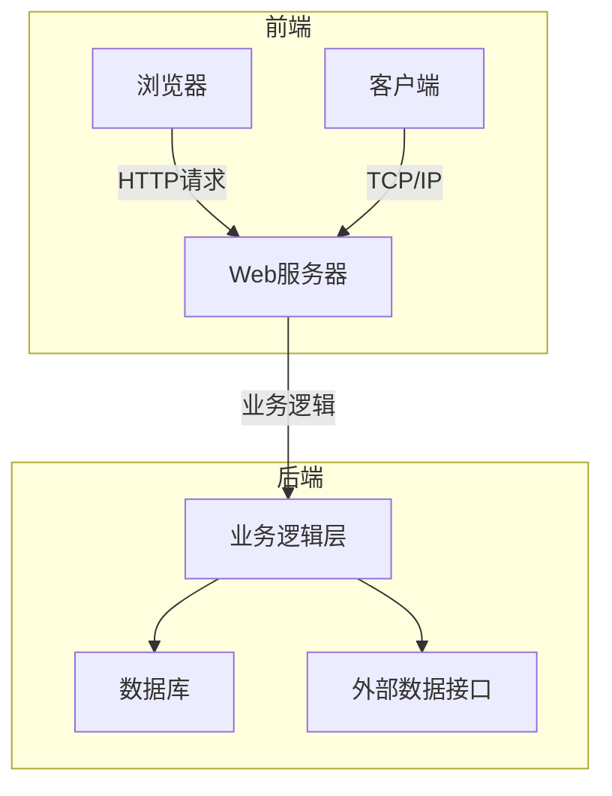
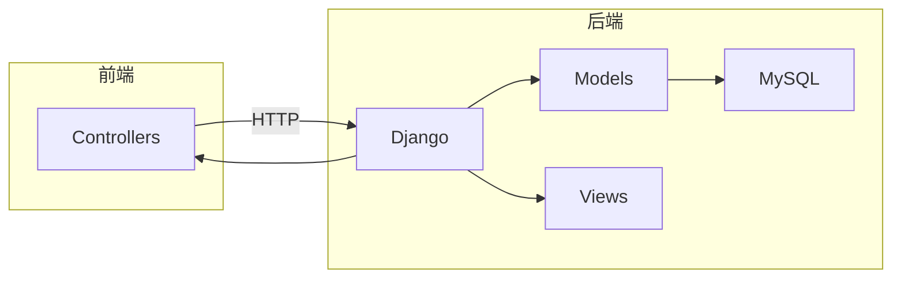

# 旅游信息系统详细设计与具体代码实现

## 1. 背景介绍

### 1.1 旅游业的重要性

旅游业是一个朝阳产业,在全球经济中扮演着重要角色。随着人们生活水平的提高和休闲时间的增加,越来越多的人喜欢旅游度假。旅游不仅能够缓解工作压力,还能增进不同文化之间的了解和交流。

### 1.2 旅游信息系统的需求

为了满足旅游者对信息的需求,提高旅游体验,旅游信息系统应运而生。旅游信息系统为旅客提供景点介绍、路线规划、酒店预订、交通查询等一站式服务,极大地方便了旅客的出行。同时,该系统还能为旅游企业提供数据分析,优化运营决策。

### 1.3 系统设计的挑战

设计一个完善的旅游信息系统并非易事,需要考虑多方面的因素:

- 数据的获取、存储和检索
- 系统的可扩展性和高并发处理能力 
- 用户界面的友好性和个性化服务
- 系统的安全性和隐私保护

## 2. 核心概念与联系  

### 2.1 系统架构

旅游信息系统通常采用 B/S 或 C/S 架构,前端通过浏览器或客户端与后端服务器进行交互。后端由多个模块组成,如数据库、业务逻辑层、外部数据接口等。



### 2.2 关键技术

旅游信息系统涉及多种技术,包括:

- 前端: HTML/CSS/JavaScript、React/Vue/Angular 等框架
- 后端: Java/Python/Node.js、Spring/Django/Express 等框架
- 数据库: MySQL/PostgreSQL/MongoDB
- 缓存: Redis
- 搜索引擎: ElasticSearch/Solr
- 消息队列: RabbitMQ/Kafka
- 地理信息系统(GIS): PostGIS/ArcGIS

### 2.3 设计模式

在系统设计中,可应用多种设计模式,如:

- **MVC**: 模型-视图-控制器,常用于Web应用
- **微服务**: 将系统拆分为小服务,提高可维护性
- **发布-订阅**: 用于异步消息传递
- **门面模式**: 为子系统提供统一入口
- **代理模式**: 控制对象的访问
- **享元模式**: 减少重复数据的存储

## 3. 核心算法原理具体操作步骤

### 3.1 路线规划算法

为旅客规划一条合理的旅游路线是系统的核心功能之一。这可以使用**dijkstra最短路径算法**或**A\*算法**来实现。

#### 3.1.1 Dijkstra算法

Dijkstra算法用于计算**单源最短路径**问题,可以找到从起点到其他所有点的最短路径。算法步骤如下:

1. 初始化:将起点加入集合,其余节点的距离设为无穷大
2. 选取距离最小的节点 u,标记为"已找到"
3. 更新 u 的相邻节点的距离
4. 重复步骤 2、3,直到所有节点都标记为"已找到"

```python
# Dijkstra 算法伪代码
def dijkstra(graph, start):
    # 初始化距离字典,起点距离为0,其余为无穷大
    distance = {start: 0} 
    for v in graph:
        if v != start:
            distance[v] = float('inf')
    
    # 已找到的节点集合
    visited = []
    
    # 未访问的节点集合
    unvisited = list(graph.keys())
    
    while unvisited:
        # 找出距离最小的节点
        min_node = min(unvisited, key=lambda v: distance[v])
        visited.append(min_node)
        unvisited.remove(min_node)
        
        # 更新相邻节点的距离
        for neighbor, weight in graph[min_node].items():
            new_distance = distance[min_node] + weight
            if new_distance < distance[neighbor]:
                distance[neighbor] = new_distance
                
    return distance
```

时间复杂度为 $O(n^2)$,对于稠密图效率较低。

#### 3.1.2 A\*算法 

A\*算法在Dijkstra算法的基础上,引入了**启发式函数**,估算当前节点到目标节点的距离,从而减少搜索空间,提高效率。算法步骤:

1. 初始化open表和close表,将起点加入open表
2. 从open表取出 f 值最小的节点 n
3. 若 n 是目标节点,结束搜索,构造路径
4. 将 n 从open表移到close表
5. 检查 n 的所有邻居节点:
    - 若在close表,忽略
    - 若不在open表,加入open表,设置父节点为 n
    - 若在open表,检查新路径长度,更新父节点和 f 值
6. 重复步骤 2-5,直到找到路径或open表为空

其中, $f(n) = g(n) + h(n)$

- $g(n)$ 是从起点到当前节点 n 的实际距离
- $h(n)$ 是从当前节点 n 到目标节点的估计距离(启发式函数)

```python
from queue import PriorityQueue

def heuristic(a, b):
    """估计从节点a到节点b的距离(启发式函数)"""
    (x1, y1) = a
    (x2, y2) = b
    return abs(x1 - x2) + abs(y1 - y2)

def a_star(graph, start, end):
    frontier = PriorityQueue()
    frontier.put(start, 0)
    came_from = {}
    cost_so_far = {}
    came_from[start] = None
    cost_so_far[start] = 0
    
    while not frontier.empty():
        current = frontier.get()
        
        if current == end:
            break
        
        for next in graph.neighbors(current):
            new_cost = cost_so_far[current] + graph.cost(current, next)
            if next not in cost_so_far or new_cost < cost_so_far[next]:
                cost_so_far[next] = new_cost
                priority = new_cost + heuristic(next, end)
                frontier.put(next, priority)
                came_from[next] = current
    
    return came_from, cost_so_far
```

时间复杂度视启发式函数而定,在最坏情况下仍为 $O(n^2)$,但通常比 Dijkstra 算法更高效。

### 3.2 推荐系统算法

推荐系统是现代信息系统的重要组成部分,能够为用户提供个性化的内容推荐。在旅游信息系统中,可以基于用户的历史浏览记录、位置信息等,推荐感兴趣的景点、餐馆等。

常用的推荐算法有:

#### 3.2.1 协同过滤算法

协同过滤算法根据用户之间的相似性进行推荐,包括:

- **基于用户**的协同过滤: 找到与目标用户有相似兴趣的其他用户,推荐这些用户喜欢的项目。
- **基于项目**的协同过滤: 找到与目标项目相似的其他项目,推荐给喜欢目标项目的用户。

相似度计算通常使用**余弦相似度**或**皮尔逊相关系数**。

#### 3.2.2 基于内容的推荐

基于内容的推荐算法利用项目的内容特征(如文本、图像等)进行推荐,常用的有:

- **TF-IDF**: 根据关键词的权重计算文本相似度
- **主题模型**(LDA): 发现文本的潜在主题分布
- **Word2Vec**: 将文本映射到连续向量空间
- **CNN**: 用于图像特征提取和相似度计算

此外,也可以将协同过滤与基于内容的方法相结合,形成**混合推荐算法**,以获得更好的推荐效果。

## 4. 数学模型和公式详细讲解举例说明

### 4.1 相似度计算

相似度计算在推荐系统、聚类分析等场景中广泛使用。常见的相似度计算方法有:

#### 4.1.1 余弦相似度

余弦相似度用于计算两个向量之间的相似程度,公式如下:

$$sim(A, B) = \cos(\theta) = \frac{A \cdot B}{\|A\|\|B\|} = \frac{\sum\limits_{i=1}^{n}{A_iB_i}}{\sqrt{\sum\limits_{i=1}^{n}{A_i^2}}\sqrt{\sum\limits_{i=1}^{n}{B_i^2}}}$$

其中 $A$、$B$ 是两个 $n$ 维向量。

余弦相似度的值域为 $[0, 1]$,值越大,两个向量越相似。

例如,计算向量 $A = (1, 2, 3)$ 和 $B = (4, 5, 6)$ 的余弦相似度:

$$sim(A, B) = \frac{1 \times 4 + 2 \times 5 + 3 \times 6}{\sqrt{1^2 + 2^2 + 3^2} \sqrt{4^2 + 5^2 + 6^2}} \approx 0.98$$

#### 4.1.2 皮尔逊相关系数

皮尔逊相关系数用于度量两个变量之间的线性相关程度,公式如下:

$$r = \frac{\sum\limits_{i=1}^{n}{(x_i - \bar{x})(y_i - \bar{y})}}{\sqrt{\sum\limits_{i=1}^{n}{(x_i - \bar{x})^2}}\sqrt{\sum\limits_{i=1}^{n}{(y_i - \bar{y})^2}}}$$

其中 $x_i$、$y_i$ 分别表示第 $i$ 个数据点的 $x$ 值和 $y$ 值,$\bar{x}$、$\bar{y}$ 分别为 $x$、$y$ 的均值。

皮尔逊相关系数的值域为 $[-1, 1]$,绝对值越大,两个变量的线性相关程度越高。

### 4.2 主题模型

主题模型(Topic Model)是一种无监督机器学习技术,常用于文本数据的主题发现和维度降低。最著名的主题模型是**LDA**(Latent Dirichlet Allocation,潜在狄利克雷分配)。

LDA 的基本思想是:

- 一篇文档由多个主题构成,每个主题由一组单词表示
- 每个单词属于一个主题,具有特定的主题分布
- 文档的每个单词都是从多项分布中采样得到的

LDA 可以用如下生成式表示:

1. 对每个文档 $d$:
    - 从狄利克雷分布 $\alpha$ 中采样主题分布 $\theta_d$
2. 对每个主题 $k$: 
    - 从狄利克雷分布 $\beta$ 中采样词分布 $\phi_k$
3. 对文档 $d$ 中的每个单词 $w_{d,n}$:
    - 从主题分布 $\theta_d$ 中采样主题 $z_{d,n}$
    - 从词分布 $\phi_{z_{d,n}}$ 中采样单词 $w_{d,n}$

用数学公式表示为:

$$p(w_{d,n}|\alpha, \beta) = \sum_{z}\,p(w_{d,n}|z, \beta)p(z|\theta_d)\,\text{where}\,\theta_d \sim \text{Dirichlet}(\alpha)$$

LDA 模型可以通过**吉布斯采样**或**变分推断**等方法来估计参数 $\theta$、$\phi$,进而发现文档的主题分布和每个主题的词分布。

## 5. 项目实践:代码实例和详细解释说明

我们以 Python 语言为例,使用 Django Web 框架和 Vue.js 前端框架,开发一个简单的旅游信息系统。

### 5.1 系统架构



### 5.2 Models

使用 Django ORM 定义数据模型:

```python
# models.py
from django.db import models

class Destination(models.Model):
    name = models.CharField(max_length=