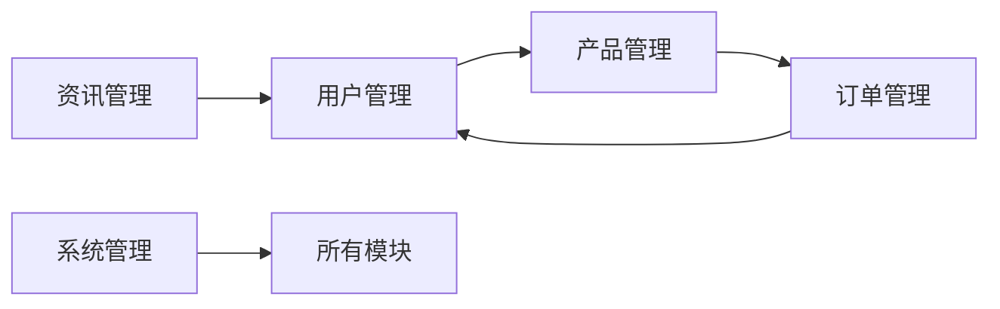

## 1. 背景介绍

### 1.1 旅游业的现状与发展趋势

随着社会经济的发展和人们生活水平的提高，旅游业蓬勃发展，成为全球经济的重要组成部分。近年来，随着互联网技术的快速发展，在线旅游平台如雨后春笋般涌现，为用户提供便捷、高效的旅游服务。

### 1.2 旅行社网站系统的重要性

旅行社网站系统是旅行社开展在线业务的核心平台，它能够为用户提供以下服务：

* **旅游产品展示**: 展示旅行社提供的各种旅游线路、景点门票、酒店预订等产品信息。
* **在线预订**: 用户可以根据自己的需求，在线预订旅游产品，并进行支付结算。
* **客户关系管理**: 记录用户的信息，提供个性化服务，维护客户关系。
* **数据分析**: 收集用户行为数据，进行分析，为旅行社经营决策提供依据。

### 1.3 本文的目的和意义

本文旨在详细介绍旅行社网站系统的架构设计、功能模块、技术实现以及代码示例，为旅行社网站系统的开发提供参考和指导，促进旅游业信息化发展。

## 2. 核心概念与联系

### 2.1 系统架构

旅行社网站系统采用典型的三层架构：

* **展示层**: 负责用户界面展示，与用户进行交互，接收用户请求，并将请求传递给业务逻辑层。
* **业务逻辑层**: 负责处理用户请求，实现业务逻辑，并与数据访问层进行交互。
* **数据访问层**: 负责数据库操作，提供数据访问接口给业务逻辑层。

### 2.2 功能模块

旅行社网站系统主要包括以下功能模块：

* **用户管理**: 用户注册、登录、个人信息管理等。
* **产品管理**: 旅游线路、景点门票、酒店预订等产品的添加、修改、删除、查询等。
* **订单管理**: 订单生成、支付、确认、取消、退款等。
* **资讯管理**: 旅游资讯、攻略、游记等内容的发布、管理等。
* **系统管理**: 系统配置、权限管理、日志管理等。

### 2.3 技术选型

* **开发语言**: Java
* **Web框架**: Spring MVC
* **数据库**: MySQL
* **前端框架**: Bootstrap, jQuery

### 2.4 核心概念联系图



## 3. 核心算法原理具体操作步骤

### 3.1 用户注册流程

1. 用户填写注册信息，包括用户名、密码、邮箱等。
2. 系统验证用户输入的信息是否合法。
3. 将用户信息保存到数据库中。
4. 发送激活邮件到用户邮箱。
5. 用户点击邮件中的激活链接，激活账号。

### 3.2 产品搜索算法

1. 用户输入关键词，例如“北京三日游”。
2. 系统根据关键词，在数据库中搜索相关产品。
3. 对搜索结果进行排序，例如按照价格、销量、评分等。
4. 将搜索结果展示给用户。

### 3.3 订单生成算法

1. 用户选择要预订的产品，并填写相关信息，例如出行日期、人数等。
2. 系统计算订单总价。
3. 生成订单，并将订单信息保存到数据库中。
4. 用户进行支付。
5. 系统确认支付成功，并更新订单状态。

## 4. 数学模型和公式详细讲解举例说明

### 4.1 产品推荐算法

#### 4.1.1 基于内容的推荐

根据用户的历史浏览记录，推荐与用户浏览过的产品相似的产品。

#### 4.1.2 协同过滤推荐

根据用户的历史行为数据，找到与用户兴趣相似的其他用户，推荐这些用户喜欢的产品。

### 4.2 价格计算公式

$$
总价 = 产品单价 \times 人数 \times 天数
$$

例如，某旅游线路的单价为1000元/人，用户预订3人，出行时间为3天，则总价为：

$$
总价 = 1000 \times 3 \times 3 = 9000元
$$

## 5. 项目实践：代码实例和详细解释说明

### 5.1 用户注册代码

```java
@Controller
public class UserController {

    @Autowired
    private UserService userService;

    @RequestMapping("/register")
    public String register(User user) {
        // 验证用户信息
        if (userService.validateUser(user)) {
            // 保存用户信息
            userService.saveUser(user);
            // 发送激活邮件
            userService.sendActivationEmail(user);
            return "redirect:/login";
        } else {
            return "register";
        }
    }
}
```

### 5.2 产品搜索代码

```java
@Controller
public class ProductController {

    @Autowired
    private ProductService productService;

    @RequestMapping("/search")
    public String search(String keyword, Model model) {
        // 搜索产品
        List<Product> products = productService.searchProducts(keyword);
        // 将搜索结果添加到模型中
        model.addAttribute("products", products);
        return "search";
    }
}
```

### 5.3 订单生成代码

```java
@Controller
public class OrderController {

    @Autowired
    private OrderService orderService;

    @RequestMapping("/createOrder")
    public String createOrder(Order order) {
        // 计算订单总价
        order.setTotalPrice(orderService.calculateTotalPrice(order));
        // 生成订单
        orderService.createOrder(order);
        return "redirect:/pay";
    }
}
```

## 6. 实际应用场景

### 6.1 在线旅游平台

旅行社网站系统可以作为在线旅游平台的核心系统，为用户提供旅游产品展示、在线预订、客户关系管理等服务。

### 6.2 旅行社内部管理系统

旅行社网站系统也可以作为旅行社内部管理系统，用于管理产品、订单、客户等信息。

## 7. 工具和资源推荐

### 7.1 开发工具

* Eclipse
* IntelliJ IDEA

### 7.2 数据库

* MySQL
* Oracle

### 7.3 Web框架

* Spring MVC
* Struts 2

### 7.4 前端框架

* Bootstrap
* jQuery

## 8. 总结：未来发展趋势与挑战

### 8.1 未来发展趋势

* **个性化推荐**: 随着人工智能技术的不断发展，旅行社网站系统将能够为用户提供更加个性化的旅游产品推荐服务。
* **虚拟现实技术**: 虚拟现实技术可以为用户带来更加 immersive 的旅游体验，旅行社网站系统可以利用虚拟现实技术展示旅游景点、酒店等。
* **移动互联网**: 随着移动互联网的普及，旅行社网站系统需要适应移动端的用户体验，提供更加便捷的移动端服务。

### 8.2 面临的挑战

* **数据安全**: 旅行社网站系统存储了大量的用户个人信息和订单信息，需要做好数据安全防护工作。
* **系统性能**: 随着用户量的增加，旅行社网站系统需要不断优化性能，提高用户体验。
* **市场竞争**: 在线旅游市场竞争激烈，旅行社网站系统需要不断创新，提供差异化服务。

## 9. 附录：常见问题与解答

### 9.1 如何注册账号？

访问旅行社网站，点击“注册”按钮，填写注册信息，并激活账号。

### 9.2 如何预订旅游产品？

选择要预订的旅游产品，填写相关信息，并进行支付。

### 9.3 如何取消订单？

登录账号，找到要取消的订单，点击“取消订单”按钮。

### 9.4 如何联系客服？

访问旅行社网站，找到“联系我们”页面，获取客服联系方式。 
