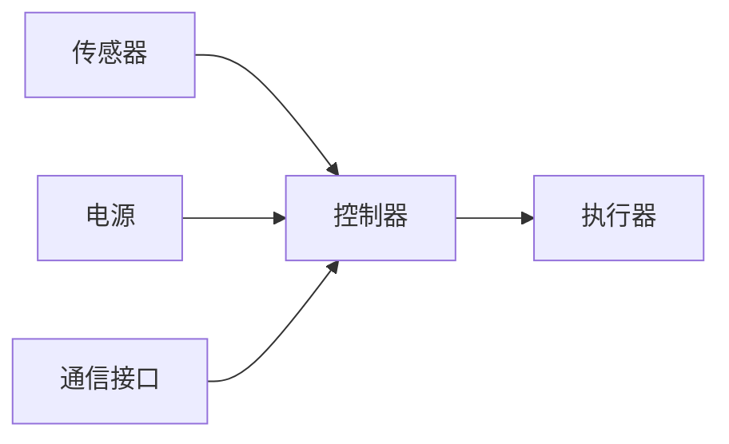

## 1. 背景介绍

### 1.1 机器人的起源与发展

机器人学的起源可以追溯到古希腊时代，当时人们就梦想着创造出能够模仿人类行为的机器。然而，直到20世纪中期，随着计算机技术和自动化技术的快速发展，机器人学才真正成为一门独立的学科。

早期的机器人主要用于工业生产线，例如汽车制造和电子产品组装。这些机器人通常体型庞大、功能单一，只能完成预先编程好的特定任务。

随着传感器、人工智能和机器学习技术的进步，机器人变得更加智能化和灵活化。现代机器人能够感知周围环境、自主导航、执行复杂任务，甚至与人类进行互动。

### 1.2 机器人学的定义与研究内容

机器人学是研究机器人的设计、制造、操作和应用的科学。它涉及多个学科领域，包括机械工程、电气工程、计算机科学、人工智能、控制理论等。

机器人学的研究内容主要包括以下几个方面：

* **机器人运动学和动力学:** 研究机器人的运动规律和力学特性，包括位置、速度、加速度、力和力矩等。
* **机器人感知:** 研究机器人如何感知周围环境，包括视觉、听觉、触觉等。
* **机器人规划:** 研究如何规划机器人的运动路径和任务执行策略。
* **机器人控制:** 研究如何控制机器人的运动和行为。
* **机器人学习:** 研究如何让机器人通过学习来提高自身的性能。

### 1.3 机器人的分类

机器人可以根据不同的标准进行分类，例如：

* **按应用领域:** 工业机器人、服务机器人、特种机器人等。
* **按运动方式:** 轮式机器人、履带式机器人、步行机器人等。
* **按控制方式:** 预编程机器人、遥控机器人、自主机器人等。


## 2. 核心概念与联系

### 2.1 机器人系统架构

一个典型的机器人系统通常由以下几个核心组件构成：

* **传感器:** 用于感知周围环境，例如摄像头、激光雷达、超声波传感器等。
* **执行器:** 用于执行动作，例如电机、液压缸、气动元件等。
* **控制器:** 用于处理传感器数据、规划任务和控制执行器。
* **电源:** 为机器人系统提供能量。
* **通信接口:** 用于与其他设备进行通信，例如 Wi-Fi、蓝牙、以太网等。



### 2.2 机器人运动学

机器人运动学研究机器人的运动规律，包括位置、速度、加速度等。它主要涉及以下几个概念：

* **自由度:** 机器人能够独立运动的程度，例如一个机械臂通常有 6 个自由度。
* **工作空间:** 机器人能够到达的所有空间点的集合。
* **正运动学:** 已知机器人的关节角度，求解机器人的末端执行器的位置和姿态。
* **逆运动学:** 已知机器人的末端执行器的位置和姿态，求解机器人的关节角度。

### 2.3 机器人动力学

机器人动力学研究机器人的力学特性，包括力和力矩等。它主要涉及以下几个概念：

* **惯性:** 机器人抵抗运动状态变化的特性。
* **力:** 导致物体运动状态发生变化的作用。
* **力矩:** 使物体发生转动的作用。
* **动力学方程:** 描述机器人运动状态与力和力矩之间关系的方程。


## 3. 核心算法原理具体操作步骤

### 3.1 路径规划算法

路径规划是机器人学中的一个重要问题，它涉及找到一条从起始点到目标点的可行路径，同时要避开障碍物和满足其他约束条件。常见的路径规划算法包括：

* **A* 算法:** 一种启发式搜索算法，通过估计从当前节点到目标节点的距离来选择最佳路径。
* **Dijkstra 算法:** 一种贪心算法，从起始节点开始，逐步扩展到所有可达节点，直到找到目标节点。
* **RRT 算法:** 一种快速探索随机树算法，通过随机采样和连接节点来构建路径。

### 3.2 SLAM 算法

SLAM (Simultaneous Localization and Mapping) 算法是指同时定位和建图，它可以让机器人在未知环境中探索并构建环境地图。常见的 SLAM 算法包括：

* **EKF-SLAM:** 基于扩展卡尔曼滤波的 SLAM 算法。
* **FastSLAM:** 基于粒子滤波的 SLAM 算法。
* **GraphSLAM:** 基于图优化的 SLAM 算法。

### 3.3 控制算法

控制算法用于控制机器人的运动和行为。常见的控制算法包括：

* **PID 控制:** 一种经典的反馈控制算法，通过比例、积分和微分控制来调整机器人的运动。
* **自适应控制:** 一种能够根据环境变化自动调整控制参数的控制算法。
* **强化学习:** 一种让机器人通过试错学习来优化控制策略的算法。


## 4. 数学模型和公式详细讲解举例说明

### 4.1 齐次变换矩阵

齐次变换矩阵用于描述机器人坐标系之间的转换关系。它是一个 4x4 的矩阵，包含旋转矩阵和平移向量。

$$
T = 
\begin{bmatrix}
R & t \\
0 & 1
\end{bmatrix}
$$

其中，$R$ 是 3x3 的旋转矩阵，$t$ 是 3x1 的平移向量。

**举例说明:**

假设有两个坐标系 A 和 B，B 坐标系相对于 A 坐标系旋转了 90 度，并沿 x 轴平移了 1 个单位。则 B 坐标系相对于 A 坐标系的齐次变换矩阵为：

$$
T = 
\begin{bmatrix}
0 & -1 & 0 & 1 \\
1 & 0 & 0 & 0 \\
0 & 0 & 1 & 0 \\
0 & 0 & 0 & 1
\end{bmatrix}
$$

### 4.2 雅可比矩阵

雅可比矩阵用于描述机器人关节速度与末端执行器速度之间的关系。它是一个 6xn 的矩阵，其中 n 是机器人的自由度数。

$$
J = 
\begin{bmatrix}
\frac{\partial x}{\partial q_1} & \frac{\partial x}{\partial q_2} & \cdots & \frac{\partial x}{\partial q_n} \\
\frac{\partial y}{\partial q_1} & \frac{\partial y}{\partial q_2} & \cdots & \frac{\partial y}{\partial q_n} \\
\frac{\partial z}{\partial q_1} & \frac{\partial z}{\partial q_2} & \cdots & \frac{\partial z}{\partial q_n} \\
\frac{\partial r_x}{\partial q_1} & \frac{\partial r_x}{\partial q_2} & \cdots & \frac{\partial r_x}{\partial q_n} \\
\frac{\partial r_y}{\partial q_1} & \frac{\partial r_y}{\partial q_2} & \cdots & \frac{\partial r_y}{\partial q_n} \\
\frac{\partial r_z}{\partial q_1} & \frac{\partial r_z}{\partial q_2} & \cdots & \frac{\partial r_z}{\partial q_n}
\end{bmatrix}
$$

其中，$x$, $y$, $z$ 是末端执行器的位置坐标，$r_x$, $r_y$, $r_z$ 是末端执行器的姿态角，$q_1$, $q_2$, ..., $q_n$ 是机器人的关节角度。

**举例说明:**

对于一个 2 自由度机械臂，其雅可比矩阵为：

$$
J = 
\begin{bmatrix}
-l_1 sin(q_1) - l_2 sin(q_1 + q_2) & -l_2 sin(q_1 + q_2) \\
l_1 cos(q_1) + l_2 cos(q_1 + q_2) & l_2 cos(q_1 + q_2)
\end{bmatrix}
$$

其中，$l_1$ 和 $l_2$ 是机械臂的连杆长度。


## 5. 项目实践：代码实例和详细解释说明

### 5.1 基于 Python 的机器人仿真环境搭建

可以使用 Python 的 `PyBullet` 库来搭建机器人仿真环境。`PyBullet` 提供了丰富的 API，可以方便地创建机器人模型、设置物理参数、控制机器人运动等。

```python
import pybullet as p

# 创建物理引擎
physicsClient = p.connect(p.GUI)

# 加载机器人模型
robot = p.loadURDF("robot.urdf")

# 设置重力
p.setGravity(0, 0, -9.81)

# 仿真循环
while True:
    # 控制机器人运动
    # ...

    # 更新物理引擎
    p.stepSimulation()
```

### 5.2 使用 ROS 控制真实机器人

ROS (Robot Operating System) 是一个用于构建机器人系统的开源软件框架。它提供了一系列工具和库，可以方便地进行机器人控制、导航、感知等任务。

```python
#!/usr/bin/env python

import rospy
from std_msgs.msg import String

def talker():
    pub = rospy.Publisher('chatter', String, queue_size=10)
    rospy.init_node('talker', anonymous=True)
    rate = rospy.Rate(10) # 10hz
    while not rospy.is_shutdown():
        hello_str = "hello world %s" % rospy.get