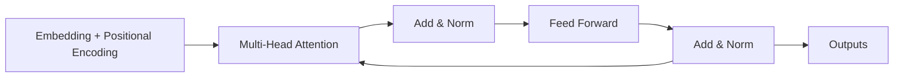

# 机器翻译在教育领域的应用:知识传播的AI加速器

## 1.背景介绍

### 1.1 知识传播的重要性

在当今快节奏的信息时代,知识的传播和共享对于推动社会进步、促进创新以及提高人类福祉至关重要。教育作为知识传播的核心渠道,对于培养下一代人才、传承文化遗产以及推动科技发展发挥着关键作用。然而,语言障碍一直是知识传播过程中的一大挑战,它限制了不同语言背景群体之间的交流和理解。

### 1.2 机器翻译的崛起

机器翻译(Machine Translation, MT)技术通过利用人工智能和自然语言处理算法,实现跨语言的自动文本转换,为打破语言壁垒提供了有力工具。近年来,benefiting from breakthrough in deep learning and large language models, MT 的质量和准确性得到了极大提升,逐渐被广泛应用于多个领域,包括商业、新闻、旅游等。

### 1.3 教育领域的机遇与挑战

教育领域被视为机器翻译技术的重要应用场景。通过将教学资源从一种语言翻译成其他语言,MT 可以促进不同语言背景的学习者获取知识,从而增强知识的传播和普及。然而,教育资源通常包含专业术语、复杂句式和文化隐喻,对翻译质量提出了更高要求。此外,教育场景下的翻译需要考虑学习者的年龄、知识水平等因素,以确保翻译结果的可读性和可理解性。

## 2.核心概念与联系

### 2.1 机器翻译的工作原理

机器翻译系统通常由三个核心组件组成:

1. **编码器(Encoder)**: 将源语言文本转换为语义向量表示
2. **解码器(Decoder)**: 根据语义向量生成目标语言文本
3. **注意力机制(Attention Mechanism)**: 在解码过程中,动态关注源语言不同部分,以提高翻译质量

传统的基于规则和统计方法已被深度学习技术所取代,尤其是**transformer模型**和**大型语言模型**,它们通过在大规模语料库上训练,展现出了卓越的翻译性能。


### 2.2 教育场景下的挑战

尽管机器翻译技术日益成熟,但在教育领域的应用仍面临诸多挑战:

1. **术语一致性**: 教育资源中往往包含大量专有术语,需要确保术语翻译的准确性和一致性。
2. **语境理解**: 正确把握语境对于准确翻译至关重要,尤其是隐喻、比喻等修辞手法的理解。
3. **语域适应性**: 不同学科领域的语言风格和表达方式存在差异,需要针对性地优化翻译模型。
4. **可读性和可理解性**: 翻译结果需要考虑学习者的年龄、知识水平等因素,确保其可读性和易理解性。

## 3.核心算法原理具体操作步骤  

### 3.1 序列到序列模型

机器翻译任务本质上是将一个序列(源语言文本)映射到另一个序列(目标语言文本)的过程,因此**序列到序列(Sequence-to-Sequence, Seq2Seq)模型**被广泛应用。Seq2Seq模型由两部分组成:

1. **编码器(Encoder)**: 一个循环神经网络(RNN)或Transformer的编码器,将源语言序列编码为一个向量表示。
2. **解码器(Decoder)**: 另一个RNN或Transformer的解码器,根据编码器的输出以及先前生成的tokens,预测下一个token。

$$\begin{align*}
h_t &= \text{EncoderRNN}(x_t, h_{t-1}) \\
s_t &= \text{DecoderRNN}(y_{t-1}, s_{t-1}, c_t) \\
p(y_t | y_{<t}, x) &= \text{DecoderOutput}(s_t, h)
\end{align*}$$

其中 $h_t$ 表示编码器在时间步 $t$ 的隐藏状态, $s_t$ 表示解码器在时间步 $t$ 的隐藏状态, $c_t$ 是上下文向量(通过注意力机制从编码器得到)。

### 3.2 Transformer 模型

Transformer 是一种全新的基于自注意力机制的序列到序列模型,不依赖于循环神经网络,因此具有更好的并行性能。其核心思想是通过**自注意力(Self-Attention)**机制捕获输入序列中任意两个位置之间的依赖关系。



1. **Embedding层**: 将输入token映射到连续的向量空间
2. **Positional Encoding**: 引入位置信息,因为Transformer没有循环或卷积结构
3. **Multi-Head Attention**: 并行计算多个注意力头,关注输入不同的子空间表示
4. **前馈全连接层**: 对每个位置的向量进行非线性变换
5. **Add & Norm**: 残差连接和层归一化,促进梯度传播

通过堆叠多个这样的Encoder和Decoder层,Transformer可以高效地建模长距离依赖,并通过掩码机制实现平行解码,大幅提升了翻译效率。

### 3.3 优化技术

为了进一步提升机器翻译质量,研究人员提出了多种优化技术:

1. **反向翻译(Back-Translation)**: 利用大量单语语料生成伪双语数据,增强模型的泛化能力。
2. **数据增强(Data Augmentation)**: 通过词重复、词交换等方式构造新的训练样本,增加数据多样性。
3. **迁移学习(Transfer Learning)**: 使用在大规模语料上预训练的模型作为初始化,进行领域细化训练。
4. **模型集成(Model Ensemble)**: 将多个独立训练的模型预测结果进行集成,提高泛化能力。
5. **注意力可视化(Attention Visualization)**: 分析注意力权重,了解模型关注哪些关键信息,有助于优化和解释。

## 4.数学模型和公式详细讲解举例说明

在机器翻译任务中,常用的评估指标包括:

1. **BLEU (Bilingual Evaluation Understudy)**: 基于n-gram的评估指标,衡量机器翻译结果与人工参考译文的相似程度。

$$\text{BLEU} = BP \cdot \exp\Big(\sum_{n=1}^N w_n \log p_n\Big)$$

其中 $p_n$ 表示机器翻译结果与参考译文中的n-gram匹配精度, $w_n$ 为对应的权重, $BP$ 为惩罚因子。

2. **TER (Translation Edit Rate)**: 计算从机器翻译结果到最佳人工译文所需的最小编辑距离。

$$\text{TER} = \frac{\text{#inserts} + \text{#deletes} + \text{#substitutes} + \text{#shifts}}{\text{#tokens in reference}}$$

3. **BERTScore**: 基于预训练语言模型BERT,计算机器翻译结果与参考译文之间的句子级和词级相似度。

$$\begin{aligned}
\mathcal{R}_{ij}^{rec} &= \cos\big(x_i^A, x_j^B\big) \\
\mathcal{R}_{ij}^{prec} &= \cos\big(x_j^B, x_i^A\big) \\
\mathcal{F} &= \frac{2 \cdot \mathcal{R}^{prec} \cdot \mathcal{R}^{rec}}{\mathcal{R}^{prec} + \mathcal{R}^{rec}}
\end{aligned}$$

其中 $x_i^A$、$x_j^B$ 分别为句子 $A$、$B$ 中的第 $i$、$j$ 个词的BERT表示。$\mathcal{R}^{rec}$、$\mathcal{R}^{prec}$ 分别表示召回和精确率, $\mathcal{F}$ 为最终的 F1 分数。

这些指标从不同角度评估了翻译质量,帮助研究人员分析模型优缺点并持续改进算法。

## 4.项目实践:代码实例和详细解释说明

以下是使用Python和Hugging Face Transformers库实现机器翻译的示例代码:

```python
from transformers import MarianMTModel, MarianTokenizer

# 加载预训练模型和分词器
model_name = "Helsinki-NLP/opus-mt-en-zh"
tokenizer = MarianTokenizer.from_pretrained(model_name)
model = MarianMTModel.from_pretrained(model_name)

# 定义翻译函数
def translate(text, max_length=100):
    encoded = tokenizer(text, return_tensors="pt", max_length=max_length, truncation=True)
    output = model.generate(**encoded, max_length=max_length)
    translation = tokenizer.batch_decode(output, skip_special_tokens=True)[0]
    return translation

# 示例输入
en_text = "Machine translation is the core of knowledge dissemination in the era of artificial intelligence."

# 英文到中文翻译
zh_text = translate(en_text)
print(zh_text)
# 输出: 机器翻译是人工智能时代知识传播的核心。
```

代码解释:

1. 导入必要的类和函数,包括 `MarianMTModel` (机器翻译模型)和 `MarianTokenizer` (分词器)。
2. 使用 `from_pretrained` 方法加载预训练的英文到中文翻译模型 `Helsinki-NLP/opus-mt-en-zh`。
3. 定义 `translate` 函数,接受英文文本作为输入,执行以下步骤:
    - 使用分词器对输入文本进行编码,得到模型可接受的张量表示。
    - 调用模型的 `generate` 方法生成目标语言(中文)的输出序列。
    - 使用分词器的 `batch_decode` 方法将输出序列解码为可读的中文文本。
4. 提供一个英文示例文本,调用 `translate` 函数进行英中翻译。

该示例使用了Hugging Face提供的开源机器翻译模型,展示了如何使用Python快速实现翻译功能。在实际应用中,您可以根据需求加载不同语言对的模型,并结合其他优化技术(如细化训练、模型集成等)来提升翻译质量。

## 5.实际应用场景

机器翻译在教育领域的应用前景广阔,可以促进知识的无障碍传播,为世界各地的学习者提供更多机会。以下是一些典型的应用场景:

### 5.1 在线教育资源翻译

随着在线教育的兴起,大量的课程、教材、视频等教育资源在互联网上流通。通过机器翻译,这些资源可以被翻译成不同语言,扩大受众范围,实现跨地区、跨文化的知识共享。

### 5.2 国际学术交流

机器翻译可以促进不同语种学者之间的学术交流与合作。研究论文、会议文献等学术资料的翻译,有助于加速新知识、新理论的全球传播,推动科研进步。

### 5.3 多语种在线学习平台

基于机器翻译技术,在线学习平台可以支持多种语言,为世界各地的学习者提供个性化的学习体验。学习者可以使用自己的母语浏览课程内容,从而提高学习效率和参与度。

### 5.4 语言学习辅助

在语言学习过程中,机器翻译可以作为有力的辅助工具。学习者可以利用翻译系统快速了解新单词、短语的含义,加深对目标语言的理解。同时,通过对比源语言和译文,学习者可以发现语言之间的差异,提高语言感知能力。

### 5.5 教育资源本地化

针对不同地区的文化背景和教育需求,通过机器翻译可以实现教育资源的本地化。例如,将通用教材翻译成当地语言,或者对内容进行适当调整,以契合当地的教育理念和文化传统。

## 6.工具和资源推荐

为了支持机器翻译在教育领域的应用,研