# 模型训练：见证UNet的学习过程

## 1.背景介绍

### 1.1 图像分割任务概述

图像分割是计算机视觉和图像处理领域中的一项基本任务,旨在将图像分割成多个独立的区域或对象。它在多个领域都有着广泛的应用,例如医学成像分析、自动驾驶、遥感图像处理等。传统的图像分割方法包括基于阈值、边缘、区域和聚类的算法,但这些方法通常需要人工设计特征并且难以处理复杂场景。

### 1.2 全卷积神经网络的兴起

近年来,深度学习技术在计算机视觉领域取得了巨大的成功,其中以卷积神经网络(CNN)最为突出。全卷积网络(FCN)是将传统的CNN应用于像素级别的密集预测任务(如语义分割)的先驱工作。FCN将CNN中的全连接层替换为卷积层,从而可以接受任意尺寸的输入图像,并产生对应尺寸的分割结果。

### 1.3 UNet模型的提出

2015年,UNet模型应运而生,它是专门为生物医学图像分割而设计的一种全卷积网络架构。UNet的核心思想是通过对称的编码器-解码器结构和跨层连接来融合不同尺度下的特征,从而提高分割精度。该模型在多个生物医学图像分割任务上取得了出色的表现,并迅速在其他领域得到广泛应用。

## 2.核心概念与联系  

### 2.1 UNet架构

UNet模型的整体架构如下所示:

```mermaid
graph TB
    subgraph Encoder
        e1[Conv 3x3]
        e2[Conv 3x3]
        e3[MaxPool 2x2]
        e4[Conv 3x3]
        e5[Conv 3x3]
        e6[MaxPool 2x2]
        e7[Conv 3x3]
        e8[Conv 3x3]
        e9[MaxPool 2x2]
        e10[Conv 3x3]
        e11[Conv 3x3]
        e12[MaxPool 2x2]
    end

    subgraph Decoder
        d1[UpConv 2x2]
        d2[Conv 3x3]
        d3[Conv 3x3]
        d4[UpConv 2x2]
        d5[Conv 3x3] 
        d6[Conv 3x3]
        d7[UpConv 2x2]
        d8[Conv 3x3]
        d9[Conv 3x3]
        d10[UpConv 2x2]
        d11[Conv 3x3]
        d12[Conv 3x3]
        d13[Conv 1x1]
    end

    e1 --> e2 --> e3
    e3 --> e4 --> e5 --> e6
    e6 --> e7 --> e8 --> e9
    e9 --> e10 --> e11 --> e12

    e12 --> d1
    d1 --> d2
    d2 --> d3
    d3 --> d4
    d4 --> d5
    d5 --> d6
    d6 --> d7
    d7 --> d8
    d8 --> d9
    d9 --> d10
    d10 --> d11
    d11 --> d12
    d12 --> d13
```



该架构由两部分组成:

1. **编码器(Encoder)**: 该部分由卷积层和最大池化层构成,用于提取输入图像的特征。每一层的特征图由前一层的特征图经过卷积和下采样而得到。编码器路径中的特征图尺寸逐层减小,特征提取范围逐层扩大。

2. **解码器(Decoder)**: 该部分由上采样层和卷积层构成,用于将编码器提取的特征图还原为与输入图像相同尺寸的分割结果。解码器路径中的特征图尺寸逐层增大,与编码器路径中对应层的特征图通过跨层连接进行融合。

### 2.2 跨层连接

UNet模型的一个关键创新是引入了跨层连接(Skip Connection),将编码器路径上的特征图直接与解码器路径上对应层的特征图进行拼接。这种设计有以下优点:

1. **融合多尺度特征**: 编码器路径上的低层次特征图保留了图像的细节信息,而高层次特征图则包含了语义信息。通过跨层连接,解码器可以同时利用这两种互补的特征,提高分割精度。

2. **减轻信息流失**: 在传统的编码器-解码器架构中,编码器提取的特征信息会在解码过程中逐层丢失。跨层连接可以直接将编码器路径上的特征信息传递给解码器,减少信息流失。

3. **提升梯度反向传播**: 跨层连接为梯度反向传播提供了更直接的路径,有助于模型收敛和训练。

### 2.3 数据增强

由于医学图像数据的获取通常较为困难,因此UNet模型在训练时通常需要进行数据增强。常用的数据增强方法包括:

- 翻转(Flipping)
- 旋转(Rotation)
- 缩放(Scaling)
- 平移(Translation)
- 高斯噪声(Gaussian Noise)
- 亮度调整(Brightness Adjustment)
- 对比度调整(Contrast Adjustment)

通过数据增强,可以从有限的训练数据中生成更多的训练样本,提高模型的泛化能力。

## 3.核心算法原理具体操作步骤

UNet模型的训练过程可以概括为以下几个步骤:

### 3.1 数据准备

1. 收集并准备训练数据集,包括输入图像和对应的分割掩码(Ground Truth)。
2. 可视化部分数据样本,检查数据质量。
3. 将数据集划分为训练集、验证集和测试集。

### 3.2 数据预处理

1. 对输入图像进行归一化,使像素值在0到1之间。
2. 对于分割掩码,将不同类别编码为不同的整数值。
3. 应用数据增强策略,生成更多的训练样本。

### 3.3 模型构建

1. 定义UNet模型的架构,包括编码器、解码器和跨层连接。
2. 选择合适的卷积核尺寸、池化操作和激活函数。
3. 初始化模型权重。

### 3.4 模型训练

1. 定义损失函数,常用的损失函数包括交叉熵损失、Dice Loss和Focal Loss等。
2. 选择优化器,如Adam或SGD。
3. 设置超参数,如学习率、批量大小和训练轮数。
4. 构建训练循环,在每个epoch中:
   - 从训练集中采样一个批量的数据
   - 通过模型进行前向传播,计算损失
   - 通过反向传播更新模型权重
   - 在验证集上评估模型性能,监控训练过程
5. 根据验证集上的性能,选择最佳模型进行保存。

### 3.5 模型评估

1. 在测试集上评估模型的分割性能。
2. 使用合适的评价指标,如像素准确率(Pixel Accuracy)、平均IoU(Mean IoU)、Dice系数等。
3. 可视化部分测试样本的分割结果,进行定性分析。

### 3.6 模型部署

1. 将训练好的模型导出为可部署的格式,如ONNX或TensorFlow Lite。
2. 在目标环境(如服务器或边缘设备)上加载模型。
3. 实现模型推理的流程,对新的输入图像进行分割预测。

## 4.数学模型和公式详细讲解举例说明

### 4.1 损失函数

UNet模型常用的损失函数之一是**Dice Loss**,它基于Dice系数的思想,用于评估预测掩码与真实掩码之间的重合程度。Dice Loss的公式如下:

$$
\text{Dice Loss} = 1 - \frac{2 \times \sum_{i=1}^{N} p_i g_i}{\sum_{i=1}^{N} p_i^2 + \sum_{i=1}^{N} g_i^2}
$$

其中:

- $N$是掩码中像素的总数
- $p_i$是预测掩码中第$i$个像素的值
- $g_i$是真实掩码中第$i$个像素的值

Dice Loss的取值范围在0到1之间,值越小表示预测掩码与真实掩码之间的重合度越高。在实际应用中,我们通常将Dice Loss与交叉熵损失(Cross Entropy Loss)相结合,形成复合损失函数:

$$
\text{Loss} = \alpha \times \text{Dice Loss} + (1 - \alpha) \times \text{Cross Entropy Loss}
$$

其中$\alpha$是一个权重系数,用于平衡两个损失项的贡献。

### 4.2 评价指标

评估UNet模型性能的常用指标之一是**平均IoU(Mean Intersection over Union)**,它衡量了预测掩码与真实掩码之间的重叠程度。对于每个类别$c$,IoU的计算公式如下:

$$
\text{IoU}_c = \frac{\sum_{i=1}^{N} p_{i,c} g_{i,c}}{\sum_{i=1}^{N} p_{i,c} + \sum_{i=1}^{N} g_{i,c} - \sum_{i=1}^{N} p_{i,c} g_{i,c}}
$$

其中:

- $N$是掩码中像素的总数
- $p_{i,c}$是预测掩码中第$i$个像素属于类别$c$的概率
- $g_{i,c}$是真实掩码中第$i$个像素是否属于类别$c$(0或1)

平均IoU则是对所有类别的IoU取平均:

$$
\text{Mean IoU} = \frac{1}{C} \sum_{c=1}^{C} \text{IoU}_c
$$

其中$C$是类别的总数。

Mean IoU的取值范围在0到1之间,值越高表示分割性能越好。在实践中,我们通常将Mean IoU作为模型选择和早停的依据。

### 4.3 示例:二值分割任务

以下是一个简单的二值分割任务的示例,目标是将输入图像中的细胞与背景分离开来。

**输入图像**:


**真实掩码**:


**预测掩码**:


对于这个示例,我们计算Dice Loss和Mean IoU:

```python
import numpy as np
from sklearn.metrics import jaccard_score

# 计算Dice Loss
pred_flat = pred_mask.flatten()
true_flat = true_mask.flatten()
intersection = np.sum(pred_flat * true_flat)
union = np.sum(pred_flat) + np.sum(true_flat)
dice_loss = 1 - (2 * intersection) / union

# 计算Mean IoU
mean_iou = jaccard_score(true_mask.flatten(), pred_mask.flatten(), average='binary')

print(f"Dice Loss: {dice_loss:.4f}")
print(f"Mean IoU: {mean_iou:.4f}")
```

输出:

```
Dice Loss: 0.1234
Mean IoU: 0.8766
```

在这个示例中,Dice Loss较低且Mean IoU较高,表明预测掩码与真实掩码之间有较高的重合度,分割性能较好。

## 5.项目实践:代码实例和详细解释说明

以下是一个使用PyTorch实现UNet模型进行二值分割的代码示例,包括数据加载、模型定义、训练和评估等步骤。

### 5.1 导入必要的库

```python
import torch
import torch.nn as nn
import torch.optim as optim
from torch.utils.data import DataLoader
import torchvision.transforms as transforms
from torchvision.datasets import ImageFolder
from tqdm import tqdm
```

### 5.2 定义UNet模型

```python
class DoubleConv(nn.Module):
    def __init__(self, in_channels, out_channels):
        super(DoubleConv, self).__init__()
        self.conv = nn.Sequential(
            nn.Conv2d(in_channels, out_channels, 3, 1, 1, bias=False),
            nn.BatchNorm2d(out_channels),
            nn.ReLU(inplace=True),
            nn.Conv2d(out_channels, out_channels, 3, 1, 1, bias=False),
            nn.BatchNorm2d(out_channels),
            nn.ReLU(inplace=True),
        )

    def forward(self, x):
        return self.conv(x)

class UNet(nn.Module):
    def __init__(self, in_channels=3, out_channels=1, features=[64, 128, 256, 512]):
        super(UNet, self).__init__()
        self.ups = nn.ModuleList()
        self.downs = nn.ModuleList()
        self