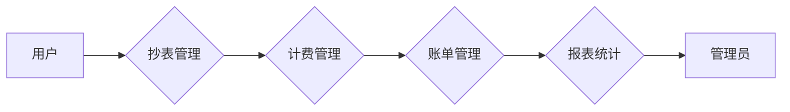

## 1. 背景介绍

### 1.1 水费电费管理系统概述

随着城市化进程的加速和人口的增长，水电资源的管理变得越来越重要。为了提高水电资源的利用效率，降低管理成本，水费电费管理系统应运而生。该系统旨在实现水电费用的自动化计量、收费、统计和分析，为用户提供便捷的服务，为管理部门提供科学的决策依据。

### 1.2 传统水费电费管理方式的弊端

传统的水费电费管理方式主要依靠人工抄表、手工计算和账单寄送，存在着效率低下、易出错、服务质量差等弊端。具体表现在：

* **抄表效率低:** 人工抄表需要挨家挨户上门，耗时耗力。
* **易出错:** 手工计算容易出现错误，导致账单不准确。
* **服务质量差:** 用户无法及时了解自己的水电使用情况和账单信息，难以进行费用控制。
* **数据分析能力弱:** 传统的管理方式难以对水电使用数据进行深入分析，无法为管理决策提供有效支持。

### 1.3 水费电费管理系统的优势

水费电费管理系统利用现代信息技术，实现了水电费管理的自动化、信息化和智能化，有效解决了传统管理方式的弊端，带来了诸多优势：

* **提高效率:** 自动抄表、计费和账单生成，大大提高了工作效率。
* **减少错误:** 系统自动计算，避免了人工计算的错误。
* **提升服务质量:** 用户可以通过系统查询账单、缴费、了解水电使用情况等，享受便捷的服务。
* **数据分析:** 系统可以对水电使用数据进行统计分析，为管理决策提供科学依据。

## 2. 核心概念与联系

### 2.1 系统用户

水费电费管理系统涉及的用户主要包括：

* **管理员:** 负责系统的日常维护、用户管理、数据分析等工作。
* **抄表员:** 负责定期抄录用户的水电表数据。
* **用户:** 使用水电资源的个人或单位。

### 2.2 系统功能模块

水费电费管理系统主要包含以下功能模块：

* **用户管理:** 管理用户信息，包括用户编号、姓名、地址、联系方式等。
* **抄表管理:** 记录用户的抄表数据，包括抄表时间、读数等。
* **计费管理:** 根据抄表数据和收费标准计算用户的水电费用。
* **账单管理:** 生成用户的账单，并提供账单查询、缴费等功能。
* **报表统计:** 对水电使用数据进行统计分析，生成各种报表。

### 2.3 系统数据流

水费电费管理系统的数据流如下图所示：



## 3. 核心算法原理具体操作步骤

### 3.1 水费电费计算方法

水费电费的计算方法一般采用阶梯式计费方式，即根据用户的用量划分不同的阶梯，每个阶梯对应不同的单价。例如：

```
用水量 | 单价
------- | --------
0-10吨 | 2元/吨
10-20吨 | 3元/吨
20吨以上 | 4元/吨
```

### 3.2 计费算法

计费算法的具体步骤如下：

1. 获取用户的抄表数据，包括上次读数和本次读数。
2. 计算用户的用量，即本次读数减去上次读数。
3. 根据用量和阶梯式计费标准，计算用户的应缴费用。
4. 生成用户的账单。

### 3.3 算法示例

假设用户的上次读数为100吨，本次读数为120吨，则用户的用量为20吨。根据上述阶梯式计费标准，用户的应缴费用为：

```
10吨 * 2元/吨 + 10吨 * 3元/吨 = 50元
```

## 4. 数学模型和公式详细讲解举例说明

### 4.1 阶梯式计费模型

阶梯式计费模型可以用如下公式表示：

$$
C = \sum_{i=1}^{n} P_i * Q_i
$$

其中：

* $C$ 表示总费用
* $n$ 表示阶梯数量
* $P_i$ 表示第 $i$ 个阶梯的单价
* $Q_i$ 表示第 $i$ 个阶梯的用量

### 4.2 模型应用举例

假设用户的用水量为25吨，阶梯式计费标准如上所述，则用户的应缴费用为：

$$
C = 2 * 10 + 3 * 10 + 4 * 5 = 70元
$$

## 5. 项目实践：代码实例和详细解释说明

### 5.1 开发环境

* 操作系统: Windows 10
* 开发语言: Python 3.8
* 数据库: MySQL 8.0

### 5.2 代码实现

```python
import mysql.connector

# 数据库连接配置
config = {
    'user': 'root',
    'password': 'password',
    'host': 'localhost',
    'database': 'water_electricity'
}

# 连接数据库
cnx = mysql.connector.connect(**config)
cursor = cnx.cursor()

# 用户信息表
cursor.execute("""
    CREATE TABLE IF NOT EXISTS users (
        id INT AUTO_INCREMENT PRIMARY KEY,
        name VARCHAR(255) NOT NULL,
        address VARCHAR(255) NOT NULL,
        phone VARCHAR(255) NOT NULL
    )
""")

# 抄表数据表
cursor.execute("""
    CREATE TABLE IF NOT EXISTS meter_readings (
        id INT AUTO_INCREMENT PRIMARY KEY,
        user_id INT NOT NULL,
        reading_date DATE NOT NULL,
        reading INT NOT NULL,
        FOREIGN KEY (user_id) REFERENCES users(id)
    )
""")

# 阶梯式计费标准表
cursor.execute("""
    CREATE TABLE IF NOT EXISTS tariff_tiers (
        id INT AUTO_INCREMENT PRIMARY KEY,
        tier_start INT NOT NULL,
        tier_end INT NOT NULL,
        price DECIMAL(10,2) NOT NULL
    )
""")

# 插入阶梯式计费标准数据
cursor.execute("""
    INSERT INTO tariff_tiers (tier_start, tier_end, price) VALUES
    (0, 10, 2.00),
    (10, 20, 3.00),
    (20, 999999, 4.00)
""")

# 计费函数
def calculate_bill(user_id, current_reading):
    # 获取上次读数
    cursor.execute("""
        SELECT reading
        FROM meter_readings
        WHERE user_id = %s
        ORDER BY reading_date DESC
        LIMIT 1
    """, (user_id,))
    previous_reading = cursor.fetchone()[0]

    # 计算用量
    usage = current_reading - previous_reading

    # 计算费用
    total_bill = 0
    cursor.execute("SELECT * FROM tariff_tiers ORDER BY tier_start")
    tiers = cursor.fetchall()
    for tier in tiers:
        if usage > 0:
            tier_usage = min(usage, tier[2] - tier[1])
            total_bill += tier_usage * tier[3]
            usage -= tier_usage

    return total_bill

# 测试计费函数
user_id = 1
current_reading = 120
bill = calculate_bill(user_id, current_reading)
print(f"用户 {user_id} 的账单金额为: {bill}")

# 关闭数据库连接
cursor.close()
cnx.close()
```

### 5.3 代码解释

* 首先，代码连接到 MySQL 数据库，并创建了三个数据表：用户信息表、抄表数据表和阶梯式计费标准表。
* 然后，代码插入了阶梯式计费标准数据。
* 接着，代码定义了一个 `calculate_bill` 函数，该函数接收用户 ID 和当前读数作为参数，计算用户的账单金额。
* `calculate_bill` 函数首先从抄表数据表中获取用户的上次读数，然后计算用量。
* 接着，`calculate_bill` 函数遍历阶梯式计费标准表，根据用量和阶梯式计费标准计算用户的应缴费用。
* 最后，代码测试了 `calculate_bill` 函数，并打印了用户的账单金额。

## 6. 实际应用场景

### 6.1 住宅小区水费电费管理

水费电费管理系统可以应用于住宅小区的水费电费管理，实现自动抄表、计费、账单生成和缴费等功能，提高管理效率，提升服务质量。

### 6.2 工业企业能源管理

水费电费管理系统可以应用于工业企业的能源管理，对企业的用水、用电情况进行监控和分析，帮助企业节约能源，降低成本。

### 6.3 政府部门水资源管理

水费电费管理系统可以应用于政府部门的水资源管理，对水资源的使用情况进行统计分析，为水资源的合理分配和利用提供决策依据。

## 7. 工具和资源推荐

### 7.1 数据库管理工具

* MySQL Workbench
* Navicat for MySQL

### 7.2 Python 数据库连接库

* MySQL Connector
* PyMySQL

### 7.3 相关学习资源

* MySQL 教程: https://www.w3schools.com/mysql/
* Python 教程: https://www.w3schools.com/python/

## 8. 总结：未来发展趋势与挑战

### 8.1 未来发展趋势

* 智能化: 随着人工智能技术的不断发展，水费电费管理系统将更加智能化，例如自动识别异常用量、预测用水用电需求等。
* 集成化: 水费电费管理系统将与其他系统集成，例如物业管理系统、能源管理系统等，实现数据共享和协同管理。
* 云化: 水费电费管理系统将逐步迁移到云端，利用云计算技术提高系统的可靠性和安全性。

### 8.2 面临的挑战

* 数据安全: 水费电费管理系统存储了大量的用户敏感信息，需要采取有效的措施保障数据安全。
* 系统稳定性: 水费电费管理系统需要保证系统的稳定运行，避免因系统故障导致服务中断。
* 用户体验: 水费电费管理系统需要不断优化用户体验，提供更加便捷、高效的服务。

## 9. 附录：常见问题与解答

### 9.1 如何修改用户信息？

用户可以通过系统提供的个人中心修改自己的用户信息，例如姓名、地址、联系方式等。

### 9.2 如何查询账单？

用户可以通过系统提供的账单查询功能查询自己的账单信息，包括账单金额、缴费状态等。

### 9.3 如何缴费？

用户可以通过系统提供的在线缴费功能进行缴费，支持多种支付方式，例如支付宝、微信支付等。

### 9.4 如何联系客服？

用户可以通过系统提供的客服电话或在线客服联系客服人员，咨询相关问题或反馈意见建议。
