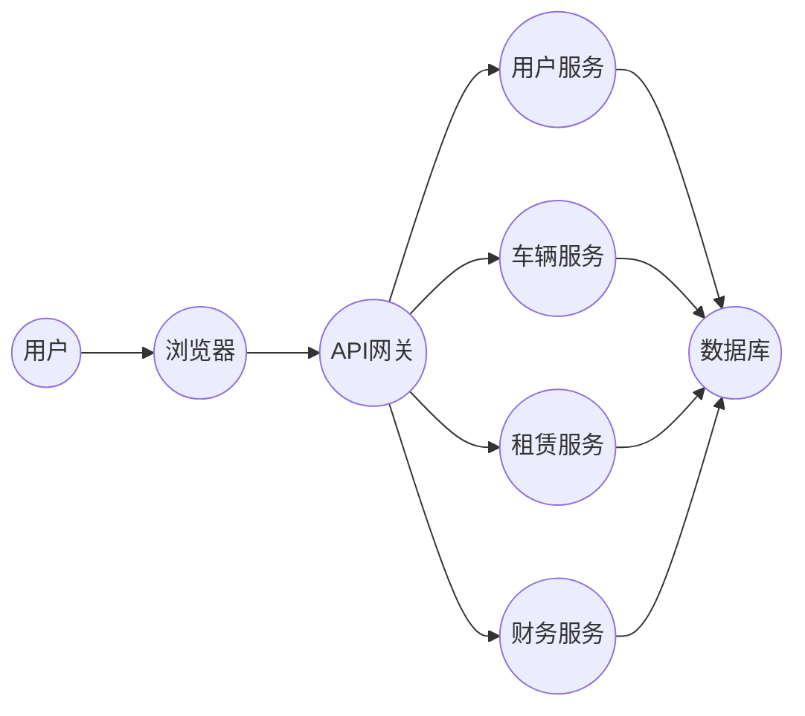

## 1. 背景介绍

### 1.1 汽车租赁行业的现状与挑战

随着人们生活水平的提高和出行需求的日益增长，汽车租赁行业近年来得到了快速发展。传统的汽车租赁模式存在着诸多痛点，如信息不对称、租赁流程繁琐、车辆管理效率低下等问题。为了解决这些问题，现代化的汽车租赁管理系统应运而生。

### 1.2 汽车租赁管理系统的意义

汽车租赁管理系统可以有效地整合车辆资源、优化租赁流程、提高运营效率，为用户提供更加便捷、高效、优质的租车服务。同时，该系统还可以帮助租赁公司实时掌握车辆状态、租赁信息、财务数据等关键信息，为经营决策提供有力支持。

## 2. 核心概念与联系

### 2.1 系统用户角色

* **管理员:** 负责系统管理、用户管理、车辆管理、租赁管理、财务管理等核心功能。
* **员工:** 负责车辆调度、客户服务、租赁合同管理等日常运营工作。
* **客户:** 通过系统浏览车辆信息、提交租赁申请、在线支付租金等。

### 2.2 系统功能模块

* **用户管理模块:** 实现用户注册、登录、权限管理、信息修改等功能。
* **车辆管理模块:** 实现车辆信息录入、车辆状态管理、车辆调度等功能。
* **租赁管理模块:** 实现租赁申请、合同管理、租金结算、车辆归还等功能。
* **财务管理模块:** 实现租金收入管理、支出管理、财务报表生成等功能。
* **统计分析模块:** 对租赁数据进行统计分析，为经营决策提供数据支持。

### 2.3 核心概念之间的联系

* 用户角色与功能模块之间存在着紧密的联系，不同角色的用户拥有不同的系统操作权限。
* 各个功能模块之间相互协作，共同完成汽车租赁业务的全流程管理。

## 3. 核心算法原理具体操作步骤

### 3.1 车辆调度算法

为了提高车辆利用率，系统需要根据用户的租车需求和车辆的可用状态进行智能调度。常用的车辆调度算法包括：

* **贪心算法:** 优先选择距离用户最近的可用车辆。
* **模拟退火算法:** 通过模拟金属退火过程，寻找最优的车辆调度方案。
* **遗传算法:** 通过模拟生物进化过程，不断优化车辆调度方案。

### 3.2 租金计算算法

租金计算需要考虑车辆类型、租赁时长、保险费用等因素。常用的租金计算公式如下：

```
租金 = 日租金 * 租赁天数 + 保险费用
```

### 3.3 具体操作步骤

1. 用户提交租车申请，选择车辆类型、租赁时间等信息。
2. 系统根据车辆调度算法选择合适的车辆。
3. 系统根据租金计算算法计算租金。
4. 用户确认租车信息并支付租金。
5. 员工进行车辆交接，并将车辆状态更新为“已出租”。
6. 用户使用车辆，并在租赁期结束后归还车辆。
7. 员工检查车辆状态，并将车辆状态更新为“可用”。
8. 系统生成租赁合同和财务报表。

## 4. 数学模型和公式详细讲解举例说明

### 4.1 车辆调度模型

假设有 $n$ 辆车和 $m$ 个用户，车辆位置用二维坐标 $(x_i, y_i)$ 表示，用户位置用二维坐标 $(p_j, q_j)$ 表示。车辆调度问题可以转化为一个二分图匹配问题，目标是找到一个匹配方案，使得所有用户都能租到车，并且总的行驶距离最短。

### 4.2 租金计算模型

租金计算公式可以表示为：

$$
租金 = \sum_{i=1}^{n} (日租金_i * 租赁天数_i) + 保险费用
$$

其中，$n$ 表示租赁车辆的数量，$日租金_i$ 表示第 $i$ 辆车的日租金，$租赁天数_i$ 表示第 $i$ 辆车的租赁天数。

### 4.3 举例说明

假设用户 A 租一辆经济型轿车 3 天，日租金为 200 元，保险费用为 50 元，则租金为：

```
租金 = 200 * 3 + 50 = 650 元
```

## 5. 项目实践：代码实例和详细解释说明

### 5.1 技术选型

* **后端:** Spring Boot 框架
* **数据库:** MySQL
* **前端:** Vue.js

### 5.2 代码实例

```java
// 车辆实体类
public class Car {
    private Long id;
    private String brand;
    private String model;
    private String licensePlate;
    private String status;
    // ...
}

// 租赁订单实体类
public class RentalOrder {
    private Long id;
    private Long userId;
    private Long carId;
    private Date startTime;
    private Date endTime;
    private double rentalFee;
    // ...
}

// 租金计算服务
@Service
public class RentalFeeService {

    public double calculateRentalFee(Car car, int days) {
        double dailyRentalFee = car.getDailyRentalFee();
        double insuranceFee = 50;
        return dailyRentalFee * days + insuranceFee;
    }
}
```

### 5.3 代码解释说明

* `Car` 实体类用于存储车辆信息，包括品牌、型号、车牌号、状态等。
* `RentalOrder` 实体类用于存储租赁订单信息，包括用户 ID、车辆 ID、租赁起始时间、租赁结束时间、租金等。
* `RentalFeeService` 服务类用于计算租金，根据车辆的日租金和租赁天数计算总租金。

## 6. 实际应用场景

### 6.1 传统汽车租赁公司

汽车租赁管理系统可以帮助传统汽车租赁公司实现数字化转型，提高运营效率、降低运营成本、提升客户满意度。

### 6.2 网约车平台

网约车平台可以利用汽车租赁管理系统拓展业务范围，为用户提供更加多元化的出行服务。

### 6.3 企业用车管理

企业可以使用汽车租赁管理系统对内部车辆进行统一管理，提高车辆利用率、降低用车成本。

## 7. 工具和资源推荐

### 7.1 开发工具

* IntelliJ IDEA
* Eclipse
* Visual Studio Code

### 7.2 数据库

* MySQL
* Oracle
* PostgreSQL

### 7.3 前端框架

* Vue.js
* React
* Angular

## 8. 总结：未来发展趋势与挑战

### 8.1 未来发展趋势

* **智能化:** 利用人工智能技术实现车辆调度、租金定价、风险控制等方面的智能化。
* **共享化:** 推广共享汽车租赁模式，提高车辆利用率、降低出行成本。
* **平台化:** 打造综合性的汽车出行服务平台，整合租车、打车、代驾等多种服务。

### 8.2 面临的挑战

* **数据安全:** 如何保障用户数据和车辆数据的安全。
* **市场竞争:** 面临来自传统汽车租赁公司和网约车平台的竞争压力。
* **技术创新:** 需要不断进行技术创新，提升系统性能和用户体验。

## 9. 附录：常见问题与解答

### 9.1 如何注册账号？

用户可以通过系统首页的“注册”按钮进行账号注册，填写相关信息并提交即可。

### 9.2 如何修改个人信息？

用户登录系统后，点击页面右上角的用户名，进入“个人中心”页面，即可修改个人信息。

### 9.3 如何取消订单？

用户在租赁开始时间之前，可以登录系统取消订单。租赁开始后，无法取消订单。


## 10. 系统架构图



**图例:**

* 用户: 系统用户，包括管理员、员工和客户。
* 浏览器: 用户访问系统的工具。
* API 网关: 负责接收用户请求并转发到相应的服务。
* 用户服务: 负责用户管理功能。
* 车辆服务: 负责车辆管理功能。
* 租赁服务: 负责租赁管理功能。
* 财务服务: 负责财务管理功能。
* 数据库: 存储系统数据。
