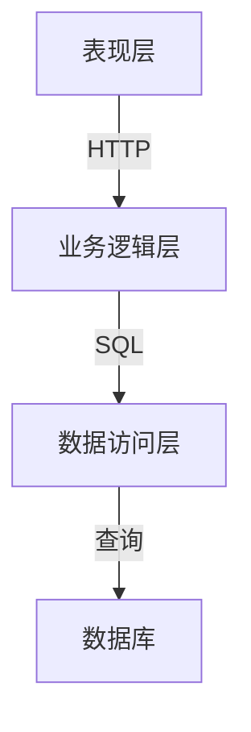

# 汽车销售系统详细设计与具体代码实现

## 1. 背景介绍

### 1.1 汽车销售业概况

汽车销售行业是一个庞大且竞争激烈的市场。随着科技的进步和消费者需求的不断变化,传统的销售模式已经无法满足当前的需求。因此,开发一个高效、智能的汽车销售系统变得越来越重要。

### 1.2 系统需求分析

一个优秀的汽车销售系统应该具备以下功能:

- 车辆信息管理:包括添加、编辑、删除和查询车辆信息。
- 销售管理:处理销售订单,跟踪库存,生成销售报告。
- 客户关系管理:维护客户信息,记录客户互动历史。
- 财务管理:管理收支,生成财务报表。
- 权限管理:控制不同角色的系统访问权限。

## 2. 核心概念与联系

### 2.1 系统架构

汽车销售系统通常采用三层架构,包括表现层(前端)、业务逻辑层(后端)和数据访问层。



### 2.2 核心模块

系统的核心模块包括:

- **车辆模块**:管理车辆信息,包括品牌、型号、年份、价格等。
- **销售模块**:处理销售订单,生成销售报告。
- **库存模块**:跟踪车辆库存,发出补货通知。
- **客户模块**:维护客户信息,记录互动历史。
- **财务模块**:管理收支,生成财务报表。
- **权限模块**:控制不同角色的系统访问权限。

## 3. 核心算法原理具体操作步骤

### 3.1 车辆信息管理算法

1. **添加车辆**:
    - 检查车辆信息的完整性和合法性。
    - 将新车辆信息插入数据库。
    - 更新库存记录。

2. **编辑车辆**:
    - 根据车辆ID查找对应的车辆记录。
    - 验证修改后的信息合法性。
    - 更新数据库中的车辆记录。

3. **删除车辆**:
    - 根据车辆ID查找对应的车辆记录。
    - 检查该车辆是否已被销售或预订。
    - 从数据库中删除该车辆记录。
    - 更新库存记录。

4. **查询车辆**:
    - 根据用户输入的查询条件构建SQL查询语句。
    - 执行SQL查询,获取满足条件的车辆记录。
    - 将查询结果返回给用户界面进行展示。

### 3.2 销售订单处理算法

1. **创建销售订单**:
    - 检查所选车辆的库存情况。
    - 验证客户信息的完整性和合法性。
    - 计算订单总价(包括税费和其他费用)。
    - 将订单信息插入数据库。
    - 更新库存记录。

2. **修改销售订单**:
    - 根据订单ID查找对应的订单记录。
    - 验证修改后的信息合法性。
    - 更新数据库中的订单记录。
    - 如果修改了车辆信息,更新库存记录。

3. **取消销售订单**:
    - 根据订单ID查找对应的订单记录。
    - 检查订单是否已经完成或取消。
    - 从数据库中删除该订单记录。
    - 更新库存记录。

4. **生成销售报告**:
    - 根据用户输入的条件构建SQL查询语句。
    - 执行SQL查询,获取满足条件的销售订单记录。
    - 对查询结果进行统计和汇总。
    - 将报告数据返回给用户界面进行展示或导出。

### 3.3 库存管理算法

1. **更新库存**:
    - 当有新车辆添加或销售时,更新对应车型的库存数量。
    - 如果库存低于设定阈值,发出补货通知。

2. **补货通知**:
    - 定期扫描库存记录,查找库存量低于阈值的车型。
    - 为这些车型生成补货通知。
    - 将通知发送给采购部门。

3. **库存查询**:
    - 根据用户输入的查询条件构建SQL查询语句。
    - 执行SQL查询,获取满足条件的库存记录。
    - 将查询结果返回给用户界面进行展示。

## 4. 数学模型和公式详细讲解举例说明

在汽车销售系统中,我们需要计算订单总价。订单总价由车辆价格、税费和其他费用组成。我们可以使用以下公式计算订单总价:

$$
总价 = 车辆价格 + 税费 + 其他费用
$$

其中:

- 车辆价格是固定值,来自车辆信息表。
- 税费通常是车辆价格的一定比例,可以用公式 $税费 = 车辆价格 \times 税率$ 计算。
- 其他费用可能包括运费、手续费等,需要根据具体情况计算。

例如,假设一辆车的价格为 $20,000 美元,税率为 8%,运费为 $500 美元,则订单总价计算如下:

$$
\begin{aligned}
车辆价格 &= 20,000\\
税费 &= 20,000 \times 0.08 = 1,600\\
其他费用 &= 500\\
总价 &= 20,000 + 1,600 + 500 = 22,100
\end{aligned}
$$

因此,该订单的总价为 $22,100 美元。

## 5. 项目实践:代码实例和详细解释说明

在这一部分,我们将提供一些核心功能的代码实例,并对其进行详细解释。

### 5.1 车辆信息管理

以下是使用 Java 和 Spring Boot 框架实现的车辆信息管理模块的代码示例:

```java
// VehicleController.java
@RestController
@RequestMapping("/vehicles")
public class VehicleController {

    @Autowired
    private VehicleService vehicleService;

    @PostMapping
    public ResponseEntity<Vehicle> addVehicle(@RequestBody Vehicle vehicle) {
        Vehicle newVehicle = vehicleService.addVehicle(vehicle);
        return ResponseEntity.ok(newVehicle);
    }

    @PutMapping("/{id}")
    public ResponseEntity<Vehicle> updateVehicle(@PathVariable Long id, @RequestBody Vehicle vehicle) {
        Vehicle updatedVehicle = vehicleService.updateVehicle(id, vehicle);
        return ResponseEntity.ok(updatedVehicle);
    }

    @DeleteMapping("/{id}")
    public ResponseEntity<Void> deleteVehicle(@PathVariable Long id) {
        vehicleService.deleteVehicle(id);
        return ResponseEntity.noContent().build();
    }

    @GetMapping
    public ResponseEntity<List<Vehicle>> getAllVehicles(@RequestParam(required = false) String make,
                                                        @RequestParam(required = false) String model,
                                                        @RequestParam(required = false) Integer year) {
        List<Vehicle> vehicles = vehicleService.getVehicles(make, model, year);
        return ResponseEntity.ok(vehicles);
    }
}
```

```java
// VehicleService.java
@Service
public class VehicleService {

    @Autowired
    private VehicleRepository vehicleRepository;

    @Autowired
    private InventoryService inventoryService;

    public Vehicle addVehicle(Vehicle vehicle) {
        validateVehicleInfo(vehicle);
        Vehicle savedVehicle = vehicleRepository.save(vehicle);
        inventoryService.updateInventory(savedVehicle, InventoryAction.ADD);
        return savedVehicle;
    }

    public Vehicle updateVehicle(Long id, Vehicle vehicle) {
        Vehicle existingVehicle = vehicleRepository.findById(id)
                .orElseThrow(() -> new ResourceNotFoundException("Vehicle not found"));

        existingVehicle.setMake(vehicle.getMake());
        existingVehicle.setModel(vehicle.getModel());
        // Update other fields as needed

        Vehicle updatedVehicle = vehicleRepository.save(existingVehicle);
        return updatedVehicle;
    }

    public void deleteVehicle(Long id) {
        Vehicle vehicle = vehicleRepository.findById(id)
                .orElseThrow(() -> new ResourceNotFoundException("Vehicle not found"));

        // Check if the vehicle has any active orders or reservations
        if (vehicle.getOrders().isEmpty() && vehicle.getReservations().isEmpty()) {
            vehicleRepository.delete(vehicle);
            inventoryService.updateInventory(vehicle, InventoryAction.REMOVE);
        } else {
            throw new IllegalStateException("Cannot delete a vehicle with active orders or reservations");
        }
    }

    public List<Vehicle> getVehicles(String make, String model, Integer year) {
        return vehicleRepository.findByMakeAndModelAndYear(make, model, year);
    }

    private void validateVehicleInfo(Vehicle vehicle) {
        // Implement validation logic here
    }
}
```

在上面的代码示例中,我们定义了一个 `VehicleController` 类,它提供了添加、更新、删除和查询车辆信息的 RESTful API 端点。

`VehicleService` 类负责实现业务逻辑,包括:

- `addVehicle`: 添加新车辆,同时更新库存记录。
- `updateVehicle`: 根据 ID 更新现有车辆的信息。
- `deleteVehicle`: 删除现有车辆,但只有在该车辆没有活跃订单或预订时才允许删除。
- `getVehicles`: 根据品牌、型号和年份查询车辆列表。

在实现中,我们使用了 Spring 框架提供的依赖注入功能,将 `VehicleRepository` 和 `InventoryService` 注入到 `VehicleService` 中。`VehicleRepository` 用于与数据库交互,而 `InventoryService` 用于更新库存记录。

### 5.2 销售订单处理

以下是使用 Java 和 Spring Boot 框架实现的销售订单处理模块的代码示例:

```java
// OrderController.java
@RestController
@RequestMapping("/orders")
public class OrderController {

    @Autowired
    private OrderService orderService;

    @PostMapping
    public ResponseEntity<Order> createOrder(@RequestBody Order order) {
        Order createdOrder = orderService.createOrder(order);
        return ResponseEntity.ok(createdOrder);
    }

    @PutMapping("/{id}")
    public ResponseEntity<Order> updateOrder(@PathVariable Long id, @RequestBody Order order) {
        Order updatedOrder = orderService.updateOrder(id, order);
        return ResponseEntity.ok(updatedOrder);
    }

    @DeleteMapping("/{id}")
    public ResponseEntity<Void> cancelOrder(@PathVariable Long id) {
        orderService.cancelOrder(id);
        return ResponseEntity.noContent().build();
    }

    @GetMapping
    public ResponseEntity<List<Order>> getOrders(@RequestParam(required = false) String customerName,
                                                 @RequestParam(required = false) LocalDate orderDateFrom,
                                                 @RequestParam(required = false) LocalDate orderDateTo) {
        List<Order> orders = orderService.getOrders(customerName, orderDateFrom, orderDateTo);
        return ResponseEntity.ok(orders);
    }
}
```

```java
// OrderService.java
@Service
public class OrderService {

    @Autowired
    private OrderRepository orderRepository;

    @Autowired
    private VehicleService vehicleService;

    @Autowired
    private CustomerService customerService;

    @Autowired
    private InventoryService inventoryService;

    public Order createOrder(Order order) {
        validateOrderInfo(order);

        Vehicle vehicle = vehicleService.getVehicleById(order.getVehicleId());
        checkVehicleAvailability(vehicle);

        Customer customer = customerService.getCustomerById(order.getCustomerId());

        order.setVehicle(vehicle);
        order.setCustomer(customer);
        order.setTotalPrice(calculateTotalPrice(vehicle));

        Order savedOrder = orderRepository.save(order);
        inventoryService.updateInventory(vehicle, InventoryAction.REMOVE);

        return savedOrder;
    }

    public Order updateOrder(Long id, Order order) {
        Order existingOrder = orderRepository.findById(id)
                .orElseThrow(() -> new ResourceNotFoundException("Order not found"));

        existingOrder.setVehicleId(order.getVehicleId());
        existingOrder.setCustomerId(order.getCustomerId());
        // Update other fields as needed

        Vehicle vehicle = vehicleService.getVehicleById(order.getVehicleId());
        checkVehicleAvailability(vehicle);

        existingOrder.setVehicle(vehicle);
        existingOrder.setCustomer(customerService.getCustomerById(order.getCustomerId()));
        existingOrder.setTotalPrice(calculateTotalPrice(vehicle));

        Order updatedOrder = orderRepository.save(existingOrder);
        inventoryService.updateInventory(vehicle, InventoryAction.REMOVE);

        return updatedOrder;
    }

    public void cancelOrder(Long id) {
        Order order = orderRepository.findById(id)
                .orElseThrow(() -> new ResourceNotFoundException("Order not found"));

        if (order.getStatus() == OrderStatus.COMPLETED) {
            throw new IllegalStateException("Cannot cancel a completed order");
        }

        order.setStatus(OrderStatus.CANCELLED);
        orderRepository.save(order);

        Vehicle vehicle = order.getVehicle();
        inventoryService.updateInventory(vehicle, InventoryAction.ADD);
    }

    public List<Order> getOrders(String customerName, LocalDate orderDateFrom, LocalDate orderDateTo) {
        return orderRepository.findByCustomerNameAndOrderDateBet