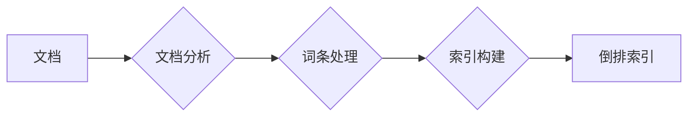
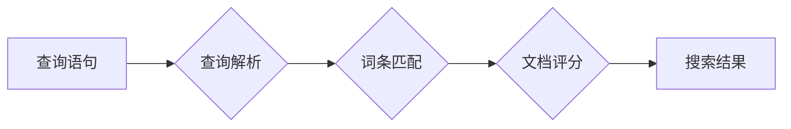

## 1. 背景介绍

### 1.1 全文检索的挑战与机遇

在信息爆炸的时代，如何高效地从海量数据中找到所需信息成为了一个巨大的挑战。传统的数据库检索方式往往依赖于精确匹配，难以满足用户日益增长的模糊查询、语义理解等需求。全文检索技术应运而生，它通过对文本进行分词、索引、排序等操作，实现了对非结构化数据的快速检索，极大地提升了信息获取的效率。

### 1.2 Lucene: 开源全文检索库的王者

Lucene，一个基于 Java 的开源全文检索库，以其高性能、可扩展性和丰富的功能著称，成为了全文检索领域的佼佼者。它不仅提供了强大的索引和搜索功能，还支持多种数据类型和查询语法，为开发者构建灵活、高效的搜索引擎提供了坚实的基础。

### 1.3 本文目标与结构

本文旨在深入剖析 Lucene 的核心概念——文档、域和词条，阐述它们之间的联系以及在全文检索过程中的作用。文章将从以下几个方面展开：

- 核心概念与联系：详细介绍文档、域、词条的定义、属性和关系，并结合实际案例加深理解。
- 核心算法原理具体操作步骤：深入分析 Lucene 的索引和搜索流程，阐述文档、域、词条在其中的关键作用。
- 数学模型和公式详细讲解举例说明：介绍 Lucene 中常用的评分模型，例如 TF-IDF、BM25 等，并结合实例讲解其计算过程。
- 项目实践：代码实例和详细解释说明：提供基于 Lucene 的代码示例，演示如何创建索引、执行搜索等操作，并对代码进行详细解释。
- 实际应用场景：介绍 Lucene 在各个领域的应用案例，例如电商搜索、法律检索、学术研究等。
- 工具和资源推荐：推荐一些常用的 Lucene 工具和学习资源，帮助读者更好地掌握 Lucene 技术。
- 总结：未来发展趋势与挑战：展望 Lucene 的未来发展趋势，并探讨全文检索领域面临的挑战。
- 附录：常见问题与解答：解答一些 Lucene 的常见问题，帮助读者解决实际问题。

## 2. 核心概念与联系

### 2.1 文档：信息的基本单元

在 Lucene 中，文档是信息的基本单元，它代表了一段独立的文本内容，例如一篇文章、一封邮件、一条微博等。每个文档都拥有一个唯一的标识符，用于区分不同的文档。

#### 2.1.1 文档的构成

一个文档通常由多个域组成，每个域代表文档的不同属性，例如标题、作者、内容、发布时间等。域可以包含不同类型的数据，例如文本、数字、日期等。

#### 2.1.2 文档的示例

例如，一篇新闻文章可以表示为一个 Lucene 文档，其包含以下域：

- title：新闻标题
- author：作者
- content：新闻内容
- date：发布时间

### 2.2 域：文档的属性

域是文档的属性，它代表了文档的不同方面，例如标题、作者、内容、发布时间等。域可以包含不同类型的数据，例如文本、数字、日期等。

#### 2.2.1 域的类型

Lucene 支持多种域类型，例如：

- TextField：用于存储文本数据，例如标题、内容等。
- StringField：用于存储不可分词的字符串，例如 ID、URL 等。
- IntPointField：用于存储整型数据，例如年龄、数量等。
- FloatPointField：用于存储浮点型数据，例如价格、评分等。

#### 2.2.2 域的示例

例如，在新闻文章文档中，可以使用以下域：

- title：TextField 类型，存储新闻标题。
- author：StringField 类型，存储作者姓名。
- content：TextField 类型，存储新闻内容。
- date：DateField 类型，存储发布时间。

### 2.3 词条：索引的基本单位

词条是索引的基本单位，它代表了一个单词或短语。Lucene 会将文档中的文本内容进行分词，提取出一个个词条，并将其存储到索引中。

#### 2.3.1 词条的构成

一个词条通常由以下信息组成：

- 文本：词条的文本内容。
- 文档频率：词条在所有文档中出现的次数。
- 词频：词条在某个文档中出现的次数。

#### 2.3.2 词条的示例

例如，在新闻文章文档中，"Lucene"、"全文检索"、"开源" 等都是词条。

### 2.4 文档、域、词条之间的联系

文档、域、词条之间存在着密切的联系：

- 文档由多个域组成，每个域代表文档的不同属性。
- 每个域包含一定数量的词条，词条是索引的基本单位。
- Lucene 通过索引词条来实现对文档的快速检索。

## 3. 核心算法原理具体操作步骤

### 3.1 索引流程

Lucene 的索引流程可以概括为以下几个步骤：

1. **文档分析**：将文档解析成多个域，并对每个域进行分词，提取出词条。
2. **词条处理**：对词条进行处理，例如去除停用词、词干提取等。
3. **索引构建**：将词条及其相关信息存储到索引中，构建倒排索引。

#### 3.1.1 倒排索引

倒排索引是一种数据结构，它将词条映射到包含该词条的文档列表。例如，对于词条 "Lucene"，倒排索引会记录包含该词条的所有文档 ID。

#### 3.1.2 索引流程图



### 3.2 搜索流程

Lucene 的搜索流程可以概括为以下几个步骤：

1. **查询解析**：将用户输入的查询语句解析成词条。
2. **词条匹配**：在倒排索引中查找与查询词条匹配的文档列表。
3. **文档评分**：根据评分模型对匹配的文档进行评分，并按分数排序。
4. **结果返回**：将评分最高的文档返回给用户。

#### 3.2.1 评分模型

Lucene 支持多种评分模型，例如 TF-IDF、BM25 等。这些模型会根据词条的频率、文档长度等因素计算文档的相关性得分。

#### 3.2.2 搜索流程图



## 4. 数学模型和公式详细讲解举例说明

### 4.1 TF-IDF

TF-IDF (Term Frequency-Inverse Document Frequency) 是一种常用的评分模型，它基于词条在文档和整个文档集合中的频率来计算文档的相关性得分。

#### 4.1.1 TF (词频)

词频指的是词条在某个文档中出现的次数。词频越高，说明该词条在该文档中越重要。

#### 4.1.2 IDF (逆文档频率)

逆文档频率指的是包含某个词条的文档数量的倒数的对数。IDF 越高，说明该词条在整个文档集合中越稀有，也就越重要。

#### 4.1.3 TF-IDF 公式

TF-IDF 的计算公式如下：

```
TF-IDF = TF * IDF
```

其中：

- TF：词条在文档中的词频。
- IDF：词条的逆文档频率，计算公式为 log(N/df)，其中 N 为文档总数，df 为包含该词条的文档数量。

#### 4.1.4 TF-IDF 示例

假设有 1000 篇文档，其中 10 篇文档包含词条 "Lucene"，某篇文档中 "Lucene" 出现了 5 次。则该词条的 TF-IDF 值为：

```
TF = 5
IDF = log(1000/10) = 2
TF-IDF = 5 * 2 = 10
```

### 4.2 BM25

BM25 (Best Match 25) 是一种改进的 TF-IDF 评分模型，它考虑了文档长度、平均文档长度等因素，能够更准确地计算文档的相关性得分。

#### 4.2.1 BM25 公式

BM25 的计算公式如下：

```
score = ∑(IDF(qi) * (f(qi,D) * (k1 + 1)) / (f(qi,D) + k1 * (1 - b + b * dl/avdl)))
```

其中：

- qi：查询词条。
- D：文档。
- f(qi,D)：词条 qi 在文档 D 中的词频。
- IDF(qi)：词条 qi 的逆文档频率。
- dl：文档 D 的长度。
- avdl：所有文档的平均长度。
- k1、b：可调节参数，通常取值为 k1=1.2，b=0.75。

#### 4.2.2 BM25 示例

假设有 1000 篇文档，平均文档长度为 1000 个词条，某篇文档长度为 2000 个词条，查询词条 "Lucene" 在该文档中出现了 5 次，包含该词条的文档数量为 10 篇。则该文档的 BM25 得分为：

```
IDF(Lucene) = log(1000/10) = 2
score = 2 * (5 * (1.2 + 1)) / (5 + 1.2 * (1 - 0.75 + 0.75 * 2000/1000)) = 3.85
```

## 5. 项目实践：代码实例和详细解释说明

### 5.1 创建索引

```java
import org.apache.lucene