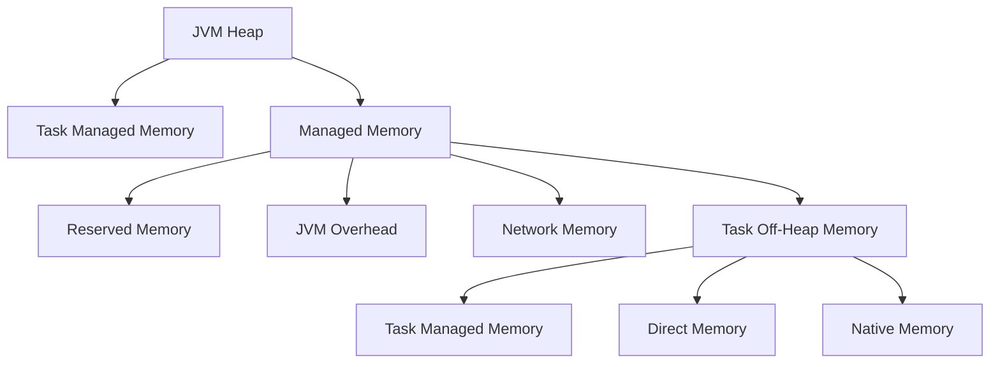

# 深入解读Flink内存管理配置参数:含义、影响和优化建议

## 1.背景介绍

### 1.1 Flink作为流式数据处理引擎的重要性

在当今大数据时代,数据量呈现出爆炸式增长,传统的批处理系统已经无法满足实时数据处理的需求。Apache Flink作为一种新兴的开源流式数据处理引擎,凭借其低延迟、高吞吐量、精确一次语义等优势,逐渐成为企业实时数据处理不可或缺的利器。无论是实时数据分析、复杂事件处理、数据管道等场景,Flink都有着广泛的应用。

### 1.2 内存管理对Flink性能的重要影响

作为一种基于JVM的分布式系统,Flink的性能在很大程度上受制于内存的利用效率。合理的内存配置不仅可以最大化利用硬件资源,还能显著提升作业的吞吐量、延迟等指标。反之,内存配置不当可能会导致频繁的GC暂停、数据溢写等问题,从而严重影响作业的整体性能。因此,掌握Flink内存管理机制并合理调优内存配置参数,对于开发和运维人员来说都是非常重要的。

## 2.核心概念与联系

在深入探讨Flink内存配置之前,我们有必要先了解一些核心概念,以及它们之间的关联。

### 2.1 总体内存模型

Flink将JVM堆内存划分为几个不同的区域,用于存储不同类型的数据,如下图所示:



- **Task Managed Memory**: 用于存储数据流的工作内存,包括流元素、哈希表等。
- **Task Off-Heap Memory**: 存储算子对象、字符串、集合等off-heap数据。
- **Managed Memory**: 由Flink进行管理和分配的内存区域,包括Task Managed Memory、Task Off-Heap Memory以及一些系统预留空间。
- **JVM Overhead**: JVM自身开销,如存储类元数据、线程堆栈等。
- **Network Memory**: 用于缓存网络传输的数据。
- **Direct Memory**: 直接内存,用于序列化/反序列化、内存映射文件等。
- **Native Memory**: 存储其他本地对象,如线程元数据、堆外内存等。

### 2.2 内存模型与堆外内存

需要注意的是,虽然Flink的内存模型基于JVM堆内存,但也会使用一些堆外内存。比如Direct Memory用于存储序列化的数据,而Native Memory则包含了诸如线程元数据等本地对象。合理利用堆外内存可以缓解堆内存压力,但同时也需要注意避免内存泄漏等问题。

### 2.3 跨容器内存管理

在部署于容器化环境(如Kubernetes)时,Flink还需要考虑跨容器的内存管理。每个Flink容器都需要预留一部分内存用于操作系统缓存、库文件等开销,从而避免容器OOM(Out-of-Memory)。同时,如果使用外部组件(如HDFS),也需要为它们分配足够的内存资源。

## 3.核心算法原理具体操作步骤 

### 3.1 堆内存管理

Flink通过一系列参数来控制堆内存的划分和使用,其核心算法原理如下:

1. **总内存预留**: Flink首先会预留一部分内存作为JVM Overhead和其他系统开销,确保JVM正常运行。这部分内存由`${TOTAL_PROCESS_MEMORY} * ${TOTAL_PROCESS_MEMORY_FRACTION}`决定。

2. **网络内存预留**: 接下来,Flink会预留一部分内存作为网络传输缓冲区,避免频繁内存复制。该内存大小由`${TOTAL_PROCESS_MEMORY} * ${NETWORK_MEMORY_FRACTION}`决定。

3. **管理内存划分**: 剩余的内存会划分为Managed Memory区域,其大小由`${TOTAL_PROCESS_MEMORY} * (1 - ${TOTAL_PROCESS_MEMORY_FRACTION} - ${NETWORK_MEMORY_FRACTION})`决定。

4. **任务内存分配**: Managed Memory中的一部分会分配给每个Task作为其Managed Memory,包括Task Managed Memory和Task Off-Heap Memory。具体分配策略由`${MANAGED_MEMORY_FRACTION}`控制。

5. **预留内存**: 在Managed Memory中还会预留一部分内存作为Reserved Memory,用于存储元数据、缓冲区等。其大小由`${MANAGED_MEMORY} * ${MANAGED_MEMORY_FRACTION}`决定。

通过上述步骤,Flink就完成了堆内存的划分和分配。值得注意的是,这些内存参数都可以通过配置文件或命令行进行调整,以适应不同的工作负载和硬件条件。

### 3.2 堆外内存管理

除了堆内存,Flink还需要管理一些堆外内存资源,如Direct Memory和Native Memory。这些内存主要通过以下方式进行管理:

1. **Direct Memory管理**:

Flink使用Direct Memory存储序列化的数据,避免了内存复制和GC的开销。Direct Memory的大小由`${DIRECT_MEMORY_LIMIT}`参数控制,默认为操作系统可用内存的80%。

2. **Native Memory管理**:

Native Memory用于存储本地对象,如线程元数据等。Flink会自动检测可用的Native Memory大小,并在必要时进行内存控制,以防止内存溢出。

3. **内存映射文件**:

对于大型数据集,Flink会将其映射到内存映射文件中,以减少内存占用。这部分内存由`${TASK_MANAGED_MEMORY_SEGMENT_SIZE}`参数控制。

4. **内存回收**:

Flink会定期回收未使用的Direct Memory和Native Memory,以避免内存泄漏。回收策略可以通过`${MEMORY_MANAGER_RELEASE_INTERVAL}`参数进行调整。

通过上述机制,Flink可以有效地管理和利用堆外内存资源,从而提高系统的整体性能和稳定性。

## 4.数学模型和公式详细讲解举例说明

在Flink的内存管理中,有一些重要的数学模型和公式,我们有必要详细讲解和举例说明。

### 4.1 内存占用估算模型

为了更好地控制内存使用,Flink提供了一种估算内存占用的数学模型。该模型基于以下公式:

$$
M(n, V, r) = n \times (V + r \times 8\text{B})
$$

其中:

- $n$表示数据流中的元素数量
- $V$表示每个元素的大小(字节)
- $r$表示每个元素需要的额外书签(record overhead)数量
- $8\text{B}$表示每个书签所占用的字节数

通过该公式,我们可以估算出一个数据流在内存中的占用大小。例如,假设一个数据流包含1000000个元素,每个元素大小为100字节,每个元素需要2个额外书签,那么该数据流在内存中的占用大小为:

$$
M(1000000, 100\text{B}, 2) = 1000000 \times (100\text{B} + 2 \times 8\text{B}) = 112000000\text{B} \approx 107\text{MB}
$$

这个估算结果可以帮助我们合理设置内存参数,避免内存不足或浪费。

### 4.2 内存分配模型

Flink采用一种基于权重的内存分配模型,用于在Task之间分配Managed Memory。该模型的核心公式为:

$$
M_i = \frac{w_i}{\sum_{j=1}^{n}w_j} \times M_\text{total}
$$

其中:

- $M_i$表示分配给第$i$个Task的Managed Memory大小
- $w_i$表示第$i$个Task的权重
- $n$表示Task的总数
- $M_\text{total}$表示Managed Memory的总大小

Task的权重可以通过`${OPERATOR_MANAGED_MEMORY_FRACTION}`参数进行配置,用于控制不同算子获得的内存份额。例如,对于一个包含Source、Map和Sink三个算子的作业,我们可以将它们的权重分别设置为0.1、0.8和0.1,那么在总内存为1GB的情况下,Map算子将获得800MB的Managed Memory,而Source和Sink各获得100MB。

通过这种基于权重的内存分配模型,Flink可以根据不同算子的内存需求进行灵活调整,从而提高内存利用效率。

### 4.3 内存溢写模型

在数据处理过程中,如果内存不足,Flink会启动内存溢写(Spilling)机制,将部分数据写入磁盘,以避免内存溢出。内存溢写的触发条件可以由以下公式描述:

$$
\frac{M_\text{used}}{M_\text{total}} > R_\text{threshold}
$$

其中:

- $M_\text{used}$表示已使用的Managed Memory大小
- $M_\text{total}$表示Managed Memory的总大小
- $R_\text{threshold}$表示内存溢写阈值,默认为0.8

当上述条件满足时,Flink会将部分数据写入磁盘,以释放内存空间。内存溢写虽然可以避免OOM异常,但也会导致性能下降,因此我们应该尽量通过合理配置内存参数来减少内存溢写的发生。

通过上述数学模型和公式,我们可以更好地理解Flink内存管理的原理,并据此进行合理的内存配置和优化。

## 5.项目实践:代码实例和详细解释说明

为了帮助读者更好地掌握Flink内存配置,我们将通过一个实际项目案例,展示如何对Flink作业进行内存优化。

### 5.1 项目背景

我们将以一个实时流式数据处理作业为例,该作业从Kafka消费数据,经过一系列转换和计算后,将结果写入HBase。作业的主要流程如下:


该作业运行在一个包含3个TaskManager的Flink集群上,每个TaskManager配置了8GB内存。

### 5.2 初始内存配置

我们首先使用Flink的默认内存配置运行该作业,配置如下:

```yaml
taskmanager.memory.process.size: 7GB  # 总内存
taskmanager.memory.managed.fraction: 0.8  # Managed Memory占比
taskmanager.memory.task.managed.memory.size: -1  # Task Managed Memory大小,自动推导
taskmanager.memory.network.fraction: 0.1  # 网络内存占比
taskmanager.memory.managed.reserve-fraction: 0.1  # Reserved Memory占比
```

在这种配置下,作业运行了一段时间后出现了频繁的内存溢写,导致吞吐量和延迟都有所下降。通过查看作业的内存使用情况,我们发现Window算子占用了大量内存,是导致内存溢写的主要原因。

### 5.3 内存优化

为了解决上述问题,我们对内存配置进行了优化,具体步骤如下:

1. **增加总内存**:我们将每个TaskManager的总内存增加到10GB,以提供更多的内存资源。

```yaml
taskmanager.memory.process.size: 10GB
```

2. **调整Managed Memory占比**:由于Window算子占用了大量内存,我们将Managed Memory的占比从0.8调整到0.9,以分配更多的Task Managed Memory。

```yaml
taskmanager.memory.managed.fraction: 0.9
```

3. **指定Task Managed Memory大小**:为了更好地控制内存分配,我们手动指定了Task Managed Memory的大小,而不是自动推导。

```yaml
taskmanager.memory.task.managed.memory.size: 1GB
```

4. **调整算子内存权重**:我们将Window算子的内存权重设置为0.6,Map和FlatMap算子的权重设置为0.2,以确保Window算子获得更多的内存资源。

```java
env.setManagedMemoryWeight(new Map(), 0.2)
   .setManagedMemoryWeight(new FlatMap(), 0.2)
   .setManagedMemoryWeight(new Window(), 0.6)
```

5. **增加内存溢写阈值**:为了减少内存溢写的发生频率,我们将