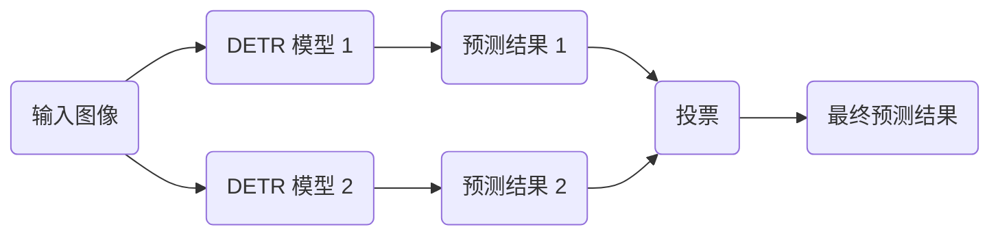
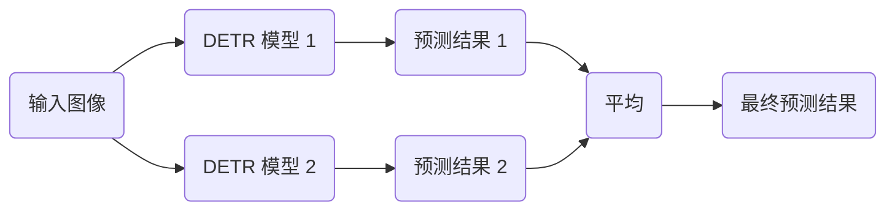

## "深度解析：DETR的模型融合技巧"

作者：禅与计算机程序设计艺术

## 1. 背景介绍

### 1.1 目标检测的传统方法与挑战

目标检测是计算机视觉中的核心任务之一，其目标是在图像或视频中定位和识别目标物体。传统的目标检测方法通常依赖于手工设计的特征和复杂的流程，例如滑动窗口、区域建议和非极大值抑制（NMS）。这些方法存在一些固有的挑战：

* **手工设计特征的局限性:**  手工设计的特征往往难以捕捉目标的多样性和复杂性，导致模型泛化能力不足。
* **计算复杂度高:**  滑动窗口和区域建议等操作会产生大量的候选区域，需要进行大量的计算，效率低下。
* **后处理步骤复杂:**  NMS等后处理步骤需要仔细调整参数，才能获得良好的性能，增加了模型调优的难度。

### 1.2 DETR的突破与优势

近年来，深度学习的兴起为目标检测带来了革命性的变化。DETR (DEtection TRansformer) 作为一种基于 Transformer 的新型目标检测模型，克服了传统方法的诸多局限，展现出显著的优势：

* **端到端的目标检测:** DETR 将目标检测视为集合预测问题，无需区域建议和NMS等后处理步骤，简化了流程。
* **基于 Transformer 的特征提取:** Transformer 强大的特征提取能力可以捕捉目标的全局上下文信息，提高了模型的泛化能力。
* **并行计算:** DETR 的架构允许并行计算，显著提高了检测速度。

### 1.3 模型融合的意义

尽管 DETR 取得了 impressive 的性能，但单一模型往往难以应对复杂多变的现实场景。模型融合作为一种有效的提升模型性能的策略，通过结合多个模型的优势，可以获得更准确、更鲁棒的结果。

## 2. 核心概念与联系

### 2.1 DETR 模型结构

DETR 的核心思想是将目标检测任务转化为集合预测问题。其模型结构主要包括以下几个部分：

* **Backbone 网络:** 用于提取图像的特征表示，通常使用 ResNet 或 ResNeXt 等卷积神经网络。
* **Transformer 编码器:** 将 Backbone 网络提取的特征进行全局编码，捕捉目标之间的上下文关系。
* **Transformer 解码器:** 根据编码器输出的全局特征，预测目标的类别和边界框。
* **二分图匹配:**  使用匈牙利算法将预测的目标与 ground truth 进行匹配，计算损失函数。

### 2.2 模型融合的常见策略

模型融合的策略多种多样，常用的方法包括：

* **投票法:**  将多个模型的预测结果进行投票，选择得票最多的类别或边界框作为最终结果。
* **平均法:**  将多个模型的预测结果进行平均，得到更平滑的预测结果。
* **堆叠法:**  将多个模型的预测结果作为新的特征输入到另一个模型中，进行进一步的预测。
* **Boosting:**  将多个弱分类器组合成一个强分类器，提高模型的泛化能力。

### 2.3 模型融合与 DETR 的结合

DETR 的端到端特性和 Transformer 强大的特征提取能力为模型融合提供了良好的基础。我们可以将 DETR 与其他目标检测模型或图像分类模型进行融合，进一步提升检测性能。

## 3. 核心算法原理具体操作步骤

### 3.1 基于投票法的模型融合

基于投票法的模型融合是一种简单有效的策略，其具体操作步骤如下：

1. 使用多个 DETR 模型或其他目标检测模型对输入图像进行预测，得到多个预测结果。
2. 对于每个目标，统计所有模型预测的类别和边界框。
3. 选择得票最多的类别和边界框作为最终的预测结果。

#### 3.1.1 算法流程图



#### 3.1.2 代码示例

```python
import torch

# 加载多个 DETR 模型
model1 = torch.hub.load('facebookresearch/detr', 'detr_resnet50', pretrained=True)
model2 = torch.hub.load('facebookresearch/detr', 'detr_resnet101', pretrained=True)

# 对输入图像进行预测
outputs1 = model1(image)
outputs2 = model2(image)

# 统计预测结果
boxes = []
scores = []
labels = []
for output in [outputs1, outputs2]:
    for i, (bbox, score, label) in enumerate(zip(output['pred_boxes'], output['pred_logits'].softmax(-1)[0], output['pred_classes'])):
        boxes.append(bbox)
        scores.append(score)
        labels.append(label)

# 投票选择最终预测结果
final_boxes = []
final_scores = []
final_labels = []
for i in range(len(boxes)):
    votes = [labels[j] for j in range(len(boxes)) if torch.allclose(boxes[i], boxes[j])]
    final_label = max(set(votes), key=votes.count)
    final_boxes.append(boxes[i])
    final_scores.append(scores[i])
    final_labels.append(final_label)
```

### 3.2 基于平均法的模型融合

基于平均法的模型融合通过对多个模型的预测结果进行平均，可以得到更平滑的预测结果，其具体操作步骤如下：

1. 使用多个 DETR 模型或其他目标检测模型对输入图像进行预测，得到多个预测结果。
2. 对于每个目标，将所有模型预测的边界框坐标进行平均。
3. 将所有模型预测的类别概率进行平均，得到最终的类别概率。

#### 3.2.1 算法流程图



#### 3.2.2 代码示例

```python
import torch

# 加载多个 DETR 模型
model1 = torch.hub.load('facebookresearch/detr', 'detr_resnet50', pretrained=True)
model2 = torch.hub.load('facebookresearch/detr', 'detr_resnet101', pretrained=True)

# 对输入图像进行预测
outputs1 = model1(image)
outputs2 = model2(image)

# 平均预测结果
boxes = []
scores = []
labels = []
for output in [outputs1, outputs2]:
    for i, (bbox, score, label) in enumerate(zip(output['pred_boxes'], output['pred_logits'].softmax(-1)[0], output['pred_classes'])):
        boxes.append(bbox)
        scores.append(score)
        labels.append(label)

# 平均边界框坐标
final_boxes = torch.mean(torch.stack(boxes), dim=0)

# 平均类别概率
final_scores = torch.mean(torch.stack(scores), dim=0)
final_labels = torch.argmax(final_scores, dim=-1)
```

## 4. 数学模型和公式详细讲解举例说明

### 4.1 DETR 的二分图匹配

DETR 使用匈牙利算法将预测的目标与 ground truth 进行匹配，计算损失函数。匈牙利算法可以找到二分图中的最大匹配，其目标是最小化匹配的总成本。

#### 4.1.1 二分图匹配的数学模型

给定一个二分图 $G = (V, E)$，其中 $V$ 表示节点集合，$E$ 表示边集合。二分图匹配是指找到一个边子集 $M \subseteq E$，使得 $M$ 中的任意两条边都没有共同的节点。最大匹配是指边数最多的匹配。

#### 4.1.2 匈牙利算法

匈牙利算法是一种用于求解二分图最大匹配问题的多项式时间算法。其基本思想是在二分图中不断寻找增广路径，直到找不到增广路径为止。增广路径是指从一个未匹配节点开始，经过匹配边和未匹配边交替出现的路径，最终到达另一个未匹配节点。

#### 4.1.3 DETR 中的二分图匹配

在 DETR 中，预测的目标和 ground truth 分别构成二分图的两个节点集合。匹配的成本由目标分类损失和边界框回归损失组成。匈牙利算法用于找到最小化总成本的匹配，从而计算损失函数。

### 4.2 模型融合的数学模型

模型融合可以通过线性组合或非线性组合的方式将多个模型的预测结果进行融合。

#### 4.2.1 线性组合

线性组合是指将多个模型的预测结果乘以权重系数后相加。例如，对于两个模型的预测结果 $y_1$ 和 $y_2$，线性组合可以表示为：

$$
y = w_1 y_1 + w_2 y_2
$$

其中 $w_1$ 和 $w_2$ 分别表示两个模型的权重系数。

#### 4.2.2 非线性组合

非线性组合是指使用非线性函数将多个模型的预测结果进行融合。例如，可以使用最大值函数、平均值函数或投票函数等。

## 5. 项目实践：代码实例和详细解释说明

### 5.1 基于 MMDetection 的 DETR 模型融合

MMDetection 是一个开源的目标检测工具箱，提供了丰富的模型和训练工具。我们可以使用 MMDetection 实现 DETR 的模型融合。

#### 5.1.1 安装 MMDetection

```bash
pip install openmim
mim install mmcv-full
mim install mmdet
```

#### 5.1.2 配置模型融合

在 MMDetection 的配置文件中，我们可以通过 `model` 字段配置模型融合。例如，以下配置使用平均法将两个 DETR 模型进行融合：

```python
model = dict(
    type='Ensemble',
    models=[
        dict(
            type='DETR',
            backbone=dict