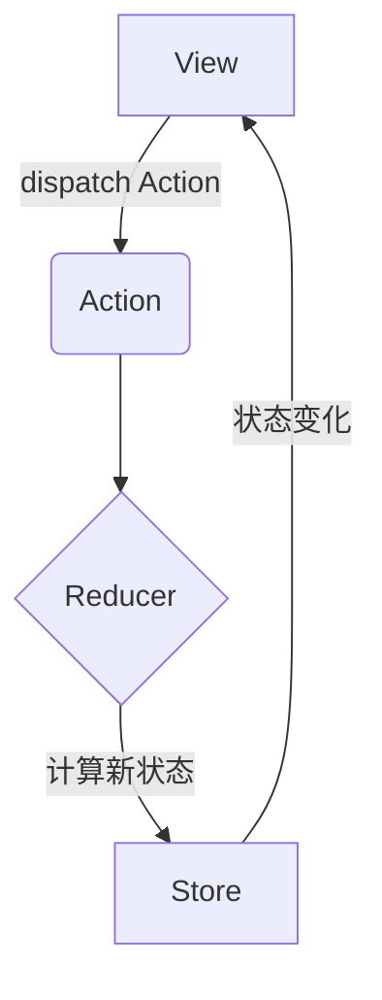
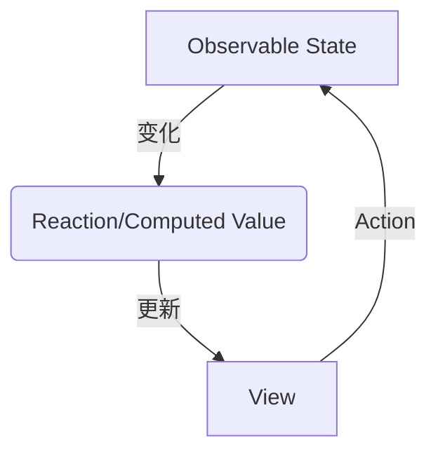
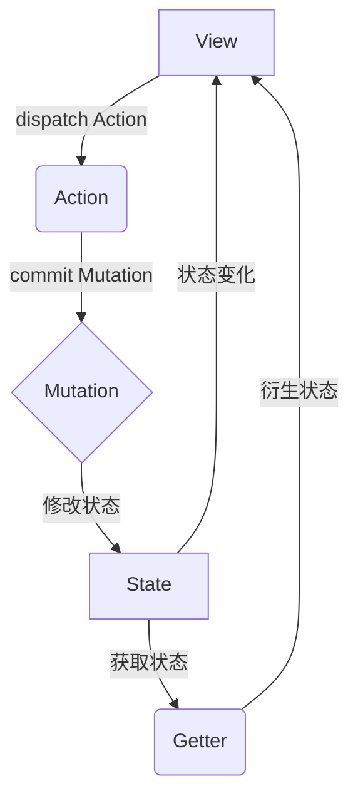

# 状态管理 原理与代码实例讲解

## 1.背景介绍

### 1.1 什么是状态管理？

在现代前端开发中，状态管理是一个至关重要的概念。状态管理是指有效地管理应用程序中的数据流和状态变化。随着应用程序变得越来越复杂,状态管理变得更加关键,因为它可以帮助我们更好地组织和维护代码,提高代码的可维护性和可扩展性。

### 1.2 为什么需要状态管理？

在传统的前端开发中,我们通常依赖于组件内部的状态来管理数据。然而,当应用程序变得越来越复杂时,这种方式会变得难以维护和扩展。这是因为:

1. **数据流混乱**: 随着应用程序规模的增长,数据在组件之间的传递变得复杂和混乱。
2. **状态分散**: 应用程序的状态分散在各个组件中,难以追踪和维护。
3. **难以测试**: 由于状态分散,测试应用程序的状态变得困难。

为了解决这些问题,状态管理模式应运而生。它提供了一种集中式的方式来管理应用程序的状态,使得数据流更加清晰,状态更加可预测,并且易于测试和维护。

## 2.核心概念与联系

### 2.1 单向数据流

单向数据流是状态管理的核心概念之一。它规定了数据在应用程序中的流动方向,通常是从单一的状态树(state tree)向视图(view)单向流动。这种单向数据流有以下优点:

1. **可预测性**: 由于数据流是单向的,应用程序的状态变化更加可预测。
2. **追踪性**: 单向数据流使得状态变化的来源更加清晰,便于调试和追踪问题。
3. **可维护性**: 由于状态管理集中化,代码更加模块化和可维护。

### 2.2 不可变状态(Immutable State)

不可变状态是另一个核心概念。它要求状态对象在整个应用程序生命周期中保持不可变。每次状态发生变化时,都会创建一个新的状态对象,而不是直接修改原有对象。这种设计模式带来了以下优势:

1. **简化检测**: 由于状态对象是不可变的,检测状态变化变得简单。
2. **避免副作用**: 不可变状态可以避免潜在的副作用,如意外的状态改变。
3. **方便时间旅行调试**: 由于每次状态变化都会生成新的状态对象,可以方便地实现时间旅行调试。

### 2.3 状态管理模式

实现状态管理的常见模式包括:

1. **Flux架构**: Facebook推出的一种状态管理模式,遵循单向数据流和不可变状态原则。
2. **Redux**: 受Flux启发,是最流行的状态管理库之一。
3. **MobX**: 基于观察者模式的状态管理库,提供了可观察状态和自动响应式更新。
4. **Vuex**: Vue.js官方推荐的状态管理库,与Vue.js集成良好。
5. **NgRx**: Angular官方推荐的状态管理库,基于Redux模式。
6. **Recoil**: Facebook推出的一种新的状态管理库,旨在解决Redux的一些痛点。

这些状态管理模式和库各有优缺点,选择哪一种取决于具体的项目需求和开发团队的偏好。

## 3.核心算法原理具体操作步骤

### 3.1 Redux核心原理

Redux是最流行的状态管理库之一,它基于三大原则:单一数据源、状态是只读的和使用纯函数进行修改。Redux的核心算法原理如下:

1. **Store**: 存储应用程序的整个状态树,是单一的状态源。
2. **Action**: 描述要执行的操作,是一个普通的JavaScript对象。
3. **Reducer**: 根据Action来更新状态树,是一个纯函数。
4. **单向数据流**: 视图(View)通过dispatch一个Action,Action被传递给Reducer,Reducer计算出新的状态并返回,Store监听到状态变化并通知视图更新。

Redux的工作流程如下所示:



其中,Reducer是Redux中最核心的部分。它是一个纯函数,接收当前状态和Action作为输入,返回一个新的状态对象。由于Reducer是纯函数,它必须遵循以下原则:

1. **不修改原始状态**: Reducer不能直接修改传入的状态对象,而是必须返回一个新的状态对象。
2. **无副作用**: Reducer不能产生任何副作用,如API调用或路由跳转。
3. **同一输入必定产生相同输出**: 给定相同的输入,Reducer必须返回相同的输出。

下面是一个简单的Reducer示例:

```javascript
const initialState = {
  count: 0
};

function counterReducer(state = initialState, action) {
  switch (action.type) {
    case 'INCREMENT':
      return { ...state, count: state.count + 1 };
    case 'DECREMENT':
      return { ...state, count: state.count - 1 };
    default:
      return state;
  }
}
```

在这个示例中,Reducer根据不同的Action类型更新状态树中的`count`属性。注意,Reducer使用了对象扩展运算符`...`来创建新的状态对象,而不是直接修改原始状态。

### 3.2 MobX核心原理

MobX是另一种流行的状态管理库,它基于观察者模式和透明的函数式响应式编程(TFRP)。MobX的核心概念包括:

1. **Observable State**: 可观察的状态,当状态发生变化时,MobX会自动检测到并响应式地更新相关的视图。
2. **Action**: 用于修改状态的函数。
3. **Computed Value**: 根据状态计算得到的衍生值,当状态变化时会自动重新计算。
4. **Reaction**: 响应状态变化的函数,用于执行副作用操作,如更新UI或发送网络请求。

MobX的工作原理如下:



MobX通过使用透明的函数式响应式编程,可以自动检测状态的变化并响应式地更新相关的视图和计算值。这种方式避免了手动跟踪依赖关系,使代码更加简洁。

下面是一个简单的MobX示例:

```javascript
import { observable, action, computed } from 'mobx';

class CounterStore {
  @observable count = 0;

  @action.bound
  increment() {
    this.count++;
  }

  @action.bound
  decrement() {
    this.count--;
  }

  @computed
  get doubledCount() {
    return this.count * 2;
  }
}

const counterStore = new CounterStore();

// 观察状态变化
autorun(() => {
  console.log(`Count: ${counterStore.count}, Doubled Count: ${counterStore.doubledCount}`);
});

// 修改状态
counterStore.increment();
counterStore.increment();
counterStore.decrement();
```

在这个示例中,我们定义了一个`CounterStore`类,其中包含了可观察的`count`状态、用于修改状态的`increment`和`decrement`动作,以及基于`count`计算的`doubledCount`计算值。当我们调用`increment`或`decrement`时,MobX会自动检测到状态的变化,并更新相关的视图和计算值。

### 3.3 Vuex核心原理

Vuex是Vue.js官方推荐的状态管理库,它受到了Redux的启发,但做了一些调整以更好地集成到Vue.js中。Vuex的核心概念包括:

1. **State**: 存储应用程序的状态树。
2. **Mutation**: 用于修改状态的函数,必须是同步函数。
3. **Action**: 可以包含异步操作,通过提交Mutation来修改状态。
4. **Getter**: 用于从状态树中获取衍生状态。

Vuex的工作流程如下:



与Redux类似,Vuex也遵循单向数据流的原则。不同之处在于,Vuex将状态修改操作分为两个概念:Mutation和Action。Mutation是同步的,用于直接修改状态;而Action可以包含异步操作,最终通过提交Mutation来修改状态。

下面是一个简单的Vuex示例:

```javascript
// store.js
import Vue from 'vue';
import Vuex from 'vuex';

Vue.use(Vuex);

const store = new Vuex.Store({
  state: {
    count: 0
  },
  mutations: {
    INCREMENT(state) {
      state.count++;
    },
    DECREMENT(state) {
      state.count--;
    }
  },
  actions: {
    incrementAsync({ commit }) {
      setTimeout(() => {
        commit('INCREMENT');
      }, 1000);
    }
  },
  getters: {
    doubledCount(state) {
      return state.count * 2;
    }
  }
});

export default store;
```

在这个示例中,我们定义了一个简单的计数器应用程序的状态管理。`state`对象存储了`count`状态,`mutations`对象包含了同步修改`count`的函数,`actions`对象包含了异步修改`count`的操作,`getters`对象包含了基于`count`计算的衍生状态`doubledCount`。

在Vue组件中,我们可以使用`this.$store`来访问Vuex Store,并通过`commit`提交Mutation或`dispatch`分发Action来修改状态,通过`mapState`或`mapGetters`来获取状态或衍生状态。

## 4.数学模型和公式详细讲解举例说明

状态管理库通常不涉及复杂的数学模型和公式。但是,在某些特定场景下,我们可能需要使用一些数学概念来优化状态管理的性能和效率。

### 4.1 Memoization

Memoization是一种优化技术,通过缓存昂贵计算的结果来提高性能。在状态管理中,我们可以使用Memoization来优化计算衍生状态(如Redux的Selector或Vuex的Getter)的性能。

假设我们有一个计算斐波那契数列的函数:

```javascript
function fibonacci(n) {
  if (n <= 1) {
    return n;
  }
  return fibonacci(n - 1) + fibonacci(n - 2);
}
```

这个函数的时间复杂度是指数级别的,因为它会重复计算相同的子问题。我们可以使用Memoization来缓存已经计算过的结果,从而避免重复计算:

```javascript
const memo = {};

function fibonacciMemoized(n) {
  if (n in memo) {
    return memo[n];
  }
  if (n <= 1) {
    memo[n] = n;
  } else {
    memo[n] = fibonacciMemoized(n - 1) + fibonacciMemoized(n - 2);
  }
  return memo[n];
}
```

使用Memoization后,时间复杂度降低到线性级别。在状态管理中,我们可以将计算衍生状态的函数进行Memoization,以提高性能。

### 4.2 结构共享

结构共享(Structural Sharing)是一种优化不可变数据结构的技术。在状态管理中,我们通常需要创建新的状态对象来代替旧的状态对象。如果直接创建新对象,会浪费大量内存。结构共享可以通过共享对象的未修改部分,只复制修改的部分,从而节省内存。

例如,在Redux中,我们可以使用`immer`库来实现结构共享:

```javascript
import produce from 'immer';

const initialState = {
  todos: [
    { id: 1, text: 'Learn Redux', completed: false },
    { id: 2, text: 'Learn Immer', completed: false }
  ]
};

function todosReducer(state = initialState, action) {
  switch (action.type) {
    case 'TOGGLE_TODO':
      return produce(state, draftState => {
        const todo = draftState.todos.find(todo => todo.id === action.payload);
        todo.completed = !todo.completed;
      });
    default:
      return state;
  }
}
```

在这个示例中,`produce`函数创建了一个草稿状态(draft state),允许我们直接修改草稿状态。`immer`会自动检测哪些部分被修改,并创建一个新的状态对象,共享未修改部分的内存。这种