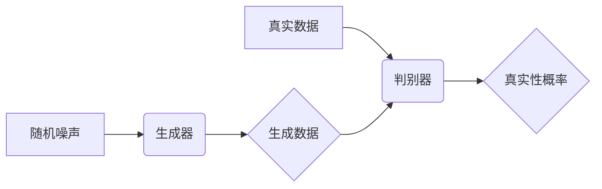

## 1. 背景介绍

### 1.1 人工智能与数据生成

近年来，人工智能 (AI) 领域取得了显著的进步，尤其是在深度学习方面。深度学习模型的成功很大程度上依赖于大量高质量的训练数据。然而，在许多实际应用中，获取足够多的真实数据可能非常困难或昂贵。这促使了对数据生成技术的研究，以创建逼真的合成数据来补充或替代真实数据。

### 1.2 生成对抗网络的诞生

生成对抗网络 (GANs) 是一种强大的深度学习技术，可以生成与真实数据非常相似的新数据。GANs 由 Ian Goodfellow 等人在 2014 年提出，其核心思想是训练两个相互竞争的神经网络：生成器和判别器。生成器试图生成逼真的数据，而判别器则试图区分真实数据和生成数据。通过这种对抗过程，生成器不断改进其生成能力，最终生成与真实数据无法区分的数据。

### 1.3 GANs 的优势

与其他数据生成技术相比，GANs 具有以下优势：

* **高保真度:** GANs 可以生成高度逼真的数据，捕获真实数据的复杂结构和特征。
* **多样性:** GANs 可以生成各种各样的数据，包括图像、文本、音频和视频。
* **无监督学习:** GANs 不需要标记数据进行训练，使其成为无监督学习的理想选择。

## 2. 核心概念与联系

### 2.1 生成器

生成器是一个神经网络，其目标是生成与真实数据分布相似的数据。它接收随机噪声作为输入，并将其转换为合成数据。生成器的架构通常是一个深度神经网络，例如多层感知器 (MLP) 或卷积神经网络 (CNN)。

### 2.2 判别器

判别器也是一个神经网络，其目标是区分真实数据和生成数据。它接收数据作为输入，并输出一个表示数据真实性的概率值。判别器的架构通常也是一个深度神经网络，例如 MLP 或 CNN。

### 2.3 对抗训练

GANs 的训练过程是一个对抗过程。生成器和判别器相互竞争，生成器试图欺骗判别器，而判别器试图识别生成数据。这个过程可以通过以下步骤进行：

1. **训练判别器:** 使用真实数据和生成数据训练判别器，使其能够区分两者。
2. **训练生成器:** 固定判别器，并训练生成器生成能够欺骗判别器的数据。
3. **重复步骤 1 和 2:**  重复这两个步骤，直到生成器能够生成与真实数据无法区分的数据。

### 2.4  Mermaid 流程图

## 3. 核心算法原理具体操作步骤

### 3.1 损失函数

GANs 的训练使用一个损失函数来衡量生成器和判别器的性能。常见的损失函数包括：

* **Minimax 损失函数:**
  $$ \min_G \max_D V(D, G) = \mathbb{E}_{x \sim p_{data}(x)}[\log D(x)] + \mathbb{E}_{z \sim p_z(z)}[\log(1 - D(G(z)))] $$
  其中，$D(x)$ 表示判别器对真实数据 $x$ 的输出，$G(z)$ 表示生成器对随机噪声 $z$ 的输出。
* **非饱和博弈损失函数:**
  $$ \min_G  \mathbb{E}_{z \sim p_z(z)}[\log(D(G(z)))] $$
  $$ \max_D \mathbb{E}_{x \sim p_{data}(x)}[\log D(x)] + \mathbb{E}_{z \sim p_z(z)}[\log(1 - D(G(z)))] $$

### 3.2 优化算法

GANs 的训练通常使用梯度下降算法来优化损失函数。常见的优化算法包括：

* **随机梯度下降 (SGD)**
* **Adam**
* **RMSprop**

### 3.3 训练过程

GANs 的训练过程可以总结如下：

1. **初始化生成器和判别器。**
2. **循环迭代以下步骤：**
   * **从真实数据分布中采样一批真实数据。**
   * **从先验分布中采样一批随机噪声。**
   * **使用生成器生成一批合成数据。**
   * **使用判别器对真实数据和合成数据进行分类。**
   * **计算损失函数。**
   * **更新判别器的参数。**
   * **更新生成器的参数。**
3. **重复步骤 2，直到达到预定的训练次数或生成器生成的数据质量达到要求。**

## 4. 数学模型和公式详细讲解举例说明

### 4.1 Minimax 损失函数

Minimax 损失函数是 GANs 最初使用的损失函数。它的目标是找到一个纳什均衡，其中生成器和判别器都无法通过单方面改变策略来提高其性能。

**公式：**

$$ \min_G \max_D V(D, G) = \mathbb{E}_{x \sim p_{data}(x)}[\log D(x)] + \mathbb{E}_{z \sim p_z(z)}[\log(1 - D(G(z)))] $$

**解释：**

* 第一项 $\mathbb{E}_{x \sim p_{data}(x)}[\log D(x)]$ 表示判别器对真实数据的平均对数似然。判别器希望最大化这个值，这意味着它希望正确地将真实数据分类为真实数据。
* 第二项 $\mathbb{E}_{z \sim p_z(z)}[\log(1 - D(G(z)))]$ 表示判别器对生成数据的平均对数似然。判别器希望最小化这个值，这意味着它希望正确地将生成数据分类为假数据。
* 生成器希望最小化整个损失函数，这意味着它希望生成能够欺骗判别器的数据，使其认为生成数据是真实的。

**举例说明：**

假设我们正在训练一个 GAN 来生成猫的图像。真实数据是一组猫的图像，而生成数据是由生成器生成的猫的图像。判别器是一个二分类器，它接收一个图像作为输入，并输出一个表示图像是否是猫的概率值。

* 当判别器接收到一张真实猫的图像时，它希望输出一个接近 1 的概率值。
* 当判别器接收到一张生成猫的图像时，它希望输出一个接近 0 的概率值。
* 生成器希望生成看起来像真实猫的图像，以便判别器输出一个接近 1 的概率值。

### 4.2 非饱和博弈损失函数

非饱和博弈损失函数是 Minimax 损失函数的一种变体，它可以解决 Minimax 损失函数在训练早期阶段梯度消失的问题。

**公式：**

$$ \min_G  \mathbb{E}_{z \sim p_z(z)}[\log(D(G(z)))] $$
$$ \max_D \mathbb{E}_{x \sim p_{data}(x)}[\log D(x)] + \mathbb{E}_{z \sim p_z(z)}[\log(1 - D(G(z)))] $$

**解释：**

* 生成器的损失函数被修改为 $\mathbb{E}_{z \sim p_z(z)}[\log(D(G(z)))]$，这鼓励生成器生成能够欺骗判别器的数据。
* 判别器的损失函数保持不变。

**举例说明：**

在前面的例子中，使用非饱和博弈损失函数，生成器将被鼓励生成看起来更