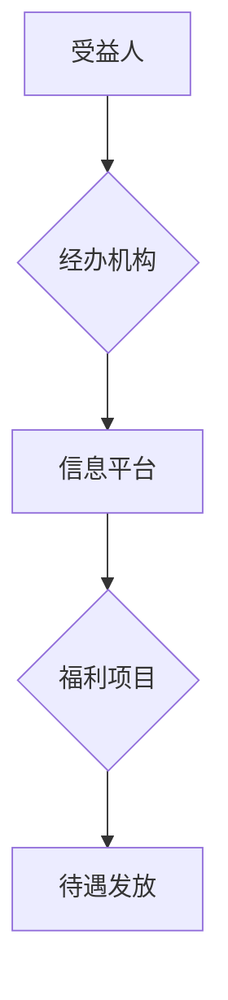

## 1. 背景介绍

### 1.1 社会福利保障体系的重要性

社会福利保障体系是现代国家治理体系的重要组成部分，是维护社会公平正义、促进社会和谐稳定的重要制度安排。它旨在为公民提供基本生活保障、促进社会公平、增进人民福祉。随着经济社会的发展和人民生活水平的提高，社会福利保障体系的建设面临着新的机遇和挑战。

### 1.2 信息技术在社会福利保障体系中的应用

信息技术的快速发展为社会福利保障体系的建设提供了新的机遇。信息化手段可以有效提高社会福利保障体系的管理效率、服务水平和透明度，促进社会福利保障体系的公平、公正和可持续发展。

### 1.3 本文目的

本文旨在探讨如何利用信息技术构建一个高效、便捷、安全的社会福利保障系统，并提供具体的代码实现方案，以期为相关领域的从业人员提供参考和借鉴。

## 2. 核心概念与联系

### 2.1 社会福利保障系统的核心概念

* **受益人:** 享受社会福利保障待遇的个人或家庭。
* **福利项目:** 社会福利保障体系提供的各种福利待遇，例如养老保险、医疗保险、失业保险、生育保险等。
* **经办机构:** 负责社会福利保障体系运营和管理的机构，例如社会保险经办机构、民政部门等。
* **信息平台:** 社会福利保障体系的信息化平台，用于存储、处理和管理社会福利保障相关数据。

### 2.2 核心概念之间的联系

受益人通过经办机构申请福利项目，经办机构根据相关政策和规定对受益人进行资格审核，并将审核结果录入信息平台。信息平台存储和管理受益人、福利项目和经办机构等相关数据，并提供数据查询、统计分析等功能，为社会福利保障体系的运营和管理提供支持。

## 3. 核心算法原理具体操作步骤

### 3.1 受益人资格审核算法

受益人资格审核算法是社会福利保障系统的核心算法之一，用于判断受益人是否符合享受特定福利项目的条件。该算法的具体操作步骤如下：

1. **收集受益人信息:** 收集受益人的身份信息、家庭信息、收入信息、财产信息等相关信息。
2. **匹配福利项目条件:** 将受益人信息与福利项目的 eligibility criteria 进行匹配，判断受益人是否符合享受该福利项目的条件。
3. **输出审核结果:** 输出审核结果，包括审核是否通过、享受福利项目的额度等信息。

### 3.2 福利待遇发放算法

福利待遇发放算法用于计算受益人应享受的福利待遇金额，并将其发放给受益人。该算法的具体操作步骤如下：

1. **获取受益人信息:** 获取受益人的身份信息、福利项目信息、享受福利项目的时长等相关信息。
2. **计算福利待遇金额:** 根据福利项目的计算公式和受益人信息计算福利待遇金额。
3. **发放福利待遇:** 将福利待遇金额发放给受益人，并记录发放信息。

## 4. 数学模型和公式详细讲解举例说明

### 4.1 养老金计算公式

养老金计算公式是养老保险福利项目的核心计算公式之一，用于计算退休人员每月应领取的养老金金额。其计算公式如下：

$$
养老金 = 基础养老金 + 个人账户养老金
$$

其中：

* **基础养老金 = (退休时上年度全省在岗职工月平均工资 + 本人指数化月平均缴费工资) / 2 × 缴费年限 × 1%**
* **个人账户养老金 = 个人账户储存额 / 计发月数**

**举例说明:**

假设某退休人员退休时上年度全省在岗职工月平均工资为 5000 元，本人指数化月平均缴费工资为 4000 元，缴费年限为 30 年，个人账户储存额为 100000 元，计发月数为 120 个月，则该退休人员每月应领取的养老金金额为：

```
基础养老金 = (5000 + 4000) / 2 × 30 × 1% = 1350 元
个人账户养老金 = 100000 / 120 = 833.33 元
养老金 = 1350 + 833.33 = 2183.33 元
```

### 4.2 医疗保险报销比例

医疗保险报销比例是指医疗保险基金支付的医疗费用占总医疗费用的比例。其计算公式如下：

$$
报销比例 = (医疗费用 - 起付线) × 报销比例
$$

**举例说明:**

假设某医疗保险项目的起付线为 1000 元，报销比例为 80%，某受益人发生医疗费用 5000 元，则该受益人可以报销的医疗费用为：

```
报销费用 = (5000 - 1000) × 80% = 3200 元
```

## 5. 项目实践：代码实例和详细解释说明

### 5.1 系统架构设计

**Mermaid 流程图:**



**系统架构图:**

```
┌──────────────┐    ┌──────────────┐
│  受益人        │    │  经办机构      │
└──────────────┘    └──────────────┘
       ▲                    ▲
       │                    │
       │                    │
       │                    │
       │                    │
       │                    │
       ▼                    ▼
┌──────────────┐    ┌──────────────┐
│  信息平台        │    │  福利项目      │
└──────────────┘    └──────────────┘
       ▲                    ▲
       │                    │
       │                    │
       │                    │
       │                    │
       │                    │
       ▼                    ▼
┌──────────────┐
│  待遇发放      │
└──────────────┘
```

### 5.2 代码实例

```python
# 受益人资格审核算法
def eligibility_check(beneficiary_info, eligibility_criteria):
    # 将受益人信息与福利项目的 eligibility criteria 进行匹配
    # ...
    # 输出审核结果
    return eligibility_result

# 福利待遇发放算法
def benefit_payment(beneficiary_info, benefit_program_info):
    # 获取受益人信息
    # ...
    # 计算福利待遇金额
    # ...
    # 发放福利待遇
    # ...
    return payment_result
```

## 6. 实际应用场景

### 6.1 养老保险

社会福利保障系统可以用于管理养老保险业务，例如：

* **养老金领取资格审核:** 对退休人员进行养老金领取资格审核，确保符合条件的退休人员能够按时足额领取养老金。
* **养老金计算和发放:** 根据养老金计算公式计算退休人员应领取的养老金金额，并将养老金按时足额发放给退休人员。
* **个人账户管理:** 管理退休人员的个人账户，记录个人账户的缴费情况、储存额等信息。

### 6.2 医疗保险

社会福利保障系统可以用于管理医疗保险业务，例如：

* **医疗保险待遇资格审核:** 对参保人员进行医疗保险待遇资格审核，确保符合条件的参保人员能够享受医疗保险待遇。
* **医疗费用报销:** 对参保人员发生的医疗费用进行审核和报销，确保参保人员能够及时获得医疗费用报销。
* **医疗保险基金管理:** 管理医疗保险基金，确保基金的收支平衡和安全运营。

### 6.3 失业保险

社会福利保障系统可以用于管理失业保险业务，例如：

* **失业保险金领取资格审核:** 对失业人员进行失业保险金领取资格审核，确保符合条件的失业人员能够按时足额领取失业保险金。
* **失业保险金计算和发放:** 根据失业保险金计算公式计算失业人员应领取的失业保险金金额，并将失业保险金按时足额发放给失业人员。
* **就业服务:** 为失业人员提供就业服务，例如就业指导、职业培训等，帮助失业人员尽快实现再就业。

## 7. 工具和资源推荐

### 7.1 数据库

* **MySQL:** 关系型数据库管理系统，适用于存储和管理社会福利保障相关数据。
* **PostgreSQL:** 对象关系型数据库管理系统，适用于存储和管理复杂数据类型，例如地理信息数据。

### 7.2 开发框架

* **Django:** Python Web 开发框架，适用于构建社会福利保障系统的 Web 应用程序。
* **Spring Boot:** Java Web 开发框架，适用于构建社会福利保障系统的 Web 应用程序。

### 7.3 云计算平台

* **阿里云:** 国内领先的云计算平台，提供云服务器、云数据库、云存储等服务，适用于部署社会福利保障系统。
* **腾讯云:** 国内领先的云计算平台，提供云服务器、云数据库、云存储等服务，适用于部署社会福利保障系统。

## 8. 总结：未来发展趋势与挑战

### 8.1 未来发展趋势

* **数字化转型:** 社会福利保障体系的数字化转型将进一步深化，信息技术将更加深入地应用于社会福利保障体系的各个环节。
* **智能化应用:** 人工智能、大数据等技术将越来越多地应用于社会福利保障体系，例如智能客服、智能审核等。
* **平台化发展:** 社会福利保障系统将更加趋于平台化发展，实现跨部门、跨区域的信息共享和业务协同。

### 8.2 面临的挑战

* **数据安全:** 社会福利保障系统存储和管理着大量的敏感数据，数据安全问题至关重要。
* **系统稳定性:** 社会福利保障系统需要保持高度的稳定性和可靠性，以确保各项业务的正常运行。
* **技术创新:** 社会福利保障体系需要不断进行技术创新，以适应不断变化的社会需求。

## 9. 附录：常见问题与解答

### 9.1 如何申请养老保险？

您可以通过以下方式申请养老保险：

* **网上申请:** 登录当地社会保险经办机构网站，在线填写养老保险申请表。
* **现场申请:** 前往当地社会保险经办机构，填写养老保险申请表。

### 9.2 如何查询养老金领取资格？

您可以通过以下方式查询养老金领取资格：

* **网上查询:** 登录当地社会保险经办机构网站，输入身份证号码查询养老金领取资格。
* **电话查询:** 拨打当地社会保险经办机构电话，咨询养老金领取资格。

### 9.3 如何办理医疗保险报销？

您可以通过以下方式办理医疗保险报销：

* **网上办理:** 登录当地社会保险经办机构网站，在线提交医疗保险报销申请。
* **现场办理:** 前往当地社会保险经办机构，提交医疗保险报销申请。
