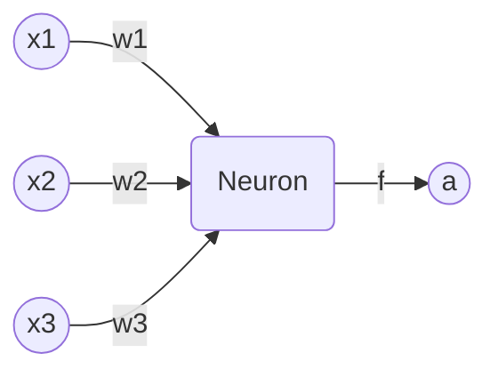
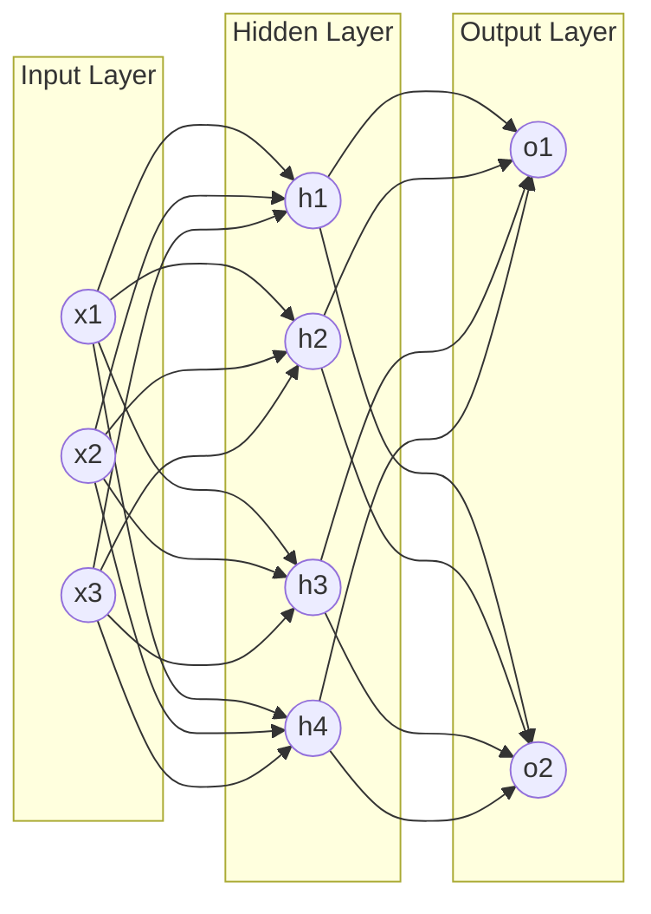
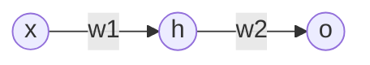
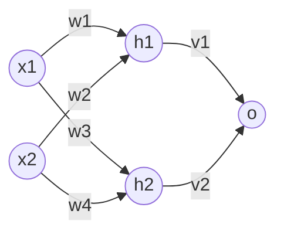

# 神经网络 原理与代码实例讲解

作者：禅与计算机程序设计艺术

## 1. 背景介绍

### 1.1 人工智能与神经网络
人工智能(Artificial Intelligence, AI)是计算机科学的一个重要分支,其目标是研究如何让计算机模拟甚至超越人类的智能。而神经网络(Neural Network)作为实现人工智能的重要技术之一,近年来受到了学术界和工业界的广泛关注。

### 1.2 神经网络的发展历程
神经网络的概念最早可以追溯到20世纪40年代,由生物学家McCulloch和数学家Pitts提出。他们受到生物神经元的启发,提出了一个简单的数学模型来模拟神经元的工作原理。此后,神经网络的研究经历了几次起起伏伏:

- 1950-1960年代:感知机(Perceptron)的提出和发展
- 1970-1980年代:反向传播(Backpropagation)算法的提出,多层感知机(MLP)的兴起
- 1990年代:支持向量机(SVM)等其他机器学习方法的崛起,神经网络研究陷入低谷  
- 2000年代后期至今:深度学习的兴起,神经网络重新成为AI研究的热点

### 1.3 神经网络取得的成就
近年来,以深度学习为代表的神经网络技术取得了一系列令人瞩目的成就,例如:

- 2012年,Hinton团队的AlexNet在ImageNet图像分类竞赛中以显著优势夺冠
- 2016年,DeepMind的AlphaGo击败世界围棋冠军李世石
- 2018年,Google发布BERT模型,在多项自然语言处理任务上取得SOTA成绩
- ......

这些成就证明了神经网络强大的特征学习和建模能力,展现了其在感知智能、认知智能等方面的巨大潜力。

## 2. 核心概念与联系

### 2.1 神经元模型
神经网络的基本组成单元是神经元(Neuron)。一个典型的神经元模型如下:

其中:
- $x_1,x_2,x_3$是输入信号
- $w_1,w_2,w_3$是对应的权重系数
- $f$是激活函数,常见的有Sigmoid、tanh、ReLU等
- $a$是神经元的输出

神经元的工作原理可以用数学公式表示为:

$$
a = f(\sum_{i=1}^{n} w_i x_i + b)
$$

其中$b$是偏置项。可以看出,神经元实际上是在对输入信号做加权求和,然后通过激活函数引入非线性变换,得到输出。

### 2.2 网络结构
将多个神经元按一定的连接方式组合在一起,就形成了神经网络。一个最简单的神经网络是全连接前馈网络(Fully Connected Feedforward Network),也称为多层感知机(Multilayer Perceptron, MLP):

如图所示,一个MLP由输入层(Input Layer)、隐藏层(Hidden Layer)和输出层(Output Layer)组成。层与层之间的神经元通常是全连接的。网络的前向传播过程就是将输入信号一层一层地传递、变换,最终得到输出。

除了MLP,还有一些常见的神经网络结构:
- 卷积神经网络(Convolutional Neural Network, CNN):引入了卷积、池化等操作,主要用于图像识别等场景
- 循环神经网络(Recurrent Neural Network, RNN):引入了状态循环,主要用于序列建模,如自然语言处理
- 图神经网络(Graph Neural Network, GNN):直接在图结构数据上建模,主要用于社交网络、知识图谱等领域
- ......

### 2.3 学习算法
神经网络通过调整内部参数(主要是各层的权重)来学习和建模数据的内在规律。最常用的学习算法是反向传播(Backpropagation)算法,其基本思想是:
1. 先随机初始化网络参数
2. 将训练样本输入网络,通过前向传播得到输出,计算损失函数(如均方误差)
3. 通过反向传播计算损失函数对各参数的梯度
4. 用梯度下降等优化算法更新参数,使损失函数最小化
5. 重复步骤2-4,直到满足停止条件(如损失函数足够小或达到最大迭代次数)

反向传播算法的核心是链式法则,即损失函数对某一层参数的梯度,可以通过逐层反向传递计算得到。以一个简单的两层网络为例:

假设损失函数为$L$,则:

$$
\frac{\partial L}{\partial w_1} = \frac{\partial L}{\partial o} \cdot \frac{\partial o}{\partial h} \cdot \frac{\partial h}{\partial w_1}
$$

反向传播就是要递归地计算出右边每一项,然后相乘得到最终的梯度。

## 3. 核心算法原理具体操作步骤

下面我们以一个简单的两层全连接网络为例,详细讲解神经网络的核心算法原理和具体操作步骤。考虑如下网络结构:

其中$x_1,x_2$是输入,$h_1,h_2$是隐藏层神经元,$o$是输出。我们的目标是通过训练数据学习隐藏层到输出层的权重$v_1,v_2$以及输入层到隐藏层的权重$w_1,w_2,w_3,w_4$。

### 3.1 前向传播
对于一个样本$(x_1,x_2,y)$,前向传播的过程如下:

1. 计算隐藏层神经元的输入:
$$
\begin{aligned}
z_1 &= w_1 x_1 + w_2 x_2 \\
z_2 &= w_3 x_1 + w_4 x_2
\end{aligned}
$$

2. 计算隐藏层神经元的输出(这里激活函数取Sigmoid):
$$
\begin{aligned}
h_1 &= \sigma(z_1) = \frac{1}{1+e^{-z_1}} \\  
h_2 &= \sigma(z_2) = \frac{1}{1+e^{-z_2}}
\end{aligned}
$$

3. 计算输出层神经元的输入:
$$
z_o = v_1 h_1 + v_2 h_2
$$

4. 计算输出层神经元的输出(这里激活函数取恒等函数):
$$
o = z_o
$$

5. 计算损失函数(这里取均方误差):
$$
L = \frac{1}{2}(o-y)^2
$$

其中$y$是样本的真实标签。

### 3.2 反向传播
接下来我们要计算损失函数$L$对各个权重参数的梯度。根据链式法则,有:

$$
\begin{aligned}
\frac{\partial L}{\partial v_1} &= \frac{\partial L}{\partial o} \cdot \frac{\partial o}{\partial z_o} \cdot \frac{\partial z_o}{\partial v_1} \\
\frac{\partial L}{\partial v_2} &= \frac{\partial L}{\partial o} \cdot \frac{\partial o}{\partial z_o} \cdot \frac{\partial z_o}{\partial v_2} \\
\frac{\partial L}{\partial w_1} &= \frac{\partial L}{\partial o} \cdot \frac{\partial o}{\partial z_o} \cdot \frac{\partial z_o}{\partial h_1} \cdot \frac{\partial h_1}{\partial z_1} \cdot \frac{\partial z_1}{\partial w_1} \\
\frac{\partial L}{\partial w_2} &= \frac{\partial L}{\partial o} \cdot \frac{\partial o}{\partial z_o} \cdot \frac{\partial z_o}{\partial h_1} \cdot \frac{\partial h_1}{\partial z_1} \cdot \frac{\partial z_1}{\partial w_2} \\  
\frac{\partial L}{\partial w_3} &= \frac{\partial L}{\partial o} \cdot \frac{\partial o}{\partial z_o} \cdot \frac{\partial z_o}{\partial h_2} \cdot \frac{\partial h_2}{\partial z_2} \cdot \frac{\partial z_2}{\partial w_3} \\
\frac{\partial L}{\partial w_4} &= \frac{\partial L}{\partial o} \cdot \frac{\partial o}{\partial z_o} \cdot \frac{\partial z_o}{\partial h_2} \cdot \frac{\partial h_2}{\partial z_2} \cdot \frac{\partial z_2}{\partial w_4}
\end{aligned} 
$$

逐项计算可得:

$$
\begin{aligned}
\frac{\partial L}{\partial o} &= (o-y) \\
\frac{\partial o}{\partial z_o} &= 1 \\ 
\frac{\partial z_o}{\partial v_1} &= h_1 \\
\frac{\partial z_o}{\partial v_2} &= h_2 \\
\frac{\partial z_o}{\partial h_1} &= v_1 \\ 
\frac{\partial z_o}{\partial h_2} &= v_2 \\
\frac{\partial h_1}{\partial z_1} &= h_1(1-h_1) \\
\frac{\partial h_2}{\partial z_2} &= h_2(1-h_2) \\
\frac{\partial z_1}{\partial w_1} &= x_1 \\ 
\frac{\partial z_1}{\partial w_2} &= x_2 \\
\frac{\partial z_2}{\partial w_3} &= x_1 \\
\frac{\partial z_2}{\partial w_4} &= x_2 
\end{aligned}
$$

将以上结果代入,即可得到各个权重参数的梯度:

$$
\begin{aligned}
\frac{\partial L}{\partial v_1} &= (o-y)h_1 \\
\frac{\partial L}{\partial v_2} &= (o-y)h_2 \\
\frac{\partial L}{\partial w_1} &= (o-y)v_1 h_1(1-h_1)x_1 \\
\frac{\partial L}{\partial w_2} &= (o-y)v_1 h_1(1-h_1)x_2 \\
\frac{\partial L}{\partial w_3} &= (o-y)v_2 h_2(1-h_2)x_1 \\ 
\frac{\partial L}{\partial w_4} &= (o-y)v_2 h_2(1-h_2)x_2
\end{aligned}
$$

### 3.3 参数更新
得到梯度后,就可以用梯度下降法更新权重参数了。设学习率为$\eta$,则:

$$
\begin{aligned}
v_1 &:= v_1 - \eta \frac{\partial L}{\partial v_1} \\
v_2 &:= v_2 - \eta \frac{\partial L}{\partial v_2} \\
w_1 &:= w_1 - \eta \frac{\partial L}{\partial w_1} \\
w_2 &:= w_2 - \eta \frac{\partial L}{\partial w_2} \\
w_3 &:= w_3 - \eta \frac{\partial L}{\partial w_3} \\
w_4 &:= w_4 - \eta \frac{\partial L}{\partial w_4}
\end{aligned}
$$

以上就是神经网络最核心的前向传播、反向传播和参数更新的过程。重复这个过程,直到损失函数收敛或达到预设的迭代次数,就完成了网络的训练。

## 4. 数学模型和公式详细讲解举例说明

前面我们讲解了神经网络的基本原理,下面再通过一些具体的数学模型和公式来加深理解。

### 4.1 