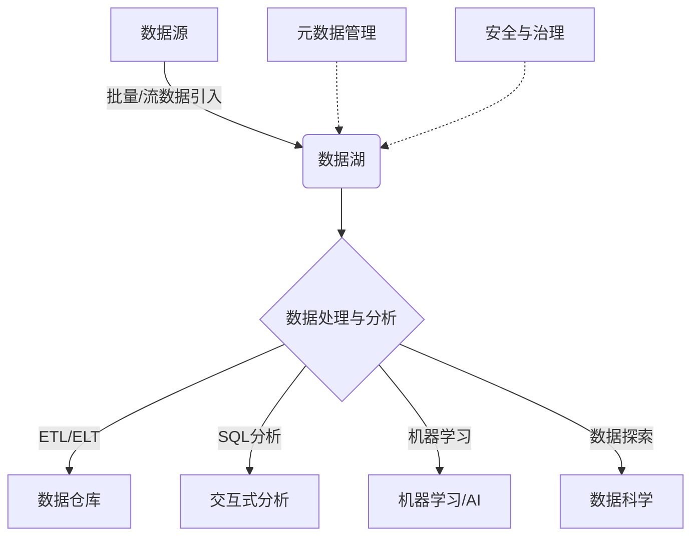

# 第九章：数据湖常见问题与解答

## 8.1 什么是数据湖？

数据湖是一种新兴的大数据存储和处理架构,旨在存储各种类型的原始数据,包括结构化数据、半结构化数据和非结构化数据。与传统的数据仓库不同,数据湖不需要预先定义数据模式,可以灵活地存储任何格式的数据,而数据的结构化和处理工作可以在数据被访问时再执行。

### 8.1.1 数据湖的特点

- **原始数据存储**:数据湖存储原始数据,不对数据进行提前处理和转换。
- **多样化数据类型**:可以存储结构化数据(如关系数据库数据)、半结构化数据(如XML、JSON)和非结构化数据(如文本、图像、视频等)。
- **低成本扩展**:基于分布式文件系统(如HDFS)构建,可以轻松扩展存储容量。
- **统一数据平台**:为各种数据分析工作提供统一的数据平台和生态系统。

### 8.1.2 数据湖与数据仓库的区别

| 特性 | 数据湖 | 数据仓库 |
|------|--------|----------|
| 数据类型 | 各种格式 | 主要结构化数据 |
| 数据模式 | 晚期模式化(Schema-on-Read) | 提前模式化(Schema-on-Write)|
| 数据处理 | 按需处理和转换 | 事先ETL处理 |
| 用户群体 | 数据科学家、数据分析师等 | 业务分析人员等|
| 成本 | 相对较低 | 相对较高 |

## 8.2 数据湖的核心概念

### 8.2.1 数据引入

数据从各种来源(如数据库、传感器、文件等)被引入到数据湖中,通常以原始格式存储,不做任何转换。常见的数据引入方式包括:

- **批量数据引入**: 使用工具如Sqoop、Flume等从RDBMS、NoSQL数据库等源系统抽取数据。
- **流式数据引入**: 使用Kafka、Kinesis等消息队列系统实时接收传感器、日志等数据流。
- **手动上传**: 用户可以直接上传文件(如CSV、JSON、视频等)到数据湖。

### 8.2.2 数据存储

数据湖底层通常基于分布式文件系统(如HDFS)或对象存储系统(如AWS S3)存储数据。常用的文件格式包括:

- **行式存储**:textfile、CSV、JSON等。
- **列式存储**:ORC、Parquet等,适合于数据分析场景。
- **其他格式**:Avro、SequenceFile等。

数据可按年、月、日等维度分区存储,方便数据访问。

### 8.2.3 元数据管理

由于数据湖存储海量原始数据,需要元数据系统记录数据的元信息,如数据模式、数据位置、数据质量等,以支持数据发现、数据准备和数据治理。常用的元数据工具有Apache Atlas、AWS Glue等。

### 8.2.4 数据处理与分析

数据湖支持各种数据处理和分析工作,包括:

- **ETL/ELT**:使用工具如Apache Spark、Hive等从数据湖抽取、转换、加载数据到数据仓库或其他系统。
- **交互式分析**:使用Apache Spark、Presto等工具进行SQL交互式查询分析。
- **机器学习**:使用Spark MLlib、TensorFlow等进行机器学习和深度学习。
- **数据科学**:数据科学家可以在数据湖中探索性地发现数据模式和建模。

### 8.2.5 数据安全与治理

数据湖需要解决数据安全、隐私和合规性问题,确保数据的机密性、完整性和可用性。常见的做法包括:

- **访问控制**:基于角色的细粒度访问控制。
- **数据掩码**:对敏感数据执行掩码或加密。  
- **数据审计**:跟踪和审计对数据的访问和操作。
- **数据分级**:根据数据重要程度、合规要求等对数据分级。

## 8.3 数据湖架构和组件

典型的数据湖架构包括以下主要组件:

- **数据源**: 各种来源的数据,如RDBMS、NoSQL、日志、IoT等。
- **数据湖存储**: 以分布式文件系统或对象存储为底层存储原始数据。
- **数据引入**:使用工具批量或流式方式将数据引入数据湖。
- **数据处理与分析**:使用Spark、Hive、Presto等工具进行ETL、SQL分析、机器学习等。
- **元数据管理**:使用Apache Atlas、AWS Glue等工具管理数据元信息。
- **数据安全与治理**:提供访问控制、数据掩码、数据审计等功能。

## 8.4 数据湖的优缺点

### 8.4.1 优点

- **存储多种数据类型**:支持存储各种格式的结构化、半结构化和非结构化数据。
- **按需处理数据**:无需提前转换和处理数据,可以根据需求对数据进行Schema-on-Read。
- **支持数据探索**:原始数据可供数据科学家发现隐藏的数据模式和价值。
- **低成本扩展**:基于分布式存储,可以低成本线性扩展存储容量。
- **支持多种分析工作**:支持ETL、SQL分析、机器学习和数据科学等多种分析工作。

### 8.4.2 缺点

- **数据质量和一致性问题**:原始数据可能存在质量和一致性问题。
- **元数据管理复杂**:需要复杂的元数据系统来管理海量原始数据。  
- **数据治理挑战**:数据治理变得更加复杂,需要有效的数据安全和合规性控制。
- **技能要求更高**:需要团队具备大数据处理、分析和数据科学等多方面的技能。
- **操作成本较高**:维护和管理数据湖的操作成本可能较高。

## 8.5 数据湖的实际应用场景

数据湖广泛应用于各个行业和领域,以下是一些典型的应用场景:

### 8.5.1 金融服务

- **反洗钱分析**: 从交易记录、客户信息等数据中发现可疑活动模式。
- **风险模型构建**: 使用机器学习模型评估贷款、投资等风险。
- **客户行为分析**: 分析客户行为数据,提供个性化产品和服务。

### 8.5.2 医疗保健

- **临床数据分析**: 整合电子病历、基因组数据等进行疾病预测和精准医疗。
- **药物研发**: 利用数据湖中的临床试验数据加速新药研发过程。
- **医疗设备数据分析**:分析医疗设备数据优化设备使用和维护。

### 8.5.3 制造业

- **预测性维护**: 利用传感器数据预测设备故障,优化维护计划。
- **质量控制**: 分析生产数据,发现质量问题根源并持续改进。
- **供应链优化**: 分析供应链数据提高效率,降低成本。

### 8.5.4 电信和媒体

- **网络优化**: 分析网络日志和使用数据,提高网络性能和服务质量。
- **个性化广告投放**: 分析用户行为数据,提供更精准的广告推荐。
- **内容推荐**: 基于用户浏览和偏好数据,推荐个性化内容。

### 8.5.5 零售和电商

- **客户行为分析**: 挖掘客户购买模式和偏好,提供个性化推荐。
- **库存优化**: 分析销售和库存数据,优化库存管理。
- **欺诈检测**: 发现异常订单和欺诈行为,保护企业和客户利益。

### 8.5.6 物联网和车联网

- **车辆数据分析**: 分析车辆传感器数据,优化车辆设计和维护。
- **智能城市**: 整合各类城市数据,提高城市运营效率和公共服务质量。
- **工业4.0**: 分析工厂和设备数据,实现智能制造。

## 8.6 数据湖的未来发展趋势

### 8.6.1 云原生数据湖

随着云计算的不断发展,越来越多的企业选择在云平台上构建数据湖。主要的云供应商如AWS、Azure和GCP都提供了云原生的数据湖服务,如Amazon S3、Azure Data Lake和Google Cloud Storage,可以简化数据湖的构建和管理。

云原生数据湖具有以下优势:

- **可扩展性**:借助云平台的弹性资源,可以轻松扩展数据湖的存储和计算能力。
- **成本优化**:采用按需付费模式,可以降低数据湖的总体拥有成本(TCO)。
- **集成能力**:与云平台上的其他服务(如数据仓库、机器学习等)无缝集成。
- **安全合规**:利用云平台提供的安全和合规性功能,确保数据安全。

未来,越来越多的企业将选择在云上构建数据湖,以获得更好的灵活性、可扩展性和成本效益。

### 8.6.2 数据湖与数据仓库融合

随着数据湖和数据仓库技术的发展,两者之间的界限变得越来越模糊。未来,两种架构可能会逐步融合,形成统一的数据平台。

在这种融合架构中:

- 数据湖提供原始数据存储和数据探索功能。
- 数据仓库提供高度优化的结构化数据存储和分析功能。
- 两者通过数据管道和元数据系统无缝集成,支持数据流动。
- 用户可以在统一平台上进行数据探索、ETL、SQL分析和机器学习等工作。

这种融合架构将结合两种架构的优势,为企业提供更加灵活和统一的数据处理和分析平台。

### 8.6.3 元数据驱动的数据治理

随着数据湖中数据量的不断增长,有效的元数据管理和数据治理变得至关重要。未来,元数据将成为数据湖治理的核心驱动力。

基于元数据的数据治理将包括以下几个方面:

- **自动元数据发现和分类**:通过机器学习和人工智能技术,自动发现和分类数据湖中的数据资产,并自动提取元数据。
- **智能元数据管理**:通过知识图谱等技术,建立数据资产之间的语义关联,支持更智能的数据发现和管理。
- **策略驱动的自动化治理**:基于元数据,自动执行数据质量、数据掩码、数据访问控制等治理策略。
- **数据资产目录和数据市场**:通过元数据驱动的数据资产目录和数据市场,促进数据资产的发现和共享。

通过元数据驱动的数据治理,企业可以更好地管理和利用数据湖中的海量数据资产。

### 8.6.4 数据湖与AI/ML的融合

随着人工智能和机器学习技术的不断发展,数据湖将成为AI/ML应用的重要数据源和平台。未来,数据湖和AI/ML将进一步融合,相互促进。

一方面,数据湖为AI/ML应用提供了海量的训练数据和数据探索能力:

- 数据湖可以存储各种类型的训练数据,如图像、视频、文本等。
- 数据湖支持数据科学家进行数据探索,发现数据模式和特征。
- 数据湖可以与AI/ML工具和平台(如TensorFlow、Spark MLlib等)无缝集成。

另一方面,AI/ML技术也将应用于数据湖的各个环节,提高数据湖的智能化水平:

- 使用机器学习自动发现和分类数据,提高元数据管理效率