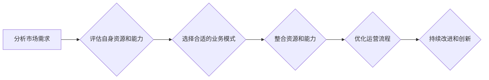

## 第二部分：多元化业务模式探索

## 1. 背景介绍

### 1.1 数字化转型浪潮下的商业模式变革

随着信息技术的飞速发展和互联网的普及，全球经济正经历着数字化转型浪潮。数字化转型不仅仅是技术的变革，更是一场深刻的商业模式变革。传统的商业模式受到巨大冲击，企业需要积极探索新的业务模式以适应数字化时代的发展趋势。

### 1.2 多元化业务模式的兴起

为了应对数字化转型带来的挑战，越来越多的企业开始探索多元化业务模式。多元化业务模式是指企业不再局限于单一的产品或服务，而是通过整合不同的业务领域、资源和能力，构建多元化的产品和服务体系，以满足不同客户群体的需求，提高企业的市场竞争力和盈利能力。

### 1.3 本章内容概述

本章将深入探讨多元化业务模式的内涵、驱动因素、构建方法以及典型案例。我们将分析多元化业务模式的优势和挑战，并为企业探索多元化业务模式提供 practical 的指导和建议。

## 2. 核心概念与联系

### 2.1 多元化业务模式的定义

多元化业务模式是指企业通过整合不同的业务领域、资源和能力，构建多元化的产品和服务体系，以满足不同客户群体的需求，提高企业的市场竞争力和盈利能力。

### 2.2 多元化业务模式的驱动因素

* **市场需求变化:** 随着消费者需求的日益多样化和个性化，单一的产品或服务难以满足市场需求，企业需要拓展业务范围，提供多元化的产品和服务。
* **技术发展:** 信息技术的快速发展为企业多元化经营提供了技术支撑，例如云计算、大数据、人工智能等技术可以帮助企业整合资源、优化流程、提升效率。
* **竞争压力:**  市场竞争日益激烈，企业需要通过多元化经营来分散风险、拓展市场、提升竞争力。
* **政策环境:**  政府鼓励企业进行多元化经营，并提供相应的政策支持。

### 2.3 多元化业务模式与其他概念的联系

* **商业模式创新:** 多元化业务模式是商业模式创新的一种重要形式，它通过拓展业务领域、整合资源和能力来创造新的价值。
* **数字化转型:**  多元化业务模式是企业数字化转型的重要组成部分，它可以帮助企业利用数字化技术提升效率、优化流程、拓展市场。
* **生态系统:** 多元化业务模式的构建需要企业与合作伙伴共同构建生态系统，实现资源共享、优势互补、合作共赢。

## 3. 核心算法原理具体操作步骤

### 3.1 多元化业务模式构建的步骤

1. **分析市场需求:**  深入了解目标客户群体的需求，分析市场趋势和竞争格局。
2. **评估自身资源和能力:**  客观评估企业的资源优势、技术能力和管理经验，确定可行的多元化方向。
3. **选择合适的业务模式:**  根据市场需求和自身资源，选择合适的业务模式，例如产品多元化、服务多元化、市场多元化等。
4. **整合资源和能力:**  整合企业内部和外部的资源和能力，构建多元化的产品和服务体系。
5. **优化运营流程:**  优化企业的运营流程，提高效率、降低成本、提升客户满意度。
6. **持续改进和创新:**  不断改进和创新多元化业务模式，以适应市场变化和客户需求。

### 3.2 多元化业务模式构建的流程图



## 4. 数学模型和公式详细讲解举例说明

### 4.1 多元化业务模式的盈利模式

多元化业务模式的盈利模式可以采用以下公式进行计算:

$$
\text{总利润} = \sum_{i=1}^{n} (\text{产品或服务}_i \text{的收入} - \text{产品或服务}_i \text{的成本})
$$

其中，n 表示多元化业务模式中产品或服务的数量。

### 4.2 多元化业务模式的风险评估

多元化业务模式的风险评估可以采用以下指标进行衡量:

* **市场风险:**  新业务领域的市场需求不确定性、竞争激烈程度等。
* **运营风险:**  新业务领域的运营管理难度、成本控制难度等。
* **财务风险:**  新业务领域的投资回报率、资金周转率等。

### 4.3 举例说明

例如，一家传统的服装制造企业想要进行多元化经营，可以考虑以下几种业务模式:

* **产品多元化:**  拓展产品线，推出新的服装品类，例如运动服、童装、家居服等。
* **服务多元化:**  提供服装定制、服装租赁、服装搭配等服务。
* **市场多元化:**  拓展海外市场，将产品销往其他国家和地区。

企业可以根据自身的资源和能力，选择合适的业务模式，并进行风险评估，制定相应的风险控制措施。

## 5. 项目实践：代码实例和详细解释说明

### 5.1 电商平台的多元化业务模式

以电商平台为例，其多元化业务模式可以包括以下几个方面:

* **产品多元化:**  拓展商品品类，例如从服装扩展到家居、电子产品、食品等。
* **服务多元化:**  提供物流配送、售后服务、金融支付等服务。
* **市场多元化:**  拓展海外市场，将商品销往其他国家和地区。

### 5.2 代码实例

以下是一个简单的 Python 代码示例，展示了电商平台如何通过 API 接口获取不同品类的商品数据:

```python
import requests

# 定义 API 接口地址
api_url = "https://api.example.com/products"

# 定义请求参数
params = {
    "category": "electronics",
    "page": 1,
    "per_page": 10
}

# 发送 GET 请求
response = requests.get(api_url, params=params)

# 解析 JSON 数据
data = response.json()

# 打印商品数据
for product in data["products"]:
    print(f"商品名称: {product['name']}")
    print(f"商品价格: {product['price']}")
```

### 5.3 代码解释

* `requests` 库用于发送 HTTP 请求。
* `api_url` 变量定义了 API 接口地址。
* `params` 字典定义了请求参数，包括商品类别、页码和每页显示的商品数量。
* `requests.get()` 函数发送 GET 请求，并将响应数据存储在 `response` 变量中。
* `response.json()` 方法将 JSON 格式的响应数据解析成 Python 字典。
* `for` 循环遍历商品数据，并打印商品名称和价格。

## 6. 实际应用场景

### 6.1 传统制造业的多元化转型

传统制造业面临着市场需求变化、成本上升、竞争激烈等挑战，需要进行多元化转型以提升竞争力。例如，一家传统的汽车制造企业可以考虑以下几种多元化业务模式:

* **发展新能源汽车:**  顺应环保趋势，发展新能源汽车，例如电动汽车、混合动力汽车等。
* **提供汽车后市场服务:**  提供汽车维修、保养、保险等服务。
* **发展智能网联汽车:**  将汽车与互联网、人工智能等技术相结合，提供智能驾驶、车联网等服务。

### 6.2 互联网企业的多元化布局

互联网企业拥有庞大的用户群体和强大的技术实力，可以进行多元化布局以拓展业务领域。例如，一家互联网电商平台可以考虑以下几种多元化业务模式:

* **发展线下零售:**  开设线下实体店，提供线上线下融合的购物体验。
* **发展云计算服务:**  为企业提供云计算服务，例如云存储、云计算、大数据分析等。
* **发展人工智能技术:**  开发人工智能技术，例如图像识别、语音识别、自然语言处理等，并应用于各个业务领域。

## 7. 工具和资源推荐

### 7.1 商业模式画布

商业模式画布是一种用于描述和分析商业模式的工具，它可以帮助企业清晰地了解自身的价值主张、客户群体、渠道通路、收入来源、成本结构等关键要素。

### 7.2 SWOT 分析

SWOT 分析是一种用于分析企业内部优势和劣势、外部机会和威胁的工具，它可以帮助企业制定多元化经营战略。

### 7.3 波特五力模型

波特五力模型是一种用于分析行业竞争格局的工具，它可以帮助企业了解行业竞争的激烈程度，以及多元化经营的可行性。

## 8. 总结：未来发展趋势与挑战

### 8.1 未来发展趋势

* **个性化定制:** 随着消费者需求的日益个性化，企业需要提供更加个性化的产品和服务。
* **服务化转型:**  制造业企业需要从单纯的产品制造转向提供服务，例如产品维护、维修、升级等。
* **平台化发展:**  企业需要构建平台，整合资源和能力，为用户提供一站式服务。

### 8.2 面临的挑战

* **市场竞争激烈:**  多元化经营意味着进入新的市场，企业需要面对新的竞争对手。
* **资源整合难度大:**  多元化经营需要整合不同的资源和能力，这对企业的管理能力提出了更高的要求。
* **风险控制难度高:**  多元化经营意味着分散风险，但也增加了风险控制的难度。

## 9. 附录：常见问题与解答

### 9.1  多元化经营的风险有哪些？

多元化经营的风险主要包括市场风险、运营风险和财务风险。

### 9.2 如何选择合适的业务模式？

选择合适的业务模式需要考虑市场需求、自身资源和能力、风险控制等因素。

### 9.3 如何评估多元化经营的效益？

评估多元化经营的效益可以采用财务指标、市场份额、客户满意度等指标进行衡量。
