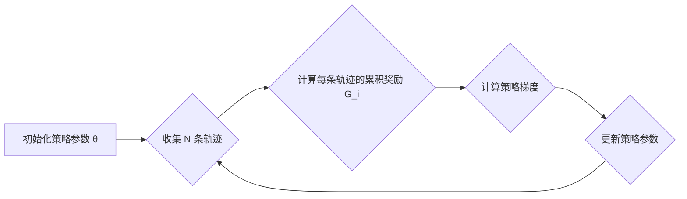

## 1. 背景介绍

### 1.1 强化学习的崛起

近年来，强化学习 (Reinforcement Learning, RL) 作为机器学习的一个重要分支，在游戏、机器人控制、资源管理等领域取得了令人瞩目的成就。AlphaGo、AlphaStar 等 AI 的成功案例，更是将强化学习推向了公众视野，引发了学术界和工业界的广泛关注。

### 1.2 策略梯度的优势

强化学习的核心问题在于学习一个策略，使得智能体 (Agent) 在与环境的交互过程中能够最大化累积奖励。策略梯度方法作为一种重要的强化学习算法，具有以下优势：

* **直接优化策略:** 策略梯度方法直接对策略进行优化，避免了值函数估计带来的误差，提高了学习效率。
* **处理连续动作空间:** 策略梯度方法可以有效处理连续动作空间，适用于更广泛的应用场景。
* **良好的收敛性:** 策略梯度方法通常具有良好的收敛性，能够找到较优的策略。

### 1.3 本文目的

本文旨在深入浅出地讲解策略梯度的原理，并结合代码实例，帮助读者更好地理解和应用这一强大的强化学习算法。

## 2. 核心概念与联系

### 2.1 马尔可夫决策过程 (MDP)

强化学习问题通常被建模为马尔可夫决策过程 (Markov Decision Process, MDP)。一个 MDP 由以下要素构成：

* **状态空间 S:**  所有可能的状态的集合。
* **动作空间 A:**  所有可能的动作的集合。
* **状态转移概率 P:**  在状态 s 下执行动作 a 后转移到状态 s' 的概率，记为 P(s'|s, a)。
* **奖励函数 R:**  在状态 s 下执行动作 a 后获得的奖励，记为 R(s, a)。
* **折扣因子 γ:**  用于衡量未来奖励的权重，取值范围为 [0, 1]。

### 2.2 策略

策略是指智能体在给定状态下选择动作的规则。策略可以是确定性的，也可以是随机的。确定性策略在给定状态下总是选择相同的动作，而随机策略则根据概率分布选择动作。

### 2.3 轨迹

轨迹是指智能体与环境交互过程中的一系列状态、动作和奖励。一条轨迹可以表示为：

```
τ = (s_0, a_0, r_0, s_1, a_1, r_1, ..., s_T)
```

其中，T 表示轨迹的长度。

### 2.4 目标函数

强化学习的目标是找到一个策略，使得智能体在与环境交互过程中能够获得最大的累积奖励。累积奖励可以表示为：

```
J(θ) = E[∑_{t=0}^{T} γ^t R(s_t, a_t)]
```

其中，θ 表示策略的参数，E 表示期望。

### 2.5 策略梯度

策略梯度是指目标函数 J(θ) 对策略参数 θ 的梯度。策略梯度方法通过迭代更新策略参数 θ，使得目标函数 J(θ) 不断增大。

## 3. 核心算法原理具体操作步骤

### 3.1 REINFORCE 算法

REINFORCE 算法是最基本的策略梯度算法之一。其核心思想是利用蒙特卡洛方法估计目标函数的梯度，并利用梯度上升法更新策略参数。

**算法流程：**

1. 初始化策略参数 θ。
2. 重复以下步骤直至收敛：
    * 收集 N 条轨迹 {τ_i}。
    * 计算每条轨迹的累积奖励 G_i = ∑_{t=0}^{T_i} γ^t R(s_t, a_t)。
    * 计算策略梯度：
        ```
        ∇_θ J(θ) ≈ 1/N ∑_{i=1}^{N} G_i ∇_θ log π_θ(a_i|s_i)
        ```
    * 更新策略参数：
        ```
        θ = θ + α ∇_θ J(θ)
        ```
    * 其中，α 为学习率。

**Mermaid 流程图:**



### 3.2 Actor-Critic 算法

Actor-Critic 算法是一种改进的策略梯度算法，它引入了一个值函数估计器 (Critic) 来减少策略梯度的方差。

**算法流程：**

1. 初始化策略参数 θ 和值函数参数 w。
2. 重复以下步骤直至收敛：
    * 收集一条轨迹 τ。
    * 计算轨迹中每个状态的值函数估计 V_w(s_t)。
    * 计算轨迹的优势函数 A(s_t, a_t) = R(s_t, a_t) + γ V_w(s_{t+1}) - V_w(s_t)。
    * 计算策略梯度：
        ```
        ∇_θ J(θ) ≈ ∑_{t=0}^{T} A(s_t, a_t) ∇_θ log π_θ(a_t|s_t)
        ```
    * 更新策略参数：
        ```
        θ = θ + α ∇_θ J(θ)
        ```
    * 更新值函数参数：
        ```
        w = w - β (V_w(s_t) - R(s_t, a_t) - γ V_w(s_{t+1})) ∇_w V_w(s_t)
        ```
    * 其中，α 和 β 为学习率。

**Mermaid 流程图:**

```mermaid
graph LR
    A[初始化策略参数 θ 和值函数参数 w] --> B{收集一条轨迹}
    B --> C{计算轨迹中每个状态的值函数估计 V_w(s_t)}
    C --> D{计算轨迹的优势函数 A(s_t, a_t)}
    D --> E{计算策略梯度}
    E --> F{更新策略参数}
    F --> G{更新值函数参数}
    G --> B
```

## 4. 数学模型和公式详细讲解举例说明

### 4.1 策略梯度定理

策略梯度定理是策略梯度方法的理论基础，它表明目标函数 J(θ) 对策略参数 θ 的梯度可以表示为：

```
∇_θ J(θ) = E[∑_{t=0}^{T} ∇_θ log π_θ(a_t|s_t) Q^{\pi_θ}(s_t, a_t)]
```

其中，Q^{\pi_θ}(s_t, a_t) 表示在状态 s_t 下执行动作 a_t 后，按照策略 π_θ 继续执行直至轨迹结束所能获得的累积奖励的期望。

**举例说明：**

假设有一个简单的强化学习问题，状态空间 S = {0, 1}，动作空间 A = {0, 1}，奖励函数 R(s, a) = s + a，折扣因子 γ = 0.9。策略 π_θ(a|s) = σ(θ s + b)，其中 σ 表示 sigmoid 函数，θ 和 b 为策略参数。

根据策略梯度定理，目标函数 J(θ) 对参数 θ 的梯度可以表示为：

```
∇_θ J(θ) = E[∑_{t=0}^{T} ∇_θ log π_θ(a_t|s_t) Q^{\pi_θ}(s_t, a_t)]
```

其中，

```
∇_θ log π_θ(a_t|s_t) = s_t σ'(θ s_t + b) (a_t - π_θ(a_t|s_t))
```

```
Q^{\pi_θ}(s_t, a_t) = R(s_t, a_t) + γ ∑_{s'} P(s'|s_t, a_t) V^{\pi_θ}(s')
```

```
V^{\pi_θ}(s) = ∑_{a} π_θ(a|s) Q^{\pi_θ}(s, a)
```

### 4.2 蒙特卡洛策略梯度

REINFORCE 算法利用蒙特卡洛方法估计 Q^{\pi_θ}(s_t, a_t)，即用轨迹中实际获得的累积奖励 G_i 来代替 Q^{\pi_θ}(s_t, a_t)。

**举例说明：**

假设我们收集了以下三条轨迹：

```
τ_1 = (0, 1, 1, 1, 0, 1)
τ_2 = (1, 0, 1, 0, 1, 0)
τ_3 = (0, 0, 0, 1, 1, 1)
```

则每条轨迹的累积奖励分别为：

```
G_1 = 1 + 0.9 * 1 + 0.9^2 * 1 + 0.9^3 * 0 + 0.9^4 * 1 = 3.439
G_2 = 1 + 0.9 * 0 + 0.9^2 * 1 + 0.9^3 * 0 + 0.9^4 * 1 = 2.71
G_3 = 0 + 0.9 * 0 + 0.9^2 * 0 + 0.9^3 * 1 + 0.9^4 * 1 = 1.458
```

因此，策略梯度可以估计为：

```
∇_θ J(θ) ≈ 1/3 (3.439 ∇_θ log π_θ(1|0) + 2.71 ∇_θ log π_θ(0|1) + 1.458 ∇_θ log π_θ(0|0))
```

### 4.3 Actor-Critic 策略梯度

Actor-Critic 算法引入了一个值函数估计器 (Critic) 来估计 V^{\pi_θ}(s_t)，并利用优势函数 A(s_t, a_t) = R(s_t, a_t) + γ V_w(s_{t+1}) - V_w(s_t) 来减少策略梯度的方差。

**举例说明：**

假设值函数估计器 V_w(s) = w s，其中 w 为值函数参数。对于轨迹 τ_1，我们可以计算出每个状态的值函数估计：

```
V_w(0) = 0
V_w(1) = w
```

因此，轨迹 τ_1 的优势函数可以计算为：

```
A(0, 1) = 1 + 0.9 * w - 0 = 1 + 0.9 * w
A(1, 0) = 1 + 0.9 * 0 - w = 1 - w
A(1, 1) = 1 + 0.9 * w - w = 1 - 0.1 * w
A(0, 0) = 0 + 0.9 * 0 - 0 = 0
A(1, 1) = 1 + 0.9 * w - w = 1 - 0.1 * w
```

因此，策略梯度可以估计为：

```
∇_θ J(θ) ≈ (1 + 0.9 * w) ∇_θ log π_θ(1|0) + (1 - w) ∇_θ log π_θ(0|1) + (1 - 0.1 * w) ∇_θ log π_θ(1|1)
```

## 5. 项目实践：代码实例和详细解释说明

### 5.1 CartPole 环境介绍

CartPole 问题是一个经典的控制问题，目标是控制一个小车在水平轨道上移动，并保持杆子竖直不倒。

**状态空间：**

* 小车位置：-2.4 到 2.4
* 小车速度：-Inf 到 Inf
* 杆子角度：-41.8° 到 41.8°
* 杆子角速度：-Inf 到 Inf

**动作空间：**

* 0：向左推小车
* 1：向右推小车

**奖励函数：**

* 每个时间步奖励为 1

**终止条件：**

* 杆子角度超过 ±12°
* 小车位置超过 ±2.4
* episode 最大长度为 200

### 5.2 REINFORCE 算法代码实例

```python
import gym
import numpy as np
import torch
import torch.nn as nn
import torch.optim as optim

# 定义策略网络
class PolicyNetwork(nn.Module):
    def __init__(self, state_dim, action_dim):
        super(PolicyNetwork, self).__init__()
        self.fc1 = nn.Linear(state_dim, 128)
        self.fc2 = nn.Linear(128, action_dim)

    def forward(self, state):
        x = torch.relu(self.fc1(state))
        x = self.fc2(x)
        return torch.softmax(x, dim=-1)

# 定义 REINFORCE 算法
class REINFORCE:
    def __init__(self, state_dim, action_dim, learning_rate):
        self.policy_network = PolicyNetwork(state_dim, action_dim)
        self.optimizer = optim.Adam(self.policy_network.parameters(), lr=learning_rate)

    def select_action(self, state):
        state = torch.from_numpy(state).float().unsqueeze(0)
        probs = self.policy_network(state)
        action = torch.multinomial(probs, num_samples=1).item()
        return action

    def update_policy(self, rewards, log_probs):
        discounted_rewards = []
        running_add = 0
        for r in rewards[::-1]:
            running_add = r + 0.99 * running_add
            discounted_rewards.insert(0, running_add)
        discounted_rewards = torch.tensor(discounted_rewards)
        policy_gradient = []
        for log_prob, Gt in zip(log_probs, discounted_rewards):
            policy_gradient.append(-log_prob * Gt)
        self.optimizer.zero_grad()
        policy_gradient = torch.stack(policy_gradient).sum()
        policy_gradient.backward()
        self.optimizer.step()

# 创建 CartPole 环境
env = gym.make('CartPole-v1')

# 初始化 REINFORCE 算法
state_dim = env.observation_space.shape[0]
action_dim = env.action_space.n
learning_rate = 0.01
reinforce = REINFORCE(state_dim, action_dim, learning_rate)

# 训练智能体
num_episodes = 1000
for episode in range(num_episodes):
    state = env.reset()
    rewards = []
    log_probs = []
    done = False
    while not done:
        action = reinforce.select_action(state)
        next_state, reward, done, _ = env.step(action)
        rewards.append(reward)
        log_probs.append(torch.log(reinforce.policy_network(torch.from_numpy(state).float().unsqueeze(0))[0][action]))
        state = next_state
    reinforce.update_policy(rewards, log_probs)
    if episode % 100 == 0:
        print('Episode: {}, Reward: {}'.format(episode, np.sum(rewards)))

# 测试智能体
state = env.reset()
done = False
while not done:
    env.render()
    action = reinforce.select_action(state)
    next_state, reward, done, _ = env.step(action)
    state = next_state

env.close()
```

**代码解释：**

1. 首先，我们定义了策略网络 `PolicyNetwork`，它是一个简单的两层全连接神经网络，输出动作的概率分布。
2. 然后，我们定义了 REINFORCE 算法 `REINFORCE`，它包含了选择动作、更新策略等方法。
3. 接着，我们创建了 CartPole 环境 `env`，并初始化了 REINFORCE 算法 `reinforce`。
4. 最后，我们训练智能体，并在训练过程中打印每个 episode 的奖励。

### 5.3 Actor-Critic 算法代码实例

```python
import gym
import numpy as np
import torch
import torch.nn as nn
import torch.optim as optim

# 定义策略网络
class PolicyNetwork(nn.Module):
    def __init__(self, state_dim, action_dim):
        super(PolicyNetwork, self).__init__()
        self.fc1 = nn.Linear(state_dim, 128)
        self.fc2 = nn.Linear(128, action_dim)

    def forward(self, state):
        x = torch.relu(self.fc1(state))
        x = self.fc2(x)
        return torch.softmax(x, dim=-1)

# 定义值函数网络
class ValueNetwork(nn.Module):
    def __