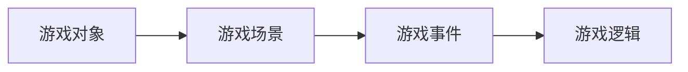

## 1. 背景介绍

### 1.1 游戏产业的蓬勃发展与游戏开发的挑战

近年来，随着互联网技术的飞速发展和智能手机的普及，游戏产业呈现出蓬勃发展的态势。游戏类型日益丰富，从大型多人在线角色扮演游戏（MMORPG）到休闲益智游戏，应有尽有。然而，游戏开发也面临着诸多挑战，例如：

* **开发周期长，成本高：**大型游戏的开发周期通常需要数年时间，开发成本也十分高昂。
* **技术门槛高，人才稀缺：**游戏开发需要掌握多种技术，例如图形学、物理引擎、人工智能等，而这些领域的人才相对稀缺。
* **市场竞争激烈，创新压力大：**游戏市场竞争激烈，开发者需要不断推陈出新，才能吸引玩家。

### 1.2 简单小游戏设计系统的意义

为了应对这些挑战，简化游戏开发流程，降低开发门槛，**简单小游戏设计系统**应运而生。这类系统旨在提供一套易于使用、功能强大的工具，帮助开发者快速创建和发布高质量的小游戏。

简单小游戏设计系统具有以下优势：

* **易于学习和使用：**系统提供直观的图形界面和简化的脚本语言，即使没有编程经验的用户也能轻松上手。
* **功能强大，灵活可扩展：**系统内置丰富的游戏元素和逻辑组件，支持自定义扩展，开发者可以根据自己的需求灵活定制游戏。
* **开发效率高，成本低：**系统简化了游戏开发流程，缩短了开发周期，降低了开发成本。
* **跨平台支持：**系统支持多种平台，例如 Windows、Mac、iOS、Android 等，开发者可以轻松将游戏发布到不同的平台。

## 2. 核心概念与联系

### 2.1 游戏对象

游戏对象是游戏世界中的基本元素，例如玩家角色、敌人、道具等。每个游戏对象都具有以下属性：

* **名称：**用于标识游戏对象。
* **位置：**游戏对象在游戏世界中的坐标。
* **大小：**游戏对象的尺寸。
* **外观：**游戏对象的图形或动画。
* **行为：**游戏对象的逻辑和动作。

### 2.2 游戏场景

游戏场景是游戏世界的一部分，例如关卡、地图等。游戏场景由多个游戏对象组成，并定义了游戏规则和目标。

### 2.3 游戏事件

游戏事件是游戏过程中发生的特定情况，例如玩家按下按键、敌人被消灭等。游戏事件触发游戏逻辑的执行。

### 2.4 游戏逻辑

游戏逻辑定义了游戏规则和行为，例如玩家如何移动、敌人如何攻击、游戏如何结束等。

### 2.5 核心概念联系

下图展示了简单小游戏设计系统中核心概念之间的联系：



## 3. 核心算法原理具体操作步骤

### 3.1 游戏循环

游戏循环是游戏运行的核心机制，它不断地更新游戏状态、处理玩家输入、渲染游戏画面。

游戏循环的步骤如下：

1. **处理输入：**检测玩家的输入，例如键盘、鼠标、触摸屏等。
2. **更新游戏逻辑：**根据玩家输入和游戏规则更新游戏状态，例如移动游戏对象、处理碰撞检测等。
3. **渲染游戏画面：**将游戏场景和游戏对象绘制到屏幕上。

### 3.2 碰撞检测

碰撞检测用于判断两个游戏对象是否发生碰撞。常用的碰撞检测算法有：

* **矩形碰撞检测：**将游戏对象简化为矩形，判断两个矩形是否相交。
* **圆形碰撞检测：**将游戏对象简化为圆形，判断两个圆形是否相交。
* **像素级碰撞检测：**逐像素比较两个游戏对象的图像，判断是否发生碰撞。

### 3.3 动画

动画用于创建游戏对象的动态效果，例如移动、旋转、缩放等。常用的动画技术有：

* **帧动画：**将动画分解为一系列静态图像，按顺序播放。
* **骨骼动画：**使用骨骼绑定模型，通过控制骨骼的运动来创建动画。

## 4. 数学模型和公式详细讲解举例说明

### 4.1 坐标系

游戏世界使用二维坐标系表示，原点位于屏幕左上角，x 轴向右，y 轴向下。

### 4.2 距离公式

计算两个游戏对象之间的距离可以使用距离公式：

$$
d = \sqrt{(x_2 - x_1)^2 + (y_2 - y_1)^2}
$$

其中，$(x_1, y_1)$ 和 $(x_2, y_2)$ 分别表示两个游戏对象的坐标。

### 4.3 速度和加速度

速度表示游戏对象移动的快慢，加速度表示速度的变化率。

速度的计算公式为：

$$
v = \frac{\Delta x}{\Delta t}
$$

其中，$\Delta x$ 表示位移，$\Delta t$ 表示时间间隔。

加速度的计算公式为：

$$
a = \frac{\Delta v}{\Delta t}
$$

### 4.4 示例

假设有一个游戏对象 A，其初始位置为 $(100, 100)$，速度为 $(5, 0)$，加速度为 $(0, -10)$。

经过 1 秒后，游戏对象 A 的位置为：

$$
x = x_0 + v_x t + \frac{1}{2} a_x t^2 = 100 + 5 \times 1 + \frac{1}{2} \times 0 \times 1^2 = 105
$$

$$
y = y_0 + v_y t + \frac{1}{2} a_y t^2 = 100 + 0 \times 1 + \frac{1}{2} \times (-10) \times 1^2 = 95
$$

因此，游戏对象 A 的新位置为 $(105, 95)$。

## 5. 项目实践：代码实例和详细解释说明

### 5.1 开发环境搭建

* **编程语言：**Python
* **游戏引擎：**Pygame
* **集成开发环境：**VS Code

### 5.2 代码实例

```python
import pygame

# 初始化 Pygame
pygame.init()

# 设置游戏窗口大小
screen_width = 800
screen_height = 600
screen = pygame.display.set_mode((screen_width, screen_height))

# 设置游戏标题
pygame.display.set_caption("简单小游戏")

# 加载游戏资源
player_image = pygame.image.load("player.png").convert_alpha()
enemy_image = pygame.image.load("enemy.png").convert_alpha()

# 定义玩家类
class Player(pygame.sprite.Sprite):
    def __init__(self):
        super().__init__()
        self.image = player_image
        self.rect = self.image.get_rect()
        self.rect.centerx = screen_width // 2
        self.rect.bottom = screen_height - 10
        self.speedx = 0

    def update(self):
        self.rect.x += self.speedx

        # 限制玩家在屏幕范围内移动
        if self.rect.left < 0:
            self.rect.left = 0
        if self.rect.right > screen_width:
            self.rect.right = screen_width

# 定义敌人类
class Enemy(pygame.sprite.Sprite):
    def __init__(self):
        super().__init__()
        self.image = enemy_image
        self.rect = self.image.get_rect()
        self.rect.x = random.randrange(0, screen_width - self.rect.width)
        self.rect.y = random.randrange(-100, -40)
        self.speedy = random.randrange(1, 8)

    def update(self):
        self.rect.y += self.speedy

        # 当敌人移出屏幕底部时，重置其位置
        if self.rect.top > screen_height:
            self.rect.x = random.randrange(0, screen_width - self.rect.width)
            self.rect.y = random.randrange(-100, -40)
            self.speedy = random.randrange(1, 8)

# 创建游戏对象
player = Player()
enemies = pygame.sprite.Group()
for i in range(8):
    enemy = Enemy()
    enemies.add(enemy)

# 游戏循环
running = True
while running:
    # 处理事件
    for event in pygame.event.get():
        if event.type == pygame.QUIT:
            running = False
        if event.type == pygame.KEYDOWN:
            if event.key == pygame.K_LEFT:
                player.speedx = -8
            if event.key == pygame.K_RIGHT:
                player.speedx = 8
        if event.type == pygame.KEYUP:
            if event.key == pygame.K_LEFT or event.key == pygame.K_RIGHT:
                player.speedx = 0

    # 更新游戏逻辑
    player.update()
    enemies.update()

    # 碰撞检测
    hits = pygame.sprite.spritecollide(player, enemies, True)
    if hits:
        # 游戏结束
        running = False

    # 渲染游戏画面
    screen.fill((0, 0, 0))
    screen.blit(player.image, player.rect)
    enemies.draw(screen)

    # 更新显示
    pygame.display.flip()

# 退出 Pygame
pygame.quit()
```

### 5.3 代码解释

* **初始化 Pygame：**使用 `pygame.init()` 初始化 Pygame 库。
* **设置游戏窗口大小：**使用 `pygame.display.set_mode()` 创建游戏窗口，并设置窗口大小。
* **设置游戏标题：**使用 `pygame.display.set_caption()` 设置游戏窗口标题。
* **加载游戏资源：**使用 `pygame.image.load()` 加载游戏图片，并使用 `convert_alpha()` 方法保留图片的透明度。
* **定义玩家类：**创建一个 `Player` 类，继承自 `pygame.sprite.Sprite` 类。
* **定义敌人类：**创建一个 `Enemy` 类，继承自 `pygame.sprite.Sprite` 类。
* **创建游戏对象：**创建玩家对象和敌人对象，并将敌人对象添加到敌人组中。
* **游戏循环：**使用 `while` 循环不断更新游戏状态、处理玩家输入、渲染游戏画面。
* **处理事件：**使用 `pygame.event.get()` 获取游戏事件，并根据事件类型执行相应的操作。
* **更新游戏逻辑：**调用玩家对象和敌人对象的 `update()` 方法更新其位置。
* **碰撞检测：**使用 `pygame.sprite.spritecollide()` 方法检测玩家对象与敌人组之间的碰撞。
* **渲染游戏画面：**使用 `screen.fill()` 方法填充背景颜色，使用 `screen.blit()` 方法绘制游戏对象。
* **更新显示：**使用 `pygame.display.flip()` 方法更新屏幕显示。
* **退出 Pygame：**使用 `pygame.quit()` 退出 Pygame 库。

## 6. 实际应用场景

简单小游戏设计系统可以应用于以下场景：

* **教育领域：**用于开发寓教于乐的教育游戏，帮助学生学习知识和技能。
* **娱乐领域：**用于开发休闲益智游戏，为玩家提供娱乐和放松。
* **广告领域：**用于开发互动广告，提升用户参与度和品牌认知度。
* **原型设计：**用于快速创建游戏原型，验证游戏创意和玩法。

## 7. 工具和资源推荐

* **Pygame：**一个开源的 Python 游戏引擎，提供丰富的游戏开发功能。
* **Unity：**一个跨平台的游戏引擎，支持 2D 和 3D 游戏开发。
* **Unreal Engine：**一个强大的游戏引擎，用于开发高质量的 3D 游戏。
* **GameMaker Studio 2：**一个易于使用的游戏引擎，适合初学者和独立开发者。
* **Construct 3：**一个基于 HTML5 的游戏引擎，无需编程经验即可开发游戏。

## 8. 总结：未来发展趋势与挑战

### 8.1 未来发展趋势

* **人工智能：**人工智能技术将越来越多地应用于游戏开发，例如自动生成游戏内容、提供个性化游戏体验等。
* **虚拟现实和增强现实：**VR 和 AR 技术将为游戏带来全新的沉浸式体验，创造更加逼真和互动性强的游戏世界。
* **云游戏：**云游戏技术将允许玩家在任何设备上玩游戏，无需下载和安装游戏客户端。
* **区块链技术：**区块链技术可以用于创建去中心化的游戏平台，保障游戏资产的安全性和透明度。

### 8.2 面临的挑战

* **技术复杂性：**新技术不断涌现，游戏开发者需要不断学习和掌握新的技术。
* **市场竞争激烈：**游戏市场竞争激烈，开发者需要不断创新，才能脱颖而出。
* **用户需求多样化：**玩家的需求越来越多样化，开发者需要根据不同的用户群体开发不同的游戏类型。

## 9. 附录：常见问题与解答

### 9.1 如何提高游戏性能？

* **优化游戏代码：**避免不必要的计算和内存分配。
* **使用缓存：**将常用的数据缓存到内存中，减少磁盘读取次数。
* **使用多线程：**将游戏逻辑分解成多个线程，提高 CPU 利用率。
* **使用图形加速：**利用 GPU 加速图形渲染。

### 9.2 如何发布游戏？

* **选择合适的平台：**根据游戏类型和目标用户选择合适的平台，例如 Steam、App Store、Google Play 等。
* **准备游戏资料：**包括游戏安装包、游戏图标、游戏截图、游戏描述等。
* **提交游戏审核：**将游戏资料提交到平台进行审核。
* **发布游戏：**审核通过后，游戏将在平台上发布。

### 9.3 如何推广游戏？

* **社交媒体推广：**在社交媒体平台上分享游戏信息，吸引玩家关注。
* **广告投放：**在游戏平台或其他网站上投放广告，提升游戏曝光率。
* **与游戏主播合作：**邀请游戏主播试玩游戏，并进行直播推广。
* **参加游戏展会：**参加游戏展会，向玩家展示游戏，并收集玩家反馈。
