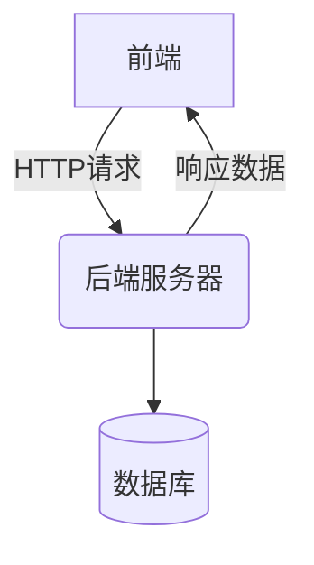
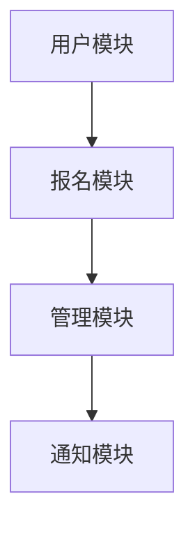
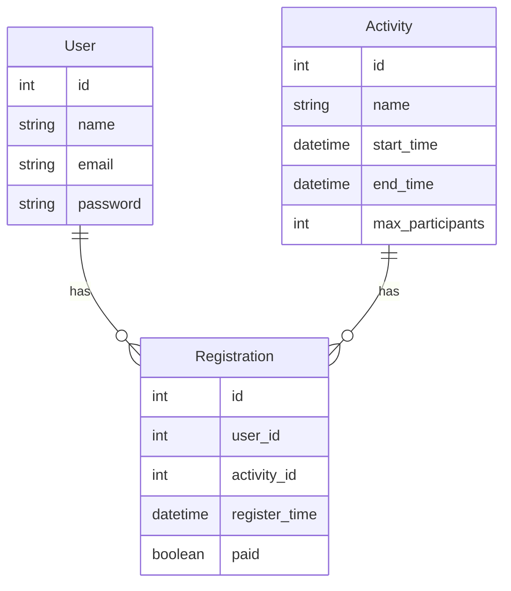
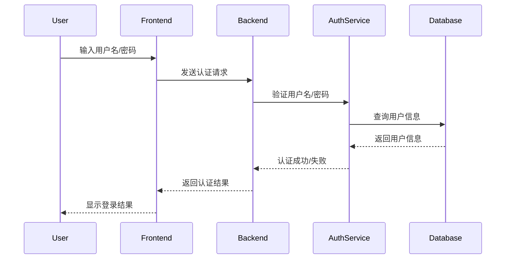
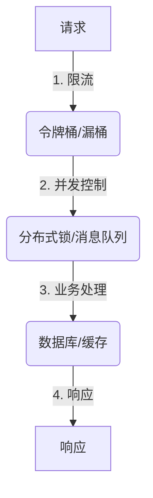
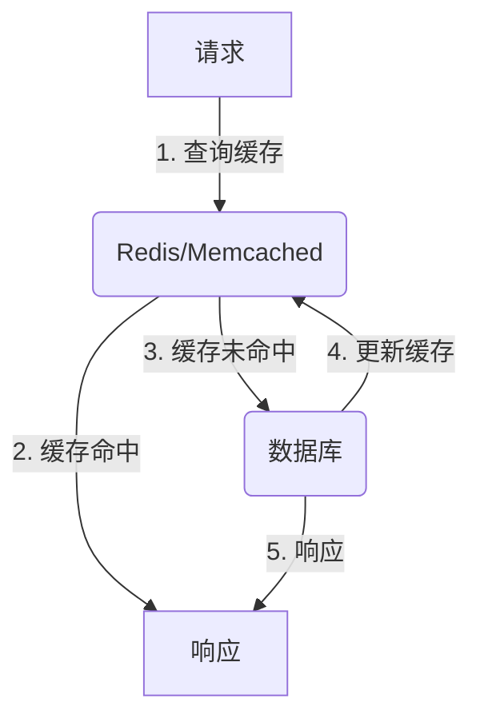
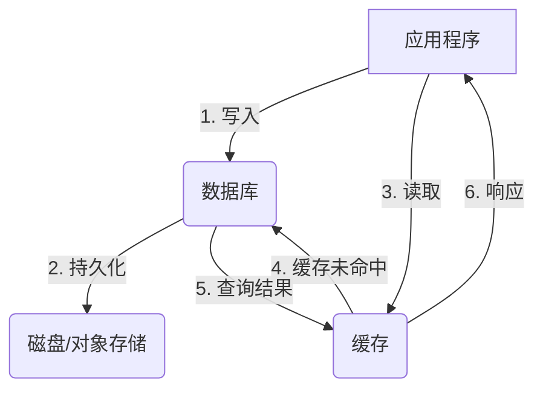

# 网上报名系统详细设计与具体代码实现

## 1. 背景介绍

随着互联网的快速发展和普及,网上报名系统已经成为各种活动、考试、培训等场景中不可或缺的重要组成部分。网上报名系统能够极大地提高报名效率,降低人力成本,并为参与者提供更加便捷的体验。然而,设计和实现一个高效、安全、可扩展的网上报名系统并非一件易事,需要充分考虑各种功能需求、性能要求、安全风险等因素。

### 1.1 网上报名系统的作用

网上报名系统的主要作用包括:

1. **提高报名效率**:与传统的现场报名相比,网上报名系统可以大大减少人力和时间成本,参与者无需亲自到场,只需在线填写相关信息即可完成报名。
2. **方便信息管理**:网上报名系统能够自动收集和存储报名信息,方便活动组织者进行信息统计和管理。
3. **提升用户体验**:网上报名系统通常界面友好,操作简单,参与者可以在任何时间、任何地点完成报名,体验更加便捷。
4. **降低运营成本**:与现场报名相比,网上报名系统可以节省大量的人力、场地等运营成本。

### 1.2 网上报名系统的挑战

尽管网上报名系统带来了诸多便利,但在设计和实现过程中也面临着一些挑战:

1. **高并发处理**:在报名高峰期,系统需要能够承受大量并发请求,保证系统的稳定性和响应速度。
2. **数据安全性**:系统需要保护参与者的个人隐私信息,防止数据泄露或被恶意篡改。
3. **功能完备性**:系统需要提供完备的功能,如报名信息管理、支付功能、短信/邮件通知等,以满足不同场景的需求。
4. **可扩展性**:系统需要具备良好的可扩展性,以适应未来业务发展和用户增长的需求。

## 2. 核心概念与联系

在深入探讨网上报名系统的设计和实现之前,我们需要先了解一些核心概念及它们之间的关系。

### 2.1 系统架构

网上报名系统通常采用前后端分离的架构模式,前端负责展示界面和用户交互,后端负责处理业务逻辑和数据存储。两者通过 RESTful API 或其他协议进行通信。

### 2.2 功能模块

一个典型的网上报名系统通常包括以下几个核心功能模块:

1. **用户模块**:提供用户注册、登录、个人信息管理等功能。
2. **报名模块**:提供活动/考试信息展示、在线报名、支付等功能。
3. **管理模块**:提供活动/考试管理、报名信息查询、统计分析等功能,供组织者使用。
4. **通知模块**:提供短信/邮件通知功能,向参与者发送报名成功、考试安排等信息。

这些模块相互协作,共同构成了完整的网上报名系统。

### 2.3 数据模型

网上报名系统需要存储各种数据,如用户信息、活动/考试信息、报名记录等。这些数据通常采用关系型数据库或NoSQL数据库进行存储和管理。下面是一个简化的数据模型示例:

## 3. 核心算法原理具体操作步骤

在实现网上报名系统的过程中,我们需要考虑一些核心算法和原理,以确保系统的高效性、安全性和可扩展性。

### 3.1 用户认证与授权

用户认证和授权是网上报名系统的基础,需要确保只有合法的用户才能访问相应的功能和数据。常见的认证方式包括用户名/密码登录、第三方OAuth认证等。

在用户登录成功后,系统会生成一个唯一的会话令牌(session token)或访问令牌(access token),用于后续的请求认证和授权。这些令牌通常采用JWT(JSON Web Token)或其他安全的方式进行签名和加密,以防止被篡改或伪造。

### 3.2 并发控制与限流

在报名高峰期,网上报名系统可能需要承受大量并发请求,因此需要采取适当的并发控制和限流措施,以确保系统的稳定性和响应速度。

常见的并发控制策略包括:

1. **数据库层面**:使用适当的锁机制(如行级锁、表级锁)来控制并发访问。
2. **应用层面**:使用分布式锁(如Redis分布式锁、Zookeeper分布式锁)来控制并发访问。
3. **消息队列**:将并发请求先存入消息队列,由消费者按照一定策略进行处理,实现请求的有序执行。

限流策略通常包括:

1. **漏桶算法**:固定的入桶速率,出桶速率无限制。
2. **令牌桶算法**:固定的出桶速率,入桶速率无限制。
3. **滑动窗口计数器**:在一个滑动窗口内,计数器记录请求数,超过阈值则拒绝请求。

### 3.3 数据缓存

为了提高系统的响应速度和减轻数据库压力,网上报名系统通常需要采用缓存技术,将一些热点数据缓存在内存中,以加快访问速度。常见的缓存方案包括:

1. **Redis缓存**:使用Redis内存数据库作为缓存,支持多种数据结构,读写性能卓越。
2. **Memcached缓存**:使用Memcached作为分布式内存缓存,支持简单的键值对缓存。
3. **应用级缓存**:在应用程序内部实现缓存逻辑,如使用Guava Cache等库。

无论采用何种缓存方案,都需要注意缓存的过期、更新、一致性等问题,通常可以采用缓存预热、缓存雪崩解决方案等策略来优化缓存性能和可靠性。

### 3.4 数据持久化

网上报名系统需要将用户信息、报名记录等数据持久化存储,以便后续查询和统计。常见的数据持久化方案包括:

1. **关系型数据库**:如MySQL、PostgreSQL等,适用于结构化数据存储,支持事务和约束。
2. **NoSQL数据库**:如MongoDB、Cassandra等,适用于非结构化或半结构化数据存储,具有高可扩展性和高性能。
3. **对象存储**:如Amazon S3、阿里云OSS等,适用于存储大文件、静态资源等。

在选择数据存储方案时,需要考虑数据量、访问模式、一致性要求等因素,并采取适当的分库分表、读写分离、主从复制等策略,以提高系统的扩展性和可用性。

## 4. 数学模型和公式详细讲解举例说明

在网上报名系统的设计和优化过程中,我们可能需要借助一些数学模型和公式来量化和分析系统的性能指标,从而指导系统的优化和调整。

### 4.1 小型驻留批量抽样

在统计报名数据时,我们可能需要对报名记录进行抽样分析。小型驻留批量抽样(Small Batch Reservoir Sampling)是一种高效的抽样算法,可以在有限的内存空间中从大量数据流中随机抽取一个固定大小的样本。

算法原理:

1. 初始化一个大小为k的reservoir(样本集合)。
2. 对于第i个元素,以k/i的概率将其加入reservoir。
3. 如果加入,则以等概率随机替换reservoir中的一个元素。
4. 重复步骤2和3,直到处理完所有元素。

该算法的优点是只需要固定大小的内存空间,且每个元素被选中的概率相等。

### 4.2 令牌桶限流算法

在处理高并发请求时,我们可以使用令牌桶算法进行限流控制,以保护系统不被过载。

令牌桶算法的原理如下:

1. 系统有一个存放令牌的桶,桶的容量固定为$C$。
2. 每隔一个固定时间$t$,系统就会向桶中放入一个令牌,直到桶满为止。
3. 每当有一个请求到来时,需要先从桶中取出一个令牌,才能被处理。
4. 如果桶中没有令牌,请求将被阻塞或拒绝。

令牌桶算法的优点是能够平滑突发流量,避免服务器被瞬时洪峰流量压垮。令牌桶的入桶速率可以用以下公式表示:

$$
rate = \frac{C}{t}
$$

其中$rate$表示令牌的入桶速率(tokens/秒),$C$表示桶的容量(tokens),$t$表示令牌放入的时间间隔(秒)。

通过调整$C$和$t$的值,我们可以控制系统的最大吞吐量和突发能力。

### 4.3 一致性哈希分布式缓存

在分布式缓存场景中,我们需要一种高效的数据分布策略,以实现负载均衡和故障转移。一致性哈希算法是一种常见的分布式缓存分布策略。

一致性哈希算法的核心思想是将缓存节点和数据键值通过哈希函数映射到同一个环形空间,然后根据顺时针方向将数据键值映射到第一个缓存节点上。

具体步骤如下:

1. 使用哈希函数(如MD5)将缓存节点的IP地址或名称映射到环形空间上。
2. 对于每个数据键值,也使用相同的哈希函数将其映射到环形空间上。
3. 顺时针找到离该键值最近的缓存节点,将该键值存储在该节点上。

一致性哈希算法的优点是在节点发生变化时,只有部分数据需要重新映射,从而减少了数据迁移的开销。

该算法的一个重要优化是虚拟节点(Virtual Node),即为每个实际节点创建多个虚拟节点,从而提高数据分布的均匀性。虚拟节点数量$n$和实际节点数量$N$的关系可以用以下公式表示:

$$
n = \f