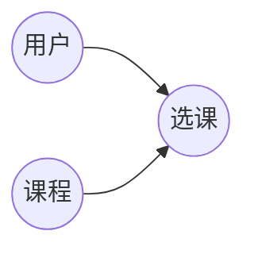

## 1. 背景介绍

### 1.1 教育信息化的必然趋势

随着互联网技术的飞速发展和普及，教育领域也迎来了信息化浪潮。传统的教学模式正在逐渐被打破，在线教育、远程教育等新型教育模式蓬勃发展。网上选课系统作为教育信息化的重要组成部分，为学生提供了更加便捷、高效的选课方式，同时也为学校教务管理带来了极大的便利。

### 1.2 网上选课系统的优势

相比传统的线下选课方式，网上选课系统具有以下优势：

* **方便快捷:** 学生可以随时随地通过网络进行选课操作，无需排队等候。
* **信息透明:** 学生可以清晰地了解课程信息、选课人数、剩余名额等，避免信息不对称。
* **提高效率:** 网上选课系统可以自动处理选课流程，减轻教务人员的工作负担。
* **数据统计分析:** 系统可以自动收集和分析选课数据，为学校教学管理提供决策依据。

### 1.3 系统设计目标

本系统旨在设计和实现一个功能完善、安全可靠、易于维护的网上选课系统，满足学生选课和学校教务管理的需求。

## 2. 核心概念与联系

### 2.1 用户角色

系统涉及的用户角色主要包括：

* **学生:**  进行课程查询、选课、退课等操作。
* **教师:**  发布课程信息、查看选课学生名单等。
* **管理员:**  管理系统用户、课程、权限等。

### 2.2 核心实体

系统中涉及的核心实体包括：

* **用户:**  包括学生、教师、管理员等。
* **课程:**  包含课程名称、课程代码、授课教师、上课时间、学分等信息。
* **选课:**  记录学生所选课程的信息。

### 2.3 实体关系图



## 3. 核心算法原理具体操作步骤

### 3.1 用户登录

1. 用户输入用户名和密码。
2. 系统验证用户名和密码是否正确。
3. 验证通过后，根据用户角色跳转到相应的页面。

### 3.2 课程查询

1. 学生输入关键词进行课程搜索。
2. 系统根据关键词匹配课程信息。
3. 展示匹配的课程列表，包括课程名称、授课教师、上课时间、学分等信息。

### 3.3 选课操作

1. 学生选择要选的课程。
2. 系统检查课程是否已满员或与已选课程时间冲突。
3. 检查通过后，将学生加入到课程的选课名单中。

### 3.4 退课操作

1. 学生选择要退的课程。
2. 系统将学生从课程的选课名单中移除。

## 4. 数学模型和公式详细讲解举例说明

本系统不涉及复杂的数学模型和公式。

## 5. 项目实践：代码实例和详细解释说明

### 5.1 技术选型

* **后端:**  Python + Django
* **前端:**  HTML + CSS + JavaScript
* **数据库:**  MySQL

### 5.2 数据库设计

```sql
-- 用户表
CREATE TABLE user (
    id INT PRIMARY KEY AUTO_INCREMENT,
    username VARCHAR(255) UNIQUE NOT NULL,
    password VARCHAR(255) NOT NULL,
    role ENUM('student', 'teacher', 'admin') NOT NULL
);

-- 课程表
CREATE TABLE course (
    id INT PRIMARY KEY AUTO_INCREMENT,
    name VARCHAR(255) NOT NULL,
    code VARCHAR(255) UNIQUE NOT NULL,
    teacher_id INT NOT NULL,
    time VARCHAR(255) NOT NULL,
    credit INT NOT NULL,
    FOREIGN KEY (teacher_id) REFERENCES user(id)
);

-- 选课表
CREATE TABLE enrollment (
    id INT PRIMARY KEY AUTO_INCREMENT,
    student_id INT NOT NULL,
    course_id INT NOT NULL,
    FOREIGN KEY (student_id) REFERENCES user(id),
    FOREIGN KEY (course_id) REFERENCES course(id)
);
```

### 5.3 代码实现

**views.py:**

```python
from django.shortcuts import render, redirect
from django.contrib.auth.decorators import login_required
from .models import User, Course, Enrollment

# 用户登录
def login(request):
    if request.method == 'POST':
        username = request.POST['username']
        password = request.POST['password']
        user = User.objects.filter(username=username, password=password).first()
        if user:
            request.session['user_id'] = user.id
            return redirect('index')
        else:
            return render(request, 'login.html', {'error': '用户名或密码错误'})
    else:
        return render(request, 'login.html')

# 首页
@login_required
def index(request):
    user = User.objects.get(id=request.session['user_id'])
    if user.role == 'student':
        return render(request, 'student_index.html')
    elif user.role == 'teacher':
        return render(request, 'teacher_index.html')
    else:
        return render(request, 'admin_index.html')

# 课程查询
@login_required
def search_course(request):
    keyword = request.GET.get('keyword', '')
    courses = Course.objects.filter(name__icontains=keyword)
    return render(request, 'search_course.html', {'courses': courses})

# 选课操作
@login_required
def enroll_course(request, course_id):
    user = User.objects.get(id=request.session['user_id'])
    course = Course.objects.get(id=course_id)
    # 检查课程是否已满员
    if course.enrollment_set.count() >= 100:
        return render(request, 'error.html', {'error': '课程已满员'})
    # 检查时间冲突
    for enrollment in user.enrollment_set.all():
        if enrollment.course.time == course.time:
            return render(request, 'error.html', {'error': '与已选课程时间冲突'})
    # 选课操作
    Enrollment.objects.create(student=user, course=course)
    return redirect('index')

# 退课操作
@login_required
def drop_course(request, course_id):
    user = User.objects.get(id=request.session['user_id'])
    course = Course.objects.get(id=course_id)
    enrollment = Enrollment.objects.filter(student=user, course=course).first()
    if enrollment:
        enrollment.delete()
    return redirect('index')
```

## 6. 实际应用场景

网上选课系统广泛应用于各大高校、职业院校、培训机构等教育机构，为学生提供便捷的选课服务，同时也为学校教务管理带来了极大的便利。

## 7. 工具和资源推荐

* **Django:**  Python Web框架
* **MySQL:**  关系型数据库
* **Bootstrap:**  前端框架
* **Visual Studio Code:**  代码编辑器

## 8. 总结：未来发展趋势与挑战

### 8.1 未来发展趋势

* **个性化推荐:**  利用大数据和人工智能技术，为学生推荐更符合其兴趣和学习目标的课程。
* **移动化学习:**  开发移动端选课系统，方便学生随时随地进行选课操作。
* **虚拟现实技术:**  利用虚拟现实技术，模拟真实的课堂环境，提升学生的学习体验。

### 8.2 面临的挑战

* **数据安全:**  保护学生和课程信息的安全，防止数据泄露。
* **系统稳定性:**  确保系统稳定运行，避免因系统故障导致选课失败。
* **用户体验:**  不断优化系统界面和功能，提升用户体验。

## 9. 附录：常见问题与解答

### 9.1 如何修改密码？

登录系统后，点击个人信息页面，即可修改密码。

### 9.2 如何查看已选课程？

登录系统后，在个人信息页面可以查看已选课程列表。

### 9.3 如何联系管理员？

在系统首页可以找到管理员的联系方式。 
