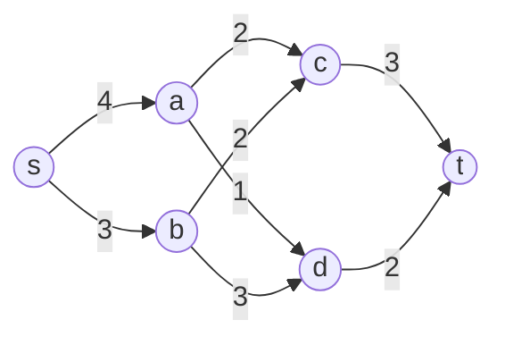
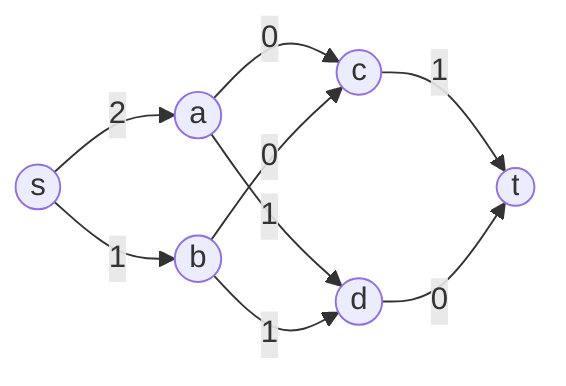

## 1. 背景介绍

### 1.1 流网络的起源与发展
网络流理论起源于 20 世纪 50 年代，最初是为了解决交通运输和物流管理中的实际问题而发展起来的。随着计算机科学的兴起，网络流理论逐渐应用于更广泛的领域，如通信网络、社交网络、生物信息学等。

### 1.2 网络流的应用领域
网络流问题在现实世界中有着广泛的应用，例如：

* **交通运输:**  优化交通流量，提高道路利用率，减少拥堵。
* **物流管理:**  设计高效的货物配送方案，降低运输成本。
* **通信网络:**  优化网络带宽分配，提高数据传输效率。
* **社交网络:**  分析社交网络中的信息传播模式，识别关键节点。
* **生物信息学:**  研究基因调控网络，预测基因功能。

### 1.3 网络流问题的基本概念
网络流问题涉及以下基本概念：

* **网络:** 由节点和边组成的图结构，边表示节点之间的连接关系。
* **容量:** 每条边都有一个容量，表示该边能够承载的最大流量。
* **流量:**  指网络中每条边上的实际流量，流量不能超过边的容量。
* **源点:**  网络中唯一的流量起点。
* **汇点:**  网络中唯一的流量终点。
* **最大流:**  指从源点到汇点的最大可能流量。
* **最小割:**  指将网络分成包含源点和汇点的两个子集，使得连接这两个子集的边的容量总和最小。

## 2. 核心概念与联系

### 2.1 流网络的数学定义
一个流网络 $G = (V, E, c, s, t)$ 由以下元素组成:

* $V$: 节点集合。
* $E$: 边集合。
* $c: E \rightarrow \mathbb{R^+}$: 容量函数，将每条边映射到其容量。
* $s \in V$: 源点。
* $t \in V$: 汇点。

### 2.2 流的概念与性质
一个流 $f: E \rightarrow \mathbb{R^+}$ 满足以下性质:

* **容量限制:** 对于每条边 $(u, v) \in E$，$0 \leq f(u, v) \leq c(u, v)$。
* **流量守恒:** 对于除源点和汇点以外的每个节点 $u \in V - \{s, t\}$，流入该节点的流量等于流出该节点的流量，即 $\sum_{v:(v,u) \in E} f(v, u) = \sum_{v:(u,v) \in E} f(u, v)$。

### 2.3 最大流与最小割的关系
最大流最小割定理指出，在一个流网络中，最大流的值等于最小割的容量。

### 2.4 增广路径
增广路径是指从源点到汇点的一条路径，该路径上所有边的剩余容量都大于 0。通过不断寻找增广路径并增加其流量，可以逐步逼近最大流。

## 3. 核心算法原理具体操作步骤

### 3.1 Ford-Fulkerson 算法

Ford-Fulkerson 算法是一种经典的最大流算法，其基本思想是：

1. 初始化所有边的流量为 0。
2. 重复以下步骤，直到找不到增广路径:
    * 寻找一条从源点到汇点的增广路径。
    * 沿着增广路径增加流量，增加的流量值为路径上所有边的最小剩余容量。

### 3.2 Edmonds-Karp 算法

Edmonds-Karp 算法是 Ford-Fulkerson 算法的一种改进版本，它使用广度优先搜索 (BFS) 寻找增广路径，保证了算法的效率。

### 3.3 Dinic 算法

Dinic 算法是一种更高效的最大流算法，它通过构建层次网络来加速寻找增广路径的过程。

## 4. 数学模型和公式详细讲解举例说明

### 4.1 线性规划模型

最大流问题可以用线性规划模型来描述：

$$
\begin{aligned}
\text{maximize} \quad & \sum_{v:(s,v) \in E} f(s, v) \\
\text{subject to} \quad & 0 \leq f(u, v) \leq c(u, v) \quad \forall (u, v) \in E \\
& \sum_{v:(v,u) \in E} f(v, u) = \sum_{v:(u,v) \in E} f(u, v) \quad \forall u \in V - \{s, t\}
\end{aligned}
$$

### 4.2 例题

考虑一个流网络，如下图所示:



其中，边的数字表示容量。

我们可以使用 Ford-Fulkerson 算法来求解该网络的最大流:

1. 初始化所有边的流量为 0。
2. 找到一条增广路径 s -> a -> c -> t，路径上所有边的最小剩余容量为 2。
3. 沿着增广路径增加流量 2，得到新的流量分布:


4. 找到一条增广路径 s -> b -> d -> t，路径上所有边的最小剩余容量为 2。
5. 沿着增广路径增加流量 2，得到新的流量分布:



6. 找不到增广路径，算法结束。

最终得到的最大流值为 4。

## 5. 项目实践：代码实例和详细解释说明

### 5.1 Python 实现 Edmonds-Karp 算法

```python
from collections import defaultdict

def edmonds_karp(graph, source, sink):
    """
    Edmonds-Karp 算法求解最大流。

    Args:
        graph: 图的邻接表表示，例如：
            graph = {
                's': {'a': 4, 'b': 3},
                'a': {'c': 2, 'd': 1},
                'b': {'c': 2, 'd': 3},
                'c': {'t': 3},
                'd': {'t': 2},
                't': {},
            }
        source: 源点。
        sink: 汇点。

    Returns:
        最大流值。
    """
    # 初始化所有边的流量为 0。
    flow = defaultdict(lambda: defaultdict(int))

    # 不断寻找增广路径，直到找不到为止。
    while True:
        # 使用 BFS 寻找增广路径。
        parent = bfs(graph, flow, source, sink)
        if parent is None:
            break

        # 沿着增广路径增加流量。
        path_flow = float('inf')
        v = sink
        while v != source:
            u = parent[v]
            path_flow = min(path_flow, graph[u][v] - flow[u][v])
            v = u
        v = sink
        while v != source:
            u = parent[v]
            flow[u][v] += path_flow
            flow[v][u] -= path_flow
            v = u

    # 计算最大流值。
    max_flow = 0
    for v in graph[source]:
        max_flow += flow[source][v]
    return max_flow

def bfs(graph, flow, source, sink):
    """
    使用 BFS 寻找增广路径。

    Args:
        graph: 图的邻接表表示。
        flow: 当前流量分布。
        source: 源点。
        sink: 汇点。

    Returns:
        增广路径的父节点字典，如果找不到增广路径则返回 None。
    """
    queue = [source]
    visited = {source}
    parent = {source: None}
    while queue:
        u = queue.pop(0)
        for v in graph[u]:
            # 如果边 (u, v) 存在剩余容量，且节点 v 未被访问过。
            if graph[u][v] - flow[u][v] > 0 and v not in visited:
                visited.add(v)
                parent[v] = u
                queue.append(v)
                if v == sink:
                    return parent
    return None
```

### 5.2 代码解释

* `edmonds_karp(graph, source, sink)` 函数实现了 Edmonds-Karp 算法，它接受图的邻接表表示、源点和汇点作为输入，返回最大流值。
* `bfs(graph, flow, source, sink)` 函数使用 BFS 寻找增广路径，它接受图的邻接表表示、当前流量分布、源点和汇点作为输入，返回增广路径的父节点字典，如果找不到增广路径则返回 None。
* 在 `edmonds_karp()` 函数中，首先初始化所有边的流量为 0。然后，不断调用 `bfs()` 函数寻找增广路径，直到找不到为止。如果找到增广路径，则沿着增广路径增加流量，增加的流量值为路径上所有边的最小剩余容量。最后，计算最大流值并返回。

## 6. 实际应用场景

### 6.1 图像分割

最大流最小割算法可以用于图像分割。将图像表示为一个网络，其中像素对应节点，像素之间的相似性对应边的权重。通过求解网络的最小割，可以将图像分割成不同的区域。

### 6.2 社交网络分析

最大流算法可以用于分析社交网络中的信息传播模式。将社交网络表示为一个网络，其中用户对应节点，用户之间的关系对应边的权重。通过计算网络的最大流，可以识别出社交网络中的关键节点，例如意见领袖。

### 6.3 生物信息学

最大流算法可以用于研究基因调控网络。将基因调控网络表示为一个网络，其中基因对应节点，基因之间的调控关系对应边的权重。通过计算网络的最大流，可以预测基因的功能。

## 7. 工具和资源推荐

### 7.1 NetworkX

NetworkX 是一个 Python 库，用于创建、操作和研究复杂网络的结构、动态和功能。

### 7.2 LEMON

LEMON (Library for Efficient Modeling and Optimization in Networks) 是一个 C++ 库，提供高效的网络流算法实现。

### 7.3 CPLEX

CPLEX 是一个商业优化软件包，提供强大的线性规划和混合整数规划求解器。

## 8. 总结：未来发展趋势与挑战

### 8.1 动态网络流

传统的网络流问题假设网络结构是静态的。然而，在现实世界中，网络结构 often 随着时间而变化。动态网络流问题研究在网络结构随时间变化的情况下如何求解最大流。

### 8.2 分布式网络流

随着大数据时代的到来，网络规模越来越大。分布式网络流问题研究如何在分布式环境下高效地求解最大流。

### 8.3 网络流与机器学习

网络流算法可以与机器学习方法相结合，用于解决更复杂的现实问题，例如推荐系统、欺诈检测等。

## 9. 附录：常见问题与解答

### 9.1 最大流最小割定理的证明

最大流最小割定理的证明可以使用反证法。

**假设:** 最大流的值不等于最小割的容量。

**推论:** 存在一个割，其容量小于最大流的值。

**矛盾:**  由于割的容量小于最大流的值，因此存在一条从源点到汇点的路径，该路径上所有边的容量都大于 0。这意味着我们可以沿着该路径增加流量，从而得到更大的流量值，这与最大流的定义相矛盾。

因此，最大流的值必须等于最小割的容量。

### 9.2 如何选择合适的最大流算法

选择合适的最大流算法取决于网络的规模和结构。

* 对于小型网络，Ford-Fulkerson 算法和 Edmonds-Karp 算法都是不错的选择。
* 对于大型网络，Dinic 算法通常更有效。
* 如果网络具有特定的结构，例如平面图，则可能存在更 specialized 的算法。

### 9.3 如何将实际问题转化为网络流问题

将实际问题转化为网络流问题需要以下步骤:

1. 识别问题中的节点和边。
2. 定义边的容量。
3. 确定源点和汇点。
4. 选择合适的最大流算法求解问题。