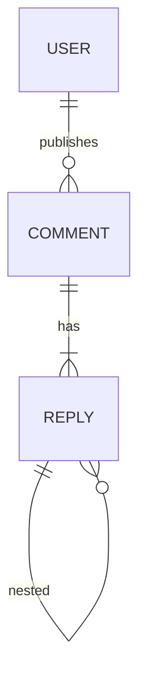

# 网络留言本系统详细设计与具体代码实现

## 1. 背景介绍

### 1.1 网络留言本系统概述

网络留言本系统是一种基于Web的应用程序,旨在为网站访问者提供互动交流的平台。它允许用户在网站上发布留言或评论,并与其他用户进行回复和讨论。这种系统在各种网站中广泛使用,如论坛、博客、新闻门户等。

网络留言本系统不仅提供了一种与网站访问者进行双向交流的方式,还能够促进社区建设、提高用户粘性、收集用户反馈等。因此,开发一个功能完善、性能良好的留言本系统对于现代Web应用程序至关重要。

### 1.2 系统需求分析

在设计和实现网络留言本系统之前,我们需要明确系统的功能需求和非功能需求。

功能需求包括:

1. 用户注册和登录
2. 发布新留言
3. 回复和引用其他留言
4. 支持多级嵌套回复
5. 留言排序(按时间、热度等)
6. 留言搜索
7. 留言审核和管理

非功能需求包括:

1. 系统性能和可扩展性
2. 安全性(防止垃圾留言、攻击等)
3. 易用性(友好的用户界面)
4. 跨平台和设备兼容性

## 2. 核心概念与联系

### 2.1 系统架构

网络留言本系统通常采用经典的三层架构,包括表示层(前端)、业务逻辑层(后端)和数据访问层。

1. **表示层**: 负责与用户交互,展示留言内容,接收用户输入等。通常使用HTML、CSS、JavaScript等Web技术实现。
2. **业务逻辑层**: 处理留言的增、删、改、查等核心功能,实现业务规则和流程控制。常用语言有Java、Python、Node.js等。
3. **数据访问层**: 负责与数据库进行交互,存储和检索留言数据。常用数据库有MySQL、PostgreSQL、MongoDB等。

### 2.2 关键概念

1. **留言(Comment)**: 系统的核心实体,包括留言内容、作者、发布时间等属性。
2. **回复(Reply)**: 对留言的评论或回应,形成多级嵌套结构。
3. **用户(User)**: 发布留言和回复的主体,需要注册和登录。
4. **权限控制**: 不同用户对留言的操作权限不同,如管理员可审核、删除留言。
5. **敏感词过滤**: 防止发布含有不当内容的留言。
6. **评分/点赞**: 反映留言的热度和质量,影响排序和展示。

### 2.3 关系模型

留言、回复、用户之间存在以下关系:

1. 一对多关系:
   - 一个用户可以发布多条留言
   - 一条留言可以有多条回复
2. 自关联:
   - 一条回复可以对应另一条回复(嵌套回复)

我们可以使用实体关系图(ERD)来直观地表示这些概念及其关系。



## 3. 核心算法原理具体操作步骤

### 3.1 留言发布算法

1. 客户端:
   - 获取用户输入的留言内容
   - 进行基本的格式检查和敏感词过滤
   - 通过AJAX或WebSocket将留言数据发送到服务器

2. 服务器端:
   - 接收客户端发送的留言数据
   - 进行进一步的数据验证和安全检查
   - 将留言数据持久化到数据库中
   - 返回操作结果给客户端

3. 客户端:
   - 接收服务器返回的结果
   - 如果成功,则在页面上实时渲染新的留言

### 3.2 留言回复算法

1. 客户端:
   - 获取用户输入的回复内容和所回复的目标留言ID
   - 进行基本的格式检查和敏感词过滤
   - 通过AJAX或WebSocket将回复数据发送到服务器

2. 服务器端:
   - 接收客户端发送的回复数据
   - 进行数据验证和安全检查
   - 根据目标留言ID,将回复数据持久化到数据库中,建立关联关系
   - 返回操作结果给客户端

3. 客户端:
   - 接收服务器返回的结果
   - 如果成功,则在页面上实时渲染新的回复,并更新回复计数

### 3.3 留言排序算法

根据用户需求,留言可以按照不同的策略进行排序,例如:

1. **时间排序**: 按照留言发布时间的先后顺序排列,可以是升序或降序。

2. **热度排序**: 根据留言的回复数量、点赞数等指标,计算出一个综合热度分数,按照热度分数的高低进行排序。

3. **自定义排序**: 根据特定的业务规则,对留言进行个性化的排序,例如根据用户等级、付费状态等因素排序。

无论采用何种排序策略,服务器端都需要从数据库中查询符合条件的留言数据,然后在内存中进行排序处理,最后将排序结果返回给客户端进行展示。

### 3.4 留言搜索算法

留言搜索功能允许用户根据关键字查找相关的留言内容。搜索算法的基本步骤如下:

1. 客户端:
   - 获取用户输入的搜索关键字
   - 通过AJAX或WebSocket将搜索请求发送到服务器

2. 服务器端:
   - 接收客户端发送的搜索请求
   - 根据搜索关键字构建查询条件
   - 从数据库中查询匹配的留言数据
   - 对查询结果进行排序或分页处理
   - 将处理后的结果返回给客户端

3. 客户端:
   - 接收服务器返回的搜索结果
   - 在页面上渲染搜索结果列表

在实现搜索功能时,可以考虑使用全文搜索引擎(如Elasticsearch)来提高搜索效率和准确性。另外,还可以支持模糊搜索、高亮显示关键字等增强功能。

## 4. 数学模型和公式详细讲解举例说明

### 4.1 留言热度计算模型

为了实现留言的热度排序,我们需要构建一个合理的热度计算模型。一种常见的做法是将多个影响因素(如回复数、点赞数、浏览量等)进行加权求和,得到一个综合热度分数。

设某条留言的热度分数为$H$,则:

$$H = w_1 \times R + w_2 \times L + w_3 \times V + \cdots$$

其中:
- $R$表示该留言的回复数量
- $L$表示该留言的点赞数量
- $V$表示该留言的浏览量
- $w_1, w_2, w_3, \cdots$分别为各个影响因素的权重系数,且$\sum w_i = 1$

权重系数的设置需要根据具体的业务场景和用户行为习惯进行调整和优化。例如,在一些社区中,回复数量可能比点赞数量更能反映热度,因此可以适当提高$w_1$的值。

另外,我们还可以引入时间衰减因子,使得较新的留言在相同热度分数下能够排在较前位置:

$$H' = H \times e^{-\lambda(t-t_0)}$$

其中:
- $H'$为考虑时间因素后的热度分数
- $t$为当前时间
- $t_0$为留言发布时间
- $\lambda$为时间衰减系数,控制热度随时间的衰减速率

### 4.2 留言相似度计算

在实现留言搜索或相关留言推荐等功能时,我们可能需要计算两条留言之间的相似度。一种常见的方法是将留言内容表示为向量,然后计算两个向量之间的余弦相似度。

假设将每条留言表示为一个$n$维向量$\vec{c} = (c_1, c_2, \cdots, c_n)$,其中$c_i$表示第$i$个特征项(如单词或词组)的权重,那么两条留言$\vec{c_1}$和$\vec{c_2}$的余弦相似度可以表示为:

$$\text{sim}(\vec{c_1}, \vec{c_2}) = \frac{\vec{c_1} \cdot \vec{c_2}}{|\vec{c_1}| \times |\vec{c_2}|} = \frac{\sum_{i=1}^{n}c_{1i} \times c_{2i}}{\sqrt{\sum_{i=1}^{n}c_{1i}^2} \times \sqrt{\sum_{i=1}^{n}c_{2i}^2}}$$

相似度的取值范围为$[0, 1]$,值越大表示两条留言越相似。在实际应用中,我们可以设置一个相似度阈值,将高于该阈值的留言对视为相关留言。

除了余弦相似度,我们还可以使用其他相似度度量方法,如欧几里得距离、Jaccard相似系数等,具体选择哪种方法需要根据实际情况进行权衡。

## 5. 项目实践: 代码实例和详细解释说明

在这一部分,我们将提供一些核心功能的代码示例,并进行详细的解释说明。为了便于理解,我们假设使用Java语言、Spring框架和MySQL数据库进行开发。

### 5.1 数据模型

```java
// 用户实体
@Entity
public class User {
    @Id
    @GeneratedValue(strategy = GenerationType.IDENTITY)
    private Long id;
    private String username;
    private String password;
    // 其他属性...
}

// 留言实体
@Entity
public class Comment {
    @Id
    @GeneratedValue(strategy = GenerationType.IDENTITY)
    private Long id;
    private String content;
    @ManyToOne
    private User author;
    private LocalDateTime createTime;
    // 其他属性...
}

// 回复实体
@Entity
public class Reply {
    @Id
    @GeneratedValue(strategy = GenerationType.IDENTITY)
    private Long id;
    private String content;
    @ManyToOne
    private User author;
    @ManyToOne
    private Comment comment;
    @ManyToOne
    private Reply parent; // 嵌套回复
    private LocalDateTime createTime;
    // 其他属性...
}
```

上面的代码定义了三个核心实体类:`User`(用户)、`Comment`(留言)和`Reply`(回复)。它们之间通过`@ManyToOne`注解建立了对应的关联关系。

### 5.2 留言发布功能

```java
// 留言服务接口
public interface CommentService {
    Comment addComment(String content, User author);
    // 其他方法...
}

// 留言服务实现
@Service
public class CommentServiceImpl implements CommentService {
    @Autowired
    private CommentRepository commentRepo;

    @Override
    public Comment addComment(String content, User author) {
        // 进行数据验证和敏感词过滤
        content = filterSensitiveWords(content);

        Comment comment = new Comment();
        comment.setContent(content);
        comment.setAuthor(author);
        comment.setCreateTime(LocalDateTime.now());

        return commentRepo.save(comment);
    }

    // 其他方法实现...
}

// 留言控制器
@RestController
@RequestMapping("/comments")
public class CommentController {
    @Autowired
    private CommentService commentService;

    @PostMapping
    public ResponseEntity<Comment> addComment(@RequestBody CommentDTO commentDTO, 
                                              Authentication authentication) {
        User author = (User) authentication.getPrincipal();
        Comment comment = commentService.addComment(commentDTO.getContent(), author);
        return ResponseEntity.ok(comment);
    }

    // 其他方法...
}
```

上面的代码展示了留言发布功能的核心实现。

1. `CommentService`接口定义了`addComment`方法,用于创建新的留言。
2. `CommentServiceImpl`实现了该方法,首先对留言内容进行敏感词过滤,然后构建`Comment`对象并保存到数据库中。
3. `CommentController`提供了一个`POST`端点,接收客户端发送的留言数据,并调用`CommentService`的`addComment`方法进行处理。

在实际开发中,我们还需要添加更多的业务逻辑和安全检查,如验证用户身份、限制留言频率等。

### 5.3 留言回复功能

```java
// 回复服务接口
public interface ReplyService {
    Reply addReply(String content, User author, Comment comment, Reply parent);
    // 其他方法...
}

// 回复服务实现
@Service
public class ReplyServiceImpl implements Reply