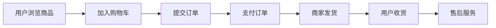

## 1. 背景介绍

### 1.1 电商行业的蓬勃发展

近年来，随着互联网技术的快速发展和普及，电子商务行业得到了蓬勃发展。网络购物作为一种新型的购物方式，以其便捷、高效、低成本等优势，逐渐成为人们生活中不可或缺的一部分。

### 1.2 网上商城系统的重要性

网上商城系统是电子商务的核心组成部分，它为用户提供了一个便捷的购物平台，同时也为商家提供了一个高效的销售渠道。一个设计良好的网上商城系统，能够有效提升用户购物体验，提高商家的运营效率和盈利能力。

### 1.3 本文的目的和意义

本文旨在介绍网络购物/网上商城系统的详细设计方案和具体代码实现，帮助读者了解网上商城系统的架构、功能模块、技术实现以及实际应用，为读者构建自己的网上商城系统提供参考和借鉴。

## 2. 核心概念与联系

### 2.1 网上商城系统的基本概念

* **用户**: 使用网上商城进行购物的个人或组织。
* **商品**: 在网上商城中展示和销售的物品。
* **订单**: 用户在网上商城中提交的购物请求。
* **支付**: 用户完成订单支付的过程。
* **物流**: 商品从商家仓库到用户手中的运输过程。
* **售后**: 用户在购物过程中遇到的问题和售后服务。

### 2.2 网上商城系统的功能模块

* **用户管理**: 用户注册、登录、个人信息管理、收货地址管理等。
* **商品管理**: 商品分类、商品信息管理、商品上下架、库存管理等。
* **订单管理**: 订单生成、订单查询、订单修改、订单取消、订单支付等。
* **支付管理**: 集成各种支付方式，例如支付宝、微信支付等。
* **物流管理**: 集成物流配送系统，实现订单跟踪、物流信息查询等。
* **售后管理**: 处理用户咨询、投诉、退换货等售后问题。
* **系统管理**: 系统配置、数据统计、权限管理等。

### 2.3 网上商城系统的核心流程



## 3. 核心算法原理具体操作步骤

### 3.1 用户注册与登录

* **用户注册**: 用户填写注册信息，包括用户名、密码、邮箱、手机号等，系统验证用户信息的有效性，并将用户信息保存到数据库中。
* **用户登录**: 用户输入用户名和密码，系统验证用户信息的正确性，如果验证通过，则允许用户登录系统。

### 3.2 商品展示与搜索

* **商品展示**: 系统根据商品分类和排序规则，将商品信息展示给用户。
* **商品搜索**: 用户输入关键词，系统根据关键词搜索相关的商品信息，并将搜索结果展示给用户。

### 3.3 购物车与订单

* **加入购物车**: 用户选择商品后，可以将商品加入购物车，购物车中记录了用户选择的商品信息和数量。
* **提交订单**: 用户确认购物车中的商品信息后，可以提交订单，系统生成订单信息，包括订单号、商品信息、用户信息、支付信息等。

### 3.4 支付与物流

* **支付**: 用户选择支付方式，完成订单支付，系统将支付信息同步到商家账户。
* **物流**: 商家根据订单信息安排发货，物流公司将商品配送到用户手中，系统提供物流信息跟踪功能。

## 4. 数学模型和公式详细讲解举例说明

### 4.1 商品推荐算法

商品推荐算法是网上商城系统中常用的算法之一，它可以根据用户的历史行为、兴趣爱好等信息，向用户推荐感兴趣的商品。

**协同过滤算法**: 协同过滤算法是一种常用的推荐算法，它基于用户之间的相似性进行推荐。例如，如果用户A和用户B都购买了商品C，那么系统可以向用户A推荐用户B购买的其他商品。

**公式**:

$$
similarity(u,v) = \frac{\sum_{i=1}^{n} r_{ui}r_{vi}}{\sqrt{\sum_{i=1}^{n} r_{ui}^2}\sqrt{\sum_{i=1}^{n} r_{vi}^2}}
$$

其中，$u$ 和 $v$ 表示两个用户，$r_{ui}$ 表示用户 $u$ 对商品 $i$ 的评分，$n$ 表示商品总数。

**举例**:

假设用户A和用户B的评分数据如下:

| 商品 | 用户A | 用户B |
|---|---|---|
| 商品1 | 5 | 4 |
| 商品2 | 3 | 2 |
| 商品3 | 4 | 5 |

则用户A和用户B的相似度为:

$$
similarity(A,B) = \frac{5*4 + 3*2 + 4*5}{\sqrt{5^2 + 3^2 + 4^2}\sqrt{4^2 + 2^2 + 5^2}} = 0.89
$$

### 4.2 库存管理模型

库存管理模型用于管理商品的库存信息，包括商品的入库、出库、库存预警等。

**安全库存**: 安全库存是指为了防止缺货而设置的最低库存量。

**公式**:

$$
Safety Stock = (Maximum Daily Usage * Maximum Lead Time) - (Average Daily Usage * Average Lead Time)
$$

其中，Maximum Daily Usage 表示最大日使用量，Maximum Lead Time 表示最大订货周期，Average Daily Usage 表示平均日使用量，Average Lead Time 表示平均订货周期。

**举例**:

假设某商品的最大日使用量为100件，最大订货周期为7天，平均日使用量为50件，平均订货周期为3天，则安全库存为:

$$
Safety Stock = (100 * 7) - (50 * 3) = 550
$$

## 5. 项目实践：代码实例和详细解释说明

### 5.1 技术选型

* **编程语言**: Java
* **框架**: Spring Boot
* **数据库**: MySQL
* **前端框架**: Vue.js

### 5.2 代码实例

**用户注册接口**:

```java
@PostMapping("/register")
public ResponseEntity<String> register(@RequestBody User user) {
    // 验证用户信息
    if (StringUtils.isEmpty(user.getUsername()) || StringUtils.isEmpty(user.getPassword())) {
        return ResponseEntity.badRequest().body("用户名或密码不能为空");
    }
    // 保存用户信息到数据库
    userService.save(user);
    return ResponseEntity.ok("注册成功");
}
```

**商品展示接口**:

```java
@GetMapping("/products")
public ResponseEntity<List<Product>> getProducts(@RequestParam(required = false) String keyword) {
    // 查询商品信息
    List<Product> products = productService.getProducts(keyword);
    return ResponseEntity.ok(products);
}
```

## 6. 实际应用场景

### 6.1 B2C网上商城

B2C网上商城是指企业对消费者的电子商务模式，例如淘宝、京东等。

### 6.2 B2B网上商城

B2B网上商城是指企业对企业的电子商务模式，例如阿里巴巴、慧聪网等。

### 6.3 C2C网上商城

C2C网上商城是指消费者对消费者的电子商务模式，例如闲鱼、转转等。

## 7. 总结：未来发展趋势与挑战

### 7.1 未来发展趋势

* **个性化推荐**: 利用大数据和人工智能技术，为用户提供更加个性化的商品推荐服务。
* **移动化购物**: 随着移动互联网的普及，移动端购物将成为主流趋势。
* **社交化电商**: 将社交元素融入电商平台，增强用户粘性和互动性。

### 7.2 面临的挑战

* **数据安全**: 保护用户隐私和数据安全是电商平台的重要责任。
* **物流效率**: 提高物流效率，降低物流成本是电商平台的重要目标。
* **用户体验**: 不断提升用户体验，增强用户粘性是电商平台的持续追求。

## 8. 附录：常见问题与解答

### 8.1 如何选择合适的电商平台？

选择电商平台需要考虑以下因素:

* **平台规模**: 大型平台流量大，竞争激烈，适合知名品牌和成熟商家；小型平台流量小，竞争相对较小，适合新兴品牌和创业公司。
* **平台费用**: 不同平台的收费标准不同，需要根据自身情况选择合适的平台。
* **平台功能**: 不同平台提供的功能和服务不同，需要根据自身需求选择合适的平台。

### 8.2 如何提高网上商城的销量？

提高网上商城销量可以采取以下措施:

* **优化商品信息**: 完善商品信息，提高商品曝光率。
* **开展促销活动**: 定期开展促销活动，吸引用户购买。
* **提供优质服务**: 提供优质的售前、售中、售后服务，提升用户满意度。
* **加强品牌建设**: 建立良好的品牌形象，提升品牌知名度和美誉度。
