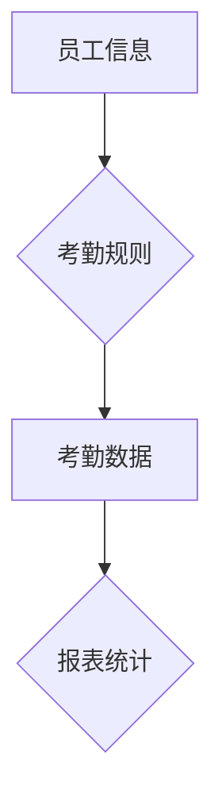

## 1. 背景介绍

### 1.1 考勤管理的必要性

随着企业规模的不断扩大和员工数量的增加，传统的考勤方式已经难以满足现代企业的需求。传统考勤方式存在着效率低下、易出错、统计困难等问题，严重影响了企业的管理效率。为了解决这些问题，考勤信息管理系统应运而生。考勤信息管理系统利用计算机技术，将员工的考勤信息进行数字化管理，可以有效提高考勤效率，减少出错率，为企业提供更科学、更准确的考勤数据。

### 1.2 考勤信息管理系统的优势

考勤信息管理系统具有以下优势：

*   **提高考勤效率:** 自动化考勤，无需人工干预，节省时间和人力成本。
*   **减少出错率:** 数字化管理，避免人为错误，提高数据准确性。
*   **方便统计分析:** 系统自动生成各种报表，方便企业进行数据分析和决策。
*   **提高员工满意度:** 透明化的考勤制度，减少员工疑虑，提高员工满意度。

### 1.3 考勤信息管理系统的应用场景

考勤信息管理系统广泛应用于各种类型的企业，例如：

*   **企事业单位:** 用于员工的日常考勤管理。
*   **学校:** 用于学生的考勤管理。
*   **医院:** 用于医护人员的考勤管理。
*   **工厂:** 用于工人的考勤管理。

## 2. 核心概念与联系

### 2.1 考勤信息管理系统的核心概念

考勤信息管理系统涉及以下核心概念:

*   **员工信息:** 包括员工的姓名、工号、部门、职位等基本信息。
*   **考勤规则:** 企业制定的考勤制度，例如上班时间、下班时间、加班规则等。
*   **考勤数据:** 员工的打卡记录、请假记录、加班记录等。
*   **报表统计:** 系统根据考勤数据自动生成的各种报表，例如考勤汇总表、异常考勤报表等。

### 2.2 核心概念之间的联系

员工信息是考勤信息管理系统的基础，考勤规则是考勤管理的依据，考勤数据是考勤管理的结果，报表统计是考勤管理的总结。这些核心概念相互联系，共同构成了考勤信息管理系统的完整体系。

### 2.3  Mermaid 流程图

## 3. 核心算法原理具体操作步骤

### 3.1 考勤打卡算法

考勤打卡算法是考勤信息管理系统的核心算法之一，用于记录员工的上下班时间。常用的考勤打卡算法包括：

*   **指纹识别:** 员工通过指纹识别设备进行打卡，系统记录打卡时间。
*   **人脸识别:** 员工通过人脸识别设备进行打卡，系统记录打卡时间。
*   **IC卡打卡:** 员工使用IC卡进行打卡，系统记录打卡时间。

### 3.2 考勤统计算法

考勤统计算法用于根据员工的考勤数据生成各种报表，例如：

*   **考勤汇总表:** 统计每个员工的出勤天数、迟到次数、早退次数、加班时间等。
*   **异常考勤报表:** 统计员工的