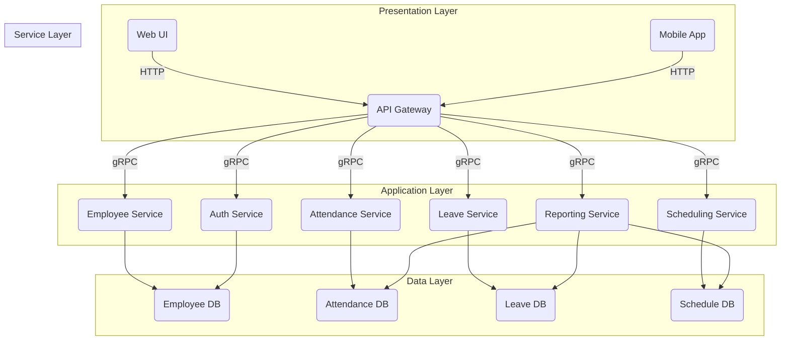

# 考勤管理系统详细设计与具体代码实现

## 1. 背景介绍

### 1.1 考勤管理系统的重要性

在任何组织中,员工是最宝贵的资源。有效的考勤管理不仅有助于确保员工薪酬的公平性,还能促进劳资双方的互信,提高工作效率。良好的考勤系统可以:

- 跟踪员工工作时间,确保薪酬准确
- 监控员工出勤情况,发现潜在问题
- 管理休假,确保工作持续性
- 提供关键数据,支持决策

因此,开发一个高效、安全的考勤管理系统对企业的人力资源管理至关重要。

### 1.2 现有系统的不足

尽管市面上存在许多考勤系统,但它们通常存在以下问题:

- 功能单一,无法满足复杂需求
- 用户体验差,操作繁琐
- 数据安全性和隐私保护不足
- 扩展性和可维护性较差
- 成本高昂,对中小企业不利

为了解决这些问题,我们将设计一个全新的考勤管理系统。

## 2. 核心概念与联系 

### 2.1 考勤管理的核心概念

考勤管理系统的核心概念包括:

- **员工 (Employee)**: 系统的使用对象,拥有唯一ID、姓名、部门、职位等属性。
- **考勤记录 (Attendance Record)**: 员工的上下班打卡记录,包括时间、地点等信息。
- **休假 (Leave)**: 员工请假的类型和时长,如病假、年假等。
- **排班 (Scheduling)**: 制定员工的工作时间表。
- **报表 (Report)**: 根据考勤记录生成各类统计报表,如出勤率、加班情况等。

### 2.2 系统的核心模块

为实现上述核心概念,系统需要包含以下模块:

- **员工管理模块**: 维护员工信息,权限控制。
- **考勤记录模块**: 记录员工上下班打卡数据。 
- **休假管理模块**: 处理员工休假申请和审批。
- **排班模块**: 根据工作制度生成员工时间表。
- **报表模块**: 统计分析考勤数据,生成报表。
- **系统管理模块**: 配置系统参数,管理用户。

### 2.3 关键技术

实现该系统需要综合运用以下关键技术:

- **面向对象设计**: 将系统划分为合理的对象模型。
- **数据库技术**: 存储和管理员工、考勤等结构化数据。
- **算法**: 实现排班优化、数据分析等功能。
- **安全技术**: 保护系统和数据的安全性和隐私。
- **Web/移动开发**: 构建友好的用户界面和体验。

## 3. 核心算法原理具体操作步骤

### 3.1 排班算法

合理的排班对于企业的高效运转至关重要。我们将采用约束编程(CP)算法来生成最优排班方案。

#### 3.1.1 问题建模

我们将排班问题建模为一个约束满足问题(CSP):

- 变量: 每个员工在每个时间段的工作状态(上班/休息)
- 约束: 
  - 员工工作时间满足法定要求(如每周工作时间上限)
  - 员工技能和工作岗位相匹配
  - 满足特殊排班需求(如值班制等)
- 目标函数: 最小化员工加班时间、最大化员工满意度等

#### 3.1.2 算法流程

1) 收集输入数据:员工信息、工作制度、岗位要求等
2) 构建CSP模型:确定变量、约束、目标函数
3) 预处理:应用规则简化搜索空间
4) 系统搜索:采用启发式算法(如冲突驱动型回溯算法)逐步构建解
5) 解空间剪枝:应用约束传播技术剪枝无效解
6) 输出最优解:获取满足所有约束且最优的排班方案

这种方法可以生成高质量、合理的排班方案。对于规模较大的问题,可采用并行化、大规模邻域搜索等技术优化性能。

### 3.2 数据分析算法

通过分析考勤数据,管理者可以洞察员工工作状况,并作出明智决策。我们将采用机器学习算法来挖掘有价值的模式。

#### 3.2.1 特征工程

首先需要从原始数据中提取有意义的特征,例如:

- 员工层面:出勤率、迟到次数、请假时长等
- 部门层面:加班情况、休假分布等 
- 时间层面:工作日/节假日的考勤模式等

#### 3.2.2 模型构建

然后基于这些特征,构建预测和描述模型:

- **分类模型**:如随机森林,用于预测员工流失风险
- **聚类模型**:如K-Means,发现异常考勤行为模式
- **回归模型**:如线性回归,分析影响生产率的关键因素

#### 3.2.3 模型评估和优化

在真实数据上评估模型性能,并进行特征选择、参数调优等优化。最后将模型部署到线上系统,为决策提供数据支持。

### 3.3 其他算法

除了上述两种核心算法外,系统中还可能使用到:

- **加密算法**:如RSA、AES,保护数据传输和存储的安全性。
- **图像处理算法**:如HOG特征,用于门禁系统的人脸识别。
- **推荐算法**:为员工推荐适合的福利、培训等资源。
- **规则引擎**:实现自定义的考勤和审批规则。

## 4. 数学模型和公式详细讲解举例说明

### 4.1 排班问题建模

我们使用整数线性规划(ILP)对排班问题进行数学建模:

假设有$N$名员工,时间周期$T$被划分为$M$个时间段。我们引入决策变量:

$$
x_{i,j} = 
\begin{cases}
1 & \text{员工 i 在时段 j 上班}\\
0 & \text{员工 i 在时段 j 休息}
\end{cases}
$$

目标函数为最小化加班时间:

$$
\min \sum_{i=1}^N \sum_{j=1}^M x_{i,j} - N \times 40 
$$

约束条件包括:

- 每个时段必须有足够的员工上班:

$$
\sum_{i=1}^N x_{i,j} \geq R_j, \forall j \in \{1,...,M\}
$$

其中$R_j$为时段$j$的员工需求。

- 每名员工的工作时间不超过法定上限:

$$
\sum_{j=1}^M x_{i,j} \leq 40 + \text{OT}\_\text{limit}_i, \forall i \in \{1,...,N\}
$$

其中$\text{OT}\_\text{limit}_i$为员工$i$的加班上限。

- 员工技能与岗位匹配:

$$
\sum_{i \in S_k} x_{i,j} \geq 1, \forall j,k
$$

其中$S_k$为具备技能$k$的员工集合。

通过这种建模方式,我们可以将排班问题高效求解。

### 4.2 异常检测模型

我们使用高斯混合模型(GMM)来发现异常的考勤模式。对于给定的时间窗口$W$,假设观测到的考勤记录是$\{x_1,...,x_n\}$,其中$x_i \in \mathbb{R}^d$为$d$维特征向量。GMM认为这些数据是由$K$个高斯分布的混合而成:

$$
p(x|\theta) = \sum_{k=1}^K \pi_k \mathcal{N}(x|\mu_k,\Sigma_k)
$$

其中$\theta=\{\pi_1,...,\pi_K,\mu_1,...,\mu_K,\Sigma_1,...,\Sigma_K\}$为模型参数。我们使用期望最大化(EM)算法对参数$\theta$进行无监督估计。

在训练好模型后,我们计算每个样本$x_i$的对数概率密度$\log p(x_i|\theta)$。如果该值异常偏小,则将$x_i$判定为异常数据。这种方法可以自动发现多种类型的异常模式。

## 5. 项目实践: 代码实例和详细解释说明

### 5.1 系统架构



该系统采用经典的分层架构:

- **表现层**:提供Web和移动端UI,通过API网关访问后端服务
- **应用层**:暴露gRPC API,实现业务逻辑
- **服务层**:包含各个微服务,负责核心业务处理
- **数据层**:存储员工、考勤、排班等数据的数据库

微服务之间通过轻量的gRPC进行通信,实现高性能和可伸缩性。数据库可以根据需求选择关系型或NoSQL型。

### 5.2 关键模块实现

#### 5.2.1 考勤记录模块

```python
import abc
from typing import List
from datetime import datetime

class AttendanceRecord:
    def __init__(self, employee_id: str, timestamp: datetime, location: str):
        self.employee_id = employee_id
        self.timestamp = timestamp
        self.location = location

class AttendanceRecordKeeper(abc.ABC):
    @abc.abstractmethod
    def record(self, record: AttendanceRecord) -> bool:
        """记录一个新的考勤记录"""

    @abc.abstractmethod  
    def get_records(self, employee_id: str, start: datetime, end: datetime) -> List[AttendanceRecord]:
        """获取指定员工在给定时间段内的考勤记录"""

class SQLAttendanceRecordKeeper(AttendanceRecordKeeper):
    def __init__(self, db_connection):
        self.db = db_connection
        
    def record(self, record):
        # 将记录插入数据库
        pass
        
    def get_records(self, employee_id, start, end):
        # 从数据库查询记录
        pass

# 使用示例
keeper = SQLAttendanceRecordKeeper(db_conn)
record = AttendanceRecord('123', datetime(2023,5,20,9,0), 'Shanghai')
keeper.record(record)
records = keeper.get_records('123', datetime(2023,5,1), datetime(2023,5,31))
```

这个模块定义了`AttendanceRecord`类表示一条考勤记录,以及`AttendanceRecordKeeper`接口用于记录和查询考勤数据。`SQLAttendanceRecordKeeper`是一个具体实现,它将数据持久化到关系型数据库中。

通过面向对象和依赖注入的设计,我们可以方便地扩展新的存储方式(如NoSQL),而不影响上层代码。

#### 5.2.2 排班模块

```python
from ortools.sat.python import cp_model

def create_shift_schedule(employees, requirements, max_hours):
    num_employees = len(employees)
    num_slots = len(requirements)
    
    model = cp_model.CpModel()
    
    # 决策变量: 员工i在时段j是否上班
    shifts = {}
    for i in range(num_employees):
        for j in range(num_slots):
            shifts[(i, j)] = model.NewBoolVar(f'shift_{i}_{j}')
            
    # 约束1: 每个时段必须有足够员工上班
    for j in range(num_slots):
        model.Add(sum(shifts[(i, j)] for i in range(num_employees)) >= requirements[j])
        
    # 约