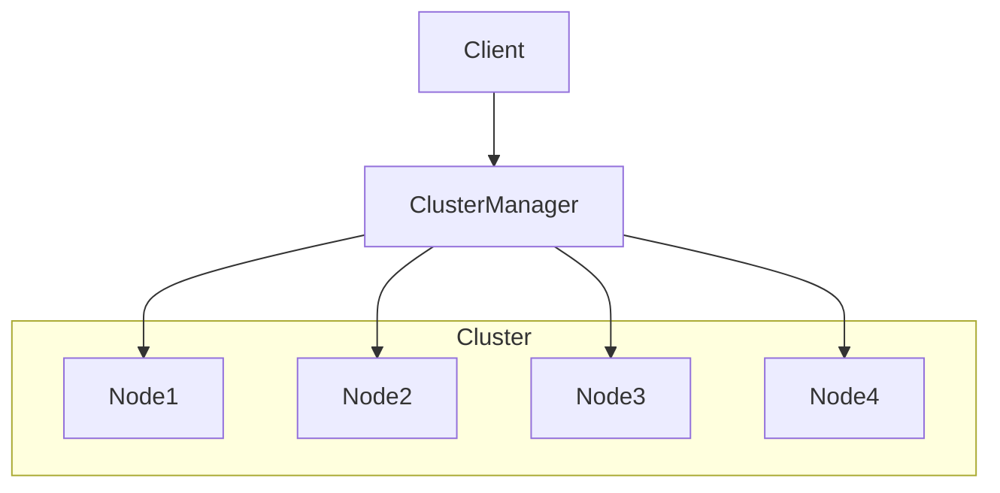

# 脑裂问题：深入解析与解决方案

## 1. 背景介绍

### 1.1 什么是脑裂问题？

脑裂问题(Brain Split)是一种在分布式系统中常见的一致性问题。它发生在一个分布式集群中,由于网络分区或节点故障等原因,导致集群被分割成两个或多个相互隔离的子集群。这种情况下,每个子集群都认为自己是"主"集群,并继续对数据进行读写操作,从而导致数据不一致。

### 1.2 为什么脑裂问题如此重要?

在分布式系统中,数据一致性是一个关键的需求。如果发生脑裂问题,不同的子集群可能会对同一份数据进行不同的修改,从而导致数据不一致和数据丢失。这种情况在金融、电子商务等对数据一致性要求高的领域尤其严重,可能会造成严重的经济损失和法律风险。

因此,解决脑裂问题对于构建可靠的分布式系统至关重要。

## 2. 核心概念与联系

### 2.1 CAP理论

在探讨脑裂问题之前,我们需要先了解CAP理论。CAP理论由Eric Brewer在2000年提出,它阐述了在分布式系统中,一致性(Consistency)、可用性(Availability)和分区容错性(Partition Tolerance)这三个理想特性之间的权衡关系。

根据CAP理论,在面临网络分区的情况下,一个分布式系统只能同时满足其中两个特性,而不可能同时满足全部三个特性。具体来说:

- 如果放弃分区容错性(P),则可以同时保证一致性(C)和可用性(A)。但这意味着系统在发生网络分区时将完全不可用,这在实际应用中是不可接受的。
- 如果放弃一致性(C),则可以同时保证可用性(A)和分区容错性(P)。这种情况下,每个节点都可以在网络分区期间继续读写数据,但可能会导致数据不一致。
- 如果放弃可用性(A),则可以同时保证一致性(C)和分区容错性(P)。这种情况下,在发生网络分区时,系统会拒绝对部分节点的读写请求,以保证数据的一致性。

### 2.2 脑裂问题与CAP理论的关系

脑裂问题实际上是CAP理论中放弃一致性(C)而选择可用性(A)和分区容错性(P)的一种体现。当发生网络分区时,每个子集群都认为自己是"主"集群,继续对数据进行读写操作,从而导致数据不一致。

因此,解决脑裂问题的核心思路是在发生网络分区时,放弃部分可用性(A),以保证数据的最终一致性(C)。具体的做法包括选举一个"主"集群,其他子集群作为"从"集群只读数据;或者在网络分区期间暂时拒绝所有写操作,等待网络恢复后再进行数据同步。

## 3. 核心算法原理具体操作步骤

### 3.1 领导者选举算法

为了解决脑裂问题,我们需要在集群中选举出一个"领导者"(Leader),由领导者来协调整个集群的读写操作。常见的领导者选举算法包括Raft算法、Paxos算法等。

以Raft算法为例,它的核心步骤如下:

1. 每个节点都有三种状态:Follower(跟随者)、Candidate(候选者)和Leader(领导者)。初始时,所有节点都是Follower状态。

2. Follower节点会定期向其他节点发送心跳包,如果在一段时间内没有收到Leader的心跳包,则认为Leader可能已经宕机,于是将自己的状态转换为Candidate,并开始进行选举。

3. Candidate节点会向其他节点发送请求投票的消息。如果获得了集群中超过一半节点的投票,则当选为Leader;否则,继续等待下一轮选举。

4. 当选出Leader后,它会周期性地向所有Follower节点发送心跳包,以维持自己的领导地位。Follower节点如果在一段时间内没有收到Leader的心跳包,则会重新进入选举流程。

5. 所有对数据的写操作都必须由Leader节点来协调和执行,以确保数据的一致性。读操作可以在Follower节点上执行,但需要确保读取的是最新的数据。

通过领导者选举算法,我们可以在集群中选出一个"主"节点,由它来协调整个集群的读写操作,从而避免脑裂问题的发生。

### 3.2 仲裁机制(Fencing)

即使采用了领导者选举算法,也可能出现"脑裂"情况,即两个或多个节点同时认为自己是Leader。为了解决这种情况,我们需要引入仲裁机制(Fencing)。

仲裁机制的核心思想是:在集群中引入一个独立的仲裁者(Arbiter),它不参与实际的数据读写操作,但可以监控整个集群的状态,并在发生"脑裂"时进行裁决。

具体的操作步骤如下:

1. 每个节点在启动时都会获取一个唯一的ID(如基于节点IP和启动时间戳生成)。

2. 当一个节点认为自己当选为Leader时,它会向仲裁者发送自己的ID和集群状态信息。

3. 仲裁者会记录下每个节点发来的ID和状态信息,并比对它们的差异。如果发现有多个节点声称自己是Leader,仲裁者会根据一定的规则(如ID大小、时间先后等)选择一个"真正的"Leader,并通知其他节点放弃Leader身份。

4. 被仲裁者"驱逐"的节点必须立即放弃Leader身份,并重新加入集群作为Follower节点。

通过引入仲裁机制,我们可以有效地解决"脑裂"问题,确保整个集群中只有一个真正的Leader在运行。

## 4. 数学模型和公式详细讲解举例说明

在分布式系统中,我们通常使用一致性哈希(Consistent Hashing)算法来实现负载均衡和数据分布。这种算法可以很好地应对节点的动态加入和移除,并且能够保证数据的均匀分布。

下面我们来详细介绍一致性哈希算法的原理和实现。

### 4.1 一致性哈希算法原理

一致性哈希算法将整个哈希空间(0 ~ 2^32-1)看作一个环形空间,并将节点和数据都映射到这个环形空间上。具体的映射方式如下:

1. 对于每个节点,使用哈希函数(如MD5)计算出它的哈希值,并将该哈希值映射到环形空间上。

2. 对于每个数据块,也使用相同的哈希函数计算出它的哈希值,并将该哈希值映射到环形空间上。

3. 每个数据块都会被存储在环形空间上顺时针方向离它最近的节点上。

当需要查找某个数据块时,只需要计算出该数据块的哈希值,并在环形空间上顺时针查找离它最近的节点,该节点就是存储该数据块的节点。

### 4.2 一致性哈希算法的优点

相比于传统的哈希算法(如取模算法),一致性哈希算法具有以下优点:

1. **负载均衡**:由于数据块和节点都是均匀分布在环形空间上的,因此可以实现较好的负载均衡。

2. **增量扩展**:当需要增加或删除节点时,只需要在环形空间上添加或删除对应的节点即可,而不需要像传统算法那样重新分配所有数据块。

3. **容错性**:当某个节点宕机时,它上面的数据块只需要迁移到顺时针方向上的下一个节点即可,而不会导致大量数据块的迁移。

### 4.3 一致性哈希算法的数学模型

假设我们有N个节点和K个数据块,它们都被映射到一个环形空间上。我们使用下标i表示第i个节点,使用下标j表示第j个数据块。

我们定义一个函数$f(x)$,它将节点和数据块映射到环形空间上的位置:

$$f(x) = hash(x) \bmod (2^{32})$$

其中,hash(x)是一个哈希函数,如MD5或SHA-1。

我们还定义一个函数$g(i, j)$,它表示第j个数据块距离第i个节点的顺时针距离:

$$g(i, j) = \min\{f(d_j) - f(n_i), f(n_i) - f(d_j) + 2^{32}\}$$

根据一致性哈希算法的原理,第j个数据块应该被存储在距离它最近的节点上,即:

$$\arg\min_i g(i, j)$$

通过上述数学模型,我们可以对一致性哈希算法进行更深入的分析和优化。例如,我们可以引入虚拟节点的概念,为每个物理节点添加多个虚拟节点,从而进一步提高负载均衡的效果。

## 5. 项目实践:代码实例和详细解释说明

在本节中,我们将通过一个具体的项目实践来展示如何使用一致性哈希算法解决负载均衡和数据分布的问题。

我们将使用Python语言实现一个简单的分布式键值存储系统,并使用一致性哈希算法来实现数据的均匀分布和动态节点管理。

### 5.1 项目架构

我们的分布式键值存储系统由以下几个主要组件组成:

1. **节点(Node)**:每个节点都是一个独立的进程,负责存储和管理一部分数据。
2. **集群管理器(ClusterManager)**:集群管理器负责维护整个集群的状态,包括节点的加入和移除、数据的分布等。它使用一致性哈希算法来实现这些功能。
3. **客户端(Client)**:客户端可以通过网络与集群管理器进行通信,向集群中存储和读取数据。

下面是整个系统的架构图:



### 5.2 一致性哈希算法的实现

我们首先来实现一致性哈希算法的核心部分。

```python
import hashlib

class ConsistentHashRing:
    def __init__(self, nodes=None):
        self.ring = {}
        self.nodes = nodes if nodes else []
        self.num_replicas = 3  # 每个节点创建3个虚拟节点
        self.init_ring()

    def init_ring(self):
        for node in self.nodes:
            for i in range(self.num_replicas):
                key = f"{node}:{i}"
                hash_value = self.gen_hash(key)
                self.ring[hash_value] = node

    def add_node(self, node):
        for i in range(self.num_replicas):
            key = f"{node}:{i}"
            hash_value = self.gen_hash(key)
            self.ring[hash_value] = node
        self.nodes.append(node)

    def remove_node(self, node):
        for i in range(self.num_replicas):
            key = f"{node}:{i}"
            hash_value = self.gen_hash(key)
            del self.ring[hash_value]
        self.nodes.remove(node)

    def get_node(self, key):
        hash_value = self.gen_hash(key)
        sorted_ring = sorted(self.ring.keys())
        for value in sorted_ring:
            if value > hash_value:
                return self.ring[value]
        return self.ring[sorted_ring[0]]

    def gen_hash(self, key):
        m = hashlib.md5()
        m.update(key.encode('utf-8'))
        return int(m.hexdigest(), 16)
```

在上面的代码中,我们定义了一个`ConsistentHashRing`类来管理整个一致性哈希环。它包含以下主要方法:

- `__init__`: 初始化一致性哈希环,可以指定初始节点列表。
- `init_ring`: 根据节点列表初始化一致性哈希环,为每个节点创建多个虚拟节点。
- `add_node`: 向一致性哈希环中添加一个新节点。
- `remove_node`: 从一致性哈希环中移除一个节点。
- `get_node`: 根据给定的键,获取应该存储该键的节点。
- `gen_hash`: 使用MD