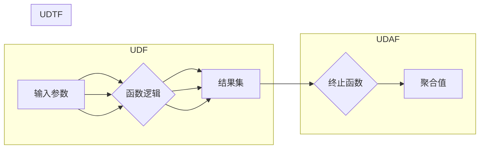

# 自定义函数：UDF、UDAF与UDTF

作者：禅与计算机程序设计艺术

## 1. 背景介绍

在数据处理和分析领域，SQL 是一种强大的工具，但有时内置函数无法满足特定需求。为了解决这个问题，许多数据库系统引入了自定义函数的概念，允许用户根据自己的需求创建新的函数。自定义函数可以扩展 SQL 的功能，提高数据处理效率，并简化复杂的操作。

### 1.1 自定义函数的优势

* **扩展 SQL 功能：**  自定义函数允许用户创建新的函数来执行 SQL 无法直接完成的操作，例如复杂计算、字符串处理或自定义聚合。
* **提高代码可重用性：**  自定义函数可以封装可重用的逻辑，减少代码重复，并提高代码可维护性。
* **简化复杂操作：**  自定义函数可以将复杂的操作封装成一个简单的函数调用，使 SQL 查询更易读、易懂。
* **提高数据处理效率：**  在某些情况下，自定义函数可以利用底层数据库系统的优化功能，提高数据处理效率。

### 1.2 自定义函数的类型

自定义函数主要分为三种类型：

* **用户定义函数（UDF）：**  UDF 操作单个数据行，并返回一个值。
* **用户定义聚合函数（UDAF）：**  UDAF 操作多行数据，并返回一个聚合值。
* **用户定义表值函数（UDTF）：**  UDTF 操作单个数据行，并返回一个结果集（多行数据）。

## 2. 核心概念与联系

### 2.1 UDF：用户定义函数

UDF 接受一个或多个输入参数，并返回一个单一值。它们类似于编程语言中的函数，可以执行各种操作，例如：

* **数学计算：**  例如，计算平方根、对数或三角函数。
* **字符串操作：**  例如，连接字符串、提取子字符串或更改字符串大小写。
* **日期和时间操作：**  例如，计算日期差、格式化日期或提取日期时间组件。
* **自定义逻辑：**  例如，根据特定条件返回值或执行复杂的计算。

### 2.2 UDAF：用户定义聚合函数

UDAF 接受多行数据作为输入，并返回一个聚合值。它们类似于 SQL 中的内置聚合函数，例如 SUM、AVG 和 COUNT，但允许用户定义自己的聚合逻辑。例如，可以创建 UDAF 来计算：

* **中位数：**  找到一组数值的中间值。
* **众数：**  找到一组数据中最频繁出现的值。
* **百分位数：**  找到一组数据中特定百分比的值。
* **自定义统计指标：**  例如，计算几何平均数或调和平均数。

### 2.3 UDTF：用户定义表值函数

UDTF 接受一个输入参数，并返回一个结果集（多行数据）。它们类似于 SQL 中的视图或子查询，但允许用户定义自己的逻辑来生成结果集。例如，可以创建 UDTF 来：

* **拆分字符串：**  将一个字符串拆分成多个子字符串。
* **生成序列：**  生成一系列数字或日期。
* **执行递归操作：**  例如，遍历树形结构或计算阶乘。

## 3. 核心算法原理与操作步骤

### 3.1 UDF 的实现

UDF 的实现取决于具体的数据库系统，但通常涉及以下步骤：

1. **定义函数签名：**  指定函数名称、输入参数类型和返回值类型。
2. **编写函数逻辑：**  使用 SQL 或其他编程语言（例如 Java 或 Python）编写函数体，实现所需的功能。
3. **注册函数：**  将函数注册到数据库系统中，使其可供 SQL 查询使用。

### 3.2 UDAF 的实现

UDAF 的实现通常涉及以下步骤：

1. **定义聚合函数签名：**  指定函数名称、输入参数类型和返回值类型。
2. **创建状态变量：**  定义用于存储聚合过程中间结果的变量。
3. **编写初始化函数：**  初始化状态变量。
4. **编写迭代函数：**  处理每一行输入数据，并更新状态变量。
5. **编写终止函数：**  根据最终状态变量计算聚合值。
6. **注册聚合函数：**  将聚合函数注册到数据库系统中，使其可供 SQL 查询使用。

### 3.3 UDTF 的实现

UDTF 的实现通常涉及以下步骤：

1. **定义表值函数签名：**  指定函数名称、输入参数类型和返回值类型。
2. **编写函数逻辑：**  使用 SQL 或其他编程语言编写函数体，生成结果集。
3. **注册表值函数：**  将表值函数注册到数据库系统中，使其可供 SQL 查询使用。

## 4. 数学模型和公式详细讲解举例说明

### 4.1 UDF 示例：计算字符串长度

```sql
-- 定义 UDF
CREATE FUNCTION string_length(str VARCHAR(255))
RETURNS INT
BEGIN
  RETURN LENGTH(str);
END;

-- 使用 UDF
SELECT string_length('Hello, world!');
```

**公式：**

```
string_length(str) = LENGTH(str)
```

其中，`LENGTH(str)` 是 SQL 中的内置函数，用于计算字符串长度。

### 4.2 UDAF 示例：计算中位数

```sql
-- 定义 UDAF
CREATE AGGREGATE FUNCTION median(val DOUBLE)
RETURNS DOUBLE
BEGIN
  -- 状态变量：存储排序后的值列表
  DECLARE values ARRAY<DOUBLE>;

  -- 初始化函数
  FUNCTION init()
  BEGIN
    SET values = [];
  END;

  -- 迭代函数
  FUNCTION iterate(val DOUBLE)
  BEGIN
    SET values = array_append(values, val);
  END;

  -- 终止函数
  FUNCTION terminate()
  BEGIN
    -- 对值列表进行排序
    SET values = array_sort(values);

    -- 计算中位数
    IF array_size(values) % 2 = 0 THEN
      RETURN (values[array_size(values) / 2 - 1] + values[array_size(values) / 2]) / 2;
    ELSE
      RETURN values[(array_size(values) + 1) / 2 - 1];
    END IF;
  END;
END;

-- 使用 UDAF
SELECT median(salary) FROM employees;
```

**公式：**

```
median(values) = 
  IF size(values) is even THEN
    (values[size(values) / 2 - 1] + values[size(values) / 2]) / 2
  ELSE
    values[(size(values) + 1) / 2 - 1]
  END IF
```

其中，`size(values)` 是值列表的大小，`values[i]` 是值列表中第 `i` 个元素。

### 4.3 UDTF 示例：拆分字符串

```sql
-- 定义 UDTF
CREATE FUNCTION split_string(str VARCHAR(255), delimiter VARCHAR(10))
RETURNS TABLE (word VARCHAR(255))
BEGIN
  DECLARE i INT;
  DECLARE word VARCHAR(255);

  SET i = 1;
  WHILE i <= LENGTH(str) DO
    SET word = SUBSTRING_INDEX(str, delimiter, i);
    IF word != '' THEN
      RETURN word;
    END IF;
    SET i = i + 1;
  END WHILE;
END;

-- 使用 UDTF
SELECT * FROM split_string('apple,banana,orange', ',');
```

**公式：**

```
split_string(str, delimiter) = 
  FOR i = 1 TO LENGTH(str) DO
    word = SUBSTRING_INDEX(str, delimiter, i)
    IF word != '' THEN
      RETURN word
    END IF
  END FOR
```

其中，`SUBSTRING_INDEX(str, delimiter, i)` 是 SQL 中的内置函数，用于返回字符串 `str` 中第 `i` 个分隔符 `delimiter` 之前的子字符串。

## 5. 项目实践：代码实例和详细解释说明

### 5.1 示例：使用 UDF 计算 BMI

**需求：**  给定一个包含身高（cm）和体重（kg）的表，使用 UDF 计算每个人的 BMI。

**代码：**

```sql
-- 创建表
CREATE TABLE persons (
  id INT,
  height INT,
  weight INT
);

-- 插入数据
INSERT INTO persons VALUES (1, 170, 60), (2, 180, 70), (3, 160, 50);

-- 定义 UDF
CREATE FUNCTION calculate_bmi(height INT, weight INT)
RETURNS DOUBLE
BEGIN
  -- 将身高转换为米
  DECLARE height_m DOUBLE;
  SET height_m = height / 100.0;

  -- 计算 BMI
  RETURN weight / (height_m * height_m);
END;

-- 使用 UDF
SELECT id, height, weight, calculate_bmi(height, weight) AS bmi FROM persons;
```

**解释：**

* 首先，我们创建了一个名为 `persons` 的表，包含 `id`、`height` 和 `weight` 列。
* 然后，我们插入了一些示例数据。
* 接下来，我们定义了一个名为 `calculate_bmi` 的 UDF，它接受身高（cm）和体重（kg）作为输入，并返回 BMI 值。
* 在 UDF 中，我们将身高转换为米，然后使用公式 `weight / (height_m * height_m)` 计算 BMI。
* 最后，我们使用 `SELECT` 语句调用 UDF，并显示每个人的 `id`、`height`、`weight` 和 `bmi`。

### 5.2 示例：使用 UDAF 计算平均工资

**需求：**  给定一个包含员工姓名和工资的表，使用 UDAF 计算所有员工的平均工资。

**代码：**

```sql
-- 创建表
CREATE TABLE employees (
  name VARCHAR(255),
  salary INT
);

-- 插入数据
INSERT INTO employees VALUES ('Alice', 5000), ('Bob', 6000), ('Charlie', 7000);

-- 定义 UDAF
CREATE AGGREGATE FUNCTION average_salary(salary INT)
RETURNS DOUBLE
BEGIN
  -- 状态变量：存储工资总和和员工数量
  DECLARE total_salary INT;
  DECLARE count INT;

  -- 初始化函数
  FUNCTION init()
  BEGIN
    SET total_salary = 0;
    SET count = 0;
  END;

  -- 迭代函数
  FUNCTION iterate(salary INT)
  BEGIN
    SET total_salary = total_salary + salary;
    SET count = count + 1;
  END;

  -- 终止函数
  FUNCTION terminate()
  BEGIN
    RETURN total_salary / count;
  END;
END;

-- 使用 UDAF
SELECT average_salary(salary) FROM employees;
```

**解释：**

* 首先，我们创建了一个名为 `employees` 的表，包含 `name` 和 `salary` 列。
* 然后，我们插入了一些示例数据。
* 接下来，我们定义了一个名为 `average_salary` 的 UDAF，它接受工资作为输入，并返回平均工资。
* 在 UDAF 中，我们定义了两个状态变量：`total_salary` 存储工资总和，`count` 存储员工数量。
* 在初始化函数中，我们将 `total_salary` 和 `count` 初始化为 0。
* 在迭代函数中，我们将每个员工的工资加到 `total_salary` 中，并将 `count` 加 1。
* 在终止函数中，我们使用 `total_salary / count` 计算平均工资。
* 最后，我们使用 `SELECT` 语句调用 UDAF，并显示平均工资。

### 5.3 示例：使用 UDTF 生成斐波那契数列

**需求：**  使用 UDTF 生成包含前 N 个斐波那契数的表。

**代码：**

```sql
-- 定义 UDTF
CREATE FUNCTION fibonacci(n INT)
RETURNS TABLE (value INT)
BEGIN
  DECLARE a INT;
  DECLARE b INT;
  DECLARE i INT;

  SET a = 0;
  SET b = 1;
  SET i = 1;

  WHILE i <= n DO
    RETURN a;
    SET i = i + 1;
    SET a, b = b, a + b;
  END WHILE;
END;

-- 使用 UDTF
SELECT * FROM fibonacci(10);
```

**解释：**

* 首先，我们定义了一个名为 `fibonacci` 的 UDTF，它接受一个整数 `n` 作为输入，并返回一个包含前 `n` 个斐波那契数的表。
* 在 UDTF 中，我们定义了三个变量：`a` 和 `b` 存储斐波那契数列的当前值，`i` 存储当前迭代次数。
* 我们将 `a` 初始化为 0，`b` 初始化为 1，`i` 初始化为 1。
* 在 `WHILE` 循环中，我们返回 `a` 的值，并将 `i` 加 1。
* 然后，我们使用元组赋值 `a, b = b, a + b` 更新 `a` 和 `b` 的值。
* 最后，我们使用 `SELECT` 语句调用 UDTF，并显示前 10 个斐波那契数。

## 6. 实际应用场景

### 6.1 数据分析和报告

自定义函数可以用于创建复杂的指标和计算，简化数据分析和报告的生成过程。例如，可以使用 UDF 计算客户生命周期价值、用户参与度或产品盈利能力。

### 6.2 数据清洗和转换

自定义函数可以用于清理和转换数据，例如删除重复数据、格式化日期或标准化字符串。

### 6.3 数据集成

自定义函数可以用于集成来自不同数据源的数据，例如将不同格式的日期转换为统一格式。

### 6.4 领域特定逻辑

自定义函数可以用于实现特定领域的逻辑，例如金融风险计算、医疗诊断或地理空间分析。

## 7. 工具和资源推荐

### 7.1 数据库文档

每个数据库系统都有自己的文档，其中包含有关自定义函数的详细信息，例如语法、示例和最佳实践。

### 7.2 在线教程和博客

许多在线教程和博客提供了有关自定义函数的实用指南和示例。

### 7.3 社区论坛

社区论坛是与其他开发人员交流和寻求帮助的好地方。

## 8. 总结：未来发展趋势与挑战

### 8.1 趋势

* **更强大的功能：**  数据库系统将继续添加对更强大自定义函数的支持，例如支持更复杂的数据类型和算法。
* **更好的性能：**  数据库系统将继续优化自定义函数的性能，使其能够处理更大的数据集。
* **更易于使用：**  数据库系统将提供更友好的界面和工具，使创建和使用自定义函数更加容易。

### 8.2 挑战

* **安全性和可靠性：**  自定义函数可能会引入安全漏洞或导致数据库不稳定，因此确保其安全性和可靠性至关重要。
* **可维护性和可测试性：**  随着自定义函数变得更加复杂，维护和测试它们将变得更加困难。
* **与现有代码的集成：**  将自定义函数集成到现有 SQL 代码中可能会很困难，尤其是在处理复杂的依赖关系时。

## 9. 附录：常见问题与解答

### 9.1 如何调试自定义函数？

调试自定义函数的方法取决于具体的数据库系统。一些数据库系统提供内置的调试器，而其他系统可能需要使用外部工具。

### 9.2 如何测试自定义函数？

可以使用单元测试框架来测试自定义函数。单元测试应该涵盖函数的所有可能输入和输出，以确保其按预期工作。

### 9.3 如何优化自定义函数的性能？

优化自定义函数的性能的方法包括：

* **使用高效的算法：**  选择最适合特定任务的算法。
* **最小化数据库访问：**  尽可能减少对数据库的访问次数。
* **使用索引：**  对经常访问的数据列创建索引。
* **缓存结果：**  如果函数的结果经常被重复使用，可以将其缓存以提高性能。


## 10.  Mermaid流程图




## 11.  结束语

自定义函数是扩展 SQL 功能、提高数据处理效率和简化复杂操作的强大工具。通过理解 UDF、UDAF 和 UDTF 的概念、原理和应用，开发人员可以创建更强大、更高效的数据处理解决方案。