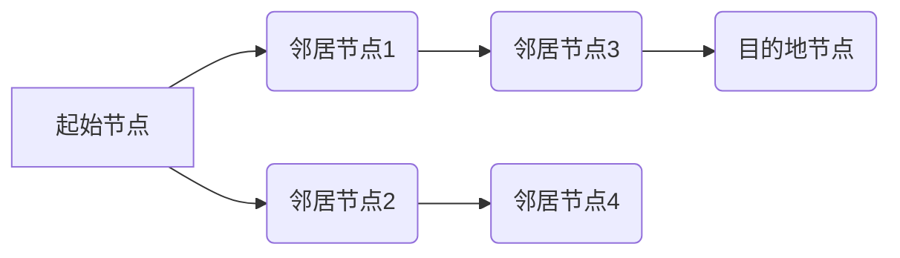

##  西部自驾游信息管理平台的设计与实现

作者：禅与计算机程序设计艺术

## 1. 背景介绍

### 1.1 西部自驾游市场现状

近年来，随着中国经济的快速发展和人民生活水平的不断提高，旅游业蓬勃发展，自驾游成为了一种 increasingly popular 的旅游方式。特别是西部地区，以其独特的自然风光、悠久的历史文化和浓郁的民族风情吸引着越来越多的自驾游爱好者。

### 1.2 自驾游信息管理平台的必要性

然而，西部地区旅游基础设施相对落后，信息化程度不高，自驾游信息获取渠道有限，游客 often encounter 各种 difficulties，例如：

* 缺乏全面的旅游信息，难以规划行程；
* 难以找到可靠的住宿、餐饮、加油等服务；
* 缺乏安全保障，容易遇到意外情况；
* 旅游资源开发不充分，体验感不足。

为了解决这些问题，构建一个 comprehensive and user-friendly 西部自驾游信息管理平台显得尤为重要。

## 2. 核心概念与联系

### 2.1 系统架构

西部自驾游信息管理平台采用 B/S 架构，主要包括以下模块：

* **数据采集模块:** 负责采集西部地区的旅游景点、住宿、餐饮、加油站、道路交通等信息，并进行数据清洗、整合和存储。
* **信息发布模块:** 负责将整理好的旅游信息发布到平台上，供用户查询和浏览。
* **用户管理模块:** 负责用户注册、登录、信息修改等功能，并提供个性化服务。
* **行程规划模块:** 允许用户根据自己的需求规划自驾游行程，并提供路线导航、景点推荐、住宿预订等服务。
* **安全保障模块:** 提供紧急救援、道路救援、医疗救助等服务，保障用户出行安全。
* **社区互动模块:** 提供用户交流平台，分享旅游经验、发布游记等。

### 2.2 核心概念

* **POI (Point of Interest):** 指地图上的兴趣点，例如旅游景点、住宿、餐饮、加油站等。
* **路线规划:** 指根据用户的起始地、目的地和途经点，计算最佳路线。
* **导航:** 指引导用户沿着规划好的路线行驶。
* **推荐系统:** 指根据用户的兴趣爱好，推荐相关的旅游景点、住宿、餐饮等。

### 2.3 联系

各个模块之间相互联系，共同构建起一个完整的自驾游信息管理平台。例如，数据采集模块负责采集 POI 信息，信息发布模块负责将 POI 信息发布到平台上，用户管理模块负责管理用户信息，行程规划模块利用 POI 信息和用户需求进行路线规划，安全保障模块利用 POI 信息提供道路救援服务，社区互动模块利用 POI 信息提供景点推荐服务。

## 3. 核心算法原理具体操作步骤

### 3.1 路线规划算法

路线规划算法是自驾游信息管理平台的核心算法之一，它负责根据用户的起始地、目的地和途经点，计算最佳路线。常用的路线规划算法包括：

* **Dijkstra 算法:** 一种经典的最短路径算法，可以找到图中任意两点之间的最短路径。
* **A\* 算法:** Dijkstra 算法的改进版本，通过引入启发式函数，可以更快地找到最短路径。
* **Floyd-Warshall 算法:** 可以找到图中任意两点之间的最短路径，适用于稠密图。

### 3.2 操作步骤

以 Dijkstra 算法为例，路线规划的具体操作步骤如下：

1. 将地图抽象成一个图，节点代表 POI，边代表道路。
2. 设置起始节点的距离为 0，其他节点的距离为无穷大。
3. 将起始节点加入到一个优先队列中，队列按照距离排序。
4. 从优先队列中取出距离最小的节点，遍历其邻居节点。
5. 如果邻居节点的距离大于当前节点的距离加上两点之间的距离，则更新邻居节点的距离和前驱节点。
6. 将更新后的邻居节点加入到优先队列中。
7. 重复步骤 4-6，直到找到目的地节点。

### 3.3 流程图



## 4. 数学模型和公式详细讲解举例说明

### 4.1 Dijkstra 算法的数学模型

Dijkstra 算法的数学模型可以用以下公式表示：

```
D[v] = min{D[u] + w(u, v)}
```

其中：

* D[v] 表示从起始节点到节点 v 的最短距离。
* D[u] 表示从起始节点到节点 u 的最短距离。
* w(u, v) 表示节点 u 和节点 v 之间的距离。

### 4.2 举例说明

假设有以下地图：

```
     A
    / \
   /   \
  B-----C
 / \   / \
D---E-F---G
```

节点之间的距离如下表所示：

| 起点 | 终点 | 距离 |
|---|---|---|
| A | B | 1 |
| A | C | 4 |
| B | C | 2 |
| B | D | 3 |
| B | E | 2 |
| C | F | 1 |
| C | G | 3 |
| D | E | 1 |
| E | F | 2 |
| F | G | 2 |

使用 Dijkstra 算法计算从节点 A 到节点 G 的最短路径，步骤如下：

1. 初始化：D[A] = 0，D[B] = D[C] = D[D] = D[E] = D[F] = D[G] = ∞。
2. 将 A 加入到优先队列中。
3. 从优先队列中取出 A，遍历其邻居节点 B 和 C。
    * D[B] = 1 < ∞，更新 D[B] = 1，前驱节点为 A。
    * D[C] = 4 < ∞，更新 D[C] = 4，前驱节点为 A。
4. 将 B 和 C 加入到优先队列中。
5. 从优先队列中取出 B，遍历其邻居节点 C、D 和 E。
    * D[C] = 3 < 4，更新 D[C] = 3，前驱节点为 B。
    * D[D] = 4 < ∞，更新 D[D] = 4，前驱节点为 B。
    * D[E] = 4 < ∞，更新 D[E] = 4，前驱节点为 B。
6. 将 C、D 和 E 加入到优先队列中。
7. 从优先队列中取出 C，遍历其邻居节点 F 和 G。
    * D[F] = 4 < ∞，更新 D[F] = 4，前驱节点为 C。
    * D[G] = 7 < ∞，更新 D[G] = 7，前驱节点为 C。
8. 将 F 和 G 加入到优先队列中。
9. 从优先队列中取出 D，遍历其邻居节点 E。
    * D[E] = 5 < 4，更新 D[E] = 5，前驱节点为 D。
10. 将 E 加入到优先队列中。
11. 从优先队列中取出 E，遍历其邻居节点 F。
    * D[F] = 7 < 4，不更新。
12. 从优先队列中取出 F，遍历其邻居节点 G。
    * D[G] = 6 < 7，更新 D[G] = 6，前驱节点为 F。
13. 从优先队列中取出 G，算法结束。

最终得到的最短路径为 A -> B -> C -> F -> G，距离为 6。

## 5. 项目实践：代码实例和详细解释说明

### 5.1 技术选型

* 后端：采用 Spring Boot 框架，提供 RESTful API 接口。
* 数据库：采用 MySQL 数据库，存储 POI 信息、用户信息、行程信息等。
* 前端：采用 Vue.js 框架，实现用户界面。
* 地图服务：采用高德地图 API，提供地图显示、路线规划、导航等功能。

### 5.2 代码实例

**路线规划接口：**

```java
@RestController
@RequestMapping("/api/route")
public class RouteController {

    @Autowired
    private RouteService routeService;

    @PostMapping("/plan")
    public Route planRoute(@RequestBody RoutePlanRequest request) {
        return routeService.planRoute(request);
    }
}
```

**RoutePlanRequest 类：**

```java
public class RoutePlanRequest {

    private String origin; // 起始地
    private String destination; // 目的地
    private List<String> waypoints; // 途经点
}
```

**RouteService 类：**

```java
@Service
public class RouteService {

    @Autowired
    private AmapClient amapClient;

    public Route planRoute(RoutePlanRequest request) {
        // 调用高德地图 API 进行路线规划
        DrivingRouteResult result = amapClient.getDrivingRoute(request.getOrigin(), request.getDestination(), request.getWaypoints());
        // 将结果封装成 Route 对象
        Route route = new Route();
        route.setDistance(result.getPaths().get(0).getDistance());
        route.setDuration(result.getPaths().get(0).getDuration());
        route.setPath(result.getPaths().get(0).getSteps());
        return route;
    }
}
```

**Route 类：**

```java
public class Route {

    private int distance; // 距离
    private int duration; // 耗时
    private List<Step> path; // 路径
}
```

### 5.3 解释说明

* 路线规划接口接收 RoutePlanRequest 对象作为参数，该对象包含起始地、目的地和途经点信息。
* RouteService 类调用高德地图 API 进行路线规划，并将结果封装成 Route 对象返回。
* Route 对象包含距离、耗时和路径信息。

## 6. 实际应用场景

### 6.1 自驾游行程规划

用户可以通过西部自驾游信息管理平台规划自驾游行程，包括选择目的地、设置途经点、预订住宿、查找餐饮等。平台会根据用户的需求推荐最佳路线，并提供导航服务。

### 6.2 旅游信息查询

用户可以通过平台查询西部地区的旅游景点、住宿、餐饮、加油站等信息，包括景点介绍、图片、评分、联系方式等。

### 6.3 安全保障

平台提供紧急救援、道路救援、医疗救助等服务，保障用户出行安全。用户可以通过平台发布求助信息，平台会及时联系救援人员提供帮助。

### 6.4 社区互动

用户可以通过平台分享旅游经验、发布游记、与其他用户交流等，增强用户体验。

## 7. 工具和资源推荐

### 7.1 开发工具

* IntelliJ IDEA：Java 集成开发环境。
* Visual Studio Code：前端开发工具。
* Navicat Premium：数据库管理工具。
* Postman：API 测试工具。

### 7.2 资源

* 高德地图 API：提供地图显示、路线规划、导航等功能。
* Spring Boot 官方文档：Spring Boot 框架学习资料。
* Vue.js 官方文档：Vue.js 框架学习资料。

## 8. 总结：未来发展趋势与挑战

### 8.1 未来发展趋势

* **个性化推荐:** 利用大数据和人工智能技术，为用户提供更精准的旅游信息推荐。
* **虚拟现实技术:** 利用 VR 技术，为用户提供沉浸式旅游体验。
* **智能化服务:** 利用人工智能技术，提供更智能化的旅游服务，例如智能客服、智能导游等。

### 8.2 挑战

* **数据安全:** 保护用户隐私和数据安全。
* **系统稳定性:** 确保平台稳定运行，应对高并发访问。
* **用户体验:** 不断优化用户体验，提高用户满意度。

## 9. 附录：常见问题与解答

### 9.1 如何注册账号？

用户可以通过平台首页的“注册”按钮进行账号注册，填写相关信息并完成验证即可。

### 9.2 如何规划行程？

用户可以通过平台首页的“行程规划”功能，输入起始地、目的地和途经点，平台会自动规划最佳路线。

### 9.3 如何预订住宿？

用户可以通过平台的“住宿”功能，搜索目的地附近的酒店，并进行在线预订。

### 9.4 如何联系客服？

用户可以通过平台首页的“联系客服”按钮，联系平台客服人员进行咨询或反馈问题. 
