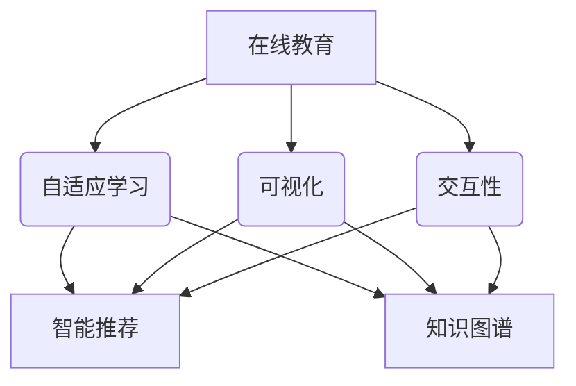
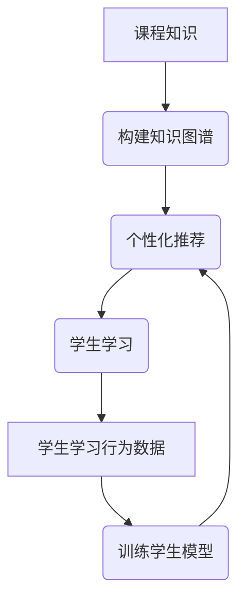
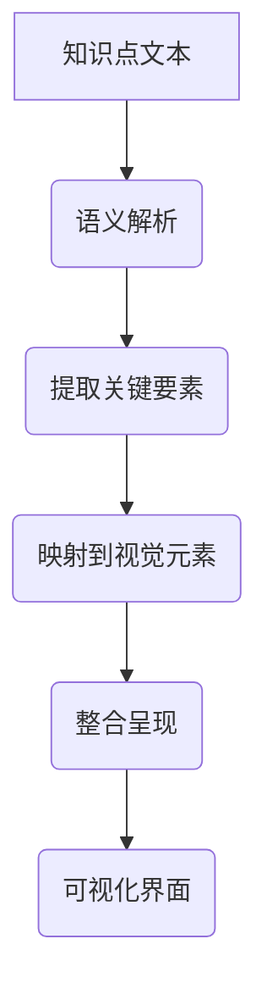

# 计算机组成原理精品课程网站详细设计与具体代码实现

## 1. 背景介绍

### 1.1 计算机组成原理课程的重要性

计算机组成原理是计算机科学与技术专业的一门核心课程,也是其他相关专业的重要基础课程。它研究计算机系统的硬件和软件组成,是计算机科学与技术专业学生必须扎实掌握的基础知识。通过学习这门课程,学生可以全面了解计算机的基本工作原理、指令系统、存储器层次结构、CPU设计、输入/输出系统等内容,为后续学习计算机体系结构、操作系统、编译原理等课程奠定坚实基础。

### 1.2 传统教学模式的不足

传统的计算机组成原理课程教学存在一些不足之处:

1. 教学内容枯燥,缺乏直观性和趣味性,难以吸引学生的注意力。
2. 缺乏实践环节,学生无法亲身动手操作,理解和掌握程度不够。
3. 教师难以对每个学生进行有效的个性化辅导。
4. 缺乏互动性,学习氛围较为单一,学习效果受到影响。

### 1.3 精品课程网站的必要性

为了解决传统教学模式的不足,提高教学质量,满足学生对交互式、个性化、可视化学习的需求,构建一个计算机组成原理精品课程网站就显得尤为重要。该网站应具备以下特点:

1. 内容全面、系统化、前沿化,资源丰富多样。
2. 界面友好,功能完备,操作简单方便。
3. 支持在线学习、在线实验、在线答疑等多种模式。
4. 实现教师和学生的良性互动,促进个性化教学。
5. 支持自适应学习,根据学生的知识掌握情况推荐个性化学习路径。

## 2. 核心概念与联系

### 2.1 核心概念

设计和开发计算机组成原理精品课程网站涉及以下几个核心概念:

1. **在线教育(Online Education)**: 利用互联网和多媒体技术,实现与传统课堂教学"面对面"教学模式不同的新型教育模式。

2. **自适应学习(Adaptive Learning)**: 根据学生的知识水平、学习能力、学习偏好等个体特征,动态调整教学内容、教学策略和学习路径,实现因材施教。

3. **可视化(Visualization)**: 将抽象的理论知识以图形、动画等直观形式呈现,帮助学生形象地理解和掌握知识点。

4. **交互性(Interaction)**: 支持师生之间、生生之间的多种互动方式,如在线答疑、讨论区、实时视频等,增强教学的参与度和体验感。

5. **智能推荐(Intelligent Recommendation)**: 基于学生的学习行为数据,利用机器学习算法分析学习特点,为学生推荐个性化的学习资源和路径。

6. **知识图谱(Knowledge Graph)**: 将课程知识按主题构建成知识网络,展现知识点之间的关系,帮助学生建立知识体系。

### 2.2 核心概念之间的关系

上述核心概念相互关联、相互作用,共同构建了计算机组成原理精品课程网站的核心功能和特色:

1. 在线教育是实现网站的基础目标。
2. 自适应学习、可视化、交互性等为实现在线教育提供了有力支撑。
3. 智能推荐和知识图谱则为自适应学习、可视化、交互性等功能提供数据基础和知识支持。

它们的关系如下图所示:

## 3. 核心算法原理与具体操作步骤

### 3.1 自适应学习推荐算法

自适应学习是精品课程网站的一个核心功能,它能根据每位学生的知识掌握情况、学习能力、学习偏好等个体特征,动态调整教学内容和学习路径,实现因材施教。其核心算法是一种基于知识图谱和机器学习的个性化推荐算法。

#### 3.1.1 算法原理

该算法的基本思路是:首先基于课程知识构建知识图谱,将知识点之间的前驱、同级和发展关系用图模型表示;其次,通过学生的学习行为数据(如做题情况、学习时长、学习顺序等)训练机器学习模型,分析每个学生的知识掌握程度和学习特点;然后将知识图谱和学生模型相结合,为每位学生推荐最合适的个性化学习路径和资源。

具体来说,算法包括以下几个主要步骤:

1. **知识图谱构建**: 将课程知识按主题组织,建立知识点之间的关系(如先修、同级、发展等),形成知识图谱。

2. **学生模型训练**: 基于学生的学习行为数据(如做题情况、学习时长、学习顺序等),使用机器学习算法(如贝叶斯网络、马尔可夫决策过程等)训练出每位学生的知识掌握程度模型和学习特征模型。

3. **个性化推荐**: 将知识图谱和学生模型相结合,利用图搜索算法(如最短路径算法)为每位学生推荐个性化的学习路径,并根据其学习特征推荐适合的学习资源。

4. **持续优化**: 在学生学习过程中不断收集新的行为数据,动态更新学生模型和推荐结果,持续优化个性化推荐效果。

#### 3.1.2 算法流程

算法的具体流程如下所示:

1. 基于课程知识构建知识图谱
2. 收集学生的学习行为数据
3. 利用学习行为数据训练学生模型,得到每位学生的知识掌握程度和学习特征
4. 将知识图谱和学生模型相结合,为每位学生进行个性化推荐,包括学习路径和学习资源
5. 学生根据推荐的个性化学习路径和资源进行学习
6. 不断收集新的学习行为数据,更新学生模型和推荐结果,形成闭环优化

### 3.2 知识点可视化算法

为了帮助学生形象地理解和掌握计算机组成原理中的抽象理论知识,精品课程网站需要将这些知识点以直观的图形、动画等形式可视化展现。可视化算法的核心就是将抽象的知识转化为图像。

#### 3.2.1 算法原理

可视化算法的基本思路是:首先对知识点的内容进行语义解析,识别出其中的关键概念、原理和步骤;然后将这些要素映射到视觉元素上,如几何形状、图标、动画等;最后按照一定的视觉规则和交互方式,将这些视觉元素整合并呈现出来。

例如,要可视化"CPU指令执行"这一知识点,算法可以遵循如下步骤:

1. 将"CPU指令执行"的关键概念(如指令、寄存器、ALU等)用不同的几何形状或图标表示。
2. 将指令执行的每个步骤用动画的形式呈现。
3. 添加文字说明、注释和交互按钮,使学生能够控制动画播放和查看详细信息。

通过这种方式,学生可以直观地观察和理解指令在CPU中是如何被执行的,而不是只依赖文字描述。

#### 3.2.2 算法流程

知识点可视化算法的具体流程如下:

1. 获取知识点的文本描述
2. 对文本进行语义解析,识别出关键概念、原理和步骤等要素
3. 将提取出的关键要素映射到视觉元素上,如几何形状、图标、动画等
4. 按照一定的视觉规则和交互方式,将这些视觉元素整合并呈现出来
5. 最终在网站上以可视化的界面展示给学生,并提供交互操作

该算法可以很好地将抽象的理论知识转化为形象生动的视觉呈现,提高学生的学习兴趣和理解效果。

## 4. 数学模型和公式详细讲解举例说明

计算机组成原理课程中涉及一些数学模型和公式,如布尔代数、组合电路设计、CPU控制单元状态转移等,这些内容对学生来说可能比较枯燥和抽象。为了提高教学效果,精品课程网站需要通过生动形象的方式对这些数学模型和公式进行详细讲解和举例说明。

### 4.1 布尔代数

布尔代数是数字电路设计的基础,常用于分析和简化组合逻辑电路。网站可以通过互动式的方式,让学生亲自编辑和观察不同的逻辑表达式,帮助理解布尔代数的运算规则和应用。

例如,对于逻辑表达式 $F=A'B+AB'$,网站可以提供如下交互界面:

1. 输入区,允许学生编辑逻辑表达式$F$。
2. 真值表区,实时显示编辑后的表达式对应的真值表。
3. 可视化区,以动画的形式展示表达式对应的逻辑门电路图。
4. 举例区,给出该表达式在实际应用中的例子,如"与非门电路"。

通过上述多种方式的结合,学生可以更直观地理解和掌握布尔代数的概念和运算规则。

### 4.2 CPU控制单元的状态转移

CPU控制单元的工作原理是计算机组成原理中一个重要但较为抽象的知识点。我们可以借助状态转移图的数学模型,配合动画演示的方式,使这一过程变得形象化。

假设有一个简化的CPU控制单元,它的状态转移过程如下所示:

$$
\begin{array}{c|cccccc}
状态 &\textbf{开始}&\textbf{取指令}&\textbf{指令译码}&\textbf{执行}&\textbf{访存}&\textbf{写回}\\
\hline
\text{开始}&-&\text{取指令}&-&-&-&-\\
\text{取指令}&-&-&\text{指令译码}&-&-&-\\
\text{指令译码}&-&-&-&\text{执行}&\text{访存}&-\\
\text{执行}&-&\text{取指令}&-&-&-&\text{写回}\\
\text{访存}&-&-&\text{执行}&-&-&\text{写回}\\
\text{写回}&-&\text{取指令}&-&-&-&-\\
\end{array}
$$

网站可以提供这样的可视化界面:

1. 用节点表示每个状态,节点颜色根据当前状态发生变化。
2. 用有向边表示状态之间的转移,并标注转移条件。
3. 配合动画,模拟整个状态转移的过程。

通过状态转移图的模型和动画演示的结合,学生可以直观地理解和掌握CPU控制单元的工作原理。

## 5. 项目实践:代码实例和详细解释说明

除了理论知识之外,精品课程网站还需要提供实践环节,让学生动手编写代码、搭建系统,加深对知识点的理解和运用。本节将给出一个"可视化CPU模拟器"的实例项目,并对其中的关键代码模块进行详细解释说明。

### 5.1 项目概述

"可视化CPU模拟器"是一个基于Web的交互式应用程序,它模拟了一个简化的CPU的工作过程,包括指令的取指、译码、执行、访存和写回等阶段。学生可以在模拟器中输入机器指令,观察和操作CPU的运行状态,从而加深对CPU