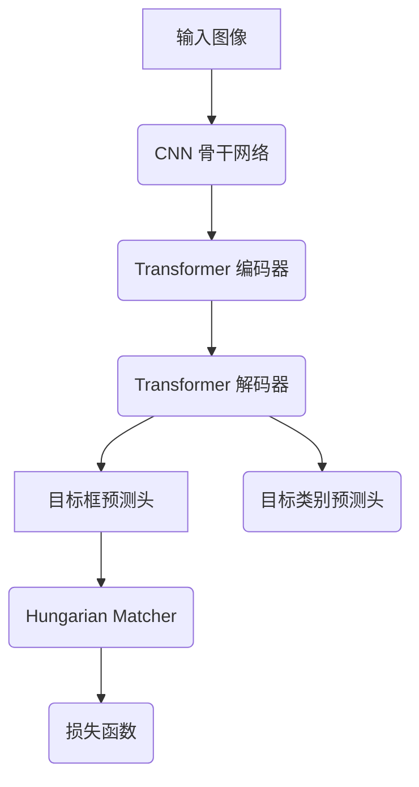

# "详述DETR的预训练模型的选择与应用"

## 1.背景介绍

### 1.1 计算机视觉任务概述

计算机视觉是人工智能领域的一个重要分支,旨在使计算机能够获取、处理、分析和理解数字图像或视频中包含的信息。它涉及多个任务,包括图像分类、目标检测、语义分割、实例分割、姿态估计等。其中,目标检测是最基础和最具挑战性的任务之一,旨在定位图像中的目标并识别它们的类别。

### 1.2 目标检测方法发展历程  

早期的目标检测方法主要基于传统的机器学习算法,如滑动窗口、级联分类器等。这些方法需要手工设计特征,计算量大、检测速度慢、准确率有限。

近年来,随着深度学习的兴起,基于卷积神经网络(CNN)的目标检测算法取得了长足进展,大幅提升了检测精度。这些算法可分为两大类:

1. **单阶段检测器**,如YOLO、SSD等,将目标检测看作一个回归问题,直接预测目标的类别和位置,计算高效但精度相对较低。

2. **双阶段检测器**,如Faster R-CNN、Mask R-CNN等,先生成候选区域,再对每个候选区域进行分类和位置精修,精度较高但运算复杂度大。

### 1.3 DETR概述

尽管双阶段检测器取得了不错的性能,但其仍存在一些缺陷,如需要手工设计锚框、不适用于任意数量的目标等。2020年,Facebook AI研究院提出了一种全新的基于Transformer的目标检测器DETR(DEtection TRansformer),旨在克服传统目标检测器的缺点。DETR将目标检测问题建模为一个集合预测问题,通过全局关注机制直接并行预测图像中的所有目标,无需生成候选区域和手工设计锚框。

DETR的创新之处在于将Transformer编码器-解码器结构引入目标检测任务,并采用新颖的集合损失函数。虽然DETR在精度方面超过了以往的检测器,但其推理速度较慢,训练收敛性较差。因此,选择合适的预训练模型对于提高DETR的性能至关重要。

## 2.核心概念与联系  

### 2.1 Transformer模型

Transformer是一种全新的基于注意力机制的序列到序列模型,由Google在2017年提出,主要用于自然语言处理任务。它完全摒弃了RNN和CNN等传统结构,使用多头自注意力机制来捕获输入序列中任意两个位置之间的依赖关系。

Transformer由编码器(Encoder)和解码器(Decoder)两部分组成:

- **编码器**将输入序列映射到连续的表示
- **解码器**将编码器输出与输出序列进行序列到序列的映射

Transformer模型具有并行性强、长期依赖建模能力强等优点,在机器翻译、语音识别等NLP任务上取得了卓越的成绩,也被成功应用于计算机视觉领域。

### 2.2 DETR模型 

DETR的整体架构如下:

具体来说:

1. **CNN骨干网络**:用于从输入图像中提取特征图,如ResNet、EfficientNet等。
2. **Transformer编码器**:对CNN提取的特征图进行编码,产生对应于每个扁平化特征向量的键(Key)和值(Value)。
3. **Transformer解码器**:将一个可学习的查询(Query)作为输入,与编码器的输出进行注意力交互,预测一组目标框和类别。
4. **目标框预测头**:基于解码器输出预测一组无标记的目标框坐标。
5. **目标类别预测头**:基于解码器输出预测每个目标框对应的目标类别。
6. **Hungarian Matcher**:优化目标分配,通过计算预测框与真实框之间的成本矩阵,找到最优的双向匹配。
7. **损失函数**:包含两部分,目标框损失和类别损失,用于训练网络参数。

### 2.3 预训练模型

深度神经网络在训练过程中往往需要大量的数据和计算资源。为了加速训练收敛并提高模型泛化能力,通常会采用在大型数据集上预训练的模型作为网络的初始化参数或backbone,然后在目标任务的数据集上进行微调(fine-tune)。

对于DETR模型,可以分别对其CNN骨干网络和Transformer编码器-解码器进行预训练。预训练的模型包括:

- 对于CNN骨干网络,可使用在ImageNet等大型数据集上预训练的模型,如ResNet、EfficientNet等。
- 对于Transformer编码器-解码器,可使用在大型文本语料上预训练的NLP模型,如BERT、RoBERTa等,或在大型视觉数据集上预训练的视觉Transformer模型。

合理选择和利用预训练模型,能够显著提高DETR在下游目标检测任务上的性能表现。

## 3.核心算法原理具体操作步骤

### 3.1 DETR模型输入输出

DETR模型的输入是一个大小为(3 x H x W)的RGB图像张量,其中H和W分别是图像的高度和宽度。

模型的输出是一组无标记的目标框坐标及其对应的类别标签。具体来说:

- **目标框坐标**: (N x 4)的张量,N为预测的目标框数量,每个目标框由4个值表示,分别是左上角和右下角的(x, y)坐标。
- **类别标签**: (N x C)的张量,C为类别数量,每行表示对应目标框的类别概率分布。

### 3.2 DETR模型前向传播

DETR模型的前向传播过程可分为以下几个步骤:

1. **特征提取**: 输入图像经过CNN骨干网络,提取一个大小为(C x H' x W')的特征图张量,其中C是通道数,H'和W'分别是特征图的高度和宽度。

2. **特征编码**: 将CNN提取的特征图输入Transformer编码器,生成对应于每个扁平化特征向量的键(Key)和值(Value)。

3. **目标框解码**: 将一个可学习的查询(Query)输入Transformer解码器,与编码器的输出进行注意力交互,产生一个(N x d)大小的解码输出张量,其中N是预测目标框数量,d是解码输出的特征维度。

4. **目标框预测**: 将解码输出张量输入到目标框预测头,预测一组无标记的目标框坐标。

5. **类别预测**: 将解码输出张量输入到类别预测头,预测每个目标框对应的目标类别。

### 3.3 目标分配与损失计算

由于DETR直接预测一组无标记的目标框及其类别,因此需要一种机制来将预测结果与真实目标框进行最优匹配,并据此计算损失函数。DETR采用了Hungarian算法来解决这个最优分配问题。

具体步骤如下:

1. **计算成本矩阵**: 对于每对预测框和真实框,计算它们的成本,包括两部分:目标框成本和类别成本。目标框成本基于预测框与真实框的几何相似性,如IoU(交并比)、GIoU(GeneraizedIoU)等;类别成本基于预测类别与真实类别的差异,如交叉熵损失。

2. **匈牙利算法**: 基于计算出的成本矩阵,采用匈牙利算法找到一个双向最优匹配,将每个预测框与真实框或背景类别进行匹配。

3. **损失计算**: 根据匹配结果,计算目标框损失(如L1损失)和类别损失(如交叉熵损失),并将两部分加权求和作为总损失函数。

4. **反向传播**: 使用总损失函数对DETR模型的参数进行梯度更新。

### 3.4 DETR推理过程

在推理阶段,DETR模型会生成一组无标记的目标框及其对应的类别概率分布。为获得最终的检测结果,需要进行如下后处理步骤:

1. **去除背景框**: 移除类别为背景的预测框。

2. **非极大值抑制(NMS)**: 对剩余的预测框应用NMS,去除重叠度较高的冗余框。

3. **置信度阈值过滤**: 根据类别概率,过滤掉置信度较低的预测框。

4. **输出检测结果**: 输出最终的检测框坐标、类别和置信度。

## 4.数学模型和公式详细讲解举例说明

### 4.1 Transformer编码器

Transformer编码器的核心是多头自注意力机制,可以有效捕获输入序列中任意两个位置之间的长程依赖关系。

对于输入序列$X = (x_1, x_2, ..., x_n)$,其中$x_i \in \mathbb{R}^{d_x}$,多头自注意力的计算过程如下:

$$
\begin{aligned}
    \text{MultiHead}(Q, K, V) &= \text{Concat}(\text{head}_1, ..., \text{head}_h)W^O\\
    \text{where} \quad \text{head}_i &= \text{Attention}(QW_i^Q, KW_i^K, VW_i^V)
\end{aligned}
$$

其中$Q$、$K$、$V$分别是查询(Query)、键(Key)和值(Value)矩阵,通过线性变换$W^Q$、$W^K$、$W^V$获得。$\text{Attention}$函数计算如下:

$$
\text{Attention}(Q, K, V) = \text{softmax}(\frac{QK^T}{\sqrt{d_k}})V
$$

通过多头注意力机制,Transformer编码器能够从不同的表示子空间捕获输入序列中的重要信息,并通过前馈网络进一步处理,最终生成编码输出。

### 4.2 匈牙利算法

匈牙利算法是一种用于求解线性赋值问题的算法,可以在DETR中用于将预测框与真实框进行最优匹配。

给定一个$m \times n$的代价矩阵$C$,其中$C_{ij}$表示将第$i$个工人分配给第$j$个工作的代价,匈牙利算法的目标是找到一个完美匹配,使得总代价最小。

算法的基本思路是:

1. 为每一行减去该行的最小值,得到新矩阵$C'$。
2. 对于$C'$的每一列,减去该列的最小值,得到新矩阵$C''$。
3. 用最少条线划掉$C''$中所有的0,使得没有一行或一列完全被划掉。
4. 如果划线的条数等于$\min(m,n)$,说明可以找到完美匹配,否则继续执行步骤5。
5. 在$C''$中找到一个未被划线覆盖的最小元素$C''_{ij}$,将其加到所有被划线覆盖的元素上,并从所有未被划线覆盖的元素中减去该值,得到新矩阵$C'''$,回到步骤3。

重复上述过程,直到找到一个完美匹配。该匹配对应着原代价矩阵$C$中的一个最优指派。

在DETR中,代价矩阵$C$的元素$C_{ij}$表示将第$i$个预测框与第$j$个真实框匹配的成本,包括目标框成本和类别成本两部分。匈牙利算法可以找到一个最优匹配,使得总成本最小,从而用于计算目标框损失和类别损失。

### 4.3 损失函数

DETR的损失函数由两部分组成:目标框损失和类别损失。

**目标框损失**:

对于每对匹配的预测框$\hat{y}$和真实框$y$,目标框损失采用了GeneralizedIoU(GIoU)损失:

$$
\mathcal{L}_{box}(\hat{y}, y) = 1 - \text{GIoU}(\hat{y}, y)
$$

其中$\text{GIoU}$是IoU(交并比)的一种变体,不