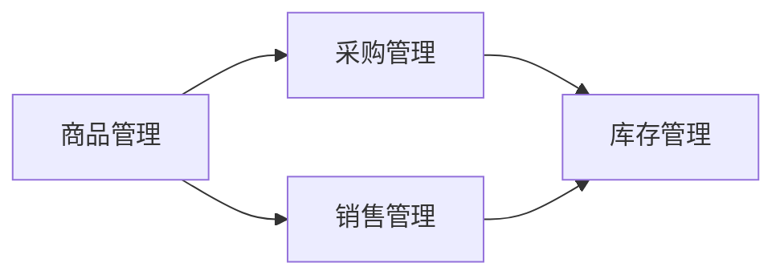

## 1. 背景介绍

### 1.1 超市进销存管理的必要性

随着社会经济的快速发展和人们生活水平的不断提高，超市行业竞争日益激烈。高效、准确的进销存管理对于超市的生存和发展至关重要。传统的进销存管理模式存在着效率低下、数据不准确、信息不透明等问题，难以满足现代超市的管理需求。

### 1.2  超市进销存管理系统概述

超市进销存管理系统是利用计算机技术对超市的采购、销售、库存等业务进行全面的管理，以提高超市的运营效率和效益。该系统可以实现商品信息的自动化管理、库存的实时监控、销售数据的分析统计等功能，为超市的决策提供科学依据。

### 1.3  系统目标

本系统的设计目标是构建一个功能完善、性能稳定、易于操作的超市进销存管理系统，以满足以下需求：

*   实现商品信息的自动化管理，包括商品的添加、修改、删除、查询等功能。
*   实现库存的实时监控，包括库存预警、库存盘点、库存报表等功能。
*   实现销售数据的分析统计，包括销售报表、利润分析、客户关系管理等功能。
*   提高超市的运营效率和效益，降低管理成本。

## 2. 核心概念与联系

### 2.1 商品管理

*   **商品信息:**  包括商品编号、商品名称、商品类别、规格、单位、进价、售价、库存数量等。
*   **商品分类:**  根据商品的属性进行分类，例如食品、饮料、日用品等。
*   **商品编码:**  为每个商品分配唯一的编码，方便商品的管理和查询。
*   **商品库存:**  记录每个商品的当前库存数量。

### 2.2 采购管理

*   **采购订单:**  记录每次采购的商品信息、数量、价格等。
*   **供应商管理:**  记录供应商的信息，例如供应商名称、联系方式、地址等。
*   **采购入库:**  将采购的商品入库，更新商品库存。

### 2.3 销售管理

*   **销售订单:**  记录每次销售的商品信息、数量、价格等。
*   **客户管理:**  记录客户的信息，例如客户名称、联系方式、地址等。
*   **销售出库:**  将销售的商品出库，更新商品库存。

### 2.4 库存管理

*   **库存预警:**  当商品库存低于预警值时，系统自动发出预警信息。
*   **库存盘点:**  定期对商品库存进行盘点，核实库存数量。
*   **库存报表:**  生成各种库存报表，例如库存汇总表、库存明细表等。

### 2.5  核心概念间的关系



## 3. 核心算法原理具体操作步骤

### 3.1  商品入库算法

1.  接收采购订单信息，包括商品编号、商品数量、进价等。
2.  根据商品编号查询商品信息，获取商品的当前库存数量。
3.  将采购数量添加到商品的当前库存数量中。
4.  更新商品的库存信息。

### 3.2  商品销售算法

1.  接收销售订单信息，包括商品编号、商品数量、售价等。
2.  根据商品编号查询商品信息，获取商品的当前库存数量。
3.  判断商品库存是否充足，如果不足则提示库存不足。
4.  从商品的当前库存数量中扣除销售数量。
5.  更新商品的库存信息。

### 3.3  库存预警算法

1.  设定商品的库存预警值。
2.  定期检查商品的库存数量。
3.  如果商品的库存数量低于预警值，则发出预警信息。

## 4. 数学模型和公式详细讲解举例说明

### 4.1  库存周转率

库存周转率是指一定时期内库存商品的周转次数，是衡量企业库存管理效率的重要指标。

**公式:**

```
库存周转率 = 年销售成本 / 年平均库存价值
```

**举例说明:**

某超市的年销售成本为 100 万元，年平均库存价值为 20 万元，则该超市的库存周转率为：

```
库存周转率 = 100 / 20 = 5
```

这意味着该超市的库存商品一年周转了 5 次。

### 4.2  毛利率

毛利率是指商品的销售毛利占销售收入的百分比，是衡量企业盈利能力的重要指标。

**公式:**

```
毛利率 = (销售收入 - 销售成本) / 销售收入 * 100%
```

**举例说明:**

某超市销售一件商品的售价为 100 元，成本为 60 元，则该商品的毛利率为：

```
毛利率 = (100 - 60) / 100 * 100% = 40%
```

## 5. 项目实践：代码实例和详细解释说明

### 5.1  技术选型

*   **开发语言:** Java
*   **数据库:** MySQL
*   **框架:** Spring Boot

### 5.2  数据库设计

```sql
-- 商品表
CREATE TABLE goods (
  id INT PRIMARY KEY AUTO_INCREMENT,
  name VARCHAR(255) NOT NULL,
  category VARCHAR(255) NOT NULL,
  specification VARCHAR(255) NOT NULL,
  unit VARCHAR(255) NOT NULL,
  purchase_price DECIMAL(10, 2) NOT NULL,
  selling_price DECIMAL(10, 2) NOT NULL,
  stock_quantity INT NOT NULL
);

-- 采购订单表
CREATE TABLE purchase_order (
  id INT PRIMARY KEY AUTO_INCREMENT,
  goods_id INT NOT NULL,
  quantity INT NOT NULL,
  purchase_price DECIMAL(10, 2) NOT NULL,
  create_time TIMESTAMP DEFAULT CURRENT_TIMESTAMP
);

-- 销售订单表
CREATE TABLE sales_order (
  id INT PRIMARY KEY AUTO_INCREMENT,
  goods_id INT NOT NULL,
  quantity INT NOT NULL,
  selling_price DECIMAL(10, 2) NOT NULL,
  create_time TIMESTAMP DEFAULT CURRENT_TIMESTAMP
);
```

### 5.3  核心代码

#### 5.3.1 商品入库

```java
@Service
public class GoodsServiceImpl implements GoodsService {

    @Autowired
    private GoodsRepository goodsRepository;

    @Override
    public void purchaseGoods(PurchaseOrder purchaseOrder) {
        // 根据商品编号查询商品信息
        Goods goods = goodsRepository.findById(purchaseOrder.getGoodsId()).orElseThrow(() -> new NotFoundException("商品不存在"));

        // 更新商品库存
        goods.setStockQuantity(goods.getStockQuantity() + purchaseOrder.getQuantity());
        goodsRepository.save(goods);
    }
}
```

#### 5.3.2 商品销售

```java
@Service
public class GoodsServiceImpl implements GoodsService {

    @Autowired
    private GoodsRepository goodsRepository;

    @Override
    public void saleGoods(SalesOrder salesOrder) {
        // 根据商品编号查询商品信息
        Goods goods = goodsRepository.findById(salesOrder.getGoodsId()).orElseThrow(() -> new NotFoundException("商品不存在"));

        // 判断商品库存是否充足
        if (goods.getStockQuantity() < salesOrder.getQuantity()) {
            throw new InsufficientStockException("商品库存不足");
        }

        // 更新商品库存
        goods.setStockQuantity(goods.getStockQuantity() - salesOrder.getQuantity());
        goodsRepository.save(goods);
    }
}
```

## 6. 实际应用场景

### 6.1  大型连锁超市

大型连锁超市拥有庞大的商品种类和数量，需要高效的进销存管理系统来管理商品信息、库存、销售等业务。

### 6.2  中小型超市

中小型超市也需要进销存管理系统来提高运营效率，降低管理成本。

### 6.3  便利店

便利店的商品种类相对较少，但需要对商品的保质期进行严格管理，进销存管理系统可以帮助便利店进行商品的保质期管理。

## 7. 工具和资源推荐

### 7.1  数据库管理工具

*   **Navicat:**  一款功能强大的数据库管理工具，支持多种数据库。
*   **DataGrip:**  JetBrains 公司出品的数据库管理工具，功能强大，易于使用。

### 7.2  代码编辑器

*   **IntelliJ IDEA:**  JetBrains 公司出品的 Java 集成开发环境，功能强大，易于使用。
*   **Eclipse:**  一款开源的 Java 集成开发环境，功能强大，插件丰富。

### 7.3  学习资源

*   **Spring Boot 官方文档:**  https://spring.io/projects/spring-boot
*   **MySQL 官方文档:**  https://dev.mysql.com/doc/

## 8. 总结：未来发展趋势与挑战

### 8.1  未来发展趋势

*   **智能化:**  利用人工智能技术，实现商品的自动补货、智能推荐等功能。
*   **移动化:**  开发移动端应用程序，方便管理人员随时随地查看库存、销售等信息。
*   **云计算:**  将进销存管理系统部署到云平台，提高系统的 scalability 和 reliability。

### 8.2  挑战

*   **数据安全:**  随着数据量的不断增大，数据安全问题日益突出。
*   **系统性能:**  随着业务量的增长，系统的性能需要不断优化。
*   **用户体验:**  需要不断提升系统的用户体验，方便用户操作。

## 9. 附录：常见问题与解答

### 9.1  如何添加新商品？

1.  进入商品管理模块。
2.  点击“添加商品”按钮。
3.  填写商品信息，包括商品编号、商品名称、商品类别、规格、单位、进价、售价等。
4.  点击“保存”按钮。

### 9.2  如何进行库存盘点？

1.  进入库存管理模块。
2.  点击“库存盘点”按钮。
3.  选择要盘点的商品。
4.  输入实际库存数量。
5.  点击“保存”按钮。

### 9.3  如何查看销售报表？

1.  进入销售管理模块。
2.  点击“销售报表”按钮。
3.  选择报表类型，例如日报表、月报表等。
4.  选择报表时间段。
5.  点击“生成报表”按钮。
