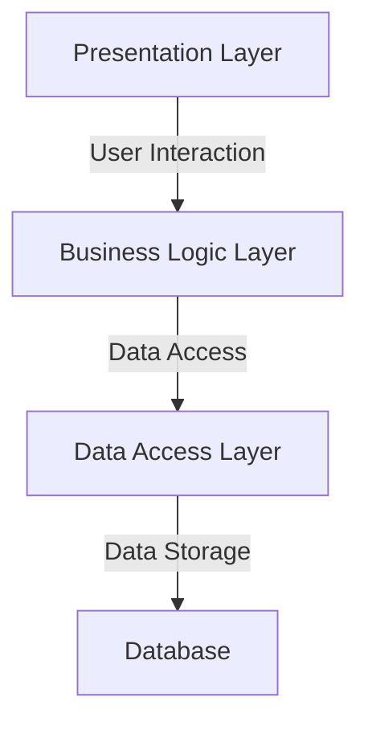

# 进销存财务管理系统详细设计与具体代码实现

## 1. 背景介绍

### 1.1 进销存财务管理系统的重要性

在任何企业运营中，进销存和财务管理系统都扮演着至关重要的角色。它们负责跟踪企业的存货水平、销售记录、采购订单以及整体财务状况。有效的进销存和财务管理不仅可以提高企业的运营效率,还能帮助企业做出明智的决策,从而提高盈利能力和竞争力。

### 1.2 传统进销存财务管理系统的缺陷

传统的进销存和财务管理系统通常依赖于手动输入和纸质记录,这种方式不仅效率低下,而且容易出错。此外,这些系统通常无法实现实时数据更新和跨部门协作,导致信息孤岛和数据不一致的问题。

### 1.3 现代进销存财务管理系统的优势

随着信息技术的快速发展,现代进销存和财务管理系统已经实现了自动化、集成化和实时更新。这些系统可以无缝集成企业的各个部门,提供统一的数据视图,从而提高企业的运营效率和决策质量。

## 2. 核心概念与联系

### 2.1 进销存管理

进销存管理是指对企业存货的采购、储存、销售和记录进行有效管理的过程。它包括以下几个关键概念:

#### 2.1.1 采购管理

采购管理负责根据销售预测和现有库存情况,制定采购计划并下达采购订单。它需要考虑供应商的交货时间、价格和质量等因素。

#### 2.1.2 库存管理

库存管理负责跟踪企业的实际库存水平,并根据预定的库存策略(如经济订货量模型)进行补货。它还需要处理库存的进出记录、盘点等工作。

#### 2.1.3 销售管理

销售管理负责跟踪客户订单、发货情况以及销售收入。它还需要处理客户关系管理、促销活动等相关工作。

### 2.2 财务管理

财务管理是指对企业的资金流动、成本核算和财务报表等进行有效管理的过程。它包括以下几个关键概念:

#### 2.2.1 现金管理

现金管理负责监控企业的现金流入和流出,确保企业有足够的现金来支付日常运营和投资需求。

#### 2.2.2 应收账款管理

应收账款管理负责跟踪客户的付款情况,并采取适当的措施来收回欠款。

#### 2.2.3 成本核算

成本核算负责记录和分析企业的各项成本,包括原材料成本、人工成本和制造费用等,以便进行成本控制和决策分析。

#### 2.2.4 财务报表编制

财务报表编制负责根据企业的会计记录,编制资产负债表、利润表和现金流量表等财务报表,反映企业的财务状况和经营成果。

### 2.3 进销存管理与财务管理的联系

进销存管理和财务管理虽然涉及不同的业务领域,但它们之间存在着密切的联系:

- 进销存管理会直接影响企业的存货水平和销售收入,这些数据是编制财务报表的重要依据。
- 财务管理需要依赖进销存管理提供的数据,如采购成本、销售收入等,来进行成本核算和现金流预测。
- 两者都需要共享企业的基本信息,如产品信息、客户信息和供应商信息等。

因此,一个完整的进销存财务管理系统需要将这两个模块紧密集成,实现数据共享和业务协同,从而提高企业的整体运营效率。

## 3. 核心算法原理具体操作步骤

### 3.1 经济订货量(EOQ)模型

经济订货量模型是库存管理中一个非常重要的概念,它旨在确定每次采购的最佳订货量,以最小化采购成本和库存持有成本的总和。该模型的核心假设包括:

- 需求已知且恒定
- 无缺货情况
- 订货成本和库存持有成本已知且恒定
- 订货量和交货时间已知且恒定

根据这些假设,经济订货量可以通过以下公式计算:

$$EOQ = \sqrt{\frac{2DP}{H}}$$

其中:
- $D$ 表示年度需求量
- $P$ 表示每次订货的固定成本
- $H$ 表示每单位产品的年度库存持有成本

该模型的具体操作步骤如下:

1. 收集相关数据,包括年度需求量、订货成本和库存持有成本等。
2. 将数据代入经济订货量公式,计算出最佳订货量。
3. 根据最佳订货量和年度需求量,确定订货周期(即两次连续订货之间的时间间隔)。
4. 建立库存监控系统,当库存水平低于重新订货点时,下达采购订单。
5. 持续监控实际需求和成本变化,适时调整订货量和订货周期。

### 3.2 ABC分类法

ABC分类法是一种常用的库存管理技术,它根据产品的重要性或价值将其分为三类:A类、B类和C类。通常情况下,A类产品虽然只占总品种的20%左右,但占总库存价值的80%以上;而C类产品则占总品种的50%左右,但只占总库存价值的5%左右。

ABC分类法的具体操作步骤如下:

1. 收集所有产品的年度需求量和单位成本数据。
2. 计算每种产品的年度库存价值(年度需求量x单位成本)。
3. 按照年度库存价值从高到低对产品进行排序。
4. 将前20%的产品划分为A类,接下来的30%划分为B类,剩余的50%划分为C类。
5. 对不同类别的产品采取不同的库存管理策略:
   - A类产品:采用严格的库存控制,保持较低的安全库存水平,并频繁进行库存盘点。
   - B类产品:采用一般的库存控制,设置适当的安全库存水平,并定期进行库存盘点。
   - C类产品:采用宽松的库存控制,设置较高的安全库存水平,并不太频繁地进行库存盘点。

通过ABC分类法,企业可以将有限的资源集中用于管理最重要的A类产品,从而提高库存管理的效率和效果。

## 4. 数学模型和公式详细讲解举例说明 

### 4.1 经济订货量(EOQ)模型

在3.1节中,我们已经介绍了经济订货量模型的基本公式:

$$EOQ = \sqrt{\frac{2DP}{H}}$$

其中:
- $D$ 表示年度需求量
- $P$ 表示每次订货的固定成本
- $H$ 表示每单位产品的年度库存持有成本

让我们通过一个具体的例子来说明该模型的应用。

**例子:**

某公司生产电脑配件,年度需求量为10,000个,每次订货的固定成本为200元,每个配件的年度库存持有成本为5元。请计算该公司的经济订货量。

**解答:**

给定:
- $D = 10,000$
- $P = 200$
- $H = 5$

将这些数值代入经济订货量公式,我们可以得到:

$$EOQ = \sqrt{\frac{2 \times 10,000 \times 200}{5}} = 1,000$$

因此,该公司的经济订货量为1,000个配件。

通过计算经济订货量,企业可以确定每次采购的最佳数量,从而最小化采购成本和库存持有成本的总和。同时,企业还需要根据实际情况调整相关参数,以适应市场和需求的变化。

### 4.2 ABC分类法

在3.2节中,我们介绍了ABC分类法的基本原理和操作步骤。现在,让我们通过一个具体的例子来说明该方法的应用。

**例子:**

某零售商销售五种不同的产品(A、B、C、D和E)。下表显示了每种产品的年度需求量和单位成本:

| 产品 | 年度需求量 | 单位成本(元) |
|------|------------|--------------|
| A    | 5,000      | 20           |
| B    | 8,000      | 15           |
| C    | 10,000     | 10           |
| D    | 3,000      | 25           |
| E    | 2,000      | 30           |

请根据ABC分类法对这五种产品进行分类。

**解答:**

1. 计算每种产品的年度库存价值:
   - 产品A: 5,000 x 20 = 100,000
   - 产品B: 8,000 x 15 = 120,000
   - 产品C: 10,000 x 10 = 100,000
   - 产品D: 3,000 x 25 = 75,000
   - 产品E: 2,000 x 30 = 60,000

2. 按照年度库存价值从高到低对产品进行排序:
   1. 产品B: 120,000
   2. 产品A: 100,000
   3. 产品C: 100,000
   4. 产品D: 75,000
   5. 产品E: 60,000

3. 将前20%的产品划分为A类,接下来的30%划分为B类,剩余的50%划分为C类:
   - A类: 产品B
   - B类: 产品A、产品C
   - C类: 产品D、产品E

根据ABC分类法的结果,零售商可以采取不同的库存管理策略,如为A类产品(产品B)实施严格的库存控制,为B类产品(产品A和C)采用一般的库存控制,而对C类产品(产品D和E)采用宽松的库存控制。这样可以有效地分配企业的资源,提高库存管理的效率。

## 5. 项目实践:代码实例和详细解释说明

在本节中,我们将通过一个具体的项目实践来演示如何使用编程语言(如Java或Python)实现进销存财务管理系统的核心功能。

### 5.1 系统架构

我们将采用三层架构(Presentation Layer、Business Logic Layer和Data Access Layer)来设计和实现该系统。这种架构可以有效地分离不同的关注点,提高代码的可维护性和可扩展性。



- **Presentation Layer:** 负责与用户交互,包括接收用户输入和显示系统输出。
- **Business Logic Layer:** 负责实现系统的核心业务逻辑,如进销存管理、财务管理等。
- **Data Access Layer:** 负责与数据库进行交互,执行数据的增删改查操作。
- **Database:** 用于存储系统的数据,如产品信息、订单记录、财务数据等。

### 5.2 核心类设计

以下是系统中一些核心类的设计:

#### 5.2.1 Product类

```python
class Product:
    def __init__(self, product_id, name, unit_price):
        self.product_id = product_id
        self.name = name
        self.unit_price = unit_price
```

`Product`类用于表示一种产品,包含产品ID、名称和单价等属性。

#### 5.2.2 Inventory类

```python
class Inventory:
    def __init__(self):
        self.products = {}

    def add_product(self, product, quantity):
        if product.product_id in self.products:
            self.products[product.product_id]['quantity'] += quantity
        else:
            self.products[product.product_id] = {
                'product': product,
                'quantity': quantity
            }

    def remove_product(self, product_id, quantity):
        if product_id in self.products:
            self.products[product_id]['quantity'] -= quantity
        else:
            raise Exception(f"Product {product_id} not found in inventory")
```

`Inventory`类用于管理库存,支持添加和移除产品等操作。它使用字典来存储每种产品的信息和数量。

#### 5.2.3 Order类

```python
class Order:
    def __init__(self, order_id, customer_id, order_date):
        self.order_id = order_id
        self.customer_id = customer_id
        self.order_date = order_date
        self.items = []

    def add_item(self, product, quantity, unit_price):
        self.items.append({
            'product': product,
            'quantity': quantity,
            'unit_price': unit_price
        })

    def calculate_total(self):
        total = 0
        for item in self.items:
            total += item['quantity'] * item['unit_