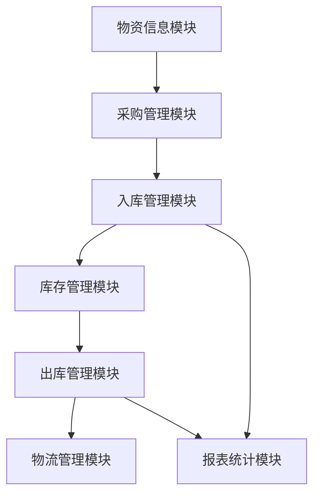
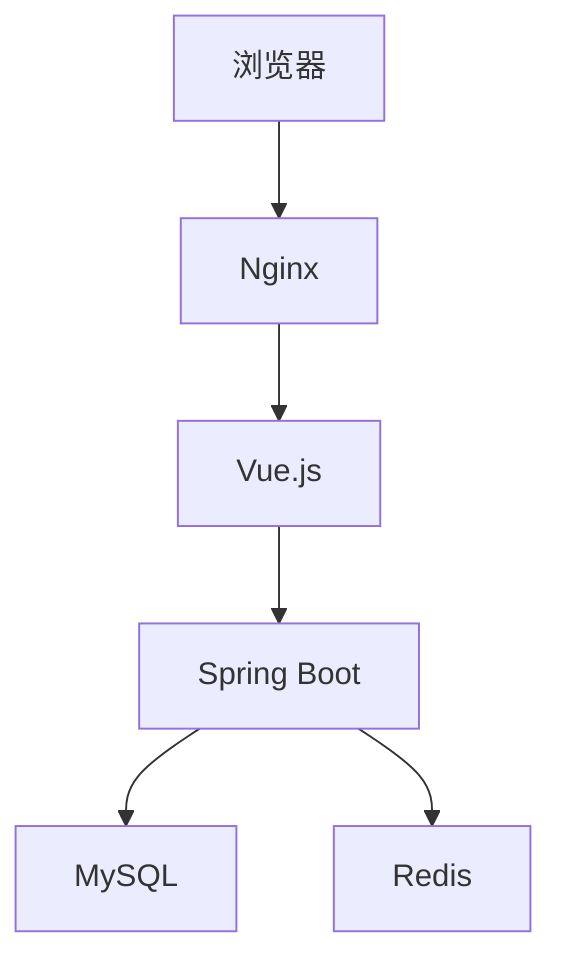

# 酒店仓库管理系统详细设计与具体代码实现

## 1.背景介绍

### 1.1 酒店仓库管理的重要性
在酒店运营中,仓库管理系统扮演着至关重要的角色。它确保了酒店各个部门所需物资的及时供应,保证了酒店服务的顺利运行。良好的仓库管理可以:

- 降低库存成本
- 优化物流效率
- 规避物资短缺风险
- 提高服务质量

### 1.2 传统仓库管理弊端
然而,传统的手工仓库管理存在诸多弊端:

- 人工操作效率低下
- 纸质记录容易出错
- 实时库存查询困难
- 缺乏智能化预警功能

这些问题直接影响了酒店运营效率,亟需通过数字化信息系统予以解决。

### 1.3 信息化仓库管理优势
基于上述背景,开发一套专业的酒店仓库管理信息系统就显得尤为必要。这种系统可以:

- 自动化采购、入库、出库流程
- 实时监控库存水平
- 智能分析物资消耗规律
- 整合供应链物流信息

从而全面提升仓库管理的现代化水平。

## 2.核心概念与联系  

### 2.1 系统架构概览
酒店仓库管理系统由以下几个核心模块组成:

- 物资信息模块
- 采购管理模块 
- 入库管理模块
- 出库管理模块
- 库存管理模块
- 物流管理模块
- 报表统计模块

各模块相互关联,共同构建了一个完整的仓库管理解决方案。



### 2.2 关键概念解析

1. **物资信息**
   包括物资编号、名称、规格型号、计量单位、库存上下限等基本属性信息。

2. **采购计划**
   根据物资消耗情况和库存水平,自动生成物资采购计划,确定采购数量。

3. **入库单**
   记录物资入库的基本信息,如供应商、批次、数量、入库时间等。

4. **库存盘点**
   定期或实时盘点库存数量,与系统记录核对,保证数据准确性。

5. **出库单**
   记录物资出库的基本信息,如领用部门、数量、出库时间等。

6. **物流信息**
   包括物流公司、运单号、预计到货时间等,确保物资送达可追溯。

7. **报表统计**
   对物资采购、库存、出库等数据进行多维度统计分析,支持决策。

## 3.核心算法原理具体操作步骤

### 3.1 采购计划生成算法

采购计划的生成遵循以下逻辑:

1. 获取各物资最新库存量 $CurrentStock$
2. 计算预测未来一周需求量 $WeekDemand$
3. 若 $CurrentStock - WeekDemand < ReorderPoint$ 
   则触发采购,采购量 $PurchaseQty = EconomicOrderQty - (CurrentStock - WeekDemand)$

其中:

- $ReorderPoint$为物资库存的再订购点
- $EconomicOrderQty$为经济最优订购量,由经典经济订货模型计算得出

$$
EconomicOrderQty = \sqrt{\frac{2DS}{H}}
$$

其中:

- $D$为年度需求量
- $S$为每次订货的固定成本  
- $H$为单位物资的年度存储成本

该算法的优点是:

- 综合考虑库存、需求、成本等因素
- 降低采购和库存成本
- 防止物资短缺和过度库存

### 3.2 智能化库存监控

系统通过设置库存上下限,实现对各物资库存水平的智能监控:

- 库存量 > 上限时,发出过量库存预警
- 库存量 < 下限时,发出库存不足预警,并触发采购流程

这种机制确保库存处于合理水平,避免资金occupation和物资短缺风险。

### 3.3 物资出库优先级调度

对于同种物资的不同批次,系统根据批次入库时间的先后,实现先进先出调度。

对于存在多种替代物资的情况,系统则按照预先设定的优先级出库。例如:

1. 先出库临近保质期的物资
2. 若保质期相近,则先出库便宜的物资

这样可以最大程度地控制库存成本,减少物资损耗。

### 3.4 物流信息追溯

为了保证物资流转的可追溯性,系统与物流公司的信息系统对接,记录并跟踪每一批物资的物流信息,主要包括:

- 物流公司
- 运单号
- 物资出库时间
- 发货地点
- 目的地
- 预计到货时间
- 实际到货时间
- 收货签收人

这种信息一方面方便查询物资去向,防止物资遗失;另一方面也为供应商付款和账目核对提供依据。

## 4.数学模型和公式详细讲解举例说明

### 4.1 经济最优订购量(EOQ)模型

酒店仓库管理中,如何确定物资的最佳采购批量是一个关键问题。过多采购会增加库存成本,过少采购又可能导致物资短缺影响服务。

经典的经济最优订购量(EOQ)模型可以很好地平衡采购成本和库存成本,求解出最优采购批量。

$$
EOQ = \sqrt{\frac{2DS}{H}}
$$

其中:

- $D$为年度需求量
- $S$为每次订货的固定成本(如人工、运输等)
- $H$为单位物资的年度存储成本(如仓储费用、资金占用成本等)

**举例**
某家酒店每年需求餐巾纸10万箱,每次订货的固定成本为1000元,年存储费用为订购量的20%。求最优订购批量。

解:
$D = 100000箱$
$S = 1000元$
$H = 订购量 \times 20\% = 0.2Q$  (Q为订购量)

将这些数值代入EOQ公式:

$$
EOQ = \sqrt{\frac{2\times100000\times1000}{0.2Q}}=\sqrt{1000000000/0.2Q}
$$

因为存储费用与订购量Q成正比,所以只有当Q取最优值EOQ时,总成本才能最小。

令$0.2Q=1000000000/EOQ^2$,得:

$$
Q=EOQ=\sqrt{1000000000/0.2}=\sqrt{5000000000}=\boxed{2236箱}
$$

因此,该酒店最优订购批量为2236箱。

### 4.2 ABC分类与库存控制

在实际情况中,酒店仓库中存在大量种类的物资,针对不同物资的重要程度和价值,应采取差异化的管理策略。ABC分类法就是一种常用的分类管理方法。

**ABC分类原则**:

- A类物资: 占库存价值20%,但物资种类仅10%左右,应重点控制
- B类物资: 占库存价值30%,物资种类25%左右,适当控制  
- C类物资: 占库存价值50%,但物资种类65%左右,可简化控制

**A类物资管理策略**:

- 设置较高的安全库存水平,降低缺货率
- 采购批量较小,减少库存积压
- 密切监控库存,实行严格管控

**B类物资管理策略**：

- 安全库存和采购批量适中
- 定期审视库存,动态调整策略  

**C类物资管理策略**：

- 安全库存水平较低
- 采购批量较大,减少订货频次
- 简化库存控制流程

通过ABC分类,可以合理分配管理资源,提高库存管理效率。

## 5.项目实践:代码实例和详细解释说明  

### 5.1 系统架构与技术选型

本系统采用B/S架构,前端使用Vue.js框架,后端采用Spring Boot框架。

数据库选用高性能的MySQL,并使用Redis进行缓存加速。

系统架构如下:



### 5.2 物资信息模块代码示例

**1. 物资信息实体类(Java)**

```java
@Entity
public class Material {
    @Id
    @GeneratedValue(strategy = GenerationType.IDENTITY)
    private Long id;
    private String code; //物资编码
    private String name; //物资名称
    private String unit; //计量单位
    private BigDecimal price; //参考单价
    private Integer minStock; //最低库存
    private Integer maxStock; //最高库存
    //...构造函数、Getter/Setter方法
}
```

**2. 物资信息管理服务层(Java)**

```java
@Service
public class MaterialService {
    @Autowired
    private MaterialRepository repository;

    //添加新物资信息
    public Material addMaterial(Material material) {
        return repository.save(material);
    }
    
    //查询物资信息
    public List<Material> getAllMaterials() {
        return repository.findAll();
    }
    
    //更新物资信息
    public Material updateMaterial(Material material) {
        return repository.save(material);
    }
    
    //删除物资信息
    public void deleteMaterial(Long id) {
        repository.deleteById(id);
    }
}
```

**3. 物资信息展示组件(Vue)**

```html
<template>
  <div>
    <el-table :data="materials">
      <el-table-column prop="code" label="编码"></el-table-column>
      <el-table-column prop="name" label="名称"></el-table-column>
      <el-table-column prop="unit" label="单位"></el-table-column>
      <el-table-column prop="price" label="单价"></el-table-column>
      <el-table-column prop="minStock" label="最低库存"></el-table-column>
      <el-table-column prop="maxStock" label="最高库存"></el-table-column>
    </el-table>
  </div>
</template>

<script>
import axios from 'axios'

export default {
  data() {
    return {
      materials: []
    }
  },
  created() {
    this.fetchMaterials()
  },
  methods: {
    fetchMaterials() {
      axios.get('/api/materials').then(res => {
        this.materials = res.data
      })
    }
  }
}
</script>
```

上述代码展示了物资信息模块的基本实现:

- 后端使用Spring Data JPA操作MySQL数据库
- 前端Vue组件通过Axios从后端获取物资信息数据
- 使用ElementUI的Table组件在页面中展示物资列表

### 5.3 入库管理模块代码示例  

**1. 入库单实体类(Java)**

```java
@Entity
public class InboundOrder {
    @Id 
    @GeneratedValue(strategy = GenerationType.IDENTITY)
    private Long id;
    private String code; //入库单编号
    @ManyToOne
    private Supplier supplier; //供应商
    @OneToMany(mappedBy = "inboundOrder")
    private List<InboundItem> items = new ArrayList<>(); //入库明细
    private LocalDateTime inboundTime; //入库时间
    //...构造函数、Getter/Setter方法
}

@Entity
public class InboundItem {
    @Id
    @GeneratedValue(strategy = GenerationType.IDENTITY) 
    private Long id;
    @ManyToOne
    private InboundOrder inboundOrder; //所属入库单
    @ManyToOne 
    private Material material; //物资
    private Integer quantity; //入库数量
    private BigDecimal unitPrice; //单价
    //...构造函数、Getter/Setter方法  
}
```

**2. 入库单管理服务层(Java)**

```java
@Service
public class InboundService {
    @Autowired
    private InboundOrderRepository repository;
    
    //新建入库单
    public InboundOrder createOrder(InboundOrder order) {
        order.setCode(generateUniqueCode()); //生成入库单编号
        order.setInboundTime(LocalDateTime.now()); //设置入库时间
        return repository.save(order);
    }
    
    //根据单号查询入库单
    public Optional<InboundOrder> getOrderByCode(String code) {
        return repository.findByCode(code);
    }
    
    //生成唯一入库单编号
    private String generateUniqueCode() {
        //...编号生成逻辑
    }
}
```

**3. 入库单提交组件(Vue)**

```html
<template>
  <div>
    <el-form @submit.native.prevent="handleSubmit">
      