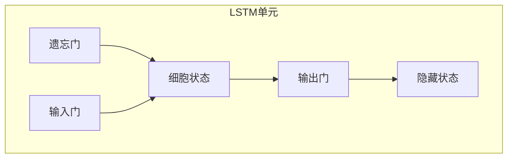

# 长短期记忆网络 (LSTM)

## 1.背景介绍

### 1.1 序列数据处理的重要性

在现实世界中,我们经常会遇到各种序列数据,如自然语言文本、语音信号、视频帧序列等。能够有效地处理这些序列数据对于许多应用领域都至关重要,例如语音识别、机器翻译、时间序列预测等。传统的机器学习算法如前馈神经网络在处理这类数据时存在着固有的缺陷,无法很好地捕捉序列数据中的长期依赖关系。

### 1.2 循环神经网络的局限性

为了解决序列数据处理的问题,循环神经网络(Recurrent Neural Networks, RNNs)应运而生。RNNs通过引入循环连接,使得网络在处理序列时能够捕捉到当前输入与之前状态之间的动态依赖关系。然而,传统的RNNs在学习长期依赖关系时仍然存在梯度消失或爆炸的问题,这严重限制了它们在实际应用中的表现。

### 1.3 长短期记忆网络的提出

为了克服RNNs的上述缺陷,1997年,Sepp Hochreiter和Jurgen Schmidhuber提出了长短期记忆网络(Long Short-Term Memory, LSTM)。LSTM通过精心设计的门控机制和状态传递方式,有效地解决了长期依赖问题,从而在许多序列建模任务上取得了卓越的成绩。

## 2.核心概念与联系

### 2.1 LSTM的核心思想

LSTM网络的核心思想是维护一个细胞状态(cell state),并通过精心设计的门控单元来控制细胞状态的更新和传递。具体来说,LSTM包含以下三种门控单元:

1. **遗忘门(forget gate)**: 控制从上一时刻的细胞状态中保留多少信息到当前时刻。
2. **输入门(input gate)**: 控制当前时刻的输入信息中有多少能够被更新到细胞状态中。
3. **输出门(output gate)**: 控制细胞状态中有多少信息能够输出到最终的隐藏状态中。

通过这些门控单元的协同工作,LSTM能够很好地捕捉序列数据中的长期依赖关系,从而在处理长序列任务时表现出色。

### 2.2 LSTM与RNN、GRU的联系

LSTM可以看作是RNN的一种特殊形式,它们都属于循环神经网络家族。与传统的RNN相比,LSTM通过引入门控机制和细胞状态的传递,有效地缓解了梯度消失/爆炸问题,从而能够更好地学习长期依赖关系。

另一种常见的循环神经网络变体是门控循环单元(Gated Recurrent Unit, GRU)。GRU相对于LSTM结构更加简单,它合并了遗忘门和输入门为一个更新门(update gate),并且去掉了LSTM中的输出门。尽管结构更加简单,但GRU在很多任务上的表现并不比LSTM差。

## 3.核心算法原理具体操作步骤 

### 3.1 LSTM单元结构

LSTM单元的核心部分包括遗忘门、输入门、输出门和细胞状态,如下图所示:



其中:

- 遗忘门 (forget gate) 决定了细胞状态中要丢弃多少信息。
- 输入门 (input gate) 决定了当前输入和上一时刻的隐藏状态中有多少信息需要更新到细胞状态中。
- 细胞状态 (cell state) 是 LSTM 的核心,它会一直传递下去,直到序列处理完毕。
- 输出门 (output gate) 决定了细胞状态中有多少信息能够输出到最终的隐藏状态中。
- 隐藏状态 (hidden state) 是 LSTM 在当前时刻的输出,也会用于计算下一时刻的输出。

### 3.2 LSTM前向传播过程

LSTM在处理序列数据时,会沿着时间步一步步前向传播。对于第 t 个时间步,LSTM 的具体计算过程如下:

1. **遗忘门计算**

遗忘门决定了上一时刻的细胞状态 $c_{t-1}$ 中有多少信息需要被遗忘。它通过对当前输入 $x_t$ 和上一隐藏状态 $h_{t-1}$ 进行变换后,送入 sigmoid 函数计算得到:

$$f_t = \sigma(W_f \cdot [h_{t-1}, x_t] + b_f)$$

其中 $W_f$ 和 $b_f$ 分别是遗忘门的权重和偏置参数。

2. **输入门计算**

输入门由两部分组成:一个 sigmoid 层决定新输入的哪些值需要被更新,另一个 tanh 层创建一个新的候选值向量 $\tilde{c}_t$。具体计算过程如下:

$$i_t = \sigma(W_i \cdot [h_{t-1}, x_t] + b_i)$$
$$\tilde{c}_t = \tanh(W_c \cdot [h_{t-1}, x_t] + b_c)$$

其中 $W_i$、$W_c$、$b_i$、$b_c$ 分别是输入门的权重和偏置参数。

3. **细胞状态更新**

根据遗忘门 $f_t$ 和输入门 $i_t$,细胞状态 $c_t$ 按如下方式进行更新:

$$c_t = f_t \odot c_{t-1} + i_t \odot \tilde{c}_t$$

其中 $\odot$ 表示元素级别的向量乘积。可以看出,细胞状态是通过遗忘上一时刻的部分信息,并添加当前时刻的新输入信息而得到的。

4. **输出门计算**

输出门决定了细胞状态 $c_t$ 中有多少信息能够输出到最终的隐藏状态 $h_t$ 中。它的计算过程如下:

$$o_t = \sigma(W_o \cdot [h_{t-1}, x_t] + b_o)$$
$$h_t = o_t \odot \tanh(c_t)$$

其中 $W_o$ 和 $b_o$ 分别是输出门的权重和偏置参数。

通过以上四个步骤,LSTM 就完成了一个时间步的前向传播计算。对于长序列,LSTM 会沿着时间步一步步前向传播,从而捕捉序列数据中的长期依赖关系。

## 4.数学模型和公式详细讲解举例说明

在上一节中,我们已经介绍了 LSTM 前向传播的具体计算步骤。现在让我们通过一个具体的例子来深入理解 LSTM 中的数学模型和公式。

假设我们有一个简单的序列数据 $\boldsymbol{X} = [x_1, x_2, x_3]$,其中每个时间步的输入 $x_t$ 都是一个三维向量。我们希望使用一个单层 LSTM 网络对该序列进行建模,并最终输出一个三维的隐藏状态序列 $\boldsymbol{H} = [h_1, h_2, h_3]$。

为了方便说明,我们假设 LSTM 单元的所有门控和候选细胞状态的维度都是 3。那么,LSTM 单元中的参数矩阵将具有如下形状:

- 遗忘门权重矩阵 $W_f \in \mathbb{R}^{3 \times 6}$
- 遗忘门偏置向量 $b_f \in \mathbb{R}^3$
- 输入门权重矩阵 $W_i \in \mathbb{R}^{3 \times 6}$
- 输入门偏置向量 $b_i \in \mathbb{R}^3$
- 候选细胞状态权重矩阵 $W_c \in \mathbb{R}^{3 \times 6}$
- 候选细胞状态偏置向量 $b_c \in \mathbb{R}^3$
- 输出门权重矩阵 $W_o \in \mathbb{R}^{3 \times 6}$
- 输出门偏置向量 $b_o \in \mathbb{R}^3$

对于第一个时间步 $t=1$,LSTM 的计算过程如下:

1. **遗忘门计算**

由于这是第一个时间步,因此没有上一时刻的隐藏状态和细胞状态。我们可以将它们初始化为全零向量。则遗忘门的计算为:

$$f_1 = \sigma(W_f \cdot [0, x_1] + b_f)$$

2. **输入门和候选细胞状态计算**

$$i_1 = \sigma(W_i \cdot [0, x_1] + b_i)$$
$$\tilde{c}_1 = \tanh(W_c \cdot [0, x_1] + b_c)$$

3. **细胞状态更新**

由于没有上一时刻的细胞状态,因此细胞状态的更新只取决于当前的候选细胞状态:

$$c_1 = i_1 \odot \tilde{c}_1$$

4. **输出门和隐藏状态计算**

$$o_1 = \sigma(W_o \cdot [0, x_1] + b_o)$$
$$h_1 = o_1 \odot \tanh(c_1)$$

对于后续的时间步 $t=2, 3, \dots$,计算过程与第一个时间步类似,只是需要将上一时刻的隐藏状态 $h_{t-1}$ 和细胞状态 $c_{t-1}$ 作为额外的输入。

通过上述示例,我们可以更清楚地了解 LSTM 中各个门控单元是如何协同工作的,以及它们与输入序列、隐藏状态和细胞状态之间的数学关系。这些公式和模型揭示了 LSTM 能够有效捕捉长期依赖关系的本质原因。

## 5.项目实践:代码实例和详细解释说明

为了加深对 LSTM 的理解,让我们通过一个实际的代码示例来演示如何使用 PyTorch 构建并训练一个 LSTM 模型。在这个示例中,我们将使用 LSTM 来解决一个简单的序列到序列(Sequence-to-Sequence)任务:给定一个数字序列,预测该序列的反转形式。

### 5.1 导入所需库

```python
import torch
import torch.nn as nn
import random
```

### 5.2 生成训练数据

```python
def generate_data(num_samples, max_len=10, min_len=5):
    """生成训练数据"""
    inputs = []
    targets = []
    for _ in range(num_samples):
        seq_len = random.randint(min_len, max_len)
        input_seq = [random.randint(0, 9) for _ in range(seq_len)]
        target_seq = list(reversed(input_seq))
        inputs.append(input_seq)
        targets.append(target_seq)
    return inputs, targets

# 生成训练数据
num_samples = 10000
inputs, targets = generate_data(num_samples)
```

### 5.3 定义 LSTM 模型

```python
class LSTMModel(nn.Module):
    def __init__(self, input_size, hidden_size, output_size, num_layers):
        super(LSTMModel, self).__init__()
        self.hidden_size = hidden_size
        self.num_layers = num_layers
        self.lstm = nn.LSTM(input_size, hidden_size, num_layers, batch_first=True)
        self.fc = nn.Linear(hidden_size, output_size)

    def forward(self, x):
        h0 = torch.zeros(self.num_layers, x.size(0), self.hidden_size)
        c0 = torch.zeros(self.num_layers, x.size(0), self.hidden_size)
        out, _ = self.lstm(x, (h0, c0))
        out = self.fc(out[:, -1, :])
        return out

# 实例化模型
input_size = 1  # 单个数字作为输入
hidden_size = 128
output_size = 10  # 输出为 0-9 的数字
num_layers = 2
model = LSTMModel(input_size, hidden_size, output_size, num_layers)
```

### 5.4 训练模型

```python
criterion = nn.CrossEntropyLoss()
optimizer = torch.optim.Adam(model.parameters(), lr=0.001)

for epoch in range(10):
    for input_seq, target_seq in zip(inputs, targets):
        input_tensor = torch.Tensor(input_seq).unsqueeze(0).unsqueeze(2).long()
        target_tensor = torch.LongTensor(target_seq)

        optimizer.zero_grad()
        output = model