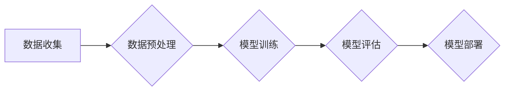

## 1. 背景介绍

### 1.1 行业 4.0 与自动化

工业4.0，又称第四次工业革命，是以智能制造为主导的全新工业革命，强调信息物理系统（CPS）的应用，将物理世界与数字世界深度融合，实现生产过程的自动化、智能化和高效化。工作流自动化作为工业4.0的核心组成部分，旨在通过数字化和智能化手段，将原本需要人工操作的流程自动化，从而提高效率、降低成本、提升质量。

### 1.2 AI代理的兴起

人工智能（AI）近年来取得了突破性进展，特别是机器学习、深度学习等技术的快速发展，使得AI代理能够在复杂环境中自主学习、推理和决策。AI代理的出现为工作流自动化提供了全新的解决方案，可以实现更灵活、更智能、更精准的自动化操作。

### 1.3 面向行业 4.0 的AI代理工作流自动化解决方案

面向行业 4.0 的 AI 代理工作流自动化解决方案，是指利用 AI 代理技术，结合工业 4.0 的特点和需求，构建智能化工作流自动化系统，实现生产过程的优化和升级。

## 2. 核心概念与联系

### 2.1 AI代理

AI代理是指能够感知环境、进行推理、做出决策并采取行动的智能体。AI代理的核心能力包括：

* **感知能力:**  能够感知周围环境的信息，例如图像、声音、传感器数据等。
* **推理能力:**  能够根据感知到的信息进行逻辑推理，理解环境状态和变化。
* **决策能力:**  能够根据推理结果做出决策，选择最佳行动方案。
* **行动能力:**  能够执行决策，对环境产生影响。

### 2.2 工作流

工作流是指一系列有序的任务集合，用于完成特定的目标。工作流通常包含多个步骤，每个步骤都需要完成特定的操作，步骤之间存在依赖关系。

### 2.3 自动化

自动化是指利用技术手段，将原本需要人工操作的流程自动化，从而提高效率、降低成本、提升质量。

### 2.4 AI代理工作流自动化

AI代理工作流自动化是指利用AI代理技术，实现工作流的自动化。AI代理可以代替人工完成工作流中的各个步骤，并根据环境变化做出动态调整，从而实现更灵活、更智能、更精准的自动化操作。

## 3. 核心算法原理具体操作步骤

### 3.1 基于规则的AI代理

基于规则的AI代理通过预先定义的规则集进行决策。规则集包含一系列条件和对应的行动，当满足特定条件时，AI代理就会执行相应的行动。

**操作步骤：**

1. 定义规则集：根据工作流的具体需求，定义一系列条件和对应的行动。
2. 感知环境：AI代理感知环境信息，判断是否满足规则集中的条件。
3. 执行行动：如果满足条件，则执行对应的行动。

### 3.2 基于学习的AI代理

基于学习的AI代理通过机器学习算法，从历史数据中学习决策规则。常见的机器学习算法包括：

* **监督学习:**  利用已标注的数据进行训练，学习输入和输出之间的映射关系。
* **无监督学习:**  利用未标注的数据进行训练，发现数据中的潜在结构和模式。
* **强化学习:**  通过与环境交互，学习最佳行动策略。

**操作步骤：**

1. 数据收集：收集工作流的历史数据，包括环境信息、操作记录、结果等。
2. 模型训练：利用机器学习算法，根据历史数据训练AI代理模型。
3. 模型部署：将训练好的模型部署到工作流中，进行实时决策。

## 4. 数学模型和公式详细讲解举例说明

### 4.1 决策树

决策树是一种树形结构，用于表示决策规则。决策树的每个节点代表一个条件，每个分支代表一个可能的决策结果。

**公式：**

```
Entropy(S) = - Σ p(c) * log2(p(c))
```

其中，S表示数据集，c表示类别，p(c)表示类别c在数据集S中的比例。

**举例说明：**

假设有一个数据集，包含10个样本，其中5个样本属于类别A，5个样本属于类别B。则数据集的熵为：

```
Entropy(S) = - (5/10) * log2(5/10) - (5/10) * log2(5/10) = 1
```

### 4.2 支持向量机

支持向量机是一种二分类模型，通过寻找最优超平面将不同类别的数据分开。

**公式：**

```
minimize: 1/2 ||w||^2 + C Σ ξ_i
subject to: y_i (w^T x_i + b) >= 1 - ξ_i, ξ_i >= 0
```

其中，w表示权重向量，b表示偏置项，C表示惩罚系数，ξ_i表示松弛变量，y_i表示样本标签，x_i表示样本特征。

**举例说明：**

假设有一个数据集，包含10个样本，其中5个样本属于类别A，5个样本属于类别B。支持向量机可以通过寻找最优超平面将不同类别的数据分开。

## 5. 项目实践：代码实例和详细解释说明

### 5.1 Python 代码实例

```python
import pandas as pd
from sklearn.tree import DecisionTreeClassifier

# 读取数据
data = pd.read_csv("workflow_data.csv")

# 划分特征和标签
features = data.drop("label", axis=1)
labels = data["label"]

# 创建决策树模型
model = DecisionTreeClassifier()

# 训练模型
model.fit(features, labels)

# 预测新数据
new_data = pd.DataFrame({"feature1": [1], "feature2": [2]})
prediction = model.predict(new_data)

# 打印预测结果
print(prediction)
```

**代码解释：**

* 导入pandas库用于数据处理，导入sklearn.tree库用于创建决策树模型。
* 读取工作流数据，并将数据划分为特征和标签。
* 创建决策树模型，并使用训练数据训练模型。
* 使用训练好的模型预测新数据，并打印预测结果。

### 5.2 Mermaid 流程图



## 6. 实际应用场景

### 6.1 制造业

AI 代理工作流自动化可以应用于制造业的各个环节，例如：

* **生产计划排程:**  AI 代理可以根据订单需求、生产能力、物料库存等信息，自动生成最优生产计划。
* **质量检测:**  AI 代理可以利用机器视觉技术，自动识别产品缺陷，提高质检效率。
* **设备维护:**  AI 代理可以根据设备运行状态，预测设备故障，提前进行维护，避免生产中断。

### 6.2 金融业

AI 代理工作流自动化可以应用于金融业的各个环节，例如：

* **风险评估:**  AI 代理可以根据客户信息、交易记录等数据，评估客户风险等级，提供个性化金融服务。
* **欺诈检测:**  AI 代理可以分析交易数据，识别异常交易行为，预防金融欺诈。
* **客户服务:**  AI 代理可以提供智能客服，解答客户疑问，提高客户满意度。

## 7. 工具和资源推荐

### 7.1 机器学习平台

* **TensorFlow:**  Google开源的机器学习平台，提供丰富的机器学习算法和工具。
* **PyTorch:**  Facebook开源的机器学习平台，易于使用，适合研究和开发。
* **Scikit-learn:**  Python机器学习库，提供常用的机器学习算法和工具。

### 7.2 工作流自动化工具

* **Zapier:**  在线工作流自动化工具，可以连接不同的应用程序，实现自动化操作。
* **IFTTT:**  在线工作流自动化工具，可以通过简单的条件触发器，实现自动化操作。
* **Microsoft Power Automate:**  微软推出的工作流自动化工具，可以自动化各种任务，例如发送邮件、收集数据等。

## 8. 总结：未来发展趋势与挑战

### 8.1 未来发展趋势

* **AI代理将更加智能化:**  随着机器学习技术的不断发展，AI代理将具备更强的学习能力和决策能力，能够处理更复杂的工作流自动化任务。
* **AI代理将更加普及化:**  AI代理的开发成本将不断降低，应用门槛也将不断降低，未来AI代理将更加普及化，应用于更广泛的领域。
* **AI代理将更加个性化:**  AI代理将能够根据用户的个性化需求，提供定制化的工作流自动化解决方案。

### 8.2 面临的挑战

* **数据安全和隐私问题:**  AI代理需要处理大量数据，如何保障数据安全和用户隐私是一个重要挑战。
* **伦理和道德问题:**  AI代理的决策可能会产生伦理和道德问题，需要建立相应的规范和标准。
* **技术人才的缺乏:**  开发和应用AI代理需要专业的技术人才，目前技术人才的缺乏是一个制约因素。

## 9. 附录：常见问题与解答

### 9.1 如何选择合适的AI代理工作流自动化解决方案？

选择合适的AI代理工作流自动化解决方案需要考虑以下因素：

* **工作流的复杂度:**  对于简单的流程，可以使用基于规则的AI代理；对于复杂的流程，需要使用基于学习的AI代理。
* **数据的可用性:**  基于学习的AI代理需要大量数据进行训练，如果数据不足，则无法有效训练模型。
* **成本预算:**  不同的AI代理工作流自动化解决方案成本不同，需要根据预算选择合适的方案。

### 9.2 如何评估AI代理工作流自动化的效果？

评估AI代理工作流自动化的效果可以参考以下指标：

* **效率提升:**  自动化流程的效率提升程度。
* **成本降低:**  自动化流程的成本降低程度。
* **质量提升:**  自动化流程的质量提升程度。
* **用户满意度:**  用户对自动化流程的满意度。 
