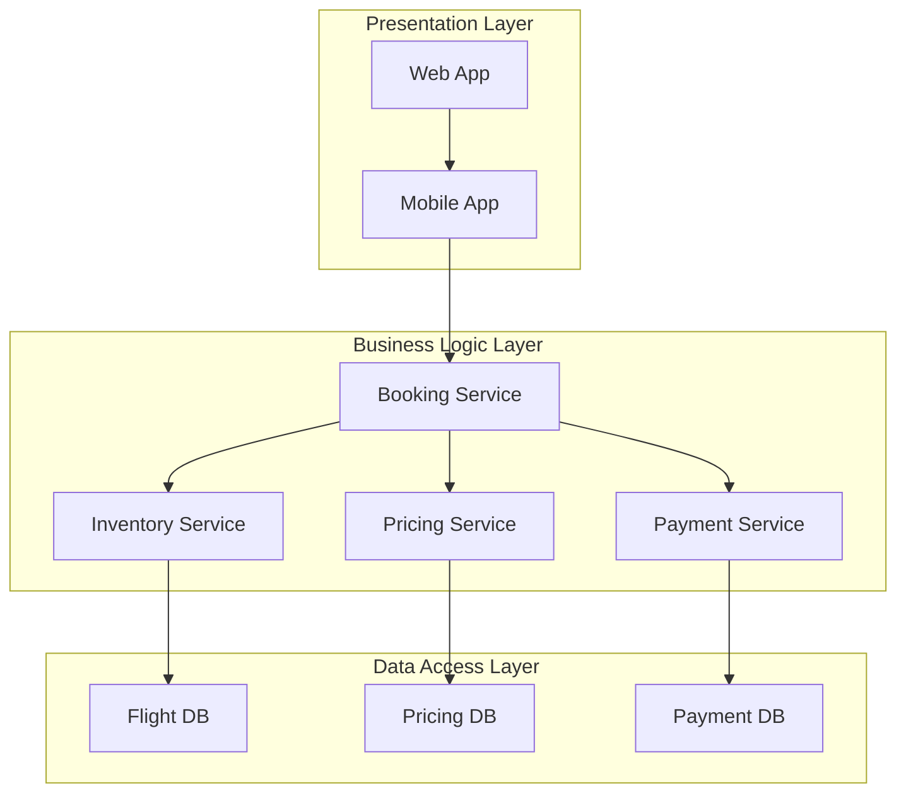
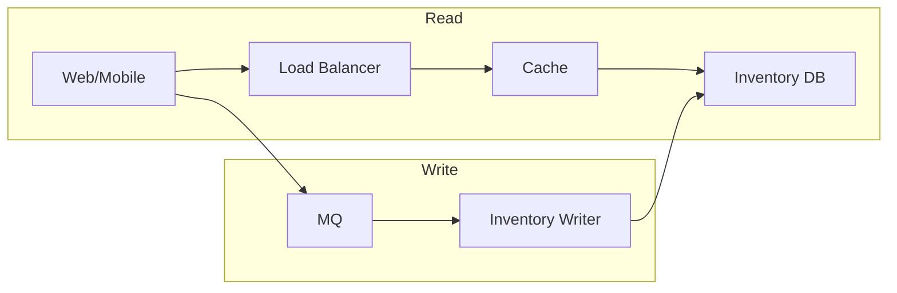
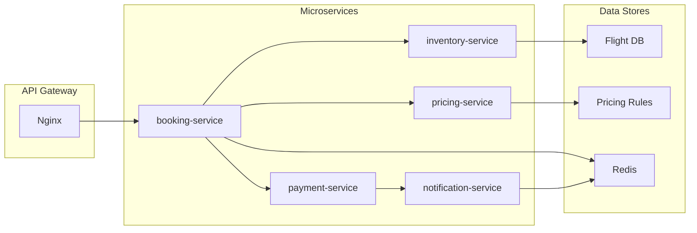

# 飞机售票系统详细设计与具体代码实现

## 1. 背景介绍

### 1.1 航空运输行业概述

航空运输是现代社会不可或缺的重要基础设施之一。随着全球化进程的加快和人们出行需求的不断增长,航空运输业务量持续攀升,对高效、可靠的航空运输系统的需求也与日俱增。

### 1.2 飞机售票系统的重要性

作为航空运输体系的核心环节,飞机售票系统对航空公司的正常运营至关重要。一个高效、安全、可扩展的飞机售票系统不仅能够为乘客提供便捷的购票体验,还能够帮助航空公司优化资源分配、降低运营成本、提高收益。

### 1.3 系统设计与实现的挑战

由于涉及多个利益相关方(航空公司、旅行社、消费者等)以及复杂的业务逻辑和大量的并发请求,设计和实现一个健壮的飞机售票系统面临诸多挑战,需要解决高并发、数据一致性、容错性、可扩展性等一系列技术难题。

## 2. 核心概念与联系

### 2.1 系统架构概览

飞机售票系统通常采用分层架构,包括表现层(前端界面)、业务逻辑层、数据访问层等。各层之间通过接口相互调用,实现职责分离和低耦合。



### 2.2 关键组件及其作用

- **Booking Service**: 负责处理用户的订票请求,协调其他服务的工作。
- **Inventory Service**: 管理航班库存信息,提供航班查询和库存扣减功能。
- **Pricing Service**: 计算机票价格,处理各种优惠规则。
- **Payment Service**: 与第三方支付系统对接,处理付款流程。

### 2.3 关键技术选型

- 分布式系统架构(微服务/SOA)
- 反应式编程模型(如ReactiveX)
- NoSQL数据库(如Redis/Cassandra)
- 消息队列(如RabbitMQ/Kafka)
- 容器化技术(如Docker/Kubernetes)

## 3. 核心算法原理具体操作步骤  

### 3.1 库存查询与扣减算法

#### 3.1.1 读写分离架构

为了应对高并发场景,通常将库存数据读写分离。读请求通过缓存(如Redis)加速,写请求则通过消息队列异步更新数据库。



#### 3.1.2 乐观锁控制并发

为了保证库存数据的一致性,需要在更新数据库时使用乐观锁,避免并发写入导致的数据争用问题。

1. 查询时获取版本号(version)
2. 更新时携带版本号,数据库比较版本号
3. 版本号不匹配则重试

#### 3.1.3 库存扣减算法

1. 查询航班剩余座位数
2. 座位数大于需求,扣减库存
3. 座位数小于需求,返回失败
4. 写入数据库前,重新验证版本号

```python
def deduct_inventory(flight_id, seats_required):
    # 获取版本号和剩余座位数
    record = read_inventory(flight_id)
    if record.remaining_seats < seats_required:
        return False
    
    # 计算新的剩余座位数
    new_remaining = record.remaining_seats - seats_required
    
    # 尝试更新库存
    rows_updated = update_inventory(flight_id, new_remaining, record.version)
    
    # 版本号不匹配则重试
    if rows_updated == 0:
        return deduct_inventory(flight_id, seats_required)
    
    return True
```

### 3.2 动态计价算法

#### 3.2.1 计价规则配置

机票价格通常由多个因素决定,如航线、舱位、日期、销售渠道等,并可能随时间动态调整。可将计价规则配置存储在数据库或配置文件中。

#### 3.2.2 规则匹配算法

1. 解析请求参数,提取影响价格的关键属性
2. 遍历计价规则,找到所有匹配的规则
3. 合并规则,计算出最终价格

```python
def calculate_price(request):
    rules = load_pricing_rules()
    
    # 提取关键属性
    route = request.route
    cabin = request.cabin
    days_to_departure = ...
    
    # 匹配规则并计算价格
    base_price = 0
    for rule in rules:
        if rule.matches(route, cabin, days_to_departure):
            base_price = rule.apply(base_price)
            
    # 应用其他规则(如手续费等)
    ...
    
    return final_price
```

### 3.3 支付流程

#### 3.3.1 第三方支付系统对接

为提高系统可扩展性和解耦性,通常需要与多家第三方支付渠道(如银行卡、电子钱包等)对接。可通过适配器模式屏蔽具体支付渠道的差异。

```python
class PaymentProcessor:
    def __init__(self, adapter):
        self.adapter = adapter
        
    def process_payment(self, order, amount):
        # 统一的支付处理流程
        if not self.adapter.validate(order, amount):
            return False
        
        self.adapter.deduct_payment(order, amount)
        # 发送支付成功通知
        ...
        return True
        
# 支付渠道适配器        
class AlipayAdapter:
    # 实现与支付宝系统的交互细节
    ...
    
class WechatPayAdapter:
    # 实现与微信支付系统的交互细节 
    ...
```

#### 3.3.2 支付重试与补偿机制

支付存在一定失败率,需要设计重试机制。另外,如果支付成功但下游通知失败,需要补偿机制来修正数据状态。

1. 通过消息队列或者调度框架实现异步重试
2. 使用幂等设计,避免重复支付
3. 通过对账补偿,修正数据状态

### 3.4 并发控制

#### 3.4.1 限流与熔断

在高并发场景下,需要通过限流算法保护下游服务,避免被压垮。同时,需要熔断机制快速失败,防止耗尽资源。可以使用漏桶或令牌桶算法进行限流。

```java
// 漏桶限流算法
class LeakyBucket {
    // 桶的容量和流出速率
    private long capacity, leakingRate;
    
    public LeakyBucket(long cap, long rate) { ... }
    
    public boolean acquire() {
        // 如果令牌数量足够,则获取令牌
        if (tokens >= 1) {
            tokens -= 1;
            return true;
        }
        return false; 
    }
    
    // 定期补充令牌
    void refillTokens() { ... }
}
```

#### 3.4.2 分布式锁

在分布式系统中,需要使用分布式锁来保护共享资源,避免并发问题。可以使用Redis、Zookeeper或者Etcd等工具实现分布式锁。

```python
# 使用Redis实现分布式锁
import redis

def acquire_lock(conn, lock_name, timeout):
    # 获取锁,设置自动释放时间
    status = conn.set(lock_name, '1', nx=True, ex=timeout)
    return status
    
def release_lock(conn, lock_name, value):
    # 使用值作为口令释放锁
    status = conn.eval("""
    if redis.call('get', KEYS[1]) == ARGV[1] then
        return redis.call('del', KEYS[1])
    else
        return 0
    end
    """, 1, lock_name, value)
    return status
```

## 4. 数学模型和公式详细讲解举例说明

### 4.1 乘客行为建模

在航空运输系统中,准确建模和预测乘客的购票行为对于优化资源分配、提高收益至关重要。常用的建模技术包括:

#### 4.1.1 生存分析模型

生存分析模型用于预测乘客何时会购买机票。令 $T$ 表示乘客购票时间, $S(t)$ 表示至时间 $t$ 尚未购票的概率(生存函数):

$$S(t) = P(T > t)$$

生存函数可以由危险率(hazard rate)函数来刻画:

$$h(t) = \lim_{\Delta t \to 0} \frac{P(t \le T < t + \Delta t | T \ge t)}{\Delta t}$$

通过对历史数据进行生存分析,可以拟合出合适的生存分布模型(如Weibull分布、对数正态分布等),从而预测未来乘客的购票时间分布。

#### 4.1.2 选择建模

选择建模用于预测乘客选择某个产品(如航班、舱位等)的概率。假设乘客 $i$ 对产品 $j$ 的效用为 $U_{ij}$,那么选择 $j$ 的概率为:

$$P(i \text{ 选择 } j) = \frac{e^{U_{ij}}}{\sum_k e^{U_{ik}}}$$

效用函数 $U_{ij}$ 可以由产品特征(如价格、时间等)的线性组合表示:

$$U_{ij} = \beta_0 + \beta_1 x_1 + \beta_2 x_2 + \cdots$$

通过对历史选择数据拟合logit或probit模型,可以估计出各特征的系数 $\beta$。

### 4.2 收益管理模型

收益管理是航空公司的核心业务,旨在通过动态调整价格和库存分配,最大化收益。常用的收益管理模型包括:

#### 4.2.1 网络收益管理模型

网络收益管理模型将整个航线网络作为优化对象,旨在最大化网络总收益。令 $R_{ij}$ 表示 $i$ 到 $j$ 的单程收益, $x_{ij}$ 表示分配给这条航线的库存量,问题可以表述为:

$$\max \sum_{i,j} R_{ij} x_{ij}$$
$$\text{s.t.} \quad \sum_j x_{ij} \le c_i, \quad \sum_i x_{ij} \le c_j$$

其中 $c_i, c_j$ 分别表示 $i, j$ 机场的容量约束。这是一个线性规划问题,可以使用单纯形法等算法求解。

#### 4.2.2 动态编程模型

动态编程模型则是按时间维度,逐步优化未来的收益。令 $r_t(x)$ 表示时间 $t$ 时分配 $x$ 个库存可获得的最大收益,则有:

$$r_t(x) = \max_{0 \le y \le x} \left\{ p_t(y) + r_{t+1}(x-y) \right\}$$

其中 $p_t(y)$ 表示在时间 $t$ 时分配 $y$ 个库存的收益。通过反向递推求解该方程,即可得到最优的库存分配策略。

## 4. 项目实践: 代码实例和详细解释说明

### 4.1 系统架构

本系统采用微服务架构,主要包括以下服务:

- `booking-service`: 负责处理订票请求,协调其他服务
- `inventory-service`: 管理航班库存信息
- `pricing-service`: 计算机票价格
- `payment-service`: 处理支付流程
- `notification-service`: 发送订单通知

服务之间使用 REST API 进行通信,并通过 Nginx 反向代理对外提供统一入口。使用 Docker 和 Kubernetes 实现容器化部署。



### 4.2 库存管理

`inventory-service` 使用 Redis 作为缓存,并