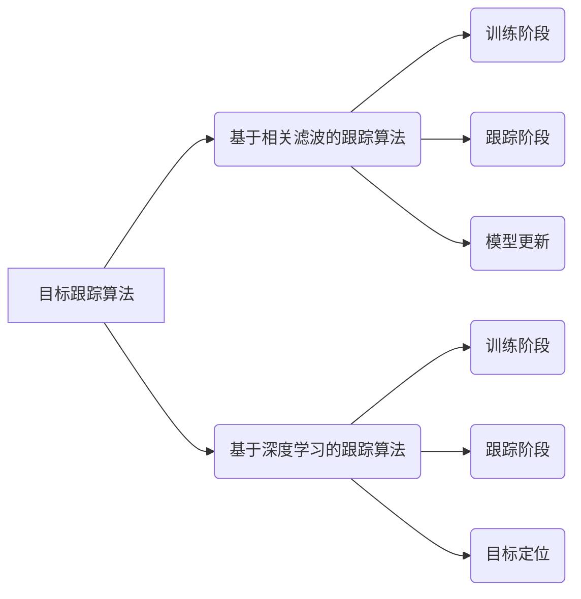

## 1. 背景介绍

### 1.1 计算机视觉的兴起
近年来，随着计算机算力的不断提升和深度学习算法的快速发展，计算机视觉领域取得了令人瞩目的成果，并在各个行业得到广泛应用。目标跟踪作为计算机视觉的一个重要分支，其任务是在视频序列中持续定位目标，并在目标发生形变、遮挡、光照变化等情况下保持稳定的跟踪效果。

### 1.2 目标跟踪的应用场景
目标跟踪技术在自动驾驶、智能监控、机器人导航、人机交互等领域具有广泛的应用价值。例如：

* **自动驾驶:**  目标跟踪可以用于识别和跟踪车辆、行人等道路目标，为车辆路径规划和安全驾驶提供支持。
* **智能监控:** 目标跟踪可以用于识别和跟踪可疑人员或物体，实现实时监控和安全预警。
* **机器人导航:** 目标跟踪可以帮助机器人识别和跟踪目标物体，实现自主导航和避障。
* **人机交互:** 目标跟踪可以用于识别和跟踪人手、人脸等，实现自然的人机交互体验。

### 1.3 Python 在目标跟踪中的优势
Python 作为一种易学易用、功能强大的编程语言，在目标跟踪领域得到了广泛应用。Python 拥有丰富的第三方库，如 OpenCV、TensorFlow、PyTorch 等，为目标跟踪算法的开发和实现提供了强大的工具支持。

## 2. 核心概念与联系

### 2.1 目标跟踪算法分类
目标跟踪算法可以根据目标模型、特征表示、搜索策略等方面进行分类。常见的目标跟踪算法包括：

* **基于相关滤波的跟踪算法:**  利用相关滤波器学习目标的特征表示，并在后续帧中通过相关操作快速定位目标。
* **基于深度学习的跟踪算法:** 利用深度神经网络学习目标的特征表示，并通过回归或分类的方式预测目标位置。
* **基于检测的跟踪算法:**  在每一帧中检测目标，并通过目标关联算法将不同帧中的目标关联起来，实现目标跟踪。

### 2.2 目标跟踪评价指标
目标跟踪算法的性能通常使用以下指标进行评估：

* **成功率:**  跟踪目标在视频序列中的成功率。
* **精度:**  跟踪目标位置的准确性。
* **鲁棒性:**  跟踪算法在目标发生形变、遮挡、光照变化等情况下的稳定性。
* **速度:**  跟踪算法的运行速度。

## 3. 核心算法原理具体操作步骤

### 3.1 基于相关滤波的跟踪算法

#### 3.1.1 算法原理
基于相关滤波的跟踪算法的核心思想是利用相关滤波器学习目标的特征表示，并在后续帧中通过相关操作快速定位目标。

#### 3.1.2 具体操作步骤

1. **训练阶段:**  在第一帧中，使用目标区域的图像块训练相关滤波器。
2. **跟踪阶段:**  在后续帧中，将相关滤波器与搜索区域进行相关操作，得到响应图。响应图峰值对应目标位置。
3. **模型更新:**  根据跟踪结果更新相关滤波器，以适应目标的变化。

### 3.2 基于深度学习的跟踪算法

#### 3.2.1 算法原理
基于深度学习的跟踪算法利用深度神经网络学习目标的特征表示，并通过回归或分类的方式预测目标位置。

#### 3.2.2 具体操作步骤

1. **训练阶段:**  使用大量带标注的图像或视频数据训练深度神经网络。
2. **跟踪阶段:**  将目标区域的图像块输入到深度神经网络中，得到目标的特征表示。
3. **目标定位:**  根据目标的特征表示，通过回归或分类的方式预测目标位置。

## 4. 数学模型和公式详细讲解举例说明

### 4.1 相关滤波器

相关滤波器是一种线性滤波器，其作用是在输入信号中寻找与目标信号相似的部分。相关滤波器的数学模型可以表示为：

$$
h(t) = f(t) * g(t)
$$

其中，$h(t)$ 表示相关滤波器的输出信号，$f(t)$ 表示输入信号，$g(t)$ 表示目标信号，$*$ 表示卷积操作。

### 4.2 深度神经网络

深度神经网络是一种多层感知器，其结构可以表示为：

```
Input Layer -> Hidden Layer 1 -> ... -> Hidden Layer n -> Output Layer
```

其中，每个隐藏层包含多个神经元，每个神经元接收来自上一层神经元的输入，并通过激活函数进行非线性变换，将结果传递给下一层神经元。

## 5. 项目实践：代码实例和详细解释说明

### 5.1 基于 OpenCV 的目标跟踪

```python
import cv2

# 加载视频文件
cap = cv2.VideoCapture('video.mp4')

# 选择跟踪目标
ret, frame = cap.read()
bbox = cv2.selectROI(frame, False)

# 初始化跟踪器
tracker = cv2.TrackerCSRT_create()
tracker.init(frame, bbox)

# 跟踪目标
while True:
    ret, frame = cap.read()
    if not ret:
        break

    # 更新跟踪结果
    success, bbox = tracker.update(frame)

    # 绘制跟踪框
    if success:
        p1 = (int(bbox[0]), int(bbox[1]))
        p2 = (int(bbox[0] + bbox[2]), int(bbox[1] + bbox[3]))
        cv2.rectangle(frame, p1, p2, (0, 255, 0), 2, 1)

    # 显示跟踪结果
    cv2.imshow('Tracking', frame)
    if cv2.waitKey(1) & 0xFF == ord('q'):
        break

# 释放资源
cap.release()
cv2.destroyAllWindows()
```

### 5.2 基于深度学习的目标跟踪

```python
import torch
import torchvision

# 加载模型
model = torchvision.models.detection.fasterrcnn_resnet50_fpn(pretrained=True)
model.eval()

# 加载视频文件
cap = cv2.VideoCapture('video.mp4')

# 跟踪目标
while True:
    ret, frame = cap.read()
    if not ret:
        break

    # 将图像转换为模型输入格式
    image = cv2.cvtColor(frame, cv2.COLOR_BGR2RGB)
    image = torch.from_numpy(image).permute(2, 0, 1).float().unsqueeze(0)

    # 进行目标检测
    with torch.no_grad():
        output = model(image)

    # 获取目标框和置信度
    boxes = output[0]['boxes']
    scores = output[0]['scores']

    # 选择置信度最高的目標
    idx = torch.argmax(scores)
    bbox = boxes[idx].detach().cpu().numpy()

    # 绘制跟踪框
    p1 = (int(bbox[0]), int(bbox[1]))
    p2 = (int(bbox[2]), int(bbox[3]))
    cv2.rectangle(frame, p1, p2, (0, 255, 0), 2, 1)

    # 显示跟踪结果
    cv2.imshow('Tracking', frame)
    if cv2.waitKey(1) & 0xFF == ord('q'):
        break

# 释放资源
cap.release()
cv2.destroyAllWindows()
```

## 6. 实际应用场景

* **自动驾驶:** 目标跟踪可以用于识别和跟踪车辆、行人等道路目标，为车辆路径规划和安全驾驶提供支持。
* **智能监控:** 目标跟踪可以用于识别和跟踪可疑人员或物体，实现实时监控和安全预警。
* **机器人导航:** 目标跟踪可以帮助机器人识别和跟踪目标物体，实现自主导航和避障。
* **人机交互:** 目标跟踪可以用于识别和跟踪人手、人脸等，实现自然的人机交互体验。

## 7. 工具和资源推荐

* **OpenCV:**  一个开源的计算机视觉库，提供了丰富的图像处理和目标跟踪功能。
* **TensorFlow:**  一个开源的机器学习平台，提供了强大的深度学习模型训练和部署功能。
* **PyTorch:**  一个开源的机器学习框架，提供了灵活的深度学习模型构建和训练功能。
* **MOTChallenge:**  一个目标跟踪算法的评估平台，提供了多个公开数据集和评估指标。

## 8. 总结：未来发展趋势与挑战

### 8.1 未来发展趋势

* **更加精确和鲁棒的跟踪算法:**  随着深度学习技术的不断发展，未来将会出现更加精确和鲁棒的跟踪算法。
* **多目标跟踪:**  多目标跟踪是目标跟踪领域的一个重要研究方向，未来将会出现更加高效的多目标跟踪算法。
* **与其他计算机视觉任务的结合:**  目标跟踪可以与其他计算机视觉任务，如目标检测、语义分割等相结合，实现更加智能的视觉系统。

### 8.2 挑战

* **目标遮挡:**  当目标被其他物体遮挡时，目标跟踪算法的性能会受到影响。
* **光照变化:**  当光照条件发生变化时，目标跟踪算法的性能会受到影响。
* **目标形变:**  当目标发生形变时，目标跟踪算法的性能会受到影响。


## 9. 附录：常见问题与解答

### 9.1 如何选择合适的目标跟踪算法？

选择目标跟踪算法需要考虑以下因素：

* **跟踪目标的特性:**  例如目标的尺寸、形状、颜色等。
* **应用场景:**  例如实时性要求、精度要求等。
* **计算资源:**  例如 CPU、GPU 等。

### 9.2 如何提高目标跟踪算法的性能？

提高目标跟踪算法的性能可以从以下方面入手：

* **使用更强大的特征表示:**  例如深度学习特征。
* **优化搜索策略:**  例如使用粒子滤波、卡尔曼滤波等。
* **提高模型更新速度:**  例如使用在线学习算法。


## 10.  Mermaid流程图


