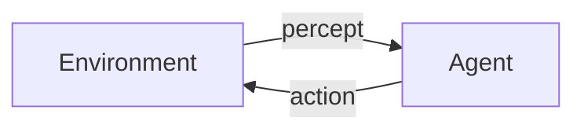

# AI Agent: AI的下一个风口 技术的发展趋势

## 1. 背景介绍

### 1.1 人工智能的发展历程

人工智能(Artificial Intelligence, AI)作为一门学科,已经走过了将近70年的发展历程。自1956年达特茅斯会议上首次提出"人工智能"这一概念以来,AI经历了几次重大的技术突破和发展浪潮。

#### 1.1.1 早期阶段(1956-1974)

早期的AI研究主要集中在博弈问题、逻辑推理和机器学习等基础理论领域。这一时期,专家系统、A*算法、神经网络等重要理论和算法被提出。但受限于计算能力和数据资源的匮乏,AI的发展相对缓慢。

#### 1.1.2 知识驱动时代(1980-1987)

20世纪80年代,由于专家系统和知识库的不断完善,AI进入了一个新的发展阶段。基于规则的系统和知识表示成为研究的重点,同时机器学习等领域也取得了长足进步。但这一时期仍然缺乏足够的计算能力和大规模数据支撑。

#### 1.1.3 深度学习时代(2006-至今)

2006年,受益于大数据和GPU并行计算能力的飞速发展,深度学习(Deep Learning)技术在计算机视觉、自然语言处理等领域取得突破性进展,推动了AI进入一个全新的发展时代。经过十多年的高速发展,深度学习已经成为AI领域最为成熟和广泛应用的技术范式。

### 1.2 AI Agent的兴起

随着AI技术的不断发展和应用场景的日益丰富,AI Agent(智能代理)作为AI系统的一种新型范式,逐渐受到了广泛关注。AI Agent是指能够感知环境、分析决策并执行行动的智能体系,具有自主性、交互性和持续学习的能力。

相比传统的AI系统,AI Agent具有以下独特优势:

1. 自主决策:能够根据环境变化自主做出决策和行动,而非被动执行预设的规则。
2. 持续学习:通过与环境的持续交互,不断获取新知识并优化自身模型。
3. 人机协作:可以与人类用户进行自然交互,在决策过程中获取人类意见反馈。

AI Agent的出现为AI系统带来了新的发展机遇,同时也面临着诸多技术挑战亟待解决。本文将重点探讨AI Agent相关的核心技术,并展望其未来发展趋势。

## 2. 核心概念与联系

### 2.1 AI Agent的定义

AI Agent是一种能够感知环境、处理信息、做出决策并执行行动的智能体系。根据Russell和Norvig在《人工智能:一种现代方法》一书中的经典定义,AI Agent可以形式化描述为:

$$
agent = function(percept) \rightarrow action
$$

其中,$percept$表示从环境获取的感知信息(如视觉、语音等),$action$表示Agent根据感知做出的行为反应。Agent函数的目标是找到一个从感知到行为的最优映射,使Agent能够在特定环境中达成既定目标。

### 2.2 Agent与环境的交互

AI Agent通过感知器(Sensors)获取环境状态信息,通过执行器(Actuators)对环境产生影响。Agent与环境之间是一个持续的交互过程,如下图所示:



在每个时间周期中,Agent根据当前的感知信息和内部状态,选择一个合适的行为输出,并将其发送到环境中执行。环境则根据Agent的行为产生新的状态,并将新的感知信息反馈给Agent,形成一个闭环过程。

### 2.3 Agent程序的结构

通常,一个完整的AI Agent程序由以下几个核心组件构成:

1. **感知模块**(Perception Module):用于获取和预处理来自环境的原始数据输入。
2. **世界模型**(World Model):基于感知信息构建对环境状态的内部表示和预测。
3. **决策模块**(Decision Module):根据世界模型和目标函数,选择下一步的最优行为。
4. **学习模块**(Learning Module):通过与环境的交互,持续优化自身的世界模型和决策策略。
5. **执行模块**(Execution Module):将决策模块的输出转化为具体的环境行为。

不同类型的Agent在具体实现上会有所差异,但上述基本架构是通用的。Agent的关键在于如何设计有效的世界模型、目标函数和决策算法,使其能够在复杂多变的环境中做出明智的选择。

## 3. 核心算法原理具体操作步骤

### 3.1 Agent程序的基本流程

一个典型的AI Agent程序的基本执行流程如下:

1. 初始化Agent的内部状态,包括世界模型、目标函数和决策策略等。
2. 获取来自环境的原始感知数据,并通过感知模块进行预处理。
3. 根据感知信息和当前的世界模型,更新对环境状态的表示和预测。
4. 在决策模块中,基于当前的世界模型、目标函数和决策策略,选择一个最优的行为输出。
5. 通过执行模块将选定的行为转化为具体的环境行动。
6. 观察环境的反馈,获取新的感知信息,并更新世界模型。
7. 根据环境反馈,在学习模块中优化世界模型、目标函数和决策策略等内部参数。
8. 重复步骤2-7,持续与环境交互并优化自身。

该基本流程适用于大多数AI Agent系统,不同类型的Agent主要差异在于具体的世界模型、决策算法和学习策略的实现方式。我们将在后续章节对这些核心模块进行详细介绍。

### 3.2 Agent的类型

根据Agent与环境的交互方式和目标任务的不同,可以将AI Agent分为以下几种基本类型:

- **简单反射Agent**(Simple Reflex Agent):基于当前的感知信息做出对应的行为反射,不需要内部状态和世界模型。
- **基于模型的Agent**(Model-based Agent):维护一个内部的世界模型,并根据模型进行状态预测和决策规划。
- **基于目标的Agent**(Goal-based Agent):设定了明确的目标函数,决策的目的是优化该目标函数。
- **基于效用的Agent**(Utility-based Agent):将状态与效用值(Utility)相关联,以最大化预期效用作为决策目标。
- **学习Agent**(Learning Agent):能够通过与环境的交互持续更新和优化自身的决策策略。

上述类型并非完全独立,在实际应用中通常会结合多种特性构建复合型Agent。比如基于深度强化学习的Agent就同时具备了基于模型、基于目标、基于效用和学习的能力。

## 4. 数学模型和公式详细讲解举例说明

### 4.1 马尔可夫决策过程(MDP)

马尔可夫决策过程(Markov Decision Process, MDP)是形式化描述Agent与环境交互的一种重要数学模型。MDP由以下5个要素组成:

- 一组有限的状态集合$S$
- 一组有限的行为集合$A$  
- 状态转移概率$P(s'|s, a)$,表示在状态$s$执行行为$a$后,转移到状态$s'$的概率
- 奖励函数$R(s, a, s')$,表示在状态$s$执行行为$a$并转移到$s'$时获得的即时奖励
- 折扣因子$\gamma \in [0, 1)$,用于权衡未来奖励的重要性

MDP的目标是找到一个策略$\pi: S \rightarrow A$,使得从任意初始状态$s_0$出发,按照该策略执行时,累积获得的期望折现奖励最大:

$$
V^\pi(s_0) = \mathbb{E}_\pi \left[ \sum_{t=0}^\infty \gamma^t R(s_t, a_t, s_{t+1}) \right]
$$

其中,$V^\pi(s_0)$被称为该策略$\pi$在初始状态$s_0$时的值函数(Value Function)。

求解MDP的核心算法有价值迭代(Value Iteration)和策略迭代(Policy Iteration)等,通过这些算法可以找到最优策略$\pi^*$,使得对应的值函数$V^{\pi^*}$最大。

### 4.2 贝叶斯决策理论

贝叶斯决策理论(Bayesian Decision Theory)是Agent决策的另一种重要数学基础。在这种框架下,Agent需要基于观测到的证据$e$,选择一个行为$a$,使得在给定的效用函数$U(a, s)$下,期望效用最大:

$$
\begin{align*}
EU(a|e) &= \sum_s P(s|e)U(a, s) \\
         &= \sum_s \frac{P(e|s)P(s)}{P(e)}U(a, s)
\end{align*}
$$

其中,$P(s|e)$是在观测到证据$e$后,对状态$s$的后验概率估计。通过贝叶斯公式,可以利用先验概率$P(s)$和似然函数$P(e|s)$计算后验概率。

选择使期望效用$EU(a|e)$最大的行为$a^*$,就是在给定证据下的最优决策:

$$
a^* = \arg\max_a EU(a|e)
$$

贝叶斯决策理论为Agent的决策过程提供了一个统一的概率框架,并能够很好地处理不确定性。同时,它也为机器学习算法的设计提供了理论基础。

## 4. 项目实践: 代码实例和详细解释说明

为了帮助读者更好地理解AI Agent的实现细节,我们将通过一个基于Python的示例项目,演示如何构建一个简单的基于模型的Agent。

### 4.1 问题描述

我们将构建一个基于格子世界(Gridworld)的Agent,其目标是找到从起点到终点的最短路径。格子世界是一种常用的AI环境,可以用于测试各种决策和规划算法。

在我们的示例中,格子世界由$5\times5$个格子组成,其中有些格子是障碍物,Agent不能通过。Agent的初始位置和目标位置都是固定的,如下图所示:

```python
grid = [[0, 0, 0, 0, 0],
        [0, 0, 0, 0, 0],
        [0, 0, 'x', 0, 0],
        [0, 0, 0, 0, 0],
        [0, 0, 0, 'g', 0]]

start = (0, 0)
goal = (4, 3)
```

这里`'x'`表示障碍物格子,`'g'`表示目标格子。Agent需要从起点`start`出发,找到到达`goal`的最短路径。

### 4.2 Agent的实现

我们将实现一个基于价值迭代(Value Iteration)算法的Agent,其核心代码如下:

```python
import numpy as np

class GridworldAgent:
    def __init__(self, grid, start, goal, reward, discount=0.9):
        self.grid = np.array(grid)
        self.start = start
        self.goal = goal
        self.reward = reward
        self.discount = discount
        self.actions = ['up', 'down', 'left', 'right']
        self.value_func = np.zeros(self.grid.shape)
        self.policy = np.zeros(self.grid.shape, dtype=object)

    def is_valid(self, state):
        row, col = state
        return 0 <= row < self.grid.shape[0] and 0 <= col < self.grid.shape[1] and self.grid[row, col] != 'x'

    def transition(self, state, action):
        row, col = state
        if action == 'up':
            new_state = (max(row - 1, 0), col)
        elif action == 'down':
            new_state = (min(row + 1, self.grid.shape[0] - 1), col)
        elif action == 'left':
            new_state = (row, max(col - 1, 0))
        else:
            new_state = (row, min(col + 1, self.grid.shape[1] - 1))

        if not self.is_valid(new_state):
            return state
        else:
            return new_state

    def value_iteration(self, max_iter=1000, theta=1e-6):
        for i in range(max_iter):
            delta = 0
            for row in range(self.grid.shape[0]):
                for col in range(self.grid.shape[1]):
                    state = (row, col)
                    if self.grid[row, col] != 'x':
                        old_value = self.value_func[row, col]
                        new_value = max([self.reward