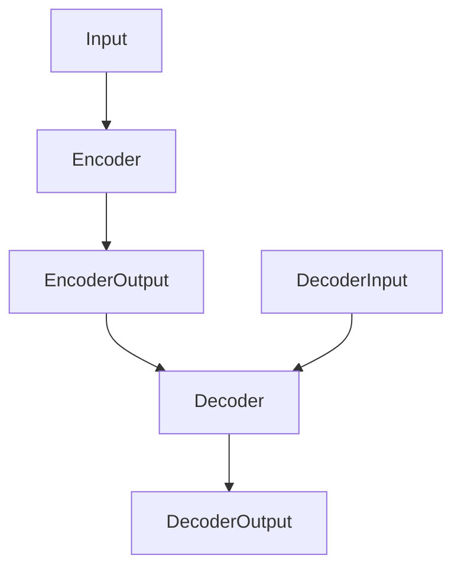
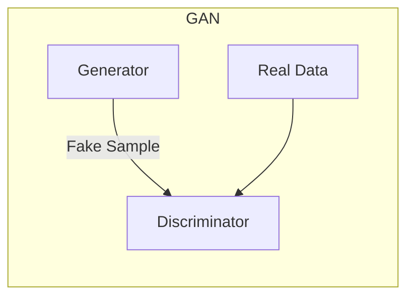

# AIGC从入门到实战：AIGC 赋能行业，产生无数新机会

## 1. 背景介绍

### 1.1 人工智能的发展历程

人工智能(Artificial Intelligence, AI)的发展可以追溯到20世纪50年代。在过去的几十年里,AI技术经历了几次重大突破,从专家系统、机器学习,到近年来的深度学习和大模型,AI的能力不断提升,应用领域也在不断扩展。

### 1.2 AIGC的兴起

近年来,随着大模型(如GPT-3、DALL-E等)的出现,AI生成式内容(AI-Generated Content,AIGC)技术异军突起,引发了广泛关注。AIGC技术可以基于给定的文本、图像或其他形式的输入,生成新的、独特的内容,如文字、图像、视频、音频等。

### 1.3 AIGC的重要性

AIGC技术的兴起,标志着人工智能已经进入一个新的发展阶段。AIGC不仅可以极大提高内容生产效率,还能创造出全新的内容形式,为各行各业带来巨大机遇。因此,了解和掌握AIGC技术,对个人和企业都至关重要。

## 2. 核心概念与联系

### 2.1 AIGC的核心概念

- **生成式AI模型**:指能够生成新内容的AI模型,如GPT-3、DALL-E等。这些模型通过训练吸收海量数据,学习内容模式和规律,从而获得生成新内容的能力。
- **提示工程(Prompt Engineering)**:指为生成式AI模型设计合适的提示(Prompt),以引导模型生成所需内容。提示工程对AIGC的效果至关重要。
- **多模态(Multimodal)**:指AIGC可同时处理多种形式的输入(如文本、图像、视频等)和输出。

### 2.2 AIGC与其他AI技术的联系

- **自然语言处理(NLP)**:AIGC中的文本生成和理解依赖NLP技术。
- **计算机视觉(CV)**:AIGC中的图像/视频生成和理解需要CV技术。
- **多模态学习**:处理多种形式的输入输出需要多模态学习技术。
- **迁移学习**:大模型通常采用迁移学习方式进行训练和fine-tuning。

## 3. 核心算法原理具体操作步骤  

### 3.1 生成式预训练模型(Generative Pre-trained Transformer)

AIGC的核心是生成式预训练模型,如GPT(Generative Pre-trained Transformer)。这类模型采用自注意力(Self-Attention)机制和Transformer编码器-解码器架构,能够有效捕捉输入序列中的长程依赖关系,从而生成高质量的文本、图像等内容。

#### 3.1.1 自注意力机制(Self-Attention)

自注意力机制是Transformer模型的核心,它允许模型在计算当前位置的表示时,关注整个输入序列中的所有位置。具体来说,对于序列中的每个位置,自注意力机制会计算该位置与其他所有位置的相关性得分,然后对所有位置的表示进行加权求和,得到该位置的新表示。

$$\begin{aligned}
\text{Attention}(Q, K, V) &= \text{softmax}(\frac{QK^T}{\sqrt{d_k}})V \\
\text{MultiHead}(Q, K, V) &= \text{Concat}(head_1, \ldots, head_h)W^O\\
\text{where } head_i &= \text{Attention}(QW_i^Q, KW_i^K, VW_i^V)
\end{aligned}$$

其中,$Q$、$K$、$V$分别表示查询(Query)、键(Key)和值(Value)。通过多头注意力(Multi-Head Attention)机制,模型可以同时关注输入序列中的不同位置模式。

#### 3.1.2 Transformer编码器-解码器架构

Transformer采用编码器-解码器架构,编码器将输入序列编码为隐藏表示,解码器则根据编码器的输出和之前生成的内容,预测下一个token。

编码器由多个相同的层组成,每一层包括两个子层:多头自注意力层和前馈神经网络层。解码器也由多个相同的层组成,除了插入一个对编码器输出的注意力层。



在生成任务中,解码器会根据输入的提示(Prompt),自回归地生成新的序列。通过掩码(Mask)机制,确保解码器在生成时只能关注之前生成的内容,而不能"窥视"将来的输出。

#### 3.1.3 预训练和微调

生成式预训练模型通常采用两阶段训练方式:

1. **预训练(Pre-training)**:在大规模无标注数据(如网络文本、图像等)上进行自监督训练,学习通用的模式和知识。
2. **微调(Fine-tuning)**:在有标注的特定任务数据上进一步训练模型,使其适应特定任务。

预训练可以让模型学习到通用的语义和世界知识,而微调可以让模型更好地完成特定的生成任务。

### 3.2 生成式对抗网络(Generative Adversarial Networks)

生成式对抗网络(Generative Adversarial Networks, GANs)是另一种广泛应用于AIGC的核心算法,尤其在图像生成方面。GAN由一个生成器(Generator)和一个判别器(Discriminator)组成,两者相互对抗,最终达到生成高质量样本的目的。

#### 3.2.1 GAN架构



生成器$G$的目标是生成能够欺骗判别器$D$的假样本,而判别器$D$则努力区分真实样本和生成的假样本。两者的min-max对抗目标如下:

$$\min_G \max_D V(D,G) = \mathbb{E}_{x\sim p_{\text{data}}(x)}\left[\log D(x)\right] + \mathbb{E}_{z\sim p_z(z)}\left[\log\left(1-D(G(z))\right)\right]$$

#### 3.2.2 GAN变种

基于标准GAN,研究者提出了多种变种以提高训练稳定性和生成质量,如WGAN(Wasserstein GAN)、LSGAN(Least Squares GAN)、CGAN(Conditional GAN)等。

#### 3.2.3 GAN在AIGC中的应用

GAN可用于生成逼真的图像、视频、语音等多模态内容。结合其他技术(如注意力机制),GAN还可用于文本到图像、图像到视频等跨模态生成任务。

### 3.3 扩散模型(Diffusion Models)

扩散模型是近年来在AIGC领域取得突破性进展的一类生成模型,尤其在高保真图像生成方面表现出色。

#### 3.3.1 扩散过程

扩散模型的基本思想是:首先通过一个扩散(diffusion)过程,将一个干净的图像逐步加入高斯噪声,直至完全变为纯噪声;然后训练一个模型,试图通过反向过程,从纯噪声中重建原始图像。

$$q(x_t|x_{t-1}) = \mathcal{N}(x_t;\sqrt{1-\beta_t}x_{t-1},\beta_tI)$$

其中,$\beta_t$控制了噪声的量。

#### 3.3.2 反向扩散过程

反向扩散过程是学习一个生成模型$p_\theta(x_{t-1}|x_t)$,使其能够从纯噪声$x_T$开始,逐步去噪,最终生成所需图像$x_0$。

$$p_\theta(x_{t-1}|x_t) = \mathcal{N}(x_{t-1};\mu_\theta(x_t,t),\Sigma_\theta(x_t,t))$$

训练目标是最小化反向扩散链条件下的负对数似然。

#### 3.3.3 扩散模型的优势

相较GAN,扩散模型具有训练更加稳定、生成质量更高、支持更高分辨率图像生成等优势。著名的扩散模型包括DDPM、Score-Based Models等。

## 4. 数学模型和公式详细讲解举例说明

AIGC中使用了多种数学模型和公式,我们以自注意力机制和GAN损失函数为例进行详细讲解。

### 4.1 自注意力机制

自注意力机制是Transformer等AIGC模型的核心,它允许模型在计算当前位置的表示时,关注整个输入序列中的所有位置。具体计算过程如下:

1. 首先将输入序列$X$分别通过三个线性投影层,得到查询(Query)、键(Key)和值(Value)矩阵:

$$\begin{aligned}
Q &= XW^Q\\
K &= XW^K\\
V &= XW^V
\end{aligned}$$

2. 计算查询$Q$与所有键$K$的相似性得分,并对得分施加Scale缩放,得到注意力权重:

$$\text{Attention}(Q, K, V) = \text{softmax}(\frac{QK^T}{\sqrt{d_k}})V$$

其中,$d_k$是键的维度,Scale可以使梯度更稳定。

3. 加权求和值矩阵$V$,即可得到经注意力加权后的序列表示。

4. 多头注意力机制可以同时关注不同的位置模式,并将所有头的注意力结果拼接:

$$\text{MultiHead}(Q, K, V) = \text{Concat}(head_1, \ldots, head_h)W^O$$

以上是自注意力机制的数学原理。我们通过一个简单的例子来直观理解:

考虑翻译句子"The animal didn't cross the street because it was too tired"。在翻译"it"时,模型需要关注"animal"这个前置词,自注意力机制就可以自动捕捉到这种长程依赖关系。

### 4.2 GAN损失函数

生成式对抗网络(GAN)的目标是训练一个生成器$G$,使其生成的假样本$G(z)$无法被判别器$D$识别(即$D(G(z))$尽可能大)；同时训练判别器$D$,使其能够正确区分真实样本$x$和生成样本$G(z)$(即$D(x)$尽可能大,$D(G(z))$尽可能小)。

GAN的损失函数可以形式化为:

$$\min_G \max_D V(D,G) = \mathbb{E}_{x\sim p_{\text{data}}(x)}\left[\log D(x)\right] + \mathbb{E}_{z\sim p_z(z)}\left[\log\left(1-D(G(z))\right)\right]$$

其中:

- $p_{\text{data}}(x)$是真实数据分布
- $p_z(z)$是生成器输入噪声$z$的分布,通常为高斯或均匀分布
- $D(x)$表示判别器判定$x$为真实样本的概率分数
- $D(G(z))$表示判别器判定$G(z)$为真实样本的概率分数

上式的第一项是最大化判别器对真实样本的正确判别概率,第二项是最大化判别器对生成样本的错误判别概率。

对于生成器$G$,我们需要最小化第二项,即最小化$\log\left(1-D(G(z))\right)$,使生成样本能够"欺骗"判别器。

对于判别器$D$,我们需要最大化整个式子,即最大化真实样本和生成样本的正确判别概率。

通过生成器和判别器的相互博弈,理想情况下,生成器会学会生成逼真的样本,判别器也会变得越来越精准。

## 5. 项目实践: 代码实例和详细解释说明

为了更好地理解AIGC,我们将通过一个实际案例,使用Python和相关库来实现一个简单的文本生成模型。

### 5.1 准备工作

首先,我们需要安装必要的Python库:

```bash
pip install torch transformers
```

其中,PyTorch是一个常用的深度学习框架,Transformers则提供了多种预训练的Transformer模型。

### 5.2 加载预训练模型

我们将使用Transformers库中的GPT2模型进行文本生成:

```python
from transformers import GPT2LMHeadModel, GPT2Tokenizer

# 加载预训练模型
model = GPT2LMHeadModel.from_pretrained('gpt2')
tokenizer = GPT2Tokenizer.from_