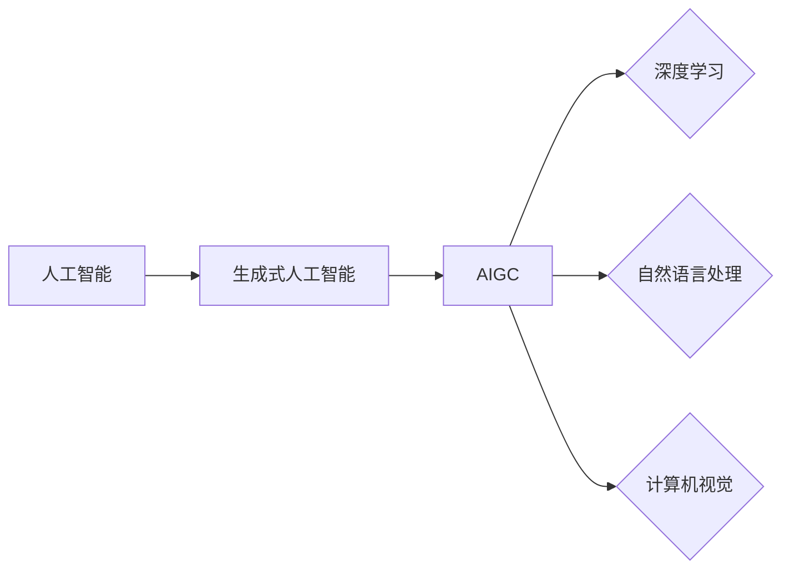

# AIGC从入门到实战：人工智能应用大规模涌现的原因

作者：禅与计算机程序设计艺术

## 1. 背景介绍

### 1.1 AIGC的兴起

近年来，人工智能生成内容（AIGC）技术取得了重大突破，其应用场景也日益广泛。从文本创作到图像生成，从音乐合成到视频剪辑，AIGC正以前所未有的速度改变着我们的生活方式和工作方式。

### 1.2 AIGC与传统内容创作的差异

与传统的由人类主导的内容创作方式相比，AIGC具有以下几个显著优势：

* **高效性:** AIGC可以快速生成大量高质量的内容，极大地提高了内容创作效率。
* **低成本:**  AIGC的成本相对较低，可以降低内容创作的成本。
* **个性化:** AIGC可以根据用户的需求生成个性化的内容，满足用户的特定需求。
* **创新性:** AIGC可以生成一些人类难以想象的内容，为内容创作带来新的创意和灵感。

### 1.3 AIGC大规模涌现的原因

AIGC的快速发展和广泛应用，主要得益于以下几个因素：

* **深度学习技术的突破:** 深度学习技术的快速发展为AIGC提供了强大的技术支撑。
* **大数据的积累:**  海量数据的积累为AIGC提供了丰富的训练数据。
* **计算能力的提升:**  计算能力的提升使得AIGC模型的训练和应用成为可能。
* **市场需求的旺盛:**  各行各业对内容创作的需求日益旺盛，为AIGC提供了广阔的应用市场。

## 2. 核心概念与联系

### 2.1 人工智能

人工智能（Artificial Intelligence，AI）是指计算机系统模拟人类智能的能力，包括学习、推理、解决问题等能力。

### 2.2 生成式人工智能

生成式人工智能（Generative AI）是指利用人工智能技术生成新的内容，例如文本、图像、音频、视频等。AIGC是生成式人工智能的一个重要分支。

### 2.3 深度学习

深度学习（Deep Learning）是一种机器学习方法，它利用多层神经网络对数据进行学习，从而实现对数据的理解和预测。深度学习是AIGC的核心技术之一。

### 2.4 自然语言处理

自然语言处理（Natural Language Processing，NLP）是人工智能领域的一个重要分支，它研究如何让计算机理解和处理人类语言。NLP是文本生成、机器翻译等AIGC应用的基础。

### 2.5 计算机视觉

计算机视觉（Computer Vision，CV）是人工智能领域的一个重要分支，它研究如何让计算机“看”世界，并理解图像和视频的内容。CV是图像生成、视频剪辑等AIGC应用的基础。

### 2.6 关系图



## 3. 核心算法原理具体操作步骤

### 3.1 文本生成

#### 3.1.1 循环神经网络（RNN）

RNN是一种专门用于处理序列数据的深度学习模型，它可以捕捉序列数据中的时间依赖关系。在文本生成中，RNN可以用于预测下一个单词或字符。

#### 3.1.2 长短期记忆网络（LSTM）

LSTM是一种特殊的RNN，它可以解决RNN中的梯度消失问题，从而更好地捕捉长距离的依赖关系。LSTM在文本生成中取得了很好的效果。

#### 3.1.3 Transformer

Transformer是一种新型的深度学习模型，它利用注意力机制来捕捉序列数据中的长距离依赖关系。Transformer在文本生成、机器翻译等任务中取得了比RNN和LSTM更好的效果。

#### 3.1.4 文本生成的操作步骤

1. 准备训练数据，包括大量的文本数据。
2. 选择合适的深度学习模型，例如RNN、LSTM或Transformer。
3. 训练模型，让模型学习文本数据中的语言模式。
4. 使用训练好的模型生成新的文本，例如文章、诗歌、对话等。

### 3.2 图像生成

#### 3.2.1 生成对抗网络（GAN）

GAN是一种深度学习模型，它由两个神经网络组成：生成器和判别器。生成器负责生成新的图像，判别器负责判断生成的图像是否真实。通过对抗训练，生成器可以生成越来越逼真的图像。

#### 3.2.2 变分自编码器（VAE）

VAE是一种深度学习模型，它可以学习数据的潜在表示，并根据潜在表示生成新的数据。VAE在图像生成、数据增强等任务中取得了很好的效果。

#### 3.2.3 图像生成的操作步骤

1. 准备训练数据，包括大量的图像数据。
2. 选择合适的深度学习模型，例如GAN或VAE。
3. 训练模型，让模型学习图像数据中的视觉模式。
4. 使用训练好的模型生成新的图像，例如照片、绘画、设计图等。

## 4. 数学模型和公式详细讲解举例说明

### 4.1 循环神经网络（RNN）

RNN的数学模型可以用以下公式表示：

$$
h_t = f(Wx_t + Uh_{t-1}) \\
y_t = g(Vh_t)
$$

其中：

* $x_t$ 表示t时刻的输入数据。
* $h_t$ 表示t时刻的隐藏状态。
* $y_t$ 表示t时刻的输出数据。
* $W$、$U$、$V$ 表示模型的权重参数。
* $f$ 和 $g$ 表示激活函数。

#### 4.1.1 例子

假设我们要用RNN生成一个句子："The cat sat on the mat."。

1. 初始化隐藏状态 $h_0$。
2. 将第一个单词 "The" 作为输入 $x_1$，计算隐藏状态 $h_1$ 和输出 $y_1$。
3. 将第二个单词 "cat" 作为输入 $x_2$，计算隐藏状态 $h_2$ 和输出 $y_2$。
4. 重复步骤3，直到生成最后一个单词 "mat."。

### 4.2 生成对抗网络（GAN）

GAN的数学模型可以用以下公式表示：

$$
\min_G \max_D V(D,G) = \mathbb{E}_{x\sim p_{data}(x)}[\log D(x)] + \mathbb{E}_{z\sim p_z(z)}[\log(1-D(G(z)))]
$$

其中：

* $G$ 表示生成器。
* $D$ 表示判别器。
* $x$ 表示真实数据。
* $z$ 表示随机噪声。
* $p_{data}(x)$ 表示真实数据的分布。
* $p_z(z)$ 表示随机噪声的分布。

#### 4.2.1 例子

假设我们要用GAN生成一张猫的图片。

1. 训练判别器，让它能够区分真实猫的图片和生成器生成的图片。
2. 训练生成器，让它能够生成越来越逼真的猫的图片，以骗过判别器。
3. 重复步骤1和2，直到生成器能够生成以假乱真的猫的图片。

## 5. 项目实践：代码实例和详细解释说明

### 5.1 文本生成

```python
import tensorflow as tf

# 定义模型
model = tf.keras.Sequential([
    tf.keras.layers.Embedding(input_dim=vocab_size, output_dim=embedding_dim),
    tf.keras.layers.LSTM(units=128),
    tf.keras.layers.Dense(units=vocab_size, activation='softmax')
])

# 编译模型
model.compile(optimizer='adam', loss='sparse_categorical_crossentropy', metrics=['accuracy'])

# 训练模型
model.fit(x_train, y_train, epochs=10)

# 生成文本
start_string = "The cat"
for i in range(10):
    # 将起始字符串转换为数字序列
    input_seq = [word_to_index[word] for word in start_string.split()]
    # 预测下一个单词
    predicted_probs = model.predict(tf.expand_dims(input_seq, axis=0))[0]
    predicted_index = tf.math.argmax(predicted_probs).numpy()
    # 将预测的单词添加到起始字符串中
    predicted_word = index_to_word[predicted_index]
    start_string += " " + predicted_word
    
# 打印生成的文本
print(start_string)
```

**代码解释：**

* 首先，我们定义了一个LSTM模型，该模型包含一个嵌入层、一个LSTM层和一个密集层。
* 然后，我们编译模型，并使用训练数据训练模型。
* 最后，我们使用训练好的模型生成新的文本。

### 5.2 图像生成

```python
import tensorflow as tf

# 定义生成器
def make_generator_model():
    model = tf.keras.Sequential()
    model.add(tf.keras.layers.Dense(7*7*256, use_bias=False,