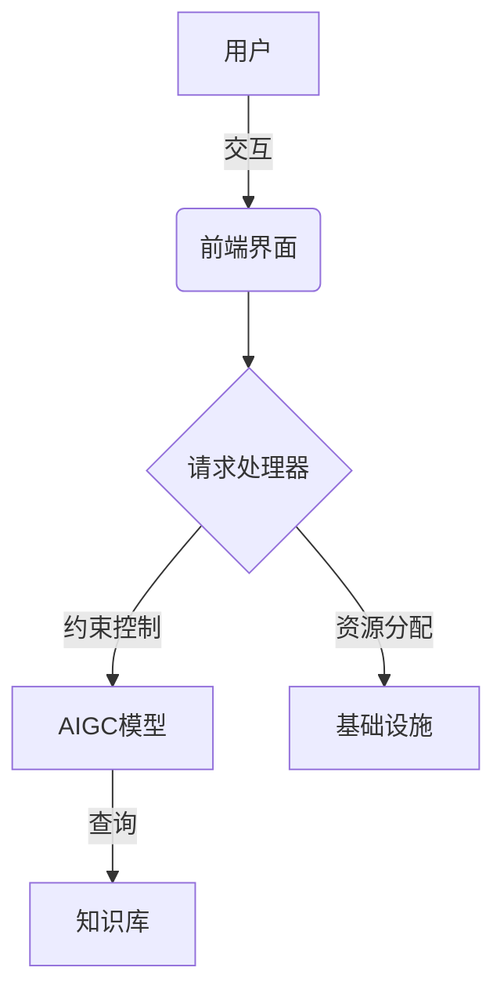
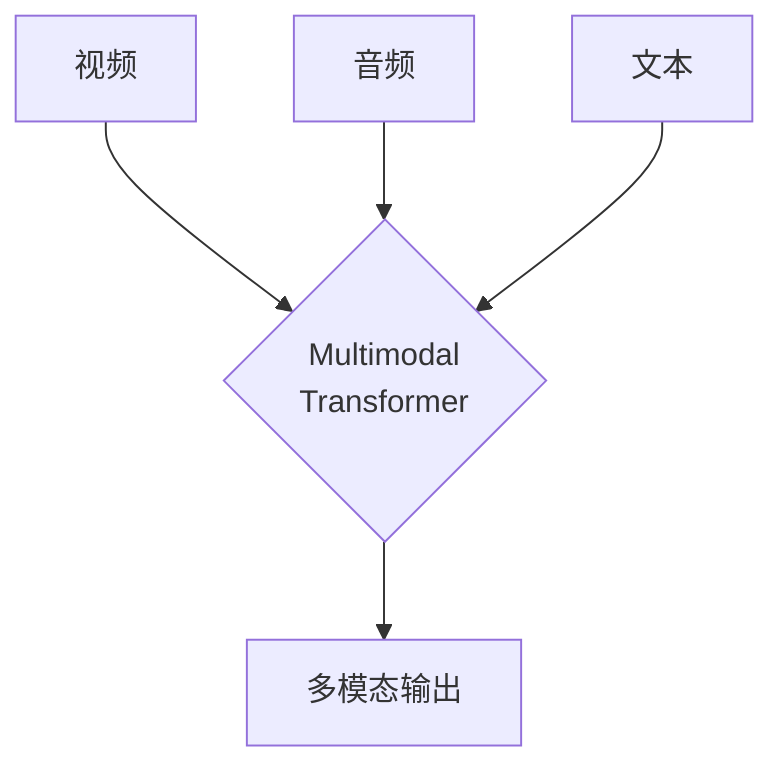

# AIGC从入门到实战：关于企业和组织

## 1.背景介绍

### 1.1 AIGC的兴起

人工智能生成内容(AIGC)是近年来兴起的一种新兴技术,它利用人工智能模型生成文本、图像、音频、视频等多种形式的内容。AIGC技术的出现,为企业和组织带来了巨大的机遇和挑战。

AIGC的核心是大型语言模型和生成式人工智能模型,通过学习海量数据,模型可以生成看似人类创作的内容。经典的AIGC模型包括OpenAI的GPT系列、Anthropic的Claude、Google的PaLM、DeepMind的Gopher等。

### 1.2 AIGC在企业中的应用

AIGC技术在企业和组织中有广泛的应用前景,可以用于:

- 内容创作和营销
- 客户服务和技术支持 
- 软件开发和代码生成
- 企业分析和决策辅助
- 设计和创意生成
- ...

企业和组织可以利用AIGC提高工作效率,节省人力成本,提供更优质的产品和服务。但同时也面临着数据隐私、知识产权、伦理道德等诸多挑战。

## 2.核心概念与联系  

### 2.1 大型语言模型

AIGC的核心是基于自然语言处理(NLP)的大型语言模型。这些模型通过学习海量文本数据,建立文本的概率分布模型,可以生成看似人类创作的自然语言文本。

著名的大型语言模型包括:

- GPT(Generative Pre-trained Transformer)
- BERT(Bidirectional Encoder Representations from Transformers)  
- XLNet
- T5(Text-to-Text Transfer Transformer)
- ...

这些模型采用了自注意力(Self-Attention)和Transformer等新型神经网络架构,在捕捉长距离依赖关系方面表现出色,因此可以生成高质量的长文本。

### 2.2 生成式人工智能

除了文本生成,AIGC还包括图像、音频、视频等多模态内容的生成。这需要生成式对抗网络(GAN)、变分自编码器(VAE)等生成模型。

一些知名的生成模型包括:

- DALL-E
- Stable Diffusion
- Imagen  
- AudioLDM
- ...

这些模型通过学习大量的图像/音频数据,建立高维潜在空间的概率分布模型,可以从随机噪声生成逼真的图像/音频内容。

### 2.3 AIGC系统架构

典型的AIGC系统由以下几个核心部分组成:

1. **前端界面**: 用户与AIGC系统交互的入口,如网页、移动APP等。
2. **请求处理器**: 负责接收用户请求,进行请求解析、安全检查等。  
3. **AIGC模型**: 大型语言模型、生成模型等,用于生成所需内容。
4. **约束控制**: 通过规则、反馈等方式控制AIGC模型输出,确保安全性、一致性。
5. **知识库**: 为AIGC模型提供领域知识和常识知识支持。
6. **基础设施**: 包括存储、计算资源等,支撑AIGC系统的运行。

企业需要根据自身需求,搭建高效、安全、可扩展的AIGC系统架构。



## 3.核心算法原理具体操作步骤

### 3.1 自然语言生成

#### 3.1.1 基于规则的生成

最早期的自然语言生成系统是基于规则的,需要人工设计大量的语法规则和模板。这种方法费时费力,且生成的语言质量有限。

#### 3.1.2 基于统计的生成 

之后出现了基于统计语言模型的生成方法,如N-gram语言模型。这些模型从大量语料中学习词序列的统计规律,生成新句子时遵循概率最大的路径。但缺乏长距离依赖建模能力。

#### 3.1.3 基于神经网络的生成

近年来,基于神经网络的生成模型取得了突破性进展,尤其是Transformer和自注意力机制的出现,使得模型能够有效捕捉长距离依赖关系,生成质量大幅提高。

生成过程可分为以下步骤:

1. **数据预处理**:将原始文本数据清洗、标注、构建词表等。
2. **模型训练**:使用海量语料,通过最大似然估计等方法训练模型参数。
3. **生成解码**:给定一个起始序列,基于trained参数,通过beam search等解码策略生成高质量文本序列。

示例代码:

```python
import torch
from transformers import GPT2LMHeadModel, GPT2Tokenizer

# 加载预训练模型和tokenizer
model = GPT2LMHeadModel.from_pretrained('gpt2')
tokenizer = GPT2Tokenizer.from_pretrained('gpt2')

# 编码输入
input_ids = tokenizer.encode('Hello, my name is', return_tensors='pt')

# 生成文本
output = model.generate(input_ids, max_length=50, do_sample=True)
text = tokenizer.decode(output[0], skip_special_tokens=True)

print(text)
```

上述代码利用预训练的GPT-2模型生成一段文本。可以看到,神经网络模型已经内置了大量的语言知识,只需给定一个简单的起始序列,即可生成连贯、合理的自然语言文本。

### 3.2 图像生成

#### 3.2.1 生成对抗网络(GAN)

生成对抗网络是图像生成的主流方法,包含一个生成器网络和一个判别器网络。生成器从随机噪声生成图像,判别器判断生成图像的真实性,两者相互对抗、交替训练,最终生成器可以生成逼真的图像。

GAN的具体算法流程为:

1. **初始化**生成器G和判别器D的参数。
2. **生成器生成**:从随机噪声z采样,生成器生成图像$G(z)$。
3. **判别器判断**:判别器判断生成图像$G(z)$和真实图像的真实性概率$D(G(z))$和$D(x)$。
4. **计算损失**:计算生成器损失$J^{(G)}$和判别器损失$J^{(D)}$。
5. **反向传播**:对G和D分别进行参数更新,最小化各自的损失函数。
6. **重复训练**:重复2-5步骤,直至模型收敛。

GAN生成的图像质量较高,但也存在模式崩溃、收敛不稳定等问题。研究者提出了各种改进方法,如WGAN、ProGAN等。

#### 3.2.2 变分自编码器(VAE)

VAE是另一种重要的生成模型,它将数据映射到一个连续的潜在空间,通过从潜在空间采样并解码,生成新的数据实例。

VAE的核心思想是最大化训练数据的边缘似然,通过构建生成模型$p(x|\theta)$和变分近似后验$q(z|x)$,并最小化两者之间的KL散度。

具体算法步骤为:

1. **编码**:将输入数据$x$编码为潜在表示$z$,由编码器$q(z|x)$给出。
2. **采样**:从潜在分布$p(z)$中采样潜在变量$z'$。  
3. **解码**:通过解码器$p(x|z')$从潜在变量$z'$重建数据$\hat{x}$。
4. **计算损失**:损失函数为重构损失和KL散度之和。
5. **反向传播**:最小化损失函数,更新编码器和解码器参数。

VAE可以通过插值和向量运算,在潜在空间中生成新的数据实例。它为生成模型引入了有力的理论基础。

### 3.3 多模态生成

现实世界的数据通常是多模态的,如图像+文本、视频+音频等。因此,AIGC需要能够生成和理解多种模态的信息。

#### 3.3.1 Vision-Language模型

Vision-Language模型将视觉和语言信息统一编码到同一个表示空间中,可以同时生成和理解图像和文本。

一些典型的Vision-Language模型包括:

- ViLBERT
- UNITER
- OSCAR
- CLIP
- ...

这些模型通过对视觉和文本特征进行自注意力融合,学习视觉-语义对齐的联合表示,可以支持多模态的生成和理解任务。

#### 3.3.2 Multimodal Transformer

Multimodal Transformer是一种用于处理多模态数据的新型Transformer架构,它将不同模态的数据并行输入,通过跨模态自注意力机制融合多源信息。

这种架构可以泛化到任意模态组合,如视频+音频+文本等,实现多模态的联合建模和生成。



Multimodal Transformer的关键在于跨模态注意力,能够学习不同模态间的相关性,生成一致的多模态输出。

## 4.数学模型和公式详细讲解举例说明

### 4.1 自然语言生成

#### 4.1.1 N-gram语言模型

N-gram语言模型是统计语言模型的基础,用于估计一个词序列的概率。给定一个长度为m的词序列$W=w_1, w_2, ..., w_m$,它的概率可以根据链式法则分解为:

$$P(W)=\prod_{i=1}^m P(w_i|w_1,...,w_{i-1})$$

由于计算复杂度过高,N-gram模型假设一个词只与前面的N-1个词相关,即:

$$P(w_i|w_1,...,w_{i-1}) \approx P(w_i|w_{i-N+1},...,w_{i-1})$$

那么词序列的概率可以近似为:

$$P(W) \approx \prod_{i=1}^m P(w_i|w_{i-N+1},...,w_{i-1})$$

通过计数统计语料库中的N-gram频率,可以估计上述条件概率。N-gram模型简单高效,但只能捕捉短距离依赖关系。

#### 4.1.2 神经网络语言模型

神经网络语言模型则通过神经网络来建模序列概率分布。以RNN为例,给定一个长度为m的序列$x_1,...,x_m$,我们希望最大化序列的对数似然:

$$\max_\theta \sum_{t=1}^m \log P(x_t|x_1,...,x_{t-1};\theta)$$

其中$\theta$是RNN的参数。RNN定义了一个递归函数:

$$h_t = \phi_\theta(h_{t-1}, x_t)$$
$$P(x_t|x_1,...,x_{t-1};\theta) = \text{OutputDistr}(h_t)$$

通过反向传播算法可以高效地学习参数$\theta$。Transformer等新型架构采用了自注意力机制,性能更加出色。

### 4.2 图像生成

#### 4.2.1 生成对抗网络

GAN的核心思想是构建一个生成器G和一个判别器D,并使它们相互对抗、最小化如下损失函数:

$$\min_G \max_D V(D,G) = \mathbb{E}_{x\sim p_{data}(x)}[\log D(x)] + \mathbb{E}_{z\sim p_z(z)}[\log(1-D(G(z)))]$$

其中:
- $p_{data}$是真实数据分布
- $p_z$是随机噪声分布,如高斯分布
- G将随机噪声$z$映射到数据空间,生成假样本$G(z)$
- D是一个二分类器,判断输入是真实样本还是生成样本

G和D相互博弈,G努力生成以假乱真的假样本来迷惑D,D则努力区分真伪样本。当D无法分辨真伪时,G生成的样本就与真实数据无法区分。

GAN的训练过程是:先用固定的G更新D,最大化$\log D(x) + \log(1-D(G(z)))$;然后固定D,更新G,最小化$\log(1-D(G(z)))$。

#### 4.2.2 变分自编码器

VAE将数据$x$建模为潜在变