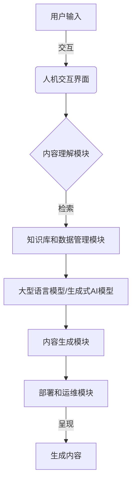
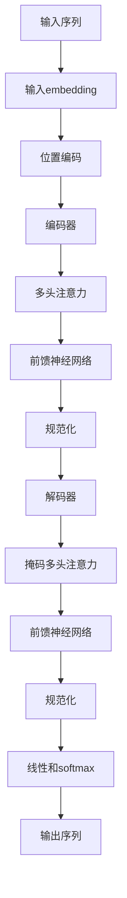

# AIGC创业：机遇与挑战

## 1.背景介绍

### 1.1 人工智能发展历程

人工智能(Artificial Intelligence, AI)自20世纪50年代问世以来,经历了起起落落的发展历程。早期的人工智能系统主要集中在特定领域的专家系统和规则引擎等狭义人工智能应用。21世纪以来,随着大数据、云计算、深度学习等技术的兴起,人工智能进入了全新的深度学习时代,展现出广阔的应用前景。

### 1.2 什么是AIGC?

AIGC(Artificial Intelligence Generated Content)是指利用人工智能技术自动生成内容,包括文字、图像、视频、音频等多种形式。AIGC技术的核心是大型语言模型和生成式人工智能模型,通过对海量数据的学习,模型能够生成看似人类创作的内容。

### 1.3 AIGC创业潮流

近年来,以OpenAI的GPT、谷歌的PaLM、百度的文心大模型等为代表的大型语言模型相继问世,推动了AIGC创业浪潮。无数创业公司和科技巨头纷纷布局AIGC,希望在这个全新赛道分一杯羹。AIGC被视为继移动互联网之后的下一个万亿级赛道。

## 2.核心概念与联系

### 2.1 大型语言模型

大型语言模型是AIGC的核心技术,通过对海量文本数据进行自监督学习,模型能够捕捉语言的语义和上下文关系,生成看似人类创作的文本内容。常见的大型语言模型包括:

- GPT(Generative Pre-trained Transformer)
- BERT(Bidirectional Encoder Representations from Transformers)
- XLNet
- T5(Text-to-Text Transfer Transformer)

这些模型通过transformer结构和自注意力机制,能够有效地处理长序列数据,捕捉长距离依赖关系。

### 2.2 生成式AI模型

生成式AI模型则是针对图像、视频等非结构化数据而设计。常见的生成式模型包括:

- GAN(Generative Adversarial Networks)
- VAE(Variational Auto-Encoders)
- Diffusion Models

这些模型通过对抗训练或自编码器结构,能够从噪声数据中生成逼真的图像和视频内容。

### 2.3 AIGC系统架构

一个完整的AIGC系统通常由以下几个核心模块组成:

- 大型语言模型/生成式AI模型
- 内容理解和生成模块
- 知识库和数据管理模块
- 人机交互界面
- 部署和运维模块

这些模块协同工作,接收用户输入,检索相关知识,生成所需内容,并通过友好的界面呈现给用户。



## 3.核心算法原理具体操作步骤

### 3.1 Transformer架构

Transformer是大型语言模型的核心架构,主要由编码器(Encoder)和解码器(Decoder)两部分组成。编码器将输入序列编码为向量表示,解码器则根据编码器的输出和之前生成的token,预测下一个token。

1. **输入embedding**:将输入token转换为embedding向量表示。
2. **位置编码**:由于Transformer没有循环和卷积结构,需要显式地引入序列位置信息。
3. **多头注意力**:通过自注意力机制,捕捉输入序列中token之间的关系。
4. **前馈神经网络**:对注意力输出进行非线性变换,提取更高层次的特征。
5. **掩码多头注意力**:解码器中,需要掩码未生成的token,防止模型利用将来的信息。
6. **线性和softmax**:最终输出概率分布,预测下一个token。



### 3.2 Diffusion Models

Diffusion Models是一种生成式模型,主要用于生成图像等连续数据。它通过一个正向扩散过程将数据转换为高斯噪声,再通过一个逆向过程从噪声中重建数据。

1. **正向扩散过程**:将原始图像 $x_0$ 通过多次扩散,转换为高斯噪声 $x_T$。
2. **逆向过程**:从噪声 $x_T$ 出发,通过一个生成网络 $p_\theta(x_{t-1}|x_t)$ 重建原始图像。
3. **损失函数**:训练时最小化每一步重建与真实图像之间的差异,优化网络参数 $\theta$。

$$
\begin{aligned}
q(x_T|x_0) &= \prod_{t=1}^T q(x_t|x_{t-1}) \\
p_\theta(x_0) &= p(x_T)\prod_{t=1}^T p_\theta(x_{t-1}|x_t) \\
\mathcal{L}_\theta &= \mathbb{E}_{q(x_T|x_0)}\big[\|x_0 - p_\theta(x_0|x_T)\|^2\big]
\end{aligned}
$$

### 3.3 GAN训练

生成对抗网络(Generative Adversarial Networks, GAN)通过生成器(Generator)和判别器(Discriminator)的对抗训练,驱使生成器生成逼真的数据。

1. **生成器**:从随机噪声 $z$ 出发,生成假数据样本 $G(z)$。
2. **判别器**:判别输入数据是真实样本 $x$ 还是生成样本 $G(z)$。
3. **对抗训练**:生成器 $G$ 力求欺骗判别器,判别器 $D$ 则努力区分真伪。
4. **最小最大损失**:生成器和判别器相互对抗,最小化彼此的损失函数。

$$
\begin{aligned}
\min_G \max_D V(D,G) &= \mathbb{E}_{x\sim p_\text{data}}[\log D(x)] \\
&+ \mathbb{E}_{z\sim p_z}[\log(1-D(G(z)))]
\end{aligned}
$$

## 4.数学模型和公式详细讲解举例说明

### 4.1 Transformer注意力机制

Transformer的注意力机制是整个模型的核心。对于一个长度为 $N$ 的序列 $X = (x_1, x_2, \ldots, x_N)$,我们希望计算其中一个位置 $t$ 的注意力输出 $y_t$。

首先计算查询向量 $q_t$、键向量 $K = (k_1, k_2, \ldots, k_N)$ 和值向量 $V = (v_1, v_2, \ldots, v_N)$:

$$
\begin{aligned}
q_t &= W^Qx_t \\
K &= W^KX \\
V &= W^VX
\end{aligned}
$$

其中 $W^Q$、$W^K$、$W^V$ 为可训练参数。接下来计算注意力分数:

$$
\text{score}(q_t, k_i) = \frac{q_t^\top k_i}{\sqrt{d_k}}
$$

通过 softmax 函数得到注意力权重:

$$
\alpha_{t,i} = \text{softmax}(\text{score}(q_t, k_i)) = \frac{\exp(\text{score}(q_t, k_i))}{\sum_{j=1}^N \exp(\text{score}(q_t, k_j))}
$$

最终注意力输出为加权求和:

$$
y_t = \sum_{i=1}^N \alpha_{t,i}v_i
$$

多头注意力机制则是将注意力过程独立运行 $h$ 次,并将结果拼接:

$$
\text{MultiHead}(Q,K,V) = \text{Concat}(y_1, y_2, \ldots, y_h)W^O
$$

其中 $y_i$ 为第 $i$ 个注意力头的输出。

### 4.2 VAE变分自编码器

变分自编码器(Variational Auto-Encoder, VAE)是一种生成模型,它将输入数据 $x$ 编码为隐变量 $z$ 的概率分布 $q_\phi(z|x)$,再从该分布中采样 $z$ 并解码生成数据 $p_\theta(x|z)$。

编码器 $q_\phi(z|x)$ 和解码器 $p_\theta(x|z)$ 都为深度神经网络,参数分别为 $\phi$ 和 $\theta$。由于真实后验 $p(z|x)$ 难以计算,VAE使用变分推断(Variational Inference)技术,最小化 $q_\phi(z|x)$ 与真实后验之间的KL散度:

$$
\mathcal{L}(\phi, \theta; x) = -\mathbb{E}_{q_\phi(z|x)}[\log p_\theta(x|z)] + D_\text{KL}(q_\phi(z|x)\|p(z))
$$

第一项为重构损失,第二项为KL散度正则项,用于约束隐变量分布接近先验 $p(z)$。通过重参数技巧(Reparameterization Trick),可以对 $\phi$ 和 $\theta$ 进行端到端的优化训练。

## 4.项目实践:代码实例和详细解释说明

以下是一个使用PyTorch实现的简化Transformer模型示例:

```python
import torch
import torch.nn as nn

# 输入embedding和位置编码
class EmbeddingLayer(nn.Module):
    def __init__(self, vocab_size, d_model):
        super().__init__()
        self.token_embedding = nn.Embedding(vocab_size, d_model)
        self.pos_encoding = PositionalEncoding(d_model)
        
    def forward(self, x):
        return self.pos_encoding(self.token_embedding(x))

# 多头注意力层
class MultiHeadAttention(nn.Module):
    def __init__(self, d_model, num_heads):
        super().__init__()
        self.query = nn.Linear(d_model, d_model)
        self.key = nn.Linear(d_model, d_model)
        self.value = nn.Linear(d_model, d_model)
        self.concat = nn.Linear(d_model, d_model)
        self.num_heads = num_heads
        
    def forward(self, x):
        queries = self.query(x).view(x.size(0), -1, self.num_heads, d_model // self.num_heads).permute(0, 2, 1, 3)
        keys = self.key(x).view(x.size(0), -1, self.num_heads, d_model // self.num_heads).permute(0, 2, 1, 3)
        values = self.value(x).view(x.size(0), -1, self.num_heads, d_model // self.num_heads).permute(0, 2, 1, 3)
        
        scores = torch.matmul(queries, keys.transpose(-2, -1)) / math.sqrt(d_model // self.num_heads)
        attention = torch.softmax(scores, dim=-1)
        out = torch.matmul(attention, values).permute(0, 2, 1, 3).contiguous().view(x.size(0), -1, d_model)
        return self.concat(out)

# 前馈神经网络层
class FeedForward(nn.Module):
    def __init__(self, d_model, d_ff):
        super().__init__()
        self.linear1 = nn.Linear(d_model, d_ff)
        self.linear2 = nn.Linear(d_ff, d_model)
        
    def forward(self, x):
        return self.linear2(F.relu(self.linear1(x)))

# Transformer编码器层
class EncoderLayer(nn.Module):
    def __init__(self, d_model, num_heads, d_ff):
        super().__init__()
        self.attn = MultiHeadAttention(d_model, num_heads)
        self.ff = FeedForward(d_model, d_ff)
        self.norm1 = nn.LayerNorm(d_model)
        self.norm2 = nn.LayerNorm(d_model)
        
    def forward(self, x):
        res = x
        x = self.norm1(x + self.attn(x))
        x = self.norm2(x + self.ff(x))
        return x

# Transformer解码器层
class DecoderLayer(nn.Module):
    def __init__(self, d_model, num_heads, d_ff):
        super().__init__()