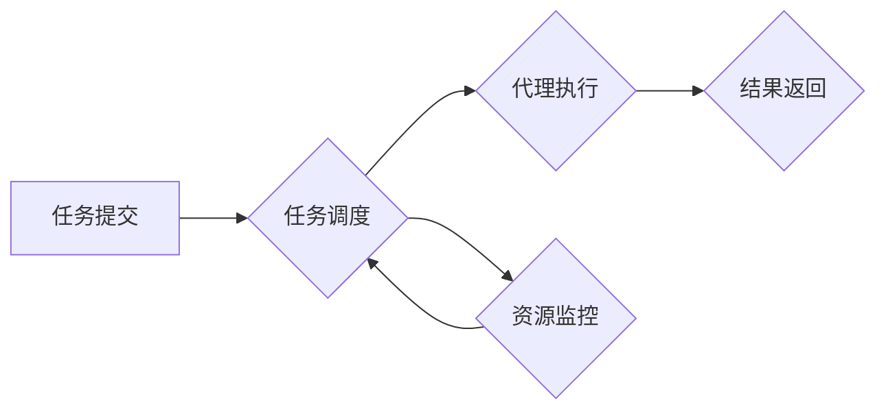

# AI人工智能深度学习算法：智能深度学习代理的自适应调度策略

作者：禅与计算机程序设计艺术

## 1. 背景介绍

### 1.1 深度学习代理的兴起与挑战

近年来，深度学习技术取得了显著的进展，并被广泛应用于各个领域，包括图像识别、自然语言处理、机器人控制等。深度学习模型的训练通常需要大量的计算资源和时间，为了提高效率，深度学习代理（Deep Learning Agent）应运而生。深度学习代理可以自动执行深度学习任务，例如数据预处理、模型训练、超参数优化等，从而解放研究人员的精力，使其专注于更高级的任务。

然而，随着深度学习模型规模的不断增大，以及应用场景的日益复杂，深度学习代理面临着新的挑战：

- **资源分配的复杂性:** 深度学习任务对计算资源的需求差异很大，如何有效地分配资源以最大化效率是一个难题。
- **任务调度的动态性:** 深度学习任务的执行时间和资源需求往往难以预测，需要动态调整调度策略以适应变化的环境。
- **代理间协作的必要性:** 复杂的深度学习任务可能需要多个代理协同完成，如何协调代理之间的合作以提高整体效率是一个挑战。

### 1.2 自适应调度策略的重要性

为了应对上述挑战，智能深度学习代理的自适应调度策略成为了研究热点。自适应调度策略旨在根据任务的特点和资源状况动态地调整代理的调度策略，以优化资源利用率、缩短任务完成时间、提高代理协作效率。

## 2. 核心概念与联系

### 2.1 深度学习代理

深度学习代理是一个可以自动执行深度学习任务的软件程序。它通常包含以下模块:

- **数据预处理模块:** 负责数据的清洗、转换、特征提取等操作。
- **模型训练模块:** 负责选择合适的深度学习模型，并使用训练数据进行训练。
- **超参数优化模块:** 负责寻找最佳的超参数组合，以提高模型的性能。
- **任务调度模块:** 负责将任务分配给合适的代理，并监控任务的执行情况。

### 2.2 自适应调度策略

自适应调度策略是指根据任务特点和资源状况动态地调整代理的调度策略。它通常包含以下要素:

- **任务优先级:** 根据任务的重要性、紧急程度等因素确定任务的优先级。
- **资源可用性:** 考虑计算资源的可用性，例如CPU、GPU、内存等。
- **代理负载:** 考虑代理的当前负载情况，避免过度分配任务。
- **性能指标:** 监控任务的执行情况，例如训练速度、模型精度等，并根据性能指标调整调度策略。

### 2.3 核心概念之间的联系

深度学习代理的各个模块之间相互协作，共同完成深度学习任务。自适应调度策略则负责根据任务特点和资源状况动态地调整代理的调度策略，以优化资源利用率、缩短任务完成时间、提高代理协作效率。

## 3. 核心算法原理具体操作步骤

### 3.1 基于强化学习的自适应调度策略

强化学习是一种机器学习方法，它可以让代理通过与环境交互来学习最佳的行为策略。在深度学习代理的调度场景中，强化学习可以用来学习自适应调度策略。

具体操作步骤如下:

1. **定义状态空间:** 状态空间包含代理的负载情况、资源可用性、任务优先级等信息。
2. **定义动作空间:** 动作空间包含代理可以执行的操作，例如将任务分配给某个代理、调整代理的资源配额等。
3. **定义奖励函数:** 奖励函数用于评估代理的行为，例如任务完成时间、资源利用率等。
4. **训练强化学习模型:** 使用强化学习算法，例如Q-learning、SARSA等，训练一个可以根据当前状态选择最佳动作的模型。

### 3.2 基于多代理系统的自适应调度策略

多代理系统是指由多个代理组成的系统，代理之间可以相互协作完成任务。在深度学习代理的调度场景中，多代理系统可以用来提高代理的协作效率。

具体操作步骤如下:

1. **定义代理之间的通信协议:** 代理之间需要定义通信协议，以便共享信息和协作完成任务。
2. **设计代理的协作策略:** 代理需要设计协作策略，例如任务分配、资源共享等。
3. **实现多代理系统的调度算法:** 多代理系统的调度算法需要考虑代理之间的协作关系，以及任务的特点和资源状况。

## 4. 数学模型和公式详细讲解举例说明

### 4.1 任务调度模型

假设有 $n$ 个代理，$m$ 个任务。每个任务 $j$ 有一个优先级 $p_j$，以及所需的计算资源 $r_j$。每个代理 $i$ 有一个可用资源 $a_i$。

任务调度模型的目标是找到一个最优的调度方案，使得所有任务都能在最短的时间内完成。

### 4.2 贪心算法

贪心算法是一种简单的调度算法，它每次选择优先级最高的任务，并将其分配给可用资源最多的代理。

具体操作步骤如下:

1. 对所有任务按照优先级降序排序。
2. 对所有代理按照可用资源降序排序。
3. 遍历所有任务，将每个任务分配给可用资源最多的代理。

### 4.3 举例说明

假设有 3 个代理，5 个任务。任务的优先级和所需资源如下表所示:

| 任务 | 优先级 | 资源 |
|---|---|---|
| 1 | 5 | 2 |
| 2 | 3 | 1 |
| 3 | 4 | 3 |
| 4 | 2 | 2 |
| 5 | 1 | 1 |

代理的可用资源如下表所示:

| 代理 | 可用资源 |
|---|---|
| 1 | 4 |
| 2 | 3 |
| 3 | 2 |

使用贪心算法进行调度，结果如下:

| 任务 | 代理 |
|---|---|
| 1 | 1 |
| 3 | 2 |
| 2 | 3 |
| 4 | 1 |
| 5 | 2 |

## 5. 项目实践：代码实例和详细解释说明

```python
import random

# 定义代理类
class Agent:
    def __init__(self, id, available_resources):
        self.id = id
        self.available_resources = available_resources
        self.tasks = []

    def assign_task(self, task):
        if self.available_resources >= task.resources:
            self.tasks.append(task)
            self.available_resources -= task.resources
            return True
        else:
            return False

# 定义任务类
class Task:
    def __init__(self, id, priority, resources):
        self.id = id
        self.priority = priority
        self.resources = resources

# 初始化代理和任务
agents = [
    Agent(1, 4),
    Agent(2, 3),
    Agent(3, 2)
]

tasks = [
    Task(1, 5, 2),
    Task(2, 3, 1),
    Task(3, 4, 3),
    Task(4, 2, 2),
    Task(5, 1, 1)
]

# 使用贪心算法进行调度
tasks.sort(key=lambda x: x.priority, reverse=True)
agents.sort(key=lambda x: x.available_resources, reverse=True)

for task in tasks:
    for agent in agents:
        if agent.assign_task(task):
            break

# 打印调度结果
for agent in agents:
    print(f"Agent {agent.id}:")
    for task in agent.tasks:
        print(f"  Task {task.id}")
```

## 6. 实际应用场景

### 6.1 云计算资源调度

在云计算环境中，深度学习任务通常需要大量的计算资源。自适应调度策略可以根据任务的特点和资源状况动态地调整虚拟机的分配策略，以优化资源利用率、缩短任务完成时间。

### 6.2 自动驾驶系统

自动驾驶系统需要实时处理大量的传感器数据，并做出驾驶决策。深度学习代理可以用来执行感知、决策等任务。自适应调度策略可以根据驾驶环境的变化动态地调整代理的调度策略，以确保驾驶安全。

### 6.3 金融风险控制

金融风险控制需要分析大量的交易数据，并识别潜在的风险。深度学习代理可以用来执行欺诈检测、信用评估等任务。自适应调度策略可以根据市场变化动态地调整代理的调度策略，以提高风险控制的效率。

## 7. 总结：未来发展趋势与挑战

### 7.1 未来发展趋势

- **更智能的调度策略:** 随着深度学习模型的不断发展，自适应调度策略需要更加智能，以适应更复杂的应用场景。
- **更精细的资源管理:** 深度学习任务对计算资源的需求越来越高，自适应调度策略需要更精细地管理资源，以提高资源利用率。
- **更紧密的代理协作:** 复杂的深度学习任务需要多个代理协同完成，自适应调度策略需要促进代理之间的紧密协作，以提高整体效率。

### 7.2 面临的挑战

- **深度学习模型的复杂性:** 深度学习模型的结构和参数越来越复杂，这给自适应调度策略的设计带来了挑战。
- **数据规模的增长:** 深度学习任务需要处理的数据规模越来越大，这给自适应调度策略的效率带来了挑战。
- **计算资源的限制:** 计算资源的成本和可用性仍然是制约深度学习应用的瓶颈，自适应调度策略需要在有限的资源条件下优化任务调度。

## 8. 附录：常见问题与解答

### 8.1 如何评估自适应调度策略的性能?

可以使用以下指标来评估自适应调度策略的性能:

- **任务完成时间:** 所有任务完成所需的总时间。
- **资源利用率:** 计算资源的使用效率。
- **代理负载均衡:** 代理之间的负载分配是否均衡。
- **任务优先级满足度:** 高优先级任务是否能够优先完成。

### 8.2 如何选择合适的自适应调度算法?

选择合适的自适应调度算法需要考虑以下因素:

- **任务的特点:** 例如任务的优先级、资源需求、执行时间等。
- **资源的状况:** 例如计算资源的可用性、成本等。
- **代理的特性:** 例如代理的负载情况、性能指标等。

### 8.3 如何实现自适应调度策略?

可以使用以下工具和技术来实现自适应调度策略:

- **强化学习框架:** 例如TensorFlow、PyTorch等。
- **多代理系统平台:** 例如JADE、MADKit等。
- **云计算平台:** 例如AWS、Azure、Google Cloud等。


## 9. 附录：Mermaid流程图


