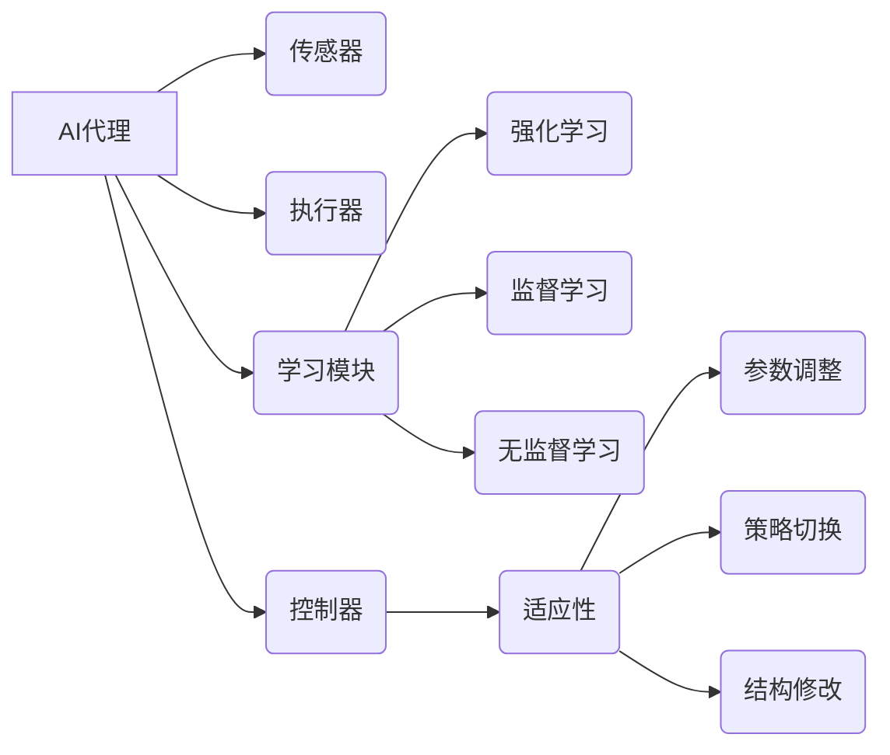

## 1. 背景介绍

### 1.1  AI代理的兴起与挑战

人工智能（AI）代理，旨在模拟人类智能并自主完成任务的计算机系统，近年来在各个领域取得了显著进展。从自动驾驶汽车到智能家居助手，AI 代理正在改变我们的生活方式。然而，现实世界是一个充满不确定性和动态变化的环境，为 AI 代理的设计和部署带来了挑战。传统的 AI 系统往往难以适应新的环境和任务，需要大量的人工干预和调整。为了克服这些限制，研究人员开始探索能够在动态环境中自主学习和适应的 AI 代理。

### 1.2 动态环境的特性

动态环境是指环境状态随时间不断变化的环境。这种变化可能是由外部因素引起的，例如天气变化、市场波动，也可能是由 AI 代理自身的行动引起的，例如在一个游戏中，AI 代理的行动会影响游戏的状态。动态环境具有以下特性：

* **不确定性:** 环境状态的变化难以预测。
* **复杂性:** 环境中存在大量的变量和交互关系。
* **非平稳性:** 环境的统计特性随时间变化。

### 1.3  适应与学习的重要性

为了在动态环境中有效地运作，AI 代理必须具备适应和学习的能力。适应是指 AI 代理能够根据环境的变化调整其行为，以保持其性能。学习是指 AI 代理能够从经验中积累知识，并利用这些知识改进其行为。适应和学习是相辅相成的，适应需要学习提供知识，而学习需要适应提供经验。

## 2. 核心概念与联系

### 2.1  AI代理

AI 代理是一个能够感知环境、做出决策并执行动作的自主系统。它通常包含以下组件：

* **传感器:** 用于感知环境状态。
* **执行器:** 用于执行动作。
* **控制器:** 用于根据感知到的环境状态做出决策。
* **学习模块:** 用于从经验中学习。

### 2.2  强化学习

强化学习是一种机器学习范式，其中 AI 代理通过与环境交互来学习最佳行为策略。AI 代理在每个时间步长观察环境状态，选择一个动作，并从环境中获得奖励或惩罚。强化学习的目标是学习一个策略，该策略能够最大化 AI 代理在长期运行中获得的累积奖励。

### 2.3  适应性

适应性是指 AI 代理能够根据环境的变化调整其行为，以保持其性能。适应性可以通过多种方式实现，例如：

* **参数调整:** 根据环境变化调整 AI 代理的内部参数。
* **策略切换:** 根据环境变化选择不同的行为策略。
* **结构修改:** 根据环境变化修改 AI 代理的结构。

### 2.4  学习

学习是指 AI 代理能够从经验中积累知识，并利用这些知识改进其行为。学习可以通过多种方式实现，例如：

* **监督学习:** 从标记数据中学习。
* **无监督学习:** 从未标记数据中学习。
* **强化学习:** 从与环境交互的经验中学习。

### 2.5  核心概念联系图



## 3. 核心算法原理具体操作步骤

### 3.1  基于模型的强化学习

基于模型的强化学习方法首先建立环境的模型，然后利用该模型规划最佳行为策略。模型可以是确定性的，也可以是随机的。常见的基于模型的强化学习算法包括：

* **动态规划:** 在已知环境模型的情况下，使用迭代方法计算最佳策略。
* **蒙特卡洛树搜索:** 通过模拟大量可能的未来轨迹来估计状态值和动作值，并选择最优动作。

#### 3.1.1 动态规划

动态规划是一种解决序列决策问题的通用方法。在强化学习中，动态规划可以用于计算最佳策略，前提是环境模型已知。动态规划算法的核心思想是将问题分解为子问题，并递归地解决这些子问题。

动态规划算法的操作步骤如下：

1. **初始化:** 为所有状态分配初始值。
2. **迭代:** 对于每个状态，计算所有可能动作的预期回报，并选择预期回报最高的动作。
3. **终止:** 当状态值收敛时，算法终止。

#### 3.1.2 蒙特卡洛树搜索

蒙特卡洛树搜索是一种基于树搜索的强化学习方法。它通过模拟大量可能的未来轨迹来估计状态值和动作值，并选择最优动作。

蒙特卡洛树搜索算法的操作步骤如下：

1. **选择:** 从根节点开始，选择一个子节点进行扩展。
2. **扩展:** 扩展所选节点，添加新的子节点。
3. **模拟:** 从新添加的子节点开始，模拟一条随机轨迹，直到达到终止状态。
4. **回溯:** 将模拟结果回溯到根节点，更新沿途节点的值。

### 3.2  无模型强化学习

无模型强化学习方法不依赖于环境模型，而是直接从与环境交互的经验中学习最佳策略。常见的无模型强化学习算法包括：

* **Q-learning:** 学习状态-动作值函数，并选择具有最高值的动作。
* **SARSA:** 学习状态-动作-奖励-状态-动作值函数，并选择具有最高值的动作。

#### 3.2.1 Q-learning

Q-learning 是一种基于值迭代的强化学习算法。它学习状态-动作值函数，并选择具有最高值的动作。

Q-learning 算法的操作步骤如下：

1. **初始化:** 为所有状态-动作对分配初始值。
2. **迭代:** 对于每个时间步长，观察当前状态和奖励，选择一个动作，并更新状态-动作值函数。
3. **终止:** 当状态-动作值函数收敛时，算法终止。

#### 3.2.2 SARSA

SARSA 是一种基于策略迭代的强化学习算法。它学习状态-动作-奖励-状态-动作值函数，并选择具有最高值的动作。

SARSA 算法的操作步骤如下：

1. **初始化:** 为所有状态-动作-奖励-状态-动作对分配初始值。
2. **迭代:** 对于每个时间步长，观察当前状态和奖励，选择一个动作，观察下一个状态和奖励，并更新状态-动作-奖励-状态-动作值函数。
3. **终止:** 当状态-动作-奖励-状态-动作值函数收敛时，算法终止。

## 4. 数学模型和公式详细讲解举例说明

### 4.1  马尔可夫决策过程（MDP）

马尔可夫决策过程（MDP）是一种用于建模序列决策问题的数学框架。MDP 由以下元素组成：

* **状态空间:** 所有可能状态的集合。
* **动作空间:** 所有可能动作的集合。
* **转移函数:** 描述状态转移概率的函数。
* **奖励函数:** 描述每个状态-动作对的奖励的函数。
* **折扣因子:** 用于权衡未来奖励的权重。

### 4.2  Bellman 方程

Bellman 方程是 MDP 的核心方程，它描述了状态值函数和动作值函数之间的关系。状态值函数表示从某个状态开始，遵循某个策略所能获得的预期累积奖励。动作值函数表示从某个状态开始，执行某个动作，然后遵循某个策略所能获得的预期累积奖励。

状态值函数的 Bellman 方程为：

$$
V^\pi(s) = \sum_{a \in A} \pi(a|s) \sum_{s' \in S} P(s'|s,a) [R(s,a,s') + \gamma V^\pi(s')]
$$

其中：

* $V^\pi(s)$ 是状态 $s$ 的值函数。
* $\pi(a|s)$ 是策略 $\pi$ 在状态 $s$ 时选择动作 $a$ 的概率。
* $P(s'|s,a)$ 是在状态 $s$ 时执行动作 $a$ 后转移到状态 $s'$ 的概率。
* $R(s,a,s')$ 是在状态 $s$ 时执行动作 $a$ 后转移到状态 $s'$ 所获得的奖励。
* $\gamma$ 是折扣因子。

动作值函数的 Bellman 方程为：

$$
Q^\pi(s,a) = \sum_{s' \in S} P(s'|s,a) [R(s,a,s') + \gamma \sum_{a' \in A} \pi(a'|s') Q^\pi(s',a')]
$$

其中：

* $Q^\pi(s,a)$ 是状态 $s$ 时执行动作 $a$ 的值函数。

### 4.3  举例说明

假设有一个机器人正在学习在一个迷宫中导航。迷宫由一个 5x5 的网格组成，机器人可以向上、向下、向左或向右移动。迷宫中有一个目标位置，机器人到达目标位置时会获得 +1 的奖励，撞到墙壁时会获得 -1 的奖励。

我们可以使用 MDP 来建模这个问题。状态空间是迷宫中所有可能的网格位置。动作空间是 {上，下，左，右}。转移函数描述了机器人在执行某个动作后移动到另一个网格位置的概率。奖励函数描述了机器人在每个网格位置获得的奖励。

我们可以使用 Bellman 方程来计算最佳策略。最佳策略是指能够最大化机器人在长期运行中获得的累积奖励的策略。

## 5. 项目实践：代码实例和详细解释说明

### 5.1  使用 Q-learning 算法训练 AI 代理玩游戏

```python
import gym
import numpy as np

# 创建环境
env = gym.make('CartPole-v1')

# 初始化 Q 表
q_table = np.zeros([env.observation_space.n, env.action_space.n])

# 设置超参数
alpha = 0.1  # 学习率
gamma = 0.99  # 折扣因子
epsilon = 0.1  # 探索率
episodes = 10000  # 训练回合数

# 训练循环
for episode in range(episodes):
    # 重置环境
    state = env.reset()

    # 初始化总奖励
    total_reward = 0

    # 循环直到游戏结束
    while True:
        # 选择动作
        if np.random.uniform(0, 1) < epsilon:
            action = env.action_space.sample()  # 随机选择动作
        else:
            action = np.argmax(q_table[state, :])  # 选择 Q 值最高的动作

        # 执行动作
        next_state, reward, done, info = env.step(action)

        # 更新 Q 表
        q_table[state, action] = (1 - alpha) * q_table[state, action] + alpha * (
                    reward + gamma * np.max(q_table[next_state, :]))

        # 更新总奖励
        total_reward += reward

        # 更新状态
        state = next_state

        # 如果游戏结束，则退出循环
        if done:
            break

    # 打印回合信息
    print(f'Episode: {episode}, Total Reward: {total_reward}')

# 保存 Q 表
np.save('q_table.npy', q_table)
```

### 5.2  代码解释

* `gym` 库用于创建强化学习环境。
* `numpy` 库用于数值计算。
* `q_table` 是一个二维数组，用于存储状态-动作值函数。
* `alpha` 是学习率，控制 Q 值更新的速度。
* `gamma` 是折扣因子，控制未来奖励的权重。
* `epsilon` 是探索率，控制 AI 代理探索新动作的概率。
* `episodes` 是训练回合数。
* `env.reset()` 用于重置环境。
* `env.step(action)` 用于执行动作并返回下一个状态、奖励、游戏是否结束以及其他信息。
* `np.argmax(q_table[state, :])` 用于选择 Q 值最高的动作。
* `np.save('q_table.npy', q_table)` 用于保存 Q 表。

## 6. 实际应用场景

### 6.1  游戏

AI 代理在游戏领域有着广泛的应用，例如：

* **游戏 AI:** 控制游戏中的非玩家角色（NPC）。
* **游戏测试:** 自动测试游戏的平衡性和漏洞。
* **游戏机器人:** 代替人类玩家进行游戏。

### 6.2  机器人

AI 代理可以用于控制机器人在现实世界中执行任务，例如：

* **自动驾驶汽车:** 控制汽车在道路上行驶。
* **工业机器人:** 控制机器人在工厂中执行任务。
* **服务机器人:** 控制机器人在家庭或公共场所提供服务。

### 6.3  金融

AI 代理可以用于金融领域的各种任务，例如：

* **算法交易:** 自动执行交易策略。
* **风险管理:** 评估和管理金融风险。
* **欺诈检测:** 检测金融欺诈行为。

## 7. 总结：未来发展趋势与挑战

### 7.1  未来发展趋势

* **更强大的学习算法:** 研究人员正在不断开发更强大的强化学习算法，以提高 AI 代理的学习效率和性能。
* **更逼真的模拟环境:** 随着虚拟现实和增强现实技术的进步，AI 代理可以在更逼真的模拟环境中进行训练，从而提高其在现实世界中的适应能力。
* **更广泛的应用领域:** AI 代理的应用领域将不断扩展，涵盖医疗、教育、交通等各个领域。

### 7.2  挑战

* **数据需求:** 训练 AI 代理需要大量的數據，而获取和处理数据是一项具有挑战性的任务。
* **安全性:** AI 代理的安全性是一个重要问题，需要确保 AI 代理的行为符合道德和法律规范。
* **可解释性:** AI 代理的决策过程往往难以解释，这限制了其在某些领域的应用。

## 8. 附录：常见问题与解答

### 8.1  什么是 AI 代理？

AI 代理是一个能够感知环境、做出决策并执行动作的自主系统。

### 8.2  什么是强化学习？

强化学习是一种机器学习范式，其中 AI 代理通过与环境交互来学习最佳行为策略。

### 8.3  AI 代理如何适应动态环境？

AI 代理可以通过参数调整、策略切换或结构修改来适应动态环境。

### 8.4  AI 代理的实际应用有哪些？

AI 代理在游戏、机器人、金融等领域有着广泛的应用。