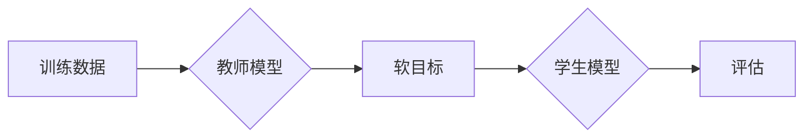

## 1. 背景介绍

### 1.1 深度学习模型的规模与效率困境

近年来，深度学习在各个领域取得了显著的成果，但随着模型规模的不断增大，其计算成本和存储需求也随之飙升。这使得在资源受限的设备（如移动设备、嵌入式系统）上部署深度学习模型变得越来越困难。

### 1.2 模型蒸馏：一种有效的模型压缩技术

为了解决这一问题，模型蒸馏技术应运而生。模型蒸馏的基本思想是将一个大型复杂模型（称为“教师模型”）的知识迁移到一个小型简单模型（称为“学生模型”）中，从而在保持性能的同时降低模型的规模和计算复杂度。

### 1.3 模型蒸馏的优势

* **降低计算成本和存储需求:** 学生模型通常比教师模型小得多，因此推理速度更快，占用的内存更少。
* **提高模型泛化能力:** 学生模型可以从教师模型的知识中学习，从而提高其泛化能力，避免过拟合。
* **方便模型部署:** 小型模型更容易部署到资源受限的设备上。

## 2. 核心概念与联系

### 2.1 教师模型与学生模型

* **教师模型:** 
    * 通常是一个大型、复杂的深度学习模型，具有较高的性能。
    * 负责提供知识和指导给学生模型。
* **学生模型:** 
    * 通常是一个小型、简单的深度学习模型，旨在学习教师模型的知识。
    * 训练目标是尽可能地接近教师模型的性能。

### 2.2 知识蒸馏

知识蒸馏是指将教师模型的知识迁移到学生模型的过程。主要包括以下几种方式：

* **输出蒸馏:** 学生模型学习模仿教师模型的输出概率分布，而不是仅仅预测类别标签。
* **特征蒸馏:** 学生模型学习模仿教师模型的中间层特征表示。
* **关系蒸馏:** 学生模型学习模仿教师模型不同样本之间的关系，例如相似性或差异性。

### 2.3 温度参数

温度参数 $T$ 是一个超参数，用于控制输出概率分布的平滑程度。较高的温度值会使概率分布更加平滑，从而鼓励学生模型学习教师模型的更广泛的知识。

## 3. 核心算法原理具体操作步骤

### 3.1 基于输出蒸馏的模型蒸馏

1. **训练教师模型:** 首先，使用大量数据训练一个高性能的教师模型。
2. **生成软目标:** 使用教师模型对训练数据进行预测，生成软目标（即输出概率分布）。
3. **训练学生模型:** 使用软目标作为训练数据，训练一个小型学生模型。训练过程中，使用温度参数 $T$ 来控制软目标的平滑程度。
4. **评估学生模型:** 使用测试数据评估学生模型的性能，并与教师模型进行比较。

### 3.2  Mermaid流程图



### 3.3 具体操作步骤举例说明

假设我们要训练一个用于图像分类的学生模型。

1. **训练教师模型:** 我们可以使用 ResNet-50 作为教师模型，并在 ImageNet 数据集上进行训练。
2. **生成软目标:** 使用训练好的 ResNet-50 模型对 ImageNet 训练数据进行预测，生成软目标。
3. **训练学生模型:** 我们可以使用 MobileNetV2 作为学生模型，并使用软目标作为训练数据进行训练。训练过程中，我们可以设置温度参数 $T=5$。
4. **评估学生模型:** 使用 ImageNet 测试数据评估 MobileNetV2 模型的性能，并与 ResNet-50 模型进行比较。

## 4. 数学模型和公式详细讲解举例说明

### 4.1 输出蒸馏的损失函数

输出蒸馏的损失函数通常包括两部分：

* **硬标签损失:** 使用真实标签计算的交叉熵损失。
* **软标签损失:** 使用软目标计算的 KL 散度损失。

$$
\mathcal{L} = \alpha \mathcal{L}_{hard} + (1-\alpha) \mathcal{L}_{soft}
$$

其中：

* $\mathcal{L}_{hard}$ 是硬标签损失，可以使用交叉熵损失函数计算。
* $\mathcal{L}_{soft}$ 是软标签损失，可以使用 KL 散度损失函数计算。
* $\alpha$ 是一个控制硬标签损失和软标签损失权重的超参数。

### 4.2 KL 散度损失函数

KL 散度损失函数用于衡量两个概率分布之间的差异。在模型蒸馏中，它用于衡量学生模型的输出概率分布与教师模型的软目标之间的差异。

$$
\mathcal{L}_{soft} = D_{KL}(p_T||p_S) = \sum_{i=1}^N p_T(i) \log \frac{p_T(i)}{p_S(i)}
$$

其中：

* $p_T$ 是教师模型的软目标概率分布。
* $p_S$ 是学生模型的输出概率分布。
* $N$ 是类别数量。

### 4.3 温度参数 $T$ 的作用

温度参数 $T$ 用于控制软目标概率分布的平滑程度。较高的温度值会使概率分布更加平滑，从而鼓励学生模型学习教师模型的更广泛的知识。

$$
p_T(i) = \frac{\exp(z_i/T)}{\sum_{j=1}^N \exp(z_j/T)}
$$

其中：

* $z_i$ 是教师模型对第 $i$ 个类别的 logits 输出。
* $T$ 是温度参数。

### 4.4 公式举例说明

假设教师模型对某个样本的 logits 输出为 $[2.0, 1.0, 0.5]$，温度参数 $T=2$。则软目标概率分布为：

```
p_T(1) = exp(2.0/2) / (exp(2.0/2) + exp(1.0/2) + exp(0.5/2)) = 0.576
p_T(2) = exp(1.0/2) / (exp(2.0/2) + exp(1.0/2) + exp(0.5/2)) = 0.288
p_T(3) = exp(0.5/2) / (exp(2.0/2) + exp(1.0/2) + exp(0.5/2)) = 0.136
```

## 5. 项目实践：代码实例和详细解释说明

### 5.1 使用 Keras 实现输出蒸馏

```python
import tensorflow as tf
from tensorflow import keras

# 定义教师模型
teacher_model = keras.applications.ResNet50(weights='imagenet')

# 定义学生模型
student_model = keras.applications.MobileNetV2(weights=None, classes=1000)

# 定义温度参数
T = 5

# 定义损失函数
def distillation_loss(y_true, y_pred):
    # 计算硬标签损失
    hard_loss = keras.losses.CategoricalCrossentropy()(y_true, y_pred)
    # 计算软标签损失
    soft_loss = keras.losses.KLDivergence()(
        tf.nn.softmax(teacher_model.predict(x) / T),
        tf.nn.softmax(y_pred / T),
    )
    # 返回加权平均损失
    return 0.5 * hard_loss + 0.5 * soft_loss

# 编译学生模型
student_model.compile(
    optimizer='adam',
    loss=distillation_loss,
    metrics=['accuracy'],
)

# 加载 ImageNet 数据集
(x_train, y_train), (x_test, y_test) = keras.datasets.imagenet.load_data()

# 训练学生模型
student_model.fit(
    x_train,
    y_train,
    epochs=10,
    batch_size=32,
)

# 评估学生模型
student_model.evaluate(x_test, y_test)
```

### 5.2 代码实例详细解释说明

* 首先，我们定义了教师模型和学生模型。
* 然后，我们定义了温度参数和损失函数。损失函数包括硬标签损失和软标签损失，并使用温度参数控制软目标的平滑程度。
* 接着，我们编译了学生模型，并加载了 ImageNet 数据集。
* 最后，我们训练了学生模型，并评估了其性能。

## 6. 实际应用场景

### 6.1 移动设备上的模型部署

模型蒸馏可以将大型模型压缩成小型模型，使其更容易部署到移动设备上。例如，我们可以使用模型蒸馏将 ResNet-50 压缩成 MobileNetV2，从而在移动设备上实现实时图像分类。

### 6.2 嵌入式系统上的模型部署

模型蒸馏也可以将大型模型压缩成小型模型，使其更容易部署到嵌入式系统上。例如，我们可以使用模型蒸馏将 BERT 压缩成 DistilBERT，从而在嵌入式系统上实现自然语言处理任务。

### 6.3 模型加速

模型蒸馏可以降低模型的计算复杂度，从而加速模型推理速度。例如，我们可以使用模型蒸馏将 ResNet-50 压缩成 ResNet-18，从而提高模型的推理速度。

## 7. 总结：未来发展趋势与挑战

### 7.1 模型蒸馏的未来发展趋势

* **自动化模型蒸馏:** 研究人员正在探索自动化模型蒸馏方法，以简化模型压缩过程。
* **多教师模型蒸馏:** 使用多个教师模型进行知识蒸馏，可以提高学生模型的性能。
* **跨模态模型蒸馏:** 将知识从一种模态（例如图像）迁移到另一种模态（例如文本）。

### 7.2 模型蒸馏的挑战

* **找到合适的教师模型:** 选择合适的教师模型对于模型蒸馏的成功至关重要。
* **平衡模型大小和性能:** 在压缩模型大小的同时，需要保持模型的性能。
* **泛化能力:** 确保学生模型具有良好的泛化能力，避免过拟合。

## 8. 附录：常见问题与解答

### 8.1 为什么需要使用温度参数？

温度参数用于控制软目标概率分布的平滑程度。较高的温度值会使概率分布更加平滑，从而鼓励学生模型学习教师模型的更广泛的知识。

### 8.2 如何选择合适的温度参数？

温度参数的选择取决于具体的任务和数据集。通常情况下，较高的温度值可以提高学生模型的泛化能力，但可能会降低其在训练数据上的性能。

### 8.3 模型蒸馏有哪些局限性？

模型蒸馏的主要局限性在于学生模型的性能通常低于教师模型。此外，模型蒸馏需要额外的训练时间和计算资源。