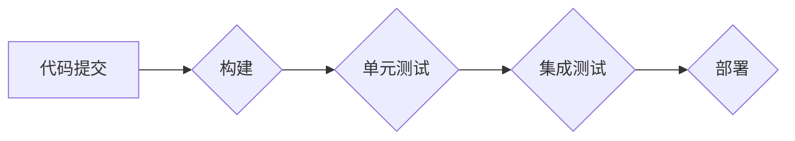

## 1. 背景介绍

### 1.1 AI系统开发的挑战

近年来，人工智能（AI）技术发展迅猛，其应用已经渗透到各个领域，包括医疗保健、金融、交通等。然而，AI系统开发过程面临着独特的挑战：

* **数据依赖性**: AI系统高度依赖于大量的数据进行训练和验证，而数据的质量、规模和可用性直接影响模型的性能。
* **模型复杂性**: AI模型通常具有复杂的结构和参数，难以理解和调试。
* **环境依赖性**: AI系统需要部署到特定的硬件和软件环境中，而环境的差异可能导致模型性能下降或无法运行。
* **持续演进**: AI技术不断发展，新的模型和算法层出不穷，需要不断更新和改进系统。

### 1.2 持续集成的必要性

为了应对上述挑战，持续集成（CI）成为AI系统开发的必要环节。CI是一种软件开发实践，旨在通过频繁地集成代码变更并进行自动化测试，尽早发现和解决问题，提高软件质量和开发效率。

### 1.3 持续集成在AI系统开发中的优势

在AI系统开发中，持续集成可以带来以下优势：

* **尽早发现问题**: 通过频繁的代码集成和自动化测试，可以尽早发现代码缺陷和模型性能问题，降低修复成本。
* **提高代码质量**: 自动化测试可以确保代码符合规范和标准，提高代码质量和可维护性。
* **加速开发周期**: 自动化构建和测试可以减少人工操作，加速开发周期，更快地将新功能和改进推向市场。
* **提高团队协作效率**: CI系统可以提供统一的代码库和构建环境，促进团队协作，提高开发效率。

## 2. 核心概念与联系

### 2.1 持续集成流程

持续集成流程通常包括以下步骤：

1. **代码提交**: 开发人员将代码变更提交到版本控制系统（如Git）。
2. **代码构建**: CI系统检测到代码变更，自动触发代码构建过程，生成可执行文件或库。
3. **单元测试**: CI系统运行单元测试，验证代码的正确性。
4. **集成测试**: CI系统将所有组件集成在一起，运行集成测试，验证系统整体功能的正确性。
5. **部署**: CI系统将构建好的系统部署到测试环境或生产环境。

### 2.2 关键组件

持续集成系统通常包含以下关键组件：

* **版本控制系统**: 用于管理代码库，跟踪代码变更历史。
* **构建工具**: 用于编译代码、生成可执行文件或库。
* **测试框架**: 用于编写和执行自动化测试。
* **持续集成服务器**: 用于协调整个CI流程，监控构建和测试结果，并提供报告和通知。

### 2.3 核心概念之间的联系

版本控制系统是CI流程的起点，代码变更触发构建过程。构建工具生成可执行文件或库，用于单元测试和集成测试。测试框架提供测试用例和断言，用于验证代码和系统功能的正确性。CI服务器协调整个流程，监控构建和测试结果，并提供报告和通知。

## 3. 核心算法原理具体操作步骤

### 3.1 构建流程

AI系统构建流程通常包括以下步骤：

1. **数据预处理**: 清洗、转换和特征工程，将原始数据转换为模型可用的格式。
2. **模型训练**: 使用训练数据训练AI模型，调整模型参数以获得最佳性能。
3. **模型评估**: 使用测试数据评估模型性能，例如准确率、召回率、F1分数等。
4. **模型打包**: 将训练好的模型打包成可部署的格式，例如ONNX、PMML等。

### 3.2 测试流程

AI系统测试流程通常包括以下步骤：

1. **单元测试**: 测试单个函数或模块的正确性。
2. **集成测试**: 测试多个模块之间的交互和数据流。
3. **端到端测试**: 测试整个系统的功能，从数据输入到模型输出。
4. **性能测试**: 测试系统的性能指标，例如吞吐量、延迟、资源利用率等。

### 3.3 部署流程

AI系统部署流程通常包括以下步骤：

1. **环境准备**: 配置目标环境，例如安装必要的软件和库。
2. **模型部署**: 将模型部署到目标环境，例如服务器、云平台、边缘设备等。
3. **服务启动**: 启动AI服务，使其可以接收请求并提供预测结果。
4. **监控**: 监控系统运行状态，例如性能指标、错误率等。

## 4. 数学模型和公式详细讲解举例说明

### 4.1 损失函数

损失函数用于衡量模型预测值与真实值之间的差异。常见的损失函数包括：

* **均方误差（MSE）**: 
$$ MSE = \frac{1}{n} \sum_{i=1}^{n} (y_i - \hat{y_i})^2 $$

其中，$n$ 是样本数量，$y_i$ 是真实值，$\hat{y_i}$ 是预测值。

* **交叉熵损失**: 
$$ Cross Entropy = - \sum_{i=1}^{n} y_i \log(\hat{y_i}) $$

其中，$n$ 是样本数量，$y_i$ 是真实值，$\hat{y_i}$ 是预测值。

### 4.2 梯度下降

梯度下降是一种优化算法，用于找到损失函数的最小值。其基本思想是沿着损失函数的负梯度方向更新模型参数。

$$ \theta_{t+1} = \theta_t - \eta \nabla L(\theta_t) $$

其中，$\theta_t$ 是模型参数，$\eta$ 是学习率，$\nabla L(\theta_t)$ 是损失函数的梯度。

### 4.3 举例说明

假设我们有一个线性回归模型，用于预测房价。模型的输入特征是房屋面积，输出是房价。

* **损失函数**: 使用均方误差（MSE）作为损失函数。
* **梯度下降**: 使用梯度下降算法更新模型参数。

```python
# 定义模型
model = LinearRegression()

# 定义损失函数
loss_fn = nn.MSELoss()

# 定义优化器
optimizer = optim.SGD(model.parameters(), lr=0.01)

# 训练模型
for epoch in range(num_epochs):
    # 前向传播
    y_pred = model(X_train)

    # 计算损失
    loss = loss_fn(y_pred, y_train)

    # 反向传播
    optimizer.zero_grad()
    loss.backward()

    # 更新参数
    optimizer.step()
```

## 5. 项目实践：代码实例和详细解释说明

### 5.1 代码实例

以下是一个简单的AI系统持续集成流程的代码示例，使用Python语言和GitHub Actions平台：

```yaml
name: CI

on:
  push:
    branches:
      - main

jobs:
  build-and-test:
    runs-on: ubuntu-latest
    steps:
      - name: Checkout code
        uses: actions/checkout@v2

      - name: Set up Python
        uses: actions/setup-python@v2
        with:
          python-version: '3.8'

      - name: Install dependencies
        run: |
          pip install -r requirements.txt

      - name: Run tests
        run: |
          pytest

      - name: Build Docker image
        run: |
          docker build -t my-ai-system .

      - name: Push Docker image
        run: |
          docker push my-ai-system
```

### 5.2 解释说明

* **工作流程名称**: CI
* **触发条件**: 当代码推送到main分支时触发工作流程。
* **任务**: build-and-test
* **运行环境**: ubuntu-latest
* **步骤**: 
    * 检出代码
    * 设置Python环境
    * 安装依赖项
    * 运行测试
    * 构建Docker镜像
    * 推送Docker镜像

## 6. 实际应用场景

### 6.1 图像分类

持续集成可以用于自动化图像分类模型的训练和测试流程。例如，可以使用CI系统自动下载新的训练数据、训练模型、评估模型性能，并生成报告。

### 6.2 自然语言处理

持续集成可以用于自动化自然语言处理模型的训练和测试流程。例如，可以使用CI系统自动收集新的文本数据、训练模型、评估模型性能，并生成报告。

### 6.3 推荐系统

持续集成可以用于自动化推荐系统模型的训练和测试流程。例如，可以使用CI系统自动收集新的用户行为数据、训练模型、评估模型性能，并生成报告。

## 7. 总结：未来发展趋势与挑战

### 7.1 未来发展趋势

* **自动化程度不断提高**: CI系统将更加智能化，能够自动识别和解决问题，减少人工干预。
* **云原生CI**: CI系统将更多地利用云计算平台，提供更灵活、可扩展的构建和测试环境。
* **AI驱动的CI**: AI技术将被用于优化CI流程，例如预测构建失败、自动生成测试用例等。

### 7.2 挑战

* **数据安全**: CI系统需要处理敏感数据，例如代码、模型参数等，需要确保数据安全。
* **环境一致性**: 不同的CI环境可能存在差异，导致构建和测试结果不一致，需要解决环境一致性问题。
* **成本控制**: CI系统需要消耗计算资源和存储资源，需要控制成本。

## 8. 附录：常见问题与解答

### 8.1 如何选择CI工具？

选择CI工具需要考虑以下因素：

* **功能**: 是否支持所需的构建和测试功能，例如支持的编程语言、测试框架、部署平台等。
* **易用性**: 是否易于配置和使用，是否提供友好的用户界面和文档。
* **可扩展性**: 是否能够满足未来需求，例如支持更大的代码库、更多的构建任务等。
* **成本**: 是否符合预算，包括许可费用、维护费用等。

### 8.2 如何编写有效的测试用例？

编写有效的测试用例需要遵循以下原则：

* **测试目标明确**: 每个测试用例应该有明确的测试目标，例如测试某个函数的特定功能。
* **覆盖所有代码路径**: 测试用例应该覆盖所有可能的代码路径，包括正常情况和异常情况。
* **易于理解和维护**: 测试用例应该易于理解和维护，使用清晰的命名和注释。

### 8.3 如何解决构建失败？

解决构建失败需要分析构建日志，找到错误原因。常见的构建失败原因包括：

* **代码错误**: 代码中存在语法错误、逻辑错误等。
* **依赖项缺失**: 缺少必要的依赖项，例如库文件、配置文件等。
* **环境问题**: 构建环境存在问题，例如操作系统版本不兼容、软件版本冲突等。

### 8.4 如何提高构建效率？

提高构建效率可以采取以下措施：

* **使用缓存**: 缓存构建过程中产生的中间文件，例如编译后的目标文件，可以减少重复构建时间。
* **并行构建**: 将构建任务分解成多个子任务，并行执行，可以缩短构建时间。
* **优化构建脚本**: 优化构建脚本，例如减少不必要的步骤、使用更高效的工具等。


## 9. Mermaid流程图



This diagram illustrates the basic CI process, where code commits trigger a build, which is followed by unit tests, integration tests, and finally deployment.
