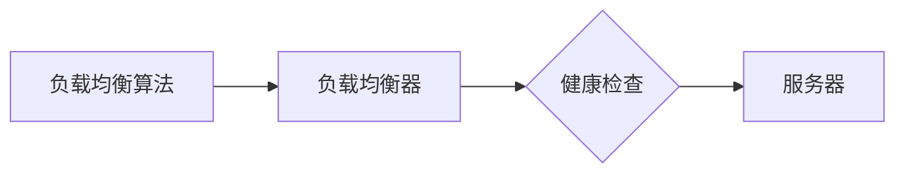

## 1. 背景介绍

### 1.1 AI系统负载均衡的重要性

随着人工智能技术的快速发展，AI系统在各个领域得到了广泛应用。然而，随着数据规模的不断扩大和用户请求的增加，AI系统面临着越来越大的负载压力。如果不能有效地进行负载均衡，就会导致系统响应速度变慢、用户体验下降，甚至系统崩溃。因此，AI系统负载均衡成为了一个至关重要的问题。

### 1.2 负载均衡的定义

负载均衡是指将工作负载分布到多个服务器或资源上，以提高系统的整体性能、可靠性和可用性。在AI系统中，负载均衡可以应用于模型训练、模型推理、数据处理等各个环节。

### 1.3 负载均衡的优势

负载均衡可以带来以下优势：

* **提高系统吞吐量:** 通过将负载分布到多个服务器上，可以提高系统的整体吞吐量，处理更多的用户请求。
* **降低响应时间:** 负载均衡可以将请求分配到负载较低的服务器上，从而降低响应时间，提升用户体验。
* **提高系统可用性:** 即使某个服务器出现故障，负载均衡也可以将请求分配到其他服务器上，保证系统的可用性。
* **提高资源利用率:** 负载均衡可以将负载均匀地分布到所有服务器上，避免资源浪费。

## 2. 核心概念与联系

### 2.1 负载均衡算法

负载均衡算法是负载均衡的核心，它决定了如何将请求分配到不同的服务器上。常见的负载均衡算法包括：

* **轮询算法 (Round Robin):** 按顺序将请求分配到不同的服务器上，简单易实现，但无法考虑服务器负载情况。
* **加权轮询算法 (Weighted Round Robin):** 为每个服务器分配不同的权重，根据权重比例分配请求，可以根据服务器性能差异进行调整。
* **最少连接算法 (Least Connections):** 将请求分配到当前连接数最少的服务器上，可以有效地避免某些服务器负载过高。
* **IP哈希算法 (IP Hash):** 根据客户端IP地址进行哈希运算，将请求分配到对应的服务器上，可以保证来自同一客户端的请求始终分配到同一服务器。

### 2.2 负载均衡器

负载均衡器是实现负载均衡的硬件或软件，它负责接收请求、选择合适的服务器并将请求转发到该服务器上。常见的负载均衡器包括：

* **硬件负载均衡器:** 专门的硬件设备，性能高、可靠性好，但成本较高。
* **软件负载均衡器:** 运行在通用服务器上的软件，成本低、配置灵活，但性能和可靠性相对较低。

### 2.3 健康检查

健康检查是指定期检查服务器的运行状态，以确保服务器能够正常处理请求。如果服务器出现故障，负载均衡器会将其从负载均衡池中移除，避免将请求分配到故障服务器上。

### 2.4 核心概念联系图



## 3. 核心算法原理具体操作步骤

### 3.1 轮询算法

1. 将所有服务器添加到一个列表中。
2. 从列表中选择第一个服务器，并将请求分配到该服务器上。
3. 将该服务器移到列表末尾。
4. 重复步骤2和3，直到所有请求都被分配。

### 3.2 加权轮询算法

1. 为每个服务器分配一个权重。
2. 计算所有服务器权重之和。
3. 按照权重比例将请求分配到不同的服务器上。

### 3.3 最少连接算法

1. 统计每个服务器当前的连接数。
2. 将请求分配到连接数最少的服务器上。

### 3.4 IP哈希算法

1. 对客户端IP地址进行哈希运算。
2. 根据哈希值将请求分配到对应的服务器上。

## 4. 数学模型和公式详细讲解举例说明

### 4.1 加权轮询算法的权重计算

假设有3台服务器，权重分别为1、2、3，则权重之和为6。 

* 服务器1分配的请求比例为 1/6。
* 服务器2分配的请求比例为 2/6。
* 服务器3分配的请求比例为 3/6。

### 4.2 最少连接算法的连接数统计

假设有3台服务器，当前连接数分别为2、1、3，则连接数最少的服务器为服务器2。

## 5. 项目实践：代码实例和详细解释说明

### 5.1 Python Flask 实现负载均衡

```python
from flask import Flask, request

app = Flask(__name__)

# 服务器列表
servers = [
    'http://server1:5000',
    'http://server2:5000',
    'http://server3:5000',
]

# 轮询算法
current_server = 0

@app.route('/')
def index():
    global current_server
    server = servers[current_server]
    current_server = (current_server + 1) % len(servers)
    # 将请求转发到选择的服务器
    return requests.get(server).content

if __name__ == '__main__':
    app.run(debug=True)
```

**代码解释:**

* `servers` 列表存储了所有服务器的地址。
* `current_server` 变量记录当前选择的服务器索引。
* `index()` 函数使用轮询算法选择服务器，并将请求转发到该服务器。

### 5.2 Nginx 实现负载均衡

```nginx
http {
    upstream backend {
        server server1:5000 weight=1;
        server server2:5000 weight=2;
        server server3:5000 weight=3;
    }

    server {
        listen 80;

        location / {
            proxy_pass http://backend;
        }
    }
}
```

**代码解释:**

* `upstream backend` 定义了一个名为 `backend` 的负载均衡池。
* `server` 指令定义了池中的服务器，并指定了权重。
* `proxy_pass` 指令将请求转发到 `backend` 负载均衡池。

## 6. 实际应用场景

### 6.1 模型训练

在模型训练过程中，可以将训练数据分配到多个服务器上进行并行训练，加快训练速度。

### 6.2 模型推理

在模型推理过程中，可以将推理请求分配到多个服务器上进行并行推理，提高推理效率。

### 6.3 数据处理

在数据处理过程中，可以将数据分割成多个部分，分配到多个服务器上进行并行处理，提高数据处理效率。

## 7. 工具和资源推荐

### 7.1 负载均衡器

* **Nginx:** 开源、高性能的负载均衡器。
* **HAProxy:** 免费、可靠的负载均衡器。
* **Amazon Elastic Load Balancing (ELB):** 云端的负载均衡服务。

### 7.2 监控工具

* **Prometheus:** 开源的监控系统。
* **Grafana:** 开源的监控仪表盘工具。

## 8. 总结：未来发展趋势与挑战

### 8.1 未来发展趋势

* **智能化负载均衡:** 利用机器学习技术，根据系统负载情况自动调整负载均衡策略。
* **容器化负载均衡:** 将负载均衡功能集成到容器平台中，实现更灵活的负载均衡管理。
* **边缘计算负载均衡:** 将负载均衡功能扩展到边缘计算节点，提高边缘计算系统的性能和可靠性。

### 8.2 挑战

* **复杂性:** 随着系统规模的扩大，负载均衡系统的复杂性也随之增加，需要更复杂的算法和工具来管理。
* **安全性:** 负载均衡系统需要保证请求的安全性，防止恶意攻击和数据泄露。
* **可扩展性:** 负载均衡系统需要能够随着系统规模的扩大而扩展，保证系统的性能和可靠性。

## 9. 附录：常见问题与解答

### 9.1 如何选择合适的负载均衡算法？

选择负载均衡算法需要考虑以下因素：

* **服务器性能:** 如果服务器性能差异较大，建议使用加权轮询算法。
* **请求类型:** 如果请求来自同一客户端，建议使用IP哈希算法。
* **系统负载情况:** 如果系统负载波动较大，建议使用最少连接算法。

### 9.2 如何配置负载均衡器？

负载均衡器的配置方法取决于具体的负载均衡器类型。一般来说，需要配置以下参数：

* **服务器列表:** 负载均衡池中的服务器地址和端口。
* **负载均衡算法:** 选择合适的负载均衡算法。
* **健康检查:** 配置健康检查参数，定期检查服务器状态。
* **其他参数:** 根据具体需求配置其他参数，例如超时时间、日志记录等。
