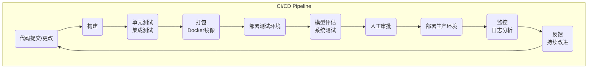

# AI项目管理中的DevOps：持续集成，持续交付

## 1.背景介绍

在当今快节奏的软件开发环境中,DevOps(Development和Operations的组合词)已成为软件交付和部署的关键实践。DevOps旨在打破传统软件开发和运维之间的壁垒,实现开发和运维团队之间的紧密协作,从而加快软件交付速度,提高质量和可靠性。

随着人工智能(AI)技术在各个领域的广泛应用,AI项目管理也面临着新的挑战。AI系统往往涉及复杂的数据处理、模型训练和部署,需要高度自动化和可扩展的基础架构。因此,将DevOps实践引入AI项目管理至关重要,以确保AI系统的高效交付和持续优化。

本文将探讨如何在AI项目管理中应用DevOps实践,特别是持续集成(Continuous Integration,CI)和持续交付(Continuous Delivery,CD)。我们将深入了解CI/CD的核心概念、关键步骤以及在AI项目中的具体应用。

## 2.核心概念与联系

### 2.1 持续集成(CI)

持续集成(CI)是一种软件开发实践,旨在频繁地将代码变更合并到共享代码库中。通过自动化构建和测试过程,CI可以尽早发现集成错误,从而减少修复成本并提高软件质量。

在AI项目中,CI可确保模型代码、数据处理管道和相关基础架构的变更能够顺利集成。它还有助于自动化模型训练、评估和验证流程,从而加快迭代周期。

### 2.2 持续交付(CD)

持续交付(CD)紧随持续集成,是指能够随时将软件部署到生产环境中的实践。通过自动化构建、测试和部署过程,CD确保软件始终保持可部署状态,并简化了将更改推送到生产环境的过程。

在AI项目中,CD可确保经过验证的模型和相关基础架构能够安全、高效地部署到生产环境中。它还有助于实现AI系统的持续优化和更新,从而满足不断变化的业务需求。

### 2.3 CI/CD与AI项目管理的联系

将CI/CD引入AI项目管理可带来以下好处:

1. **加快迭代速度**:自动化的构建、测试和部署流程可显著缩短AI模型和系统的开发周期,加快创新步伐。

2. **提高质量和可靠性**:持续的测试和验证确保AI系统在部署前经过全面检查,降低错误和故障的风险。

3. **促进协作**:CI/CD流程促进开发、数据科学和运维团队之间的紧密协作,打破传统的壁垒。

4. **支持可扩展性**:通过自动化和基础架构即代码(Infrastructure as Code,IaC)实践,CI/CD可确保AI系统具有高度可扩展性,适应不断增长的计算需求。

5. **持续优化**:CD使AI模型和系统能够持续更新和优化,满足不断变化的业务需求。

为了充分利用CI/CD在AI项目管理中的优势,我们需要建立一个完整的CI/CD管道,涵盖代码、数据、模型、基础架构和测试等各个方面。接下来,我们将详细探讨CI/CD管道的核心组件和实现步骤。

## 3.核心算法原理具体操作步骤

CI/CD管道由多个阶段组成,每个阶段都涉及特定的任务和自动化流程。下面是AI项目中CI/CD管道的典型步骤:



1. **代码提交/更改**:开发人员将代码更改推送到版本控制系统(如Git)中的共享代码库。这可以是模型代码、数据处理管道、基础架构代码或其他相关组件的更改。

2. **构建**:CI服务器从代码库中提取最新代码,并自动构建可执行的工件(如Docker镜像)。这一步可能包括编译代码、运行单元测试、构建Docker镜像等任务。

3. **单元测试和集成测试**:在此阶段,自动运行单元测试和集成测试,以验证代码更改的正确性和兼容性。这对于及时发现错误和问题至关重要。

4. **打包**:如果测试通过,则将构建的工件(如Docker镜像)打包并推送到存储库(如Docker Registry)中,以供后续部署使用。

5. **部署测试环境**:在测试环境中部署打包的工件,该环境应尽可能模拟生产环境。这一步可能包括设置基础架构、部署模型和相关服务等。

6. **模型评估和系统测试**:在测试环境中,自动运行模型评估和系统测试,以验证整个AI系统的性能和正确性。这可能包括运行基准测试、集成测试、负载测试等。

7. **人工审批**:如果所有测试和评估都通过,则可由人工(如项目经理或产品负责人)审批,决定是否可以将更改部署到生产环境中。

8. **部署生产环境**:一旦获得批准,就可以自动将更改部署到生产环境中。这一步可能包括设置生产基础架构、部署模型和相关服务等。

9. **监控和日志分析**:在生产环境中,持续监控AI系统的性能、错误和其他指标。分析日志以发现潜在问题并进行故障排除。

10. **反馈和持续改进**:根据监控和日志分析的结果,收集反馈并持续改进AI系统。这可能需要回到代码提交/更改阶段,开始新的迭代周期。

该CI/CD管道可以通过自动化工具(如Jenkins、GitLab CI/CD、Azure DevOps等)来实现。每个步骤都应该是自动化的,以确保高效、一致和可重复的交付过程。

值得注意的是,AI项目的CI/CD管道可能需要一些特殊考虑,如数据版本控制、模型版本管理、可解释性和公平性测试等。我们将在后续章节中探讨这些特殊需求。

## 4.数学模型和公式详细讲解举例说明

在AI项目中,数学模型和算法是核心组成部分。为了确保AI系统的质量和可靠性,我们需要在CI/CD管道中引入对模型和算法的测试和验证。

### 4.1 模型评估指标

模型评估是CI/CD管道中的关键步骤,旨在量化模型的性能和质量。常用的模型评估指标包括:

- **准确率(Accuracy)**:正确预测的比例,即 $Accuracy = \frac{TP + TN}{TP + TN + FP + FN}$,其中TP、TN、FP和FN分别表示真阳性、真阴性、假阳性和假阴性。

- **精确率(Precision)**:正确预测的正例占所有预测正例的比例,即 $Precision = \frac{TP}{TP + FP}$。

- **召回率(Recall)**:正确预测的正例占所有实际正例的比例,即 $Recall = \frac{TP}{TP + FN}$。

- **F1分数**:精确率和召回率的调和平均值,即 $F1 = 2 \cdot \frac{Precision \cdot Recall}{Precision + Recall}$。

- **对数损失(Log Loss)**:衡量模型概率预测的准确性,对数损失越小,模型预测越准确。

- **ROC曲线和AUC**:ROC曲线显示了真阳性率和假阳性率之间的权衡,AUC(Area Under the Curve)越大,模型的分类能力越强。

根据具体的AI任务和需求,我们可以选择合适的评估指标,并在CI/CD管道中设置阈值,以确保模型满足预期的性能水平。

### 4.2 模型可解释性和公平性

除了评估模型的性能外,我们还需要关注模型的可解释性和公平性。这对于构建透明、负责任和可信赖的AI系统至关重要。

**可解释性**指的是能够解释模型的预测和决策过程。常用的可解释性技术包括:

- **SHAP(SHapley Additive exPlanations)**:通过计算每个特征对模型预测的贡献,来解释模型的决策过程。

- **LIME(Local Interpretable Model-Agnostic Explanations)**:通过训练一个局部可解释的代理模型,来解释特定实例的预测结果。

- **决策树和规则集成**:这些模型本身就具有较好的可解释性,因为它们的决策过程可以用规则或树形结构表示。

**公平性**指的是确保模型的预测和决策不会对特定群体产生不公平或歧视性的结果。常用的公平性指标包括:

- **统计率素质(Statistical Parity)**:不同群体的正例率应该相等。

- **等机会差异(Equal Opportunity Difference)**:不同群体的真阳性率应该相等。

- **平均绝对残差(Average Absolute Residual)**:不同群体的残差绝对值之和应该最小化。

我们可以在CI/CD管道中引入可解释性和公平性测试,以确保AI模型符合预期的透明度和公平性标准。这些测试可以作为部署前的关键质量门控,确保AI系统在投入生产前经过全面验证。

## 5.项目实践:代码实例和详细解释说明

为了更好地理解如何在实际AI项目中应用CI/CD实践,我们将提供一个基于Python和TensorFlow的示例项目,并解释如何构建CI/CD管道。

### 5.1 项目概述

我们将构建一个图像分类模型,用于识别不同种类的植物。该项目包括以下主要组件:

- `data`目录:包含训练和测试数据集。
- `model.py`:定义神经网络模型架构。
- `train.py`:训练模型并保存权重。
- `evaluate.py`:评估模型性能并生成指标报告。
- `app.py`:Web应用程序,用于模型部署和推理。
- `tests`目录:包含单元测试和集成测试。
- `requirements.txt`:列出了Python依赖项。
- `Dockerfile`:用于构建Docker镜像。

### 5.2 CI/CD管道设置

我们将使用GitLab CI/CD来构建和自动化CI/CD管道。GitLab CI/CD使用`.gitlab-ci.yml`文件来定义管道步骤。以下是一个示例配置:

```yaml
image: python:3.8

stages:
  - build
  - test
  - deploy

cache:
  key: ${CI_COMMIT_REF_SLUG}
  paths:
    - .venv/

before_script:
  - python -V
  - pip install --upgrade pip
  - pip install -r requirements.txt
  - pip install pytest

build:
  stage: build
  script:
    - python -m pytest tests/unit/
    - docker build -t ${CI_REGISTRY_IMAGE}:${CI_COMMIT_SHORT_SHA} .

test:
  stage: test
  script:
    - docker run ${CI_REGISTRY_IMAGE}:${CI_COMMIT_SHORT_SHA} python -m pytest tests/integration/
    - docker run ${CI_REGISTRY_IMAGE}:${CI_COMMIT_SHORT_SHA} python evaluate.py

deploy:
  stage: deploy
  script:
    - docker push ${CI_REGISTRY_IMAGE}:${CI_COMMIT_SHORT_SHA}
  only:
    - main
```

在这个示例中,我们定义了三个阶段:构建、测试和部署。

1. **构建阶段**:运行单元测试并构建Docker镜像。
2. **测试阶段**:在构建的Docker镜像中运行集成测试和模型评估。
3. **部署阶段**:如果测试通过,则将Docker镜像推送到注册表。

注意,我们只在`main`分支上部署到生产环境。对于其他分支,管道将只运行构建和测试阶段。

### 5.3 单元测试和集成测试

在`tests/unit`目录中,我们可以编写单元测试来验证模型和其他组件的正确性。例如:

```python
# tests/unit/test_model.py
import pytest
import tensorflow as tf
from model import create_model

def test_model_creation():
    model = create_model()
    assert isinstance(model, tf.keras.Model)

def test_model_output_shape():
    model = create_model()
    input_shape = (