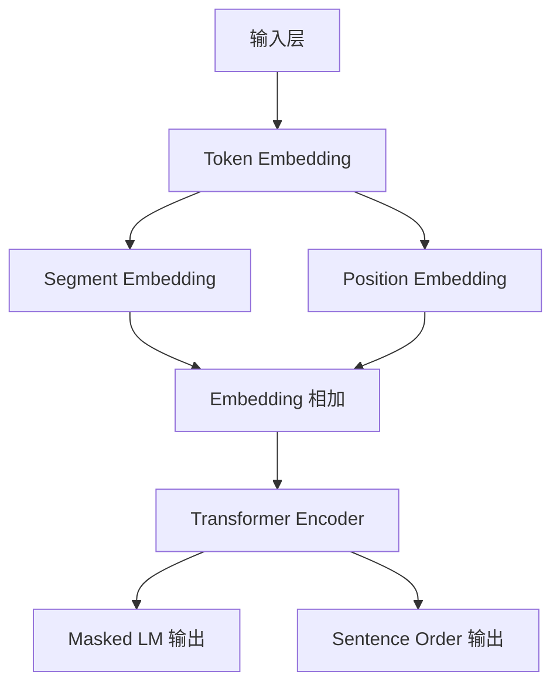

# ALBERT:轻量级BERT，为NLP任务带来高效解决方案

## 1.背景介绍

### 1.1 自然语言处理的重要性

在当前的数字时代,自然语言处理(NLP)技术已经成为人工智能领域中最重要和应用最广泛的分支之一。随着大数据和计算能力的不断提高,NLP技术在各个领域都发挥着越来越重要的作用,如智能问答系统、机器翻译、信息检索、情感分析等。高效准确的NLP技术能够帮助我们更好地理解和处理海量的自然语言数据,从而提高生产效率,优化决策过程,提供更好的用户体验。

### 1.2 BERT模型的突破性贡献

2018年,谷歌的AI研究员开发了BERT(Bidirectional Encoder Representations from Transformers)模型,这是NLP领域的一个里程碑式的创新。BERT是第一个广泛使用的基于Transformer的预训练语言模型,它通过在大规模语料库上进行双向预训练,学习到了深层次的语义和上下文表示。BERT在多项NLP任务上取得了state-of-the-art的表现,极大地推动了NLP技术的发展。

### 1.3 ALBERT模型的诞生

尽管BERT模型取得了巨大的成功,但其在实际应用中仍然存在一些不足,比如参数量过大、训练时间过长等。为了解决这些问题,2019年,谷歌开发了ALBERT(A Lite BERT for Self-supervised Learning of Language Representations),即轻量级BERT模型。ALBERT通过参数压缩和跨层参数共享等技术,大幅减少了参数量,同时保持了BERT的优秀表现,为NLP任务带来了一种更高效的解决方案。

## 2.核心概念与联系

### 2.1 Transformer架构

ALBERT模型的核心是Transformer编码器架构。Transformer最初被设计用于机器翻译任务,它完全基于注意力机制,不需要复杂的循环或者卷积结构,在并行计算方面有着天然的优势。

Transformer的主要组件包括:

1. **嵌入层(Embedding Layer)**: 将输入token映射到embedding空间。
2. **多头注意力层(Multi-Head Attention)**: 捕捉输入序列中不同位置token之间的依赖关系。
3. **前馈神经网络(Feed-Forward Network)**: 对每个位置的表示进行非线性变换,从而捕捉更复杂的特征。
4. **层归一化(Layer Normalization)**: 加快训练收敛速度。

Transformer通过堆叠多个编码器层,每一层包含多头注意力和前馈网络,最终输出每个token的上下文表示。

### 2.2 BERT的双向编码器

基于Transformer编码器,BERT采用了全新的双向编码器架构。传统的语言模型只考虑了单向的上下文,BERT则同时捕捉了左右两侧的上下文信息,从而学习到了更丰富的表示。

具体来说,BERT通过在输入序列中插入特殊标记[MASK],并预测掩码位置的token,从而实现了有监督的双向编码。预训练时,BERT在大规模语料库上最小化掩码token的预测误差,从而学习到了通用的语言表示。

### 2.3 ALBERT模型

ALBERT在BERT的基础上,引入了两项关键技术:

1. **跨层参数共享(Cross-layer Parameter Sharing)**
2. **嵌入参数矩阵分解(Factorized Embedding Parameterization)**  

这两项技术大幅减少了ALBERT的参数量,降低了对内存和计算资源的需求,同时保持了与BERT相当的表现。

#### 2.3.1 跨层参数共享

在Transformer模型中,尽管每一层的参数是不同的,但各层的参数分布是相似的。ALBERT通过在Transformer的所有编码器层之间共享部分参数,来减少冗余参数。具体来说,ALBERT将前馈网络的参数共享到所有层之间,只保留每层注意力层的参数是独立的。这种跨层参数共享大大降低了参数量,而不会显著影响模型的表现。

#### 2.3.2 嵌入矩阵分解

另一个降低参数量的技术是嵌入参数矩阵分解。在BERT中,token嵌入和位置嵌入是通过相加的方式组合的,而且嵌入矩阵的维度很高(比如768)。ALBERT将嵌入矩阵分解为两个较小的矩阵,从而大幅减少了嵌入参数的数量。具体来说,ALBERT将原始嵌入矩阵E分解为两个低维矩阵E1和E2,其中E = E1 * E2^T。这种矩阵分解技术可以在不显著降低表现的情况下,将嵌入参数量降低约9倍。

通过上述两种参数压缩技术,ALBERT模型的参数量比BERT大约减少了18倍,从而大幅降低了内存占用和计算开销,为NLP任务带来了更高效的解决方案。

## 3.核心算法原理具体操作步骤

### 3.1 ALBERT模型结构

ALBERT模型的整体结构如下图所示:

可以看到,ALBERT的输入层包括Token Embedding、Segment Embedding和Position Embedding三部分。其中Token Embedding对应输入token的词嵌入,Segment Embedding用于区分两个句子,Position Embedding编码每个token在句子中的位置信息。

这三个嵌入相加后,送入Transformer Encoder层进行双向编码。ALBERT的Transformer Encoder采用了跨层参数共享和嵌入矩阵分解技术,从而大幅降低了参数量。

编码后的输出有两个分支:一个是Masked LM输出,对应着预测被掩码token的任务;另一个是Sentence Order输出,对应着判断两个句子的前后顺序的任务。这两个辅助任务在预训练阶段被用来学习通用的语言表示。

### 3.2 ALBERT预训练过程

ALBERT的预训练过程包括两个主要任务:Masked LM和Sentence Order Prediction。

#### 3.2.1 Masked LM (掩码语言模型)

与BERT类似,ALBERT也采用了Masked LM的预训练目标。具体来说:

1. 从语料库中随机抽取一些句子作为输入
2. 在输入句子中随机选择15%的token,将它们用特殊标记[MASK]替换
3. 使用Transformer编码器对带有[MASK]标记的句子进行编码
4. 对于每个[MASK]位置,模型需要从词表中预测该位置最可能出现的token
5. 最小化预测与实际token之间的交叉熵损失,从而学习通用的语义和上下文表示

#### 3.2.2 Sentence Order Prediction (句子顺序预测)

另一个预训练目标是判断两个句子的前后顺序关系:

1. 从语料库中随机抽取成对的句子
2. 以50%的概率交换两个句子的顺序 
3. 使用特殊标记[SEP]分割两个句子
4. 将句子对输入Transformer编码器
5. 在编码器输出的[CLS]位置,添加一个二分类层
6. 判断输入的两个句子顺序是否正确
7. 最小化二分类交叉熵损失

通过上述两个任务的联合训练,ALBERT学习到了丰富的语义和上下文表示,为下游NLP任务做好了基础。

### 3.3 ALBERT微调过程

预训练完成后,ALBERT可以在特定的NLP任务上进行微调(fine-tuning),以获得更好的性能表现。微调过程包括:

1. 将预训练好的ALBERT模型加载进来,作为初始化参数
2. 根据具体任务构建相应的输出层,如分类、序列标注等
3. 在特定任务的训练数据上进行有监督微调
4. 对所有参数(ALBERT编码器+输出层)进行梯度更新
5. 在验证集上评估模型性能,选择最优参数进行测试

需要注意的是,由于ALBERT使用了跨层参数共享,因此在微调时所有编码器层的参数也会被更新到。这使得ALBERT的微调相对更加高效。

通过预训练+微调的过程,ALBERT模型能够在保持高效的同时,展现出极佳的性能表现。

## 4.数学模型和公式详细讲解举例说明

在ALBERT模型中,涉及到了多个数学概念和模型,下面我们逐一介绍。

### 4.1 注意力机制(Attention Mechanism)

注意力机制是Transformer架构的核心,它能够自动捕捉输入序列中不同位置token之间的依赖关系。ALBERT模型中使用的是多头注意力(Multi-Head Attention)机制。

对于给定的查询向量$q$、键向量$k$和值向量$v$,注意力机制的计算过程如下:

$$\begin{aligned}
\text{Attention}(q, k, v) &= \text{softmax}(\frac{qk^T}{\sqrt{d_k}})v \\
\text{MultiHead}(Q,K,V) &= \text{Concat}(head_1, ..., head_h)W^O\\
\text{where } head_i &= \text{Attention}(QW_i^Q, KW_i^K, VW_i^V)
\end{aligned}$$

其中$Q、K、V$分别表示查询、键和值的矩阵形式。$W_i^Q、W_i^K、W_i^V$是可训练的投影矩阵,用于将$Q、K、V$映射到注意力头的子空间。$W^O$则是最终将多头注意力的输出拼接并映射回原始空间。

注意力分数$\text{Attention}(q, k, v)$表示查询$q$对键$k$的关注程度。通过与值向量$v$加权求和,我们可以得到查询$q$在上下文中的表示。多头注意力则是将多个注意力头的结果拼接,从而捕捉不同子空间的依赖关系。

### 4.2 层归一化(Layer Normalization)

为了加速模型训练的收敛速度,Transformer采用了层归一化技术。层归一化的计算公式如下:

$$\begin{aligned}
\mu &= \frac{1}{H}\sum_{i=1}^{H}x_i\\  
\sigma^2 &= \frac{1}{H}\sum_{i=1}^{H}(x_i - \mu)^2\\
\hat{x_i} &= \frac{x_i - \mu}{\sqrt{\sigma^2 + \epsilon}}\\
y_i &= \gamma \hat{x_i} + \beta
\end{aligned}$$

其中$x$是输入向量,长度为$H$。$\mu$和$\sigma^2$分别是输入的均值和方差。$\epsilon$是一个很小的常数,用于避免除以0。$\gamma$和$\beta$是可训练的缩放和偏移参数。

层归一化的作用是将输入归一化到均值为0、方差为1的标准分布,然后再通过缩放和偏移进行仿射变换,从而加快模型收敛。

### 4.3 跨层参数共享

ALBERT的一个核心技术是跨层参数共享。具体来说,ALBERT将Transformer编码器中的前馈网络权重$W_1、W_2、b_1、b_2$共享到所有层之间:

$$\text{FFN}(x) = \max(0, xW_1 + b_1)W_2 + b_2$$

这种跨层参数共享技术能够显著减少ALBERT的参数量,而不会明显影响模型性能。

### 4.4 嵌入矩阵分解

为了进一步压缩参数,ALBERT采用了嵌入矩阵分解技术。具体来说,将原始嵌入矩阵$E \in \mathbb{R}^{V \times D}$分解为两个低维矩阵$E_1 \in \mathbb{R}^{V \times m}, E_2 \in \mathbb{R}^{m \times D}$:

$$E = E_1E_2^T$$

其中$V$是词表大小,$D$是嵌入维度,$m$是一个较小的内部维度。通过这种矩阵分解,ALBERT将嵌入参数量从$VD$减少到了$Vm + mD$,大约降低了9倍。

## 5. 项目实践:代码实例和详细解释说明

为了更好地理解ALBERT